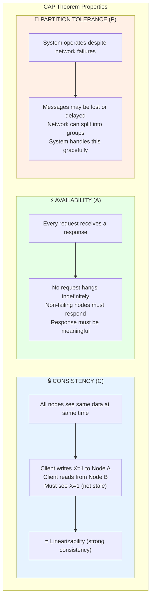
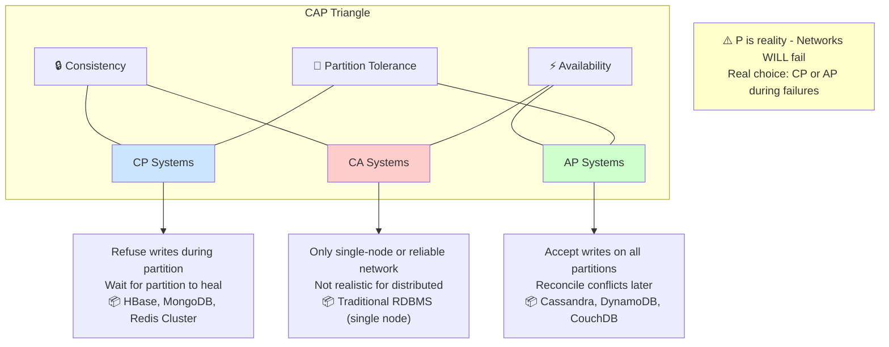
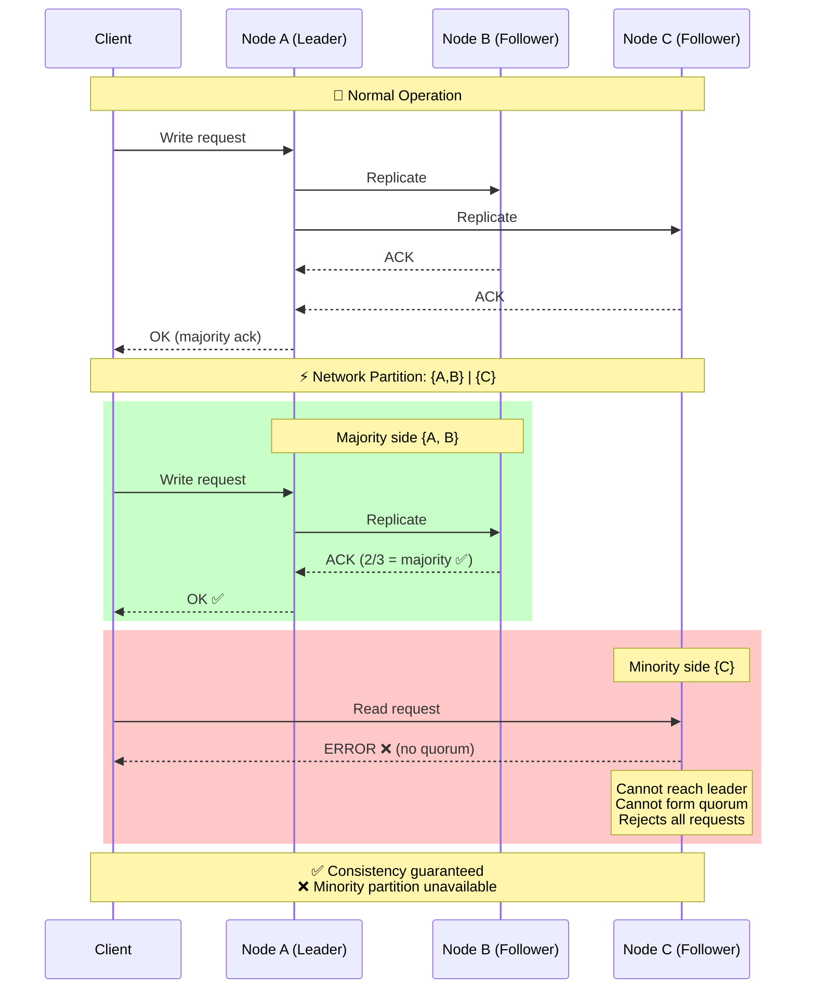
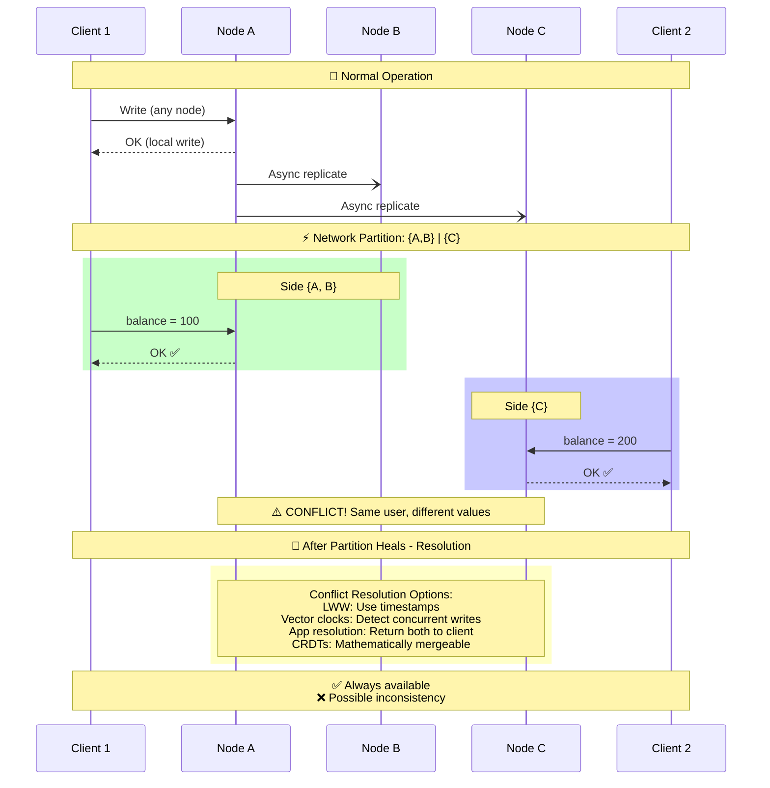
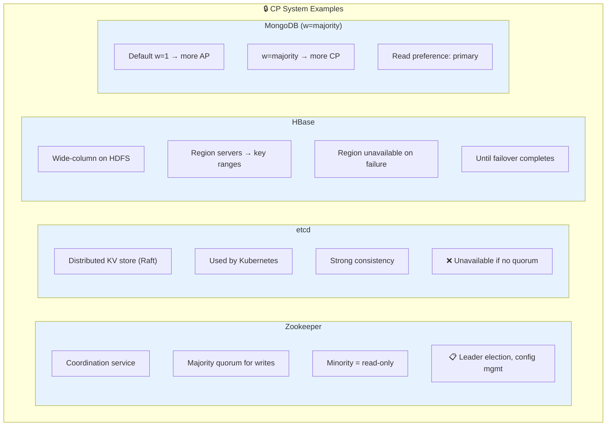
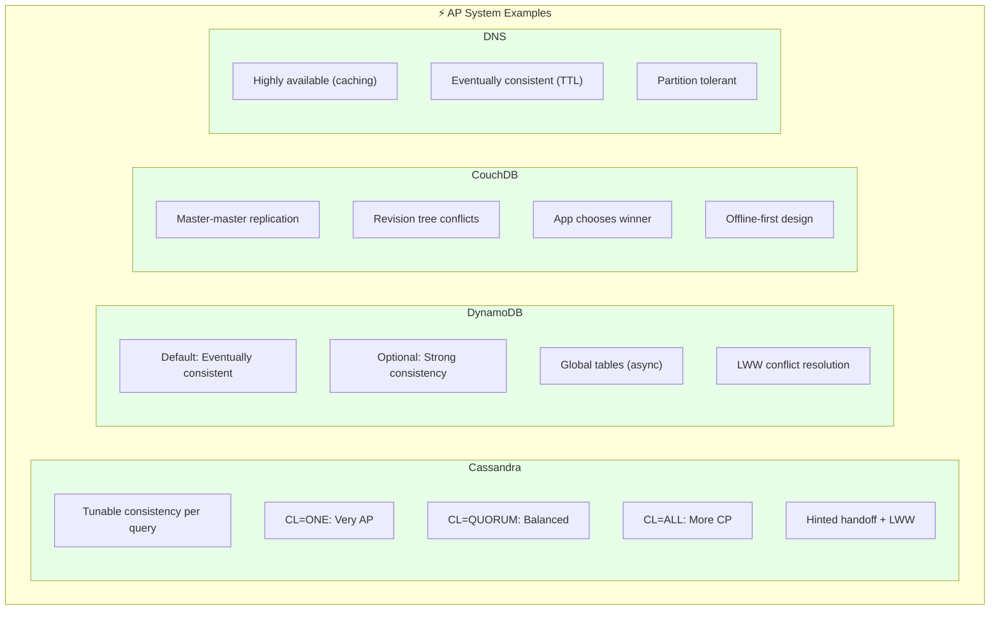
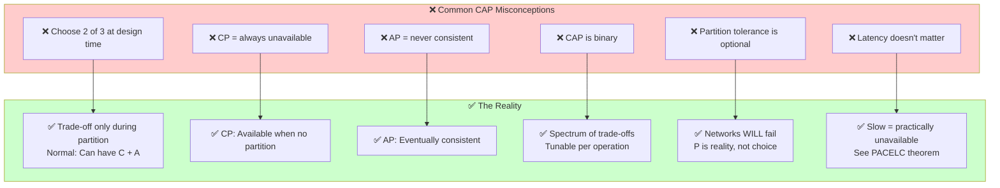
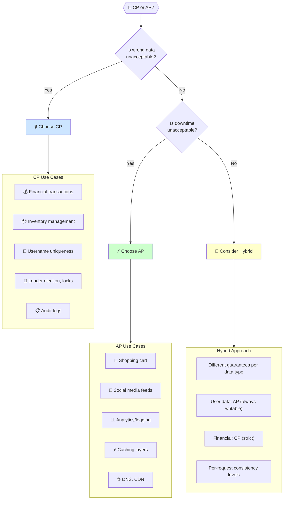

# CAP Theorem

## Introduction

The CAP theorem, proposed by Eric Brewer in 2000 and proven by Gilbert and Lynch in 2002, states that a distributed data store can only provide two of three guarantees: Consistency, Availability, and Partition Tolerance. Understanding CAP is essential for making informed decisions about distributed database design.

## The Three Properties

## The Trade-off

## Partition Scenarios

### CP System Behavior

### AP System Behavior

## Real-World Examples

### CP Systems

### AP Systems

## CAP Misconceptions

## Choosing CP vs AP

## Key Takeaways

1. **Partition tolerance is mandatory** - Networks fail, plan for it
2. **Trade-off is per-partition** - Normal operation can have C+A
3. **CAP is simplified** - Real systems have nuanced trade-offs
4. **Consistency has levels** - From linearizable to eventual
5. **Availability has degrees** - 99.9% vs 99.99% matters
6. **Choose based on requirements** - Money needs CP, carts can be AP
