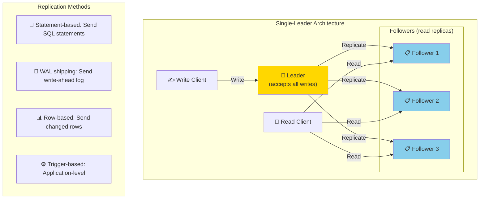
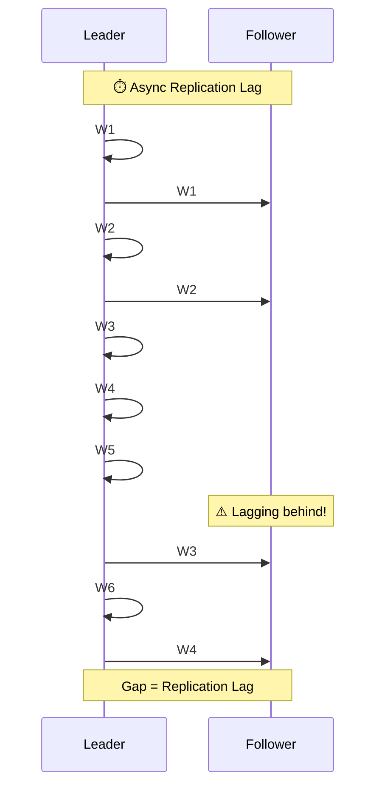
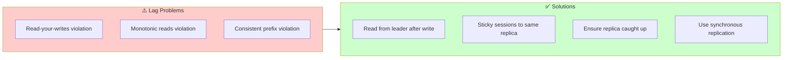
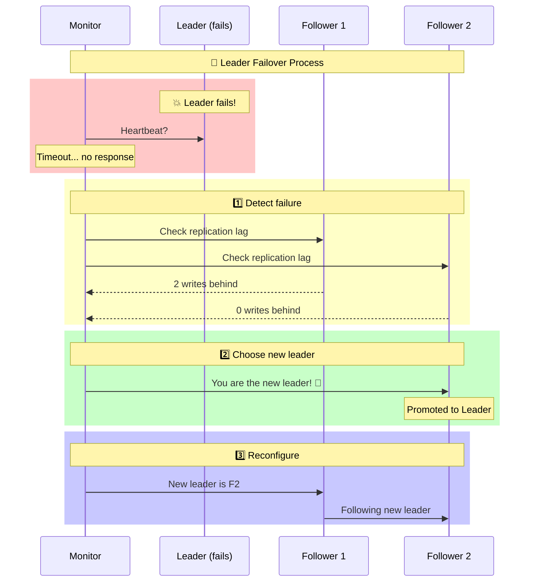
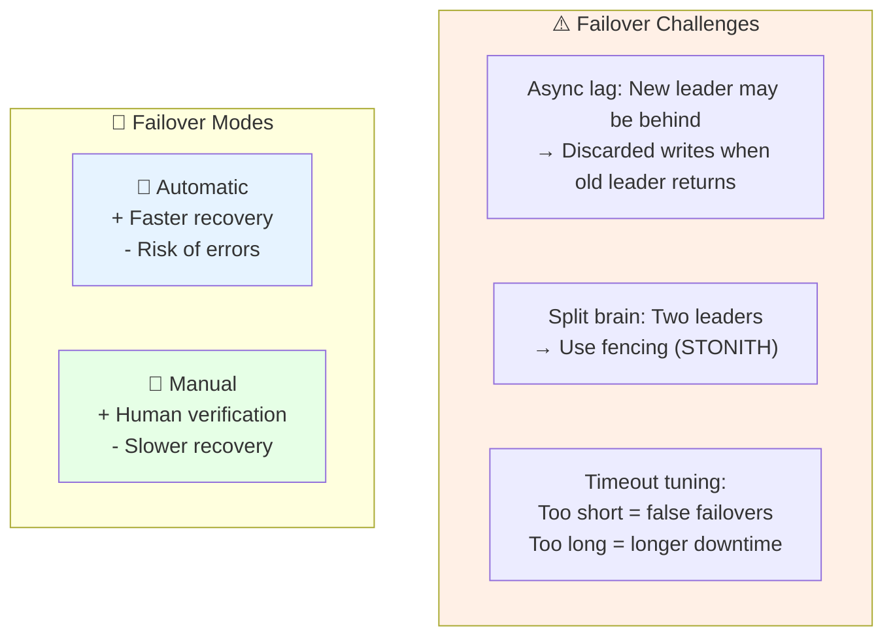

# Single-Leader Replication

## Overview

```mermaid
flowchart TB
    subgraph Architecture["Single-Leader Architecture"]
        Client1["✍️ Write Client"]
        Client2["📖 Read Client"]

        Leader["👑 Leader<br/>(accepts all writes)"]

        subgraph Followers["Followers (read replicas)"]
            F1["📋 Follower 1"]
            F2["📋 Follower 2"]
            F3["📋 Follower 3"]
        end

        Client1 -->|"Write"| Leader
        Leader -->|"Replicate"| F1
        Leader -->|"Replicate"| F2
        Leader -->|"Replicate"| F3

        Client2 -->|"Read"| F1
        Client2 -->|"Read"| F2
        Client2 -->|"Read"| F3
    end

    subgraph Methods["Replication Methods"]
        M1["📝 Statement-based: Send SQL statements"]
        M2["📄 WAL shipping: Send write-ahead log"]
        M3["📊 Row-based: Send changed rows"]
        M4["⚙️ Trigger-based: Application-level"]
    end

    style Leader fill:#ffd700
    style F1 fill:#87ceeb
    style F2 fill:#87ceeb
    style F3 fill:#87ceeb
```

## Replication Lag

```mermaid
sequenceDiagram
    participant L as Leader
    participant F as Follower

    Note over L,F: ⏱️ Async Replication Lag

    L->>L: W1
    L->>F: W1
    L->>L: W2
    L->>F: W2
    L->>L: W3
    L->>L: W4
    L->>L: W5
    Note over F: ⚠️ Lagging behind!
    L->>F: W3
    L->>L: W6
    L->>F: W4
    Note over L,F: Gap = Replication Lag
```

```mermaid
flowchart LR
    subgraph Problems["⚠️ Lag Problems"]
        P1["Read-your-writes violation"]
        P2["Monotonic reads violation"]
        P3["Consistent prefix violation"]
    end

    subgraph Solutions["✅ Solutions"]
        S1["Read from leader after write"]
        S2["Sticky sessions to same replica"]
        S3["Ensure replica caught up"]
        S4["Use synchronous replication"]
    end

    Problems --> Solutions

    style Problems fill:#ffcccc
    style Solutions fill:#ccffcc
```

## Failover

```mermaid
sequenceDiagram
    participant M as Monitor
    participant L as Leader (fails)
    participant F1 as Follower 1
    participant F2 as Follower 2

    Note over M,F2: 🔄 Leader Failover Process

    rect rgb(255, 200, 200)
        Note over L: 💥 Leader fails!
        M->>L: Heartbeat?
        Note over M: Timeout... no response
    end

    rect rgb(255, 255, 200)
        Note over M,F2: 1️⃣ Detect failure
        M->>F1: Check replication lag
        M->>F2: Check replication lag
        F1-->>M: 2 writes behind
        F2-->>M: 0 writes behind
    end

    rect rgb(200, 255, 200)
        Note over M,F2: 2️⃣ Choose new leader
        M->>F2: You are the new leader! 👑
        Note over F2: Promoted to Leader
    end

    rect rgb(200, 200, 255)
        Note over M,F2: 3️⃣ Reconfigure
        M->>F1: New leader is F2
        F1->>F2: Following new leader
    end
```

```mermaid
flowchart TB
    subgraph Challenges["⚠️ Failover Challenges"]
        C1["Async lag: New leader may be behind<br/>→ Discarded writes when old leader returns"]
        C2["Split brain: Two leaders<br/>→ Use fencing (STONITH)"]
        C3["Timeout tuning:<br/>Too short = false failovers<br/>Too long = longer downtime"]
    end

    subgraph Modes["🔧 Failover Modes"]
        Auto["🤖 Automatic<br/>+ Faster recovery<br/>- Risk of errors"]
        Manual["👤 Manual<br/>+ Human verification<br/>- Slower recovery"]
    end

    style Challenges fill:#fff0e6
    style Auto fill:#e6f3ff
    style Manual fill:#e6ffe6
```
