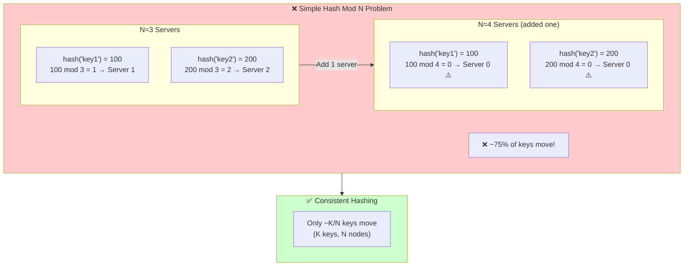
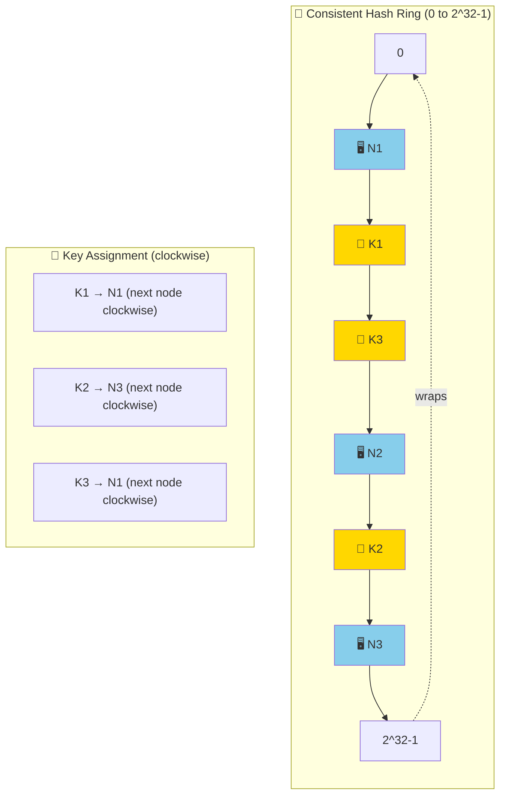
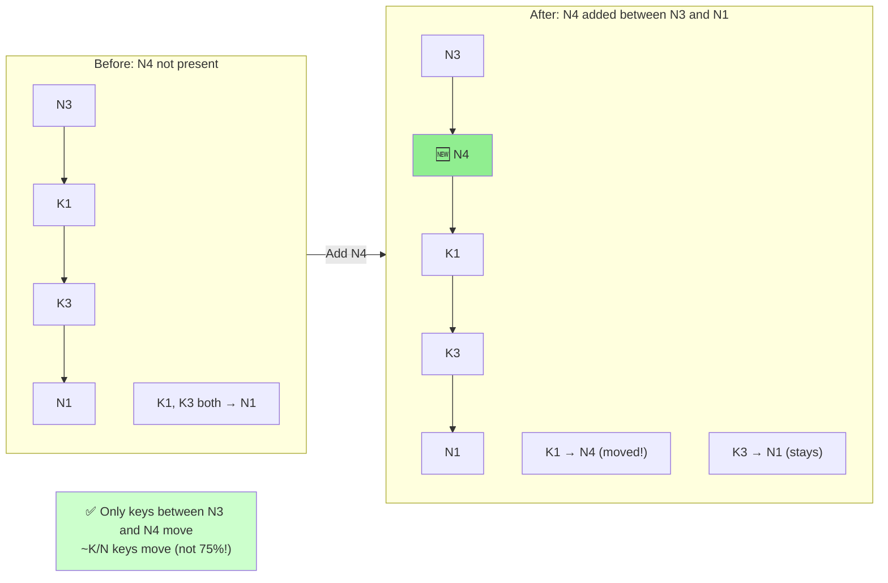
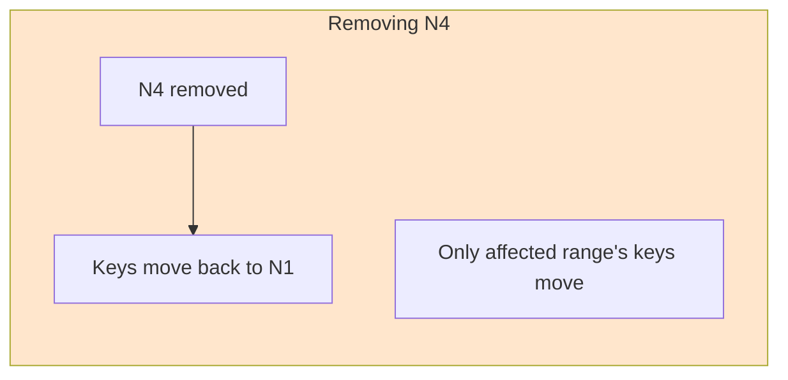
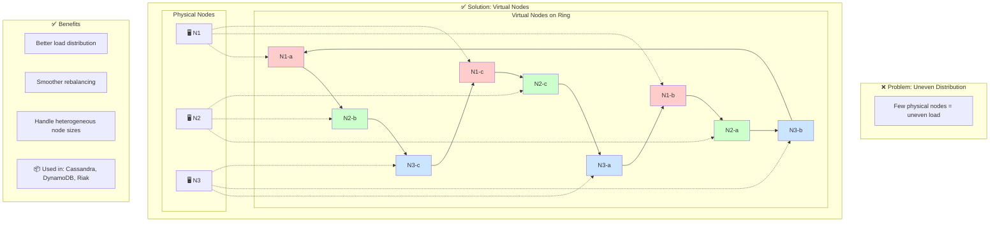
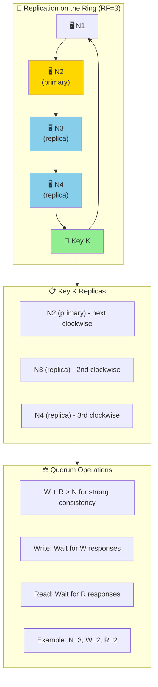

# Consistent Hashing

## The Problem

```mermaid
flowchart TB
    subgraph Problem["❌ Simple Hash Mod N Problem"]
        subgraph Before["N=3 Servers"]
            B1["hash('key1') = 100<br/>100 mod 3 = 1 → Server 1"]
            B2["hash('key2') = 200<br/>200 mod 3 = 2 → Server 2"]
        end

        subgraph After["N=4 Servers (added one)"]
            A1["hash('key1') = 100<br/>100 mod 4 = 0 → Server 0 ⚠️"]
            A2["hash('key2') = 200<br/>200 mod 4 = 0 → Server 0 ⚠️"]
        end

        Before -->|"Add 1 server"| After
        Result["❌ ~75% of keys move!"]
    end

    subgraph Solution["✅ Consistent Hashing"]
        CH["Only ~K/N keys move<br/>(K keys, N nodes)"]
    end

    Problem --> Solution

    style Problem fill:#ffcccc
    style Solution fill:#ccffcc
```

## The Ring

```mermaid
flowchart TB
    subgraph Ring["🔄 Consistent Hash Ring (0 to 2^32-1)"]
        direction TB

        Zero["0"]

        N1["🖥️ N1"]
        K1["🔑 K1"]
        K3["🔑 K3"]
        N2["🖥️ N2"]
        K2["🔑 K2"]
        N3["🖥️ N3"]

        Max["2^32-1"]

        Zero --> N1
        N1 --> K1
        K1 --> K3
        K3 --> N2
        N2 --> K2
        K2 --> N3
        N3 --> Max
        Max -.->|"wraps"| Zero
    end

    subgraph Assignment["📍 Key Assignment (clockwise)"]
        A1["K1 → N1 (next node clockwise)"]
        A2["K2 → N3 (next node clockwise)"]
        A3["K3 → N1 (next node clockwise)"]
    end

    style N1 fill:#87ceeb
    style N2 fill:#87ceeb
    style N3 fill:#87ceeb
    style K1 fill:#ffd700
    style K2 fill:#ffd700
    style K3 fill:#ffd700
```

## Adding and Removing Nodes

```mermaid
flowchart LR
    subgraph Before["Before: N4 not present"]
        B_N3["N3"] --> B_K1["K1"] --> B_K3["K3"] --> B_N1["N1"]
        B_Note["K1, K3 both → N1"]
    end

    subgraph After["After: N4 added between N3 and N1"]
        A_N3["N3"] --> A_N4["🆕 N4"] --> A_K1["K1"] --> A_K3["K3"] --> A_N1["N1"]
        A_Note1["K1 → N4 (moved!)"]
        A_Note2["K3 → N1 (stays)"]
    end

    Before -->|"Add N4"| After

    Result["✅ Only keys between N3 and N4 move<br/>~K/N keys move (not 75%!)"]

    style A_N4 fill:#90EE90
    style Result fill:#ccffcc
```

```mermaid
flowchart LR
    subgraph Remove["Removing N4"]
        R1["N4 removed"] --> R2["Keys move back to N1"]
        R3["Only affected range's keys move"]
    end

    style Remove fill:#ffe6cc
```

## Virtual Nodes

```mermaid
flowchart TB
    subgraph Problem["❌ Problem: Uneven Distribution"]
        P1["Few physical nodes = uneven load"]
    end

    subgraph Solution["✅ Solution: Virtual Nodes"]
        subgraph Physical["Physical Nodes"]
            N1["🖥️ N1"]
            N2["🖥️ N2"]
            N3["🖥️ N3"]
        end

        subgraph Virtual["Virtual Nodes on Ring"]
            V1a["N1-a"] --> V2b["N2-b"] --> V3c["N3-c"]
            V3c --> V1c["N1-c"]
            V1c --> V2c["N2-c"]
            V2c --> V3a["N3-a"]
            V3a --> V1b["N1-b"]
            V1b --> V2a["N2-a"]
            V2a --> V3b["N3-b"]
            V3b --> V1a
        end

        N1 -.-> V1a & V1b & V1c
        N2 -.-> V2a & V2b & V2c
        N3 -.-> V3a & V3b & V3c
    end

    subgraph Benefits["✅ Benefits"]
        B1["Better load distribution"]
        B2["Smoother rebalancing"]
        B3["Handle heterogeneous node sizes"]
        B4["📦 Used in: Cassandra, DynamoDB, Riak"]
    end

    style V1a fill:#ffcccc
    style V1b fill:#ffcccc
    style V1c fill:#ffcccc
    style V2a fill:#ccffcc
    style V2b fill:#ccffcc
    style V2c fill:#ccffcc
    style V3a fill:#cce5ff
    style V3b fill:#cce5ff
    style V3c fill:#cce5ff
```

## Replication with Consistent Hashing

```mermaid
flowchart TB
    subgraph Ring["🔄 Replication on the Ring (RF=3)"]
        N1["🖥️ N1"]
        N2["🖥️ N2<br/>(primary)"]
        N3["🖥️ N3<br/>(replica)"]
        N4["🖥️ N4<br/>(replica)"]
        X["🔑 Key K"]

        N1 --> N2
        N2 --> N3
        N3 --> N4
        N4 --> X
        X --> N1
    end

    subgraph Replicas["📋 Key K Replicas"]
        R1["N2 (primary) - next clockwise"]
        R2["N3 (replica) - 2nd clockwise"]
        R3["N4 (replica) - 3rd clockwise"]
    end

    subgraph Quorum["⚖️ Quorum Operations"]
        Q1["W + R > N for strong consistency"]
        Q2["Write: Wait for W responses"]
        Q3["Read: Wait for R responses"]
        Q4["Example: N=3, W=2, R=2"]
    end

    X --> Replicas
    Replicas --> Quorum

    style N2 fill:#ffd700
    style N3 fill:#87ceeb
    style N4 fill:#87ceeb
    style X fill:#90EE90
```
