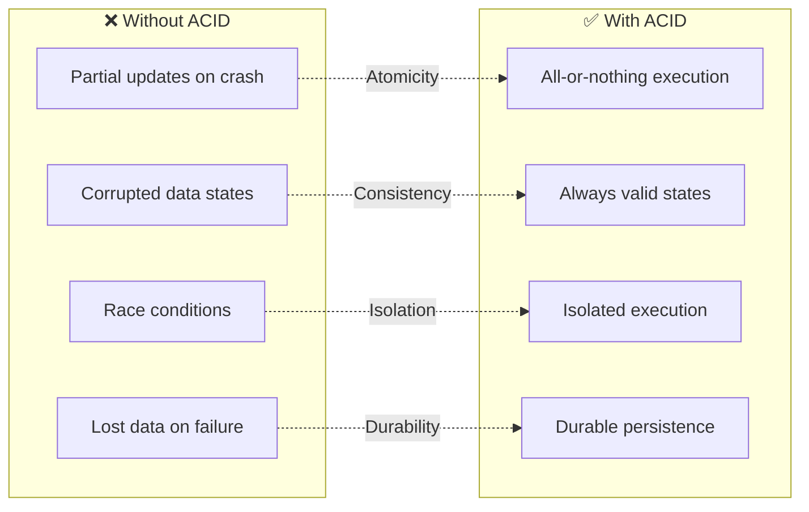
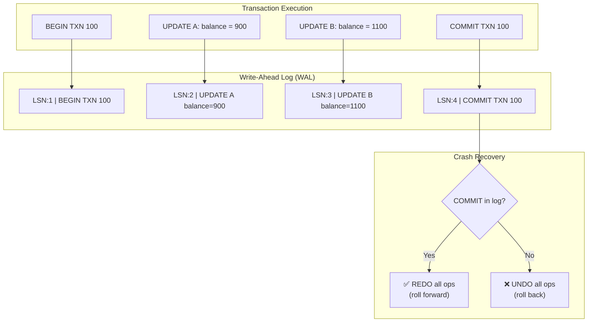
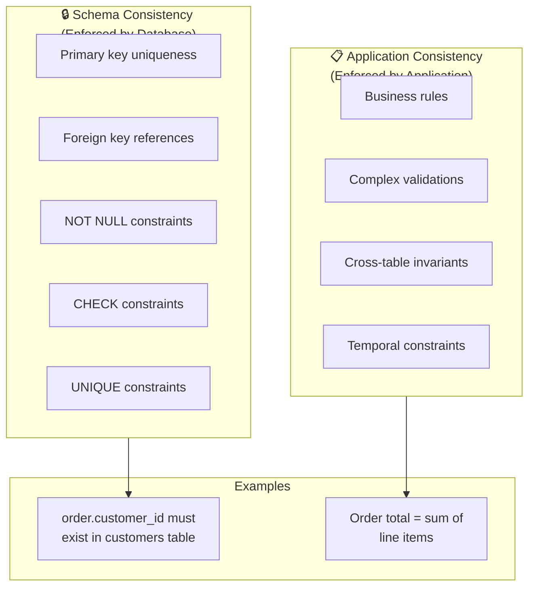
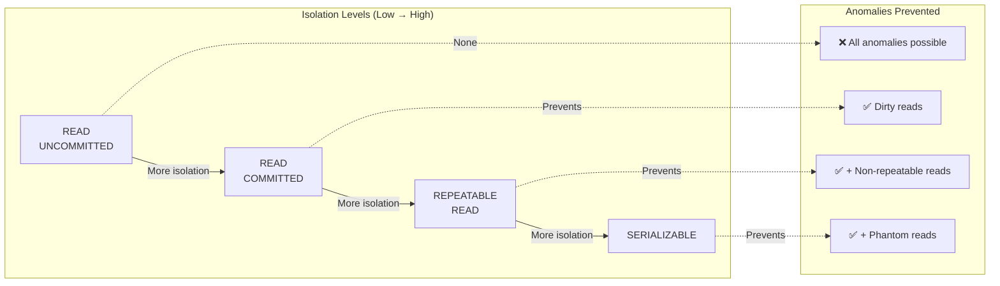

# ACID Properties Deep Dive

## 1. Introduction

ACID is an acronym describing four essential properties that guarantee reliable processing of database transactions: **Atomicity**, **Consistency**, **Isolation**, and **Durability**.



ACID ensures your database behaves predictably, even when:
- Power fails mid-transaction
- Multiple users access same data
- System crashes unexpectedly
- Network partitions occur

---

## 2. Atomicity

**"All or Nothing"** - A transaction is an indivisible unit of work. Either all operations complete successfully, or the database is left unchanged.

### The Problem Atomicity Solves

```sql
-- Bank transfer: Move $100 from Account A to Account B
BEGIN TRANSACTION;
    UPDATE accounts SET balance = balance - 100 WHERE id = 'A';
    -- WHAT IF SYSTEM CRASHES HERE?
    UPDATE accounts SET balance = balance + 100 WHERE id = 'B';
COMMIT;
```

Without atomicity:
- Account A loses $100
- Account B gains nothing
- $100 vanishes from the system!

### How Atomicity Works



### Code Examples

```python
# Python - Proper transaction handling
import psycopg2

def transfer_funds(from_account, to_account, amount):
    conn = psycopg2.connect(database="bank")
    try:
        with conn.cursor() as cur:
            # Atomicity: These happen together or not at all
            cur.execute(
                "UPDATE accounts SET balance = balance - %s WHERE id = %s",
                (amount, from_account)
            )
            cur.execute(
                "UPDATE accounts SET balance = balance + %s WHERE id = %s",
                (amount, to_account)
            )
        conn.commit()  # Atomic commit point
    except Exception as e:
        conn.rollback()  # Undo everything
        raise e
    finally:
        conn.close()
```

```java
// Java - Using try-with-resources for automatic rollback
public void transferFunds(String from, String to, BigDecimal amount)
        throws SQLException {
    String debit = "UPDATE accounts SET balance = balance - ? WHERE id = ?";
    String credit = "UPDATE accounts SET balance = balance + ? WHERE id = ?";

    try (Connection conn = dataSource.getConnection()) {
        conn.setAutoCommit(false);  // Start transaction

        try (PreparedStatement debitStmt = conn.prepareStatement(debit);
             PreparedStatement creditStmt = conn.prepareStatement(credit)) {

            debitStmt.setBigDecimal(1, amount);
            debitStmt.setString(2, from);
            debitStmt.executeUpdate();

            creditStmt.setBigDecimal(1, amount);
            creditStmt.setString(2, to);
            creditStmt.executeUpdate();

            conn.commit();  // Atomic commit
        } catch (SQLException e) {
            conn.rollback();  // Atomic rollback
            throw e;
        }
    }
}
```

---

## 3. Consistency

**"Valid State to Valid State"** - A transaction brings the database from one valid state to another valid state, maintaining all defined rules, constraints, and triggers.

### Types of Consistency



### Enforcing Consistency

```sql
-- Schema-level constraints
CREATE TABLE orders (
    id SERIAL PRIMARY KEY,
    customer_id INT NOT NULL REFERENCES customers(id),  -- FK constraint
    total DECIMAL(10,2) NOT NULL CHECK (total >= 0),    -- CHECK constraint
    status VARCHAR(20) DEFAULT 'pending'
        CHECK (status IN ('pending', 'processing', 'shipped', 'delivered')),
    created_at TIMESTAMP DEFAULT CURRENT_TIMESTAMP
);

-- Trigger for complex consistency rules
CREATE OR REPLACE FUNCTION validate_order_total()
RETURNS TRIGGER AS $$
BEGIN
    -- Ensure order total matches sum of line items
    IF NEW.total != (
        SELECT COALESCE(SUM(quantity * price), 0)
        FROM order_items WHERE order_id = NEW.id
    ) THEN
        RAISE EXCEPTION 'Order total does not match line items';
    END IF;
    RETURN NEW;
END;
$$ LANGUAGE plpgsql;

CREATE TRIGGER check_order_total
BEFORE INSERT OR UPDATE ON orders
FOR EACH ROW EXECUTE FUNCTION validate_order_total();
```

---

## 4. Isolation

**"Concurrent Transactions = Serial Execution"** - Concurrent transactions execute as if they were running one after another, without interfering with each other.

### Isolation Levels



| Level | Dirty Read | Non-Repeatable Read | Phantom Read |
|-------|------------|---------------------|--------------|
| READ UNCOMMITTED | Possible | Possible | Possible |
| READ COMMITTED | **Prevented** | Possible | Possible |
| REPEATABLE READ | **Prevented** | **Prevented** | Possible* |
| SERIALIZABLE | **Prevented** | **Prevented** | **Prevented** |

*In PostgreSQL, Repeatable Read also prevents phantom reads

### Read Phenomena Explained

```
┌─────────────────────────────────────────────────────────────────────────────┐
│                           DIRTY READ                                         │
├─────────────────────────────────────────────────────────────────────────────┤
│                                                                              │
│   Transaction A                          Transaction B                       │
│   ─────────────                          ─────────────                       │
│   BEGIN                                                                      │
│   UPDATE accounts SET balance=500                                            │
│   WHERE id=1 (was 1000)                                                      │
│                                          BEGIN                               │
│                                          SELECT balance FROM accounts        │
│                                          WHERE id=1                          │
│                                          → Returns 500 (uncommitted!)        │
│   ROLLBACK (balance back to 1000)                                           │
│                                          Uses 500 for calculations... WRONG  │
│                                                                              │
└─────────────────────────────────────────────────────────────────────────────┘

┌─────────────────────────────────────────────────────────────────────────────┐
│                        NON-REPEATABLE READ                                   │
├─────────────────────────────────────────────────────────────────────────────┤
│                                                                              │
│   Transaction A                          Transaction B                       │
│   ─────────────                          ─────────────                       │
│   BEGIN                                                                      │
│   SELECT balance FROM accounts           BEGIN                               │
│   WHERE id=1 → Returns 1000                                                  │
│                                          UPDATE accounts SET balance=500     │
│                                          WHERE id=1                          │
│                                          COMMIT                              │
│   SELECT balance FROM accounts                                               │
│   WHERE id=1 → Returns 500                                                   │
│   Same query, different result!                                              │
│                                                                              │
└─────────────────────────────────────────────────────────────────────────────┘

┌─────────────────────────────────────────────────────────────────────────────┐
│                          PHANTOM READ                                        │
├─────────────────────────────────────────────────────────────────────────────┤
│                                                                              │
│   Transaction A                          Transaction B                       │
│   ─────────────                          ─────────────                       │
│   BEGIN                                                                      │
│   SELECT * FROM orders                   BEGIN                               │
│   WHERE status='pending'                                                     │
│   → Returns 3 rows                                                           │
│                                          INSERT INTO orders (status)         │
│                                          VALUES ('pending')                  │
│                                          COMMIT                              │
│   SELECT * FROM orders                                                       │
│   WHERE status='pending'                                                     │
│   → Returns 4 rows                                                           │
│   New "phantom" row appeared!                                                │
│                                                                              │
└─────────────────────────────────────────────────────────────────────────────┘
```

### Setting Isolation Levels

```sql
-- PostgreSQL
BEGIN TRANSACTION ISOLATION LEVEL SERIALIZABLE;
-- Or
SET TRANSACTION ISOLATION LEVEL REPEATABLE READ;

-- MySQL
SET TRANSACTION ISOLATION LEVEL READ COMMITTED;
START TRANSACTION;

-- Per-session default
SET SESSION CHARACTERISTICS AS TRANSACTION ISOLATION LEVEL SERIALIZABLE;
```

---

## 5. Durability

**"Committed = Permanent"** - Once a transaction is committed, its effects persist even if the system crashes immediately after.

### How Durability is Achieved

```
┌─────────────────────────────────────────────────────────────────────────────┐
│                      DURABILITY MECHANISMS                                   │
├─────────────────────────────────────────────────────────────────────────────┤
│                                                                              │
│   1. WRITE-AHEAD LOGGING (WAL)                                              │
│      ─────────────────────────                                               │
│      • Log record written BEFORE data page                                  │
│      • Log is flushed to disk on COMMIT                                     │
│      • Crash recovery replays log                                           │
│                                                                              │
│      Timeline:                                                               │
│      [LOG: "Update A to 500"] → [FLUSH LOG] → [COMMIT] → [Update data page] │
│                                      ↑                                       │
│                                 Durability point                             │
│                                                                              │
│   2. CHECKPOINTING                                                          │
│      ─────────────                                                           │
│      • Periodically flush dirty pages to disk                               │
│      • Reduces recovery time                                                │
│      • Truncates old log records                                            │
│                                                                              │
│   3. REPLICATION (for high availability)                                    │
│      ───────────                                                             │
│      • Synchronous: Wait for replica before COMMIT                          │
│      • Asynchronous: Replica may lag behind                                 │
│                                                                              │
└─────────────────────────────────────────────────────────────────────────────┘
```

### Durability Trade-offs

```sql
-- PostgreSQL: fsync settings (trade durability for performance)
-- DANGEROUS: Only for testing!
SET synchronous_commit = off;  -- Don't wait for WAL flush
-- Risk: Recent commits may be lost on crash

-- MySQL: InnoDB flush settings
-- 1 = Flush log on every commit (default, safest)
-- 2 = Flush log every second (some risk)
-- 0 = Let OS handle flushing (highest risk)
SET GLOBAL innodb_flush_log_at_trx_commit = 1;
```

---

## 6. ACID in Distributed Systems

In distributed databases, ACID guarantees become more complex:

```
┌─────────────────────────────────────────────────────────────────────────────┐
│                    DISTRIBUTED ACID CHALLENGES                               │
├─────────────────────────────────────────────────────────────────────────────┤
│                                                                              │
│   CAP THEOREM                                                                │
│   ───────────                                                                │
│   Choose 2 of 3:                                                             │
│   • Consistency (C) - All nodes see same data                               │
│   • Availability (A) - System responds to requests                          │
│   • Partition Tolerance (P) - System works despite network splits           │
│                                                                              │
│   ACID databases typically sacrifice Availability for Consistency            │
│   (CP systems)                                                               │
│                                                                              │
│   SOLUTIONS:                                                                 │
│   ───────────                                                                │
│   • Two-Phase Commit (2PC)    - Distributed atomicity                       │
│   • Paxos/Raft                - Consensus for consistency                   │
│   • Spanner (TrueTime)        - Global consistency with GPS clocks          │
│   • CockroachDB               - Serializable distributed SQL                │
│                                                                              │
└─────────────────────────────────────────────────────────────────────────────┘
```

---

## 7. Code Examples

### Python with Context Manager

```python
from contextlib import contextmanager
import psycopg2

@contextmanager
def transaction(conn):
    """ACID transaction context manager"""
    try:
        yield conn.cursor()
        conn.commit()  # Durability: flush to WAL
    except Exception:
        conn.rollback()  # Atomicity: undo all
        raise

def process_order(order_id, payment_info):
    conn = psycopg2.connect(database="shop")
    conn.set_session(
        isolation_level='SERIALIZABLE'  # Strongest isolation
    )

    with transaction(conn) as cur:
        # All these operations are atomic
        cur.execute(
            "UPDATE orders SET status = 'processing' WHERE id = %s",
            (order_id,)
        )
        cur.execute(
            "INSERT INTO payments (order_id, amount, method) VALUES (%s, %s, %s)",
            (order_id, payment_info['amount'], payment_info['method'])
        )
        cur.execute(
            "UPDATE inventory SET quantity = quantity - 1 WHERE product_id = %s",
            (order_id,)  # Simplified
        )
        # COMMIT happens automatically if no exception
        # Consistency: constraints checked at commit
```

### Java with Spring @Transactional

```java
import org.springframework.transaction.annotation.Transactional;
import org.springframework.transaction.annotation.Isolation;

@Service
public class OrderService {

    @Transactional(
        isolation = Isolation.SERIALIZABLE,
        rollbackFor = Exception.class
    )
    public void processOrder(Long orderId, PaymentInfo payment) {
        // Atomicity: All or nothing within this method

        orderRepository.updateStatus(orderId, "processing");
        paymentRepository.createPayment(orderId, payment);
        inventoryRepository.decrementStock(orderId);

        // Consistency: Constraints validated
        // Isolation: Other transactions see consistent state
        // Durability: Committed to WAL on method exit
    }
}
```

### JavaScript with Knex.js

```javascript
const knex = require('knex')(config);

async function processOrder(orderId, paymentInfo) {
    // Transaction with serializable isolation
    await knex.transaction(async (trx) => {
        // Atomicity: All operations in this block are atomic
        await trx('orders')
            .where('id', orderId)
            .update({ status: 'processing' });

        await trx('payments').insert({
            order_id: orderId,
            amount: paymentInfo.amount,
            method: paymentInfo.method
        });

        await trx('inventory')
            .where('product_id', orderId)
            .decrement('quantity', 1);

        // Automatic COMMIT on success
        // Automatic ROLLBACK on any error
    }, { isolationLevel: 'serializable' });
}
```

---

## 8. Summary

| Property | Guarantee | Implementation |
|----------|-----------|----------------|
| **Atomicity** | All or nothing | Write-ahead logging, undo logs |
| **Consistency** | Valid states only | Constraints, triggers, application logic |
| **Isolation** | No interference | Locks, MVCC, isolation levels |
| **Durability** | Committed = permanent | WAL fsync, replication |

ACID properties are the foundation of reliable database operations. Understanding them helps you:
- Design robust data models
- Handle errors correctly in application code
- Choose appropriate isolation levels
- Debug transaction-related issues
- Make informed trade-offs between safety and performance
