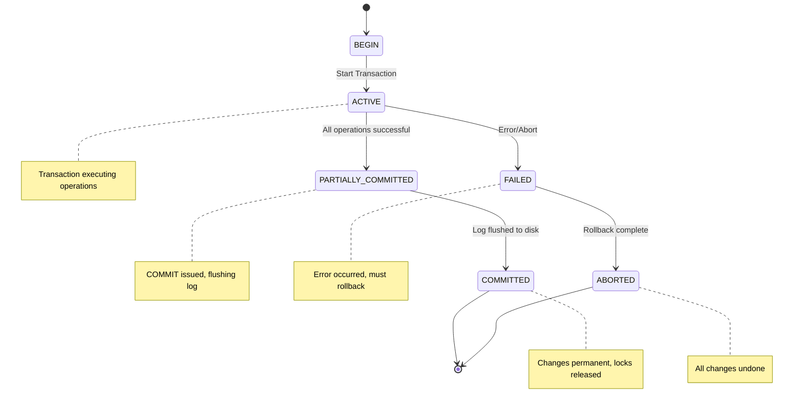
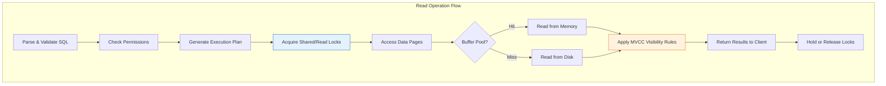
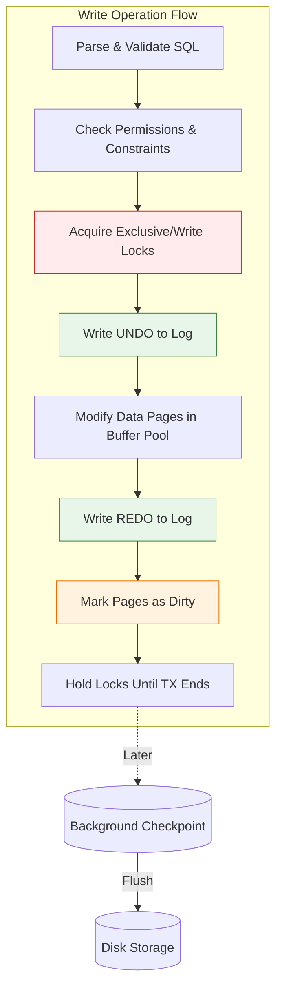
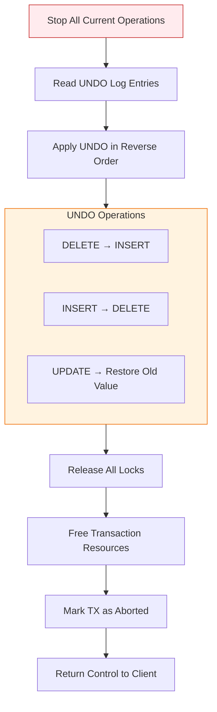
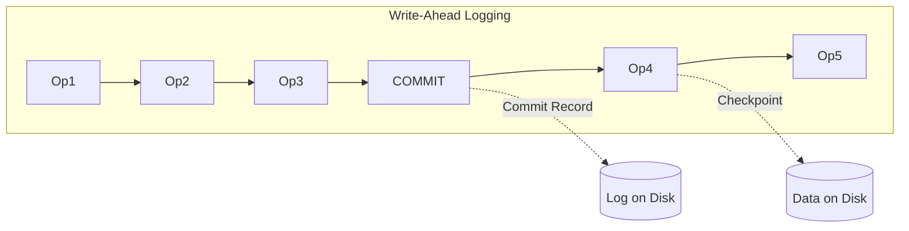
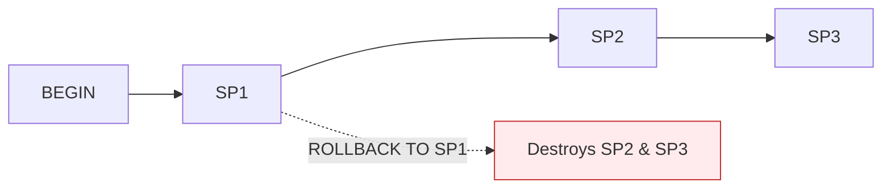
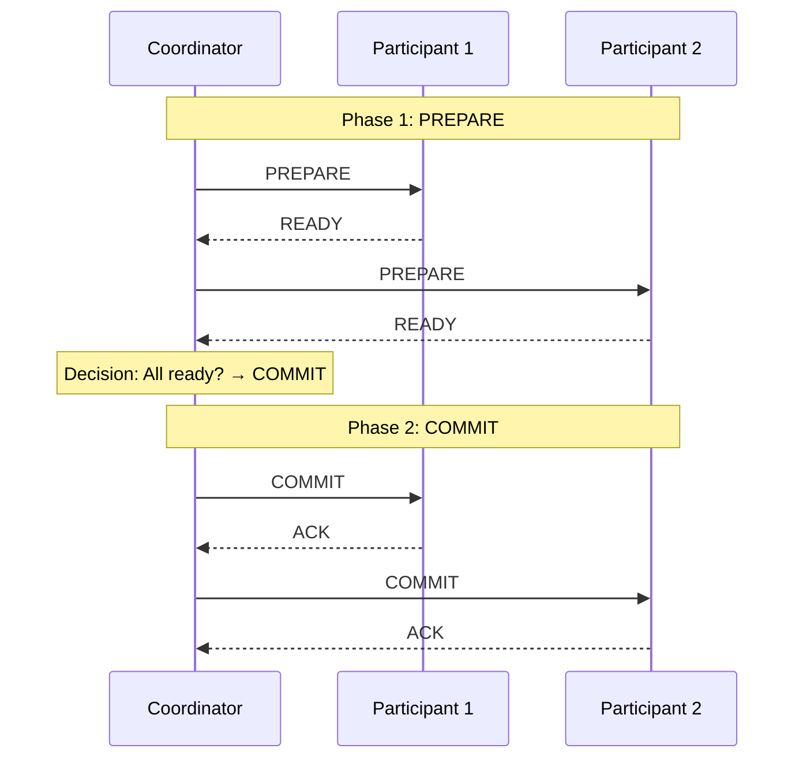

# Transaction Lifecycle

## 1. Introduction

Understanding the complete lifecycle of a database transaction is essential for building reliable applications. This covers what happens from the moment a transaction begins until it either commits or rolls back.



---

## 2. Transaction States

### 2.1 State Definitions

```
┌─────────────────────────────────────────────────────────────────────────────┐
│                       TRANSACTION STATES                                     │
├─────────────────────────────────────────────────────────────────────────────┤
│                                                                              │
│   ACTIVE                                                                    │
│   • Transaction is executing operations                                    │
│   • Can read and write data                                                │
│   • Changes are not yet permanent                                          │
│                                                                              │
│   PARTIALLY COMMITTED                                                       │
│   • All operations completed successfully                                   │
│   • COMMIT issued but not yet confirmed                                    │
│   • Writing to log, flushing buffers                                       │
│                                                                              │
│   COMMITTED                                                                 │
│   • Changes are permanent                                                  │
│   • Transaction log durably written                                        │
│   • Locks released, resources freed                                        │
│                                                                              │
│   FAILED                                                                    │
│   • Error occurred during execution                                        │
│   • Transaction cannot proceed                                             │
│   • Must be rolled back                                                    │
│                                                                              │
│   ABORTED                                                                   │
│   • Rollback completed                                                     │
│   • All changes undone                                                     │
│   • Database restored to pre-transaction state                             │
│                                                                              │
└─────────────────────────────────────────────────────────────────────────────┘
```

---

## 3. Detailed Lifecycle Phases

### 3.1 Transaction Begin

```sql
-- Explicit transaction start
BEGIN TRANSACTION;
-- or
START TRANSACTION;

-- With isolation level
BEGIN TRANSACTION ISOLATION LEVEL SERIALIZABLE;

-- With read-only hint
BEGIN TRANSACTION READ ONLY;
```

**What happens internally:**
1. Transaction ID (XID) assigned
2. Transaction added to active transaction list
3. Snapshot created (for MVCC databases)
4. Resources allocated (memory, connections)

### 3.2 Active Phase - Reading Data

```sql
BEGIN;

-- Read operation
SELECT * FROM accounts WHERE id = 1;
```

**Internal process:**


### 3.3 Active Phase - Writing Data

```sql
-- Write operations
UPDATE accounts SET balance = balance - 100 WHERE id = 1;
INSERT INTO transfers (from_id, to_id, amount) VALUES (1, 2, 100);
UPDATE accounts SET balance = balance + 100 WHERE id = 2;
```

**Internal process:**


> [!NOTE]
> Data is NOT immediately written to disk! Changes are in memory and in the transaction log.

### 3.4 COMMIT Phase

```sql
COMMIT;
```

**Detailed commit process:**
```mermaid
flowchart TD
    subgraph Phase1["Phase 1: PREPARE"]
        C1["Check All Constraints"] --> C2["Validate Operations"]
        C2 --> C3["Write Commit Record to Log"]
    end
    
    subgraph Phase2["Phase 2: FLUSH LOG - Critical!"]
        C4["Force Log to Disk - fsync"]
        C5["Point of No Return"]
        C6["Crash After = Will Redo"]
    end
    
    subgraph Phase3["Phase 3: FINALIZE"]
        C7["Mark TX Committed"] --> C8["Release All Locks"]
        C8 --> C9["Free Resources"]
        C9 --> C10["Return Success"]
    end
    
    Phase1 --> Phase2
    C4 --> C5 --> C6
    Phase2 --> Phase3
    
    style Phase2 fill:#ffebee,stroke:#c62828
    style C5 fill:#ffcdd2,stroke:#b71c1c
```

> [!IMPORTANT]
> Data pages may still be in memory only! Background checkpoint writes them later. Recovery uses log to redo if needed.

### 3.5 ROLLBACK Phase

```sql
ROLLBACK;
-- or automatic rollback on error
```

**Rollback process:**


> [!WARNING]
> Rollback can be expensive for long transactions!

---

## 4. Write-Ahead Logging (WAL)

### 4.1 WAL Principle



**The WAL Rule:** Before modifying any data page, you MUST first write the change to the log.

**Why?** For crash recovery:
- Log is sequentially written (fast)
- Data pages written randomly (slower)
- If crash before data written, replay log to recover

### 4.2 Log Record Types

```sql
-- Example log records (conceptual)

-- UNDO log record (for rollback)
{
    "type": "UNDO",
    "txn_id": 12345,
    "table": "accounts",
    "row_id": 1,
    "column": "balance",
    "old_value": 1000
}

-- REDO log record (for recovery)
{
    "type": "REDO",
    "txn_id": 12345,
    "table": "accounts",
    "row_id": 1,
    "column": "balance",
    "new_value": 900
}

-- Commit record
{
    "type": "COMMIT",
    "txn_id": 12345,
    "timestamp": "2024-01-15 10:30:45.123"
}
```

---

## 5. Savepoints

### 5.1 Creating and Using Savepoints

```sql
BEGIN;
    INSERT INTO orders (customer_id) VALUES (1);
    SAVEPOINT order_created;

    INSERT INTO order_items (order_id, product_id, qty) VALUES (1, 100, 2);
    SAVEPOINT items_added;

    UPDATE inventory SET stock = stock - 2 WHERE product_id = 100;
    -- Oops, not enough stock!

    ROLLBACK TO SAVEPOINT items_added;
    -- Order still exists, items rolled back

    -- Try different product
    INSERT INTO order_items (order_id, product_id, qty) VALUES (1, 101, 1);

COMMIT;
```

### 5.2 Savepoint Internals

```mermaid
flowchart TD
    subgraph SavepointOps["Savepoint Operations"]
        direction TB
        
        subgraph Create["SAVEPOINT"]
            S1["Mark Current Log Position"]
            S2["Record Name & Position"]
            S3["Continue TX Normally"]
            S1 --> S2 --> S3
        end
        
        subgraph Rollback["ROLLBACK TO SAVEPOINT"]
            R1["Undo Ops After Savepoint"]
            R2["Release Locks After SP"]
            R3["Continue From SP Position"]
            R1 --> R2 --> R3
        end
        
        subgraph Release["RELEASE SAVEPOINT"]
            L1["Remove SP Marker"]
            L2["Free Resources"]
            L3["Changes Now Permanent"]
            L1 --> L2 --> L3
        end
    end
```



**Savepoints are nested:**


---

## 6. Implicit vs Explicit Transactions

### 6.1 Autocommit Mode

```sql
-- Most databases default to autocommit mode
-- Each statement is its own transaction

UPDATE accounts SET balance = 100 WHERE id = 1;
-- Automatically committed!

UPDATE accounts SET balance = 200 WHERE id = 2;
-- Automatically committed!

-- These are TWO separate transactions
-- If second fails, first is still committed
```

### 6.2 Explicit Transactions

```sql
-- Explicit transaction groups statements together
BEGIN;
    UPDATE accounts SET balance = 100 WHERE id = 1;
    UPDATE accounts SET balance = 200 WHERE id = 2;
COMMIT;
-- Both succeed or both fail
```

### 6.3 Controlling Autocommit

```sql
-- PostgreSQL: Transactions are implicit within a connection
-- Use BEGIN to start explicit transaction

-- MySQL: Control autocommit
SET autocommit = 0;  -- Disable
-- All statements now require explicit COMMIT

SET autocommit = 1;  -- Enable (default)

-- SQL Server: Control with transaction mode
SET IMPLICIT_TRANSACTIONS ON;  -- Auto-start transactions
SET IMPLICIT_TRANSACTIONS OFF; -- Default autocommit
```

---

## 7. Distributed Transaction Lifecycle

### 7.1 Two-Phase Commit (2PC)



> [!WARNING]
> If ANY participant votes NO:
> - Coordinator sends ABORT to all
> - All participants roll back

---

## 8. Transaction Monitoring

### 8.1 PostgreSQL

```sql
-- View active transactions
SELECT
    pid,
    xact_start,
    state,
    query,
    NOW() - xact_start AS duration
FROM pg_stat_activity
WHERE state != 'idle'
  AND xact_start IS NOT NULL
ORDER BY xact_start;

-- View locks held by transactions
SELECT
    l.pid,
    l.locktype,
    l.mode,
    l.granted,
    a.query
FROM pg_locks l
JOIN pg_stat_activity a ON l.pid = a.pid
WHERE NOT l.granted;  -- Waiting for lock
```

### 8.2 MySQL

```sql
-- View running transactions
SELECT * FROM information_schema.innodb_trx;

-- View transaction locks
SELECT * FROM performance_schema.data_locks;

-- View lock waits
SELECT * FROM performance_schema.data_lock_waits;
```

---

## 9. Best Practices

```
┌─────────────────────────────────────────────────────────────────────────────┐
│                 TRANSACTION LIFECYCLE BEST PRACTICES                         │
├─────────────────────────────────────────────────────────────────────────────┤
│                                                                              │
│   1. KEEP TRANSACTIONS SHORT                                                │
│      • Acquire locks late, release early                                   │
│      • Don't do non-database work inside transactions                      │
│      • Avoid user interaction during transactions                          │
│                                                                              │
│   2. HANDLE ERRORS PROPERLY                                                  │
│      • Always have rollback in error handlers                              │
│      • Use try-finally to ensure cleanup                                   │
│      • Don't swallow transaction errors                                    │
│                                                                              │
│   3. USE APPROPRIATE ISOLATION LEVEL                                        │
│      • Start with READ COMMITTED (default)                                 │
│      • Use SERIALIZABLE only when needed                                   │
│      • Document why higher levels are needed                               │
│                                                                              │
│   4. BE PREPARED FOR RETRIES                                                │
│      • Serialization failures can happen                                   │
│      • Deadlocks cause automatic rollback                                  │
│      • Build retry logic into applications                                 │
│                                                                              │
│   5. MONITOR LONG-RUNNING TRANSACTIONS                                      │
│      • Set up alerts for transactions > threshold                         │
│      • Review why transactions run long                                    │
│      • Consider breaking into smaller transactions                         │
│                                                                              │
└─────────────────────────────────────────────────────────────────────────────┘
```

---

## 10. Summary

| Phase | Description | Key Action |
|-------|-------------|------------|
| BEGIN | Transaction starts | Allocate XID, create snapshot |
| ACTIVE | Operations execute | Acquire locks, write to log |
| PARTIALLY COMMITTED | Commit requested | Flush log to disk |
| COMMITTED | Success | Release locks, return control |
| FAILED | Error occurred | Mark for rollback |
| ABORTED | Rollback complete | Undo changes, release locks |

**Key Points:**
- WAL ensures durability even if data pages aren't written
- Commit is only complete after log is on disk
- Rollback uses UNDO log to reverse changes
- Savepoints allow partial rollback
- Long transactions hold locks and can cause problems
