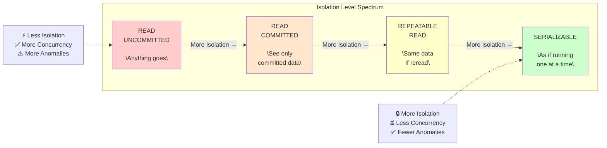
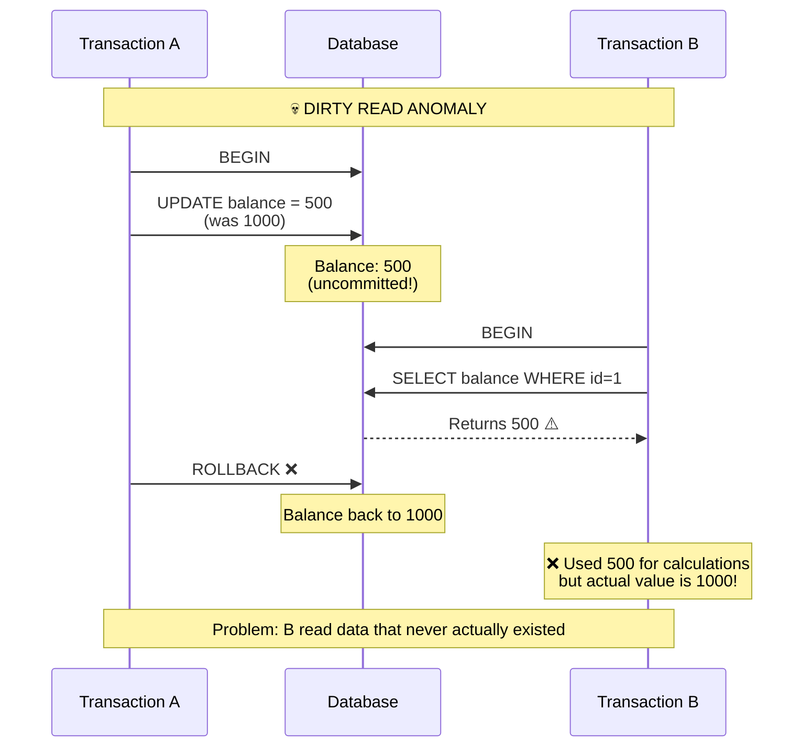
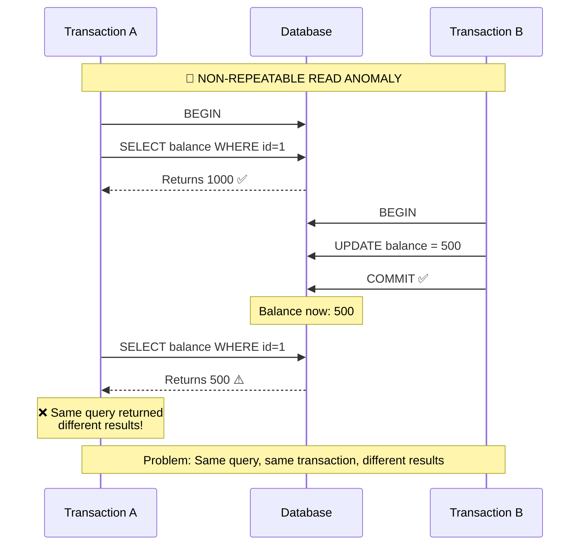
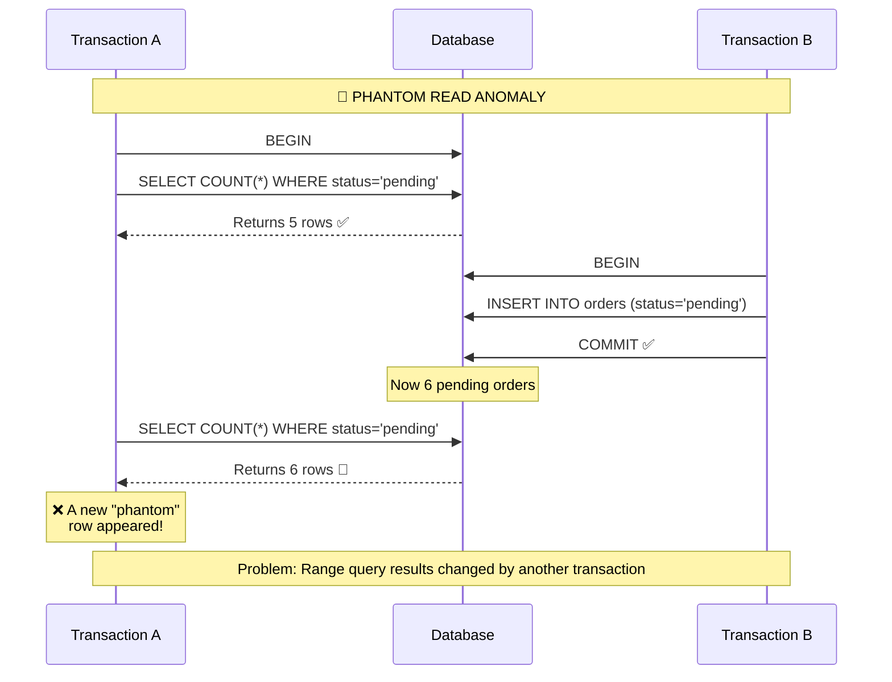
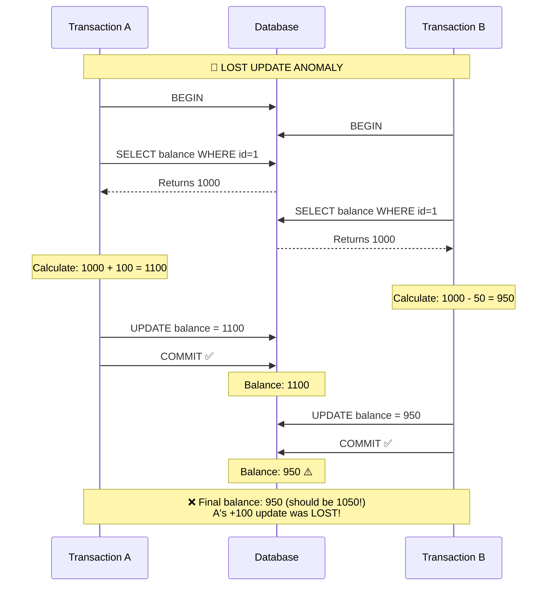
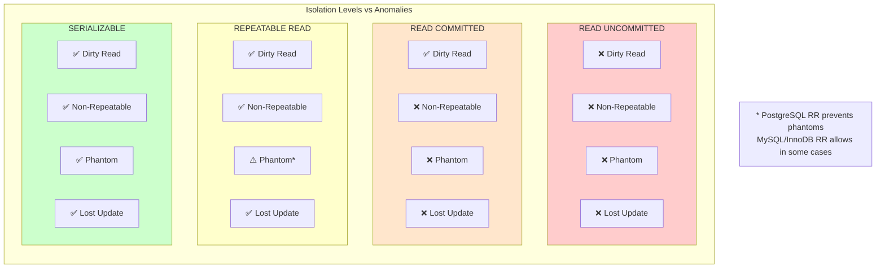
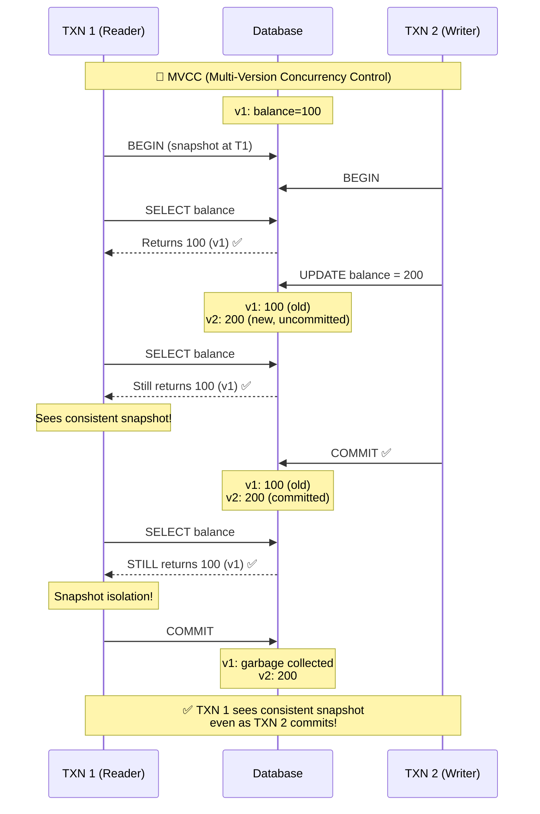
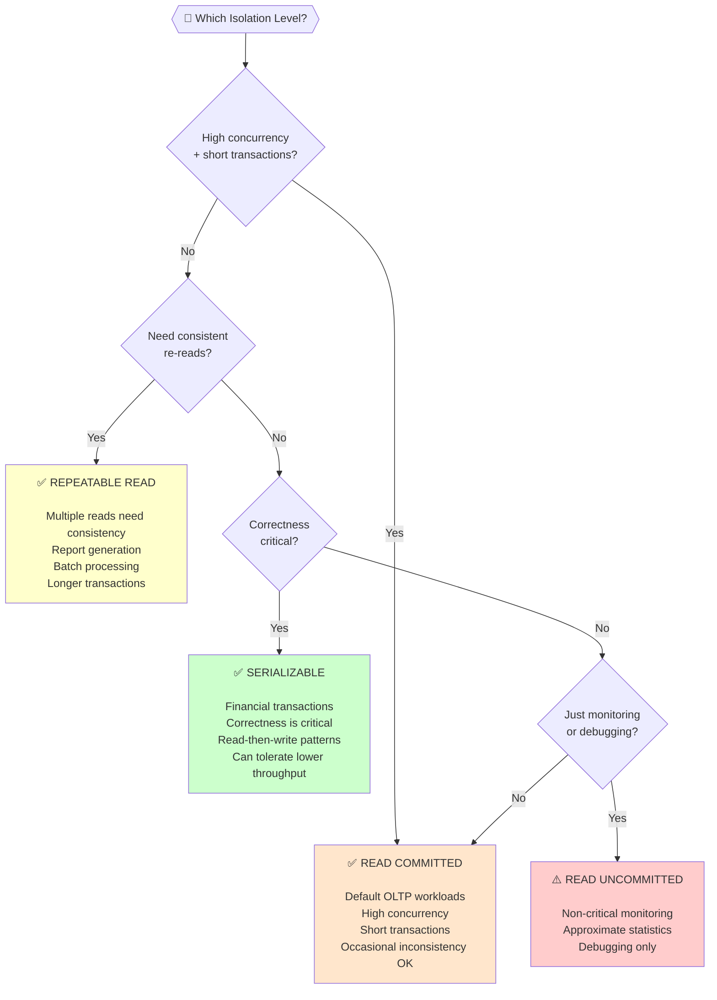

# Isolation Levels

## 1. Introduction

**Isolation levels** define the degree to which transactions are isolated from each other's modifications. Higher isolation provides more consistency guarantees but typically reduces concurrency.



---

## 2. Read Phenomena (Anomalies)

### 2.1 Dirty Read

Reading uncommitted changes from another transaction.



### 2.2 Non-Repeatable Read

Same query returns different results within one transaction.



### 2.3 Phantom Read

New rows appear that match a previous query's criteria.



### 2.4 Lost Update

Two transactions update the same row, one overwrites the other.



---

## 3. Isolation Levels Explained

### 3.1 READ UNCOMMITTED

```sql
SET TRANSACTION ISOLATION LEVEL READ UNCOMMITTED;

-- Allows: Dirty reads, Non-repeatable reads, Phantom reads
-- Prevents: Nothing

-- Use case: Very rare. Only for read-only analytics where
-- approximate results are acceptable and speed is critical
```

```
Phenomena Allowed:
✗ Dirty Read
✗ Non-Repeatable Read
✗ Phantom Read

Performance: Highest (no locking overhead)
Concurrency: Highest
Use Cases:
• Approximate counts/aggregations
• Monitoring dashboards (non-critical)
• Debug queries during development
```

### 3.2 READ COMMITTED

```sql
SET TRANSACTION ISOLATION LEVEL READ COMMITTED;

-- Default for: PostgreSQL, Oracle, SQL Server
-- Allows: Non-repeatable reads, Phantom reads
-- Prevents: Dirty reads

-- Each statement sees a snapshot of committed data at statement start
```

```
Phenomena Allowed:
✓ Dirty Read (prevented)
✗ Non-Repeatable Read
✗ Phantom Read

Performance: Good
Concurrency: Good
Use Cases:
• Most OLTP applications
• Default for many databases
• Good balance of consistency and performance
```

```sql
-- Behavior example
BEGIN;

SELECT balance FROM accounts WHERE id = 1;  -- Snapshot at this moment
-- Another transaction commits a change
SELECT balance FROM accounts WHERE id = 1;  -- New snapshot, might differ

COMMIT;
```

### 3.3 REPEATABLE READ

```sql
SET TRANSACTION ISOLATION LEVEL REPEATABLE READ;

-- Default for: MySQL/InnoDB
-- Allows: Phantom reads (in standard SQL; PostgreSQL prevents them)
-- Prevents: Dirty reads, Non-repeatable reads

-- Transaction sees a snapshot from the start; re-reads return same data
```

```
Phenomena Allowed:
✓ Dirty Read (prevented)
✓ Non-Repeatable Read (prevented)
✗ Phantom Read (allowed in SQL standard, prevented in PostgreSQL)

Performance: Moderate
Concurrency: Moderate
Use Cases:
• Financial reports that read same data multiple times
• Long-running read transactions needing consistency
• Batch jobs processing data
```

```sql
-- Behavior example
BEGIN;

SELECT balance FROM accounts WHERE id = 1;  -- Snapshot for entire transaction
-- Another transaction commits a change
SELECT balance FROM accounts WHERE id = 1;  -- Same result as first query

COMMIT;
```

### 3.4 SERIALIZABLE

```sql
SET TRANSACTION ISOLATION LEVEL SERIALIZABLE;

-- Strictest level
-- Prevents: All phenomena including phantom reads
-- Behavior: As if transactions ran one at a time (serially)
```

```
Phenomena Allowed:
✓ Dirty Read (prevented)
✓ Non-Repeatable Read (prevented)
✓ Phantom Read (prevented)

Performance: Lowest
Concurrency: Lowest
Use Cases:
• Critical financial transactions
• When absolute correctness is required
• When you'd otherwise need application-level locking
```

---

## 4. Comparison Matrix



---

## 5. Implementation Approaches

### 5.1 Locking (Pessimistic)

```sql
-- Two-Phase Locking (2PL)
-- Transactions acquire locks, hold until commit/rollback

-- Shared lock (read lock) - multiple readers allowed
SELECT * FROM accounts WHERE id = 1 FOR SHARE;

-- Exclusive lock (write lock) - one writer, no readers
SELECT * FROM accounts WHERE id = 1 FOR UPDATE;

-- Lock types:
-- • Row locks: Lock specific rows
-- • Table locks: Lock entire table
-- • Gap locks: Lock gaps between index values (for phantom prevention)
```

### 5.2 MVCC (Optimistic)

```sql
-- Multi-Version Concurrency Control
-- Readers don't block writers; writers don't block readers

-- How it works:
-- 1. Each row has version info (transaction ID, timestamps)
-- 2. Writes create new versions instead of modifying in place
-- 3. Reads see consistent snapshot based on transaction start time
-- 4. Old versions cleaned up by vacuum/garbage collection

-- Used by: PostgreSQL, MySQL/InnoDB, Oracle
```



---

## 6. Choosing an Isolation Level



---

## 7. Code Examples

### PostgreSQL

```sql
-- Set for session
SET SESSION CHARACTERISTICS AS TRANSACTION ISOLATION LEVEL SERIALIZABLE;

-- Set for specific transaction
BEGIN TRANSACTION ISOLATION LEVEL REPEATABLE READ;
    SELECT * FROM accounts WHERE id = 1;
    -- more operations...
COMMIT;

-- Check current level
SHOW transaction_isolation;
```

### Python (psycopg2)

```python
import psycopg2
from psycopg2 import extensions

conn = psycopg2.connect(database="mydb")

# Set isolation level
conn.set_isolation_level(extensions.ISOLATION_LEVEL_SERIALIZABLE)

# Or per transaction
conn.set_isolation_level(extensions.ISOLATION_LEVEL_REPEATABLE_READ)

try:
    with conn.cursor() as cur:
        cur.execute("SELECT balance FROM accounts WHERE id = %s", (1,))
        balance = cur.fetchone()[0]
        # ... calculations ...
        cur.execute("UPDATE accounts SET balance = %s WHERE id = %s",
                   (new_balance, 1))
    conn.commit()
except psycopg2.errors.SerializationFailure:
    conn.rollback()
    # Retry the transaction
```

### Java (JDBC)

```java
Connection conn = dataSource.getConnection();

// Set isolation level
conn.setTransactionIsolation(Connection.TRANSACTION_SERIALIZABLE);

// Available constants:
// Connection.TRANSACTION_READ_UNCOMMITTED
// Connection.TRANSACTION_READ_COMMITTED
// Connection.TRANSACTION_REPEATABLE_READ
// Connection.TRANSACTION_SERIALIZABLE

try {
    conn.setAutoCommit(false);
    // Transaction operations...
    conn.commit();
} catch (SQLException e) {
    conn.rollback();
    if (e.getSQLState().equals("40001")) {  // Serialization failure
        // Retry transaction
    }
}
```

---

## 8. Summary

| Level | Dirty Read | Non-Repeatable | Phantom | Use Case |
|-------|------------|----------------|---------|----------|
| READ UNCOMMITTED | Possible | Possible | Possible | Rare, monitoring |
| READ COMMITTED | Prevented | Possible | Possible | Default OLTP |
| REPEATABLE READ | Prevented | Prevented | Possible* | Reports, batches |
| SERIALIZABLE | Prevented | Prevented | Prevented | Critical finance |

**Key Points:**
- Default to READ COMMITTED for most applications
- Use REPEATABLE READ for consistent multi-read transactions
- Use SERIALIZABLE for critical correctness requirements
- Be prepared to retry transactions at higher isolation levels
- Understand your database's specific implementation (MVCC vs locking)
