# Concurrency Control

## 1. Introduction

**Concurrency control** ensures correct results when multiple transactions execute simultaneously. Without it, concurrent transactions can produce incorrect results, even if each transaction is correct individually.

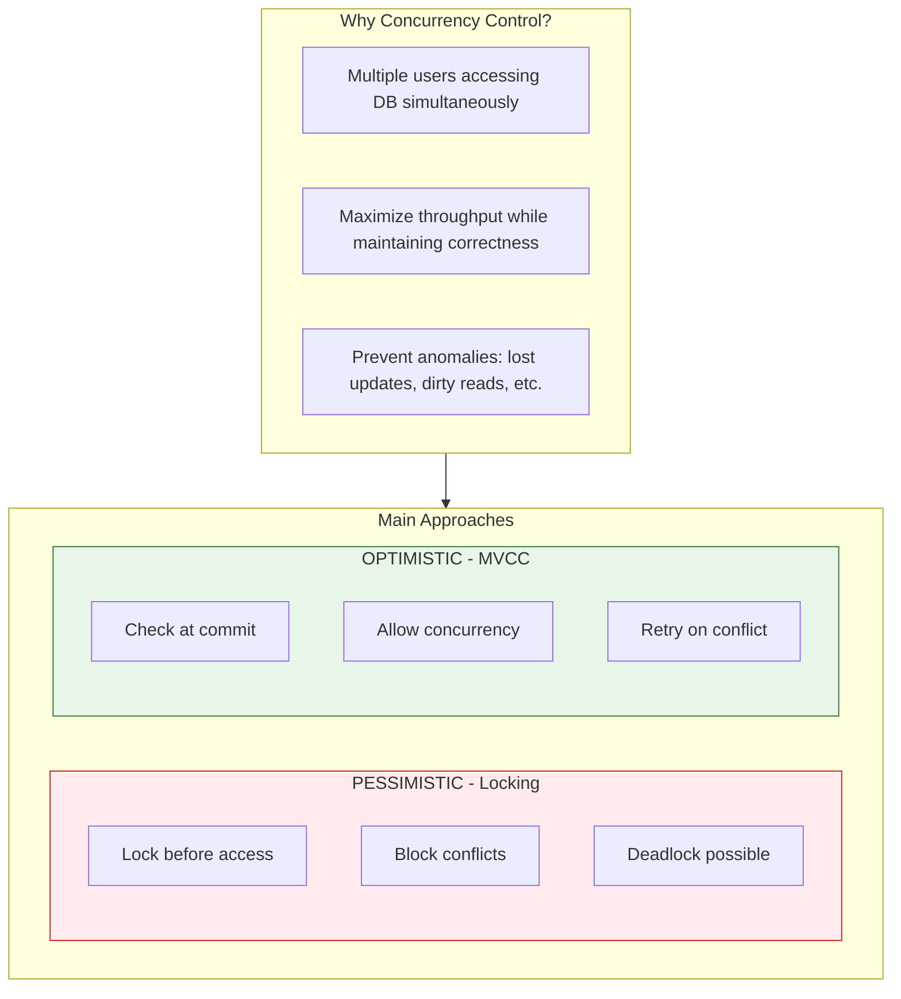

> [!NOTE]
> Modern databases often combine both approaches

---

## 2. Concurrency Problems

### 2.1 Lost Update

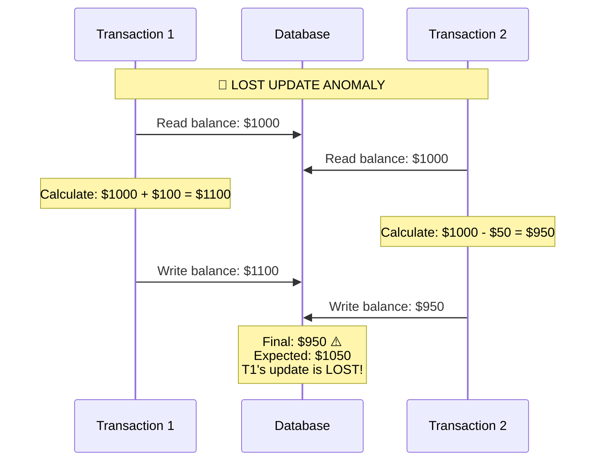

### 2.2 Dirty Read

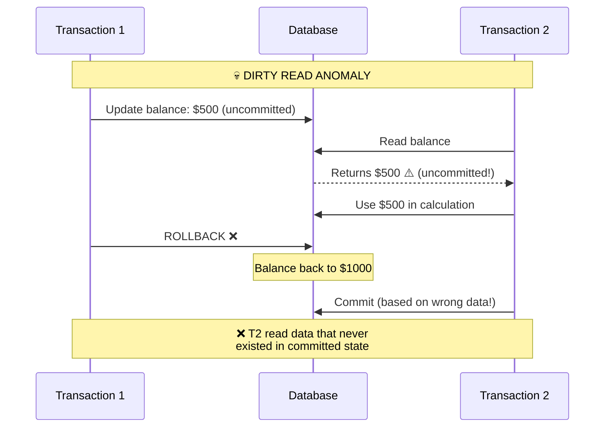

### 2.3 Non-Repeatable Read

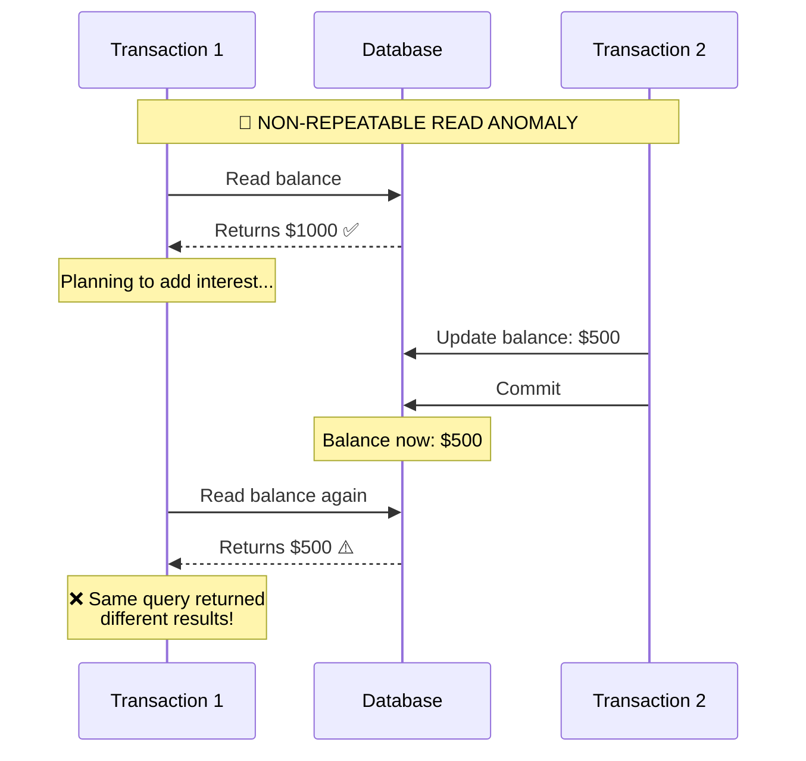

### 2.4 Phantom Read

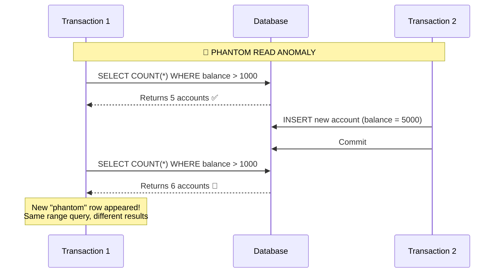

---

## 3. Serializability

### 3.1 Definition

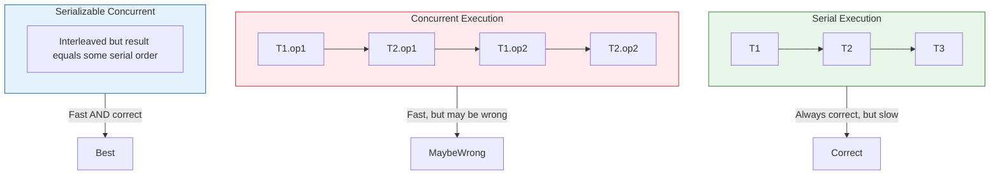

**Types of Serializability:**
- **Conflict Serializability:** No conflicting operations reordered
- **View Serializability:** Same reads see same values

### 3.2 Conflict Serializability

```
Operations conflict if:
1. They belong to different transactions
2. They access the same data item
3. At least one is a write

Conflict types:
• Read-Write (R-W): Read depends on prior write
• Write-Read (W-R): Write affects later read
• Write-Write (W-W): One write overwrites another

Non-conflicting operations can be reordered.

Example - Serializable schedule:
T1: R(A) W(A)           R(B) W(B)
T2:           R(A) W(A)           R(B) W(B)

Equivalent to: T1 → T2 (serial)
```

---

## 4. Locking-Based Concurrency Control

### 4.1 Lock Types

```sql
-- Shared Lock (S-lock / Read lock)
-- Multiple transactions can hold simultaneously
SELECT * FROM accounts WHERE id = 1 FOR SHARE;

-- Exclusive Lock (X-lock / Write lock)
-- Only one transaction can hold
SELECT * FROM accounts WHERE id = 1 FOR UPDATE;
```

**Lock Compatibility Matrix:**

| Requesting \ Existing | Shared (S) | Exclusive (X) |
|----------------------|------------|---------------|
| **Shared (S)** | ✅ Compatible | ❌ Conflict |
| **Exclusive (X)** | ❌ Conflict | ❌ Conflict |

> [!NOTE]
> - ✅ = Can be granted
> - ❌ = Must wait
> - Multiple readers can proceed concurrently
> - Writer blocks all other readers and writers

### 4.2 Lock Granularity

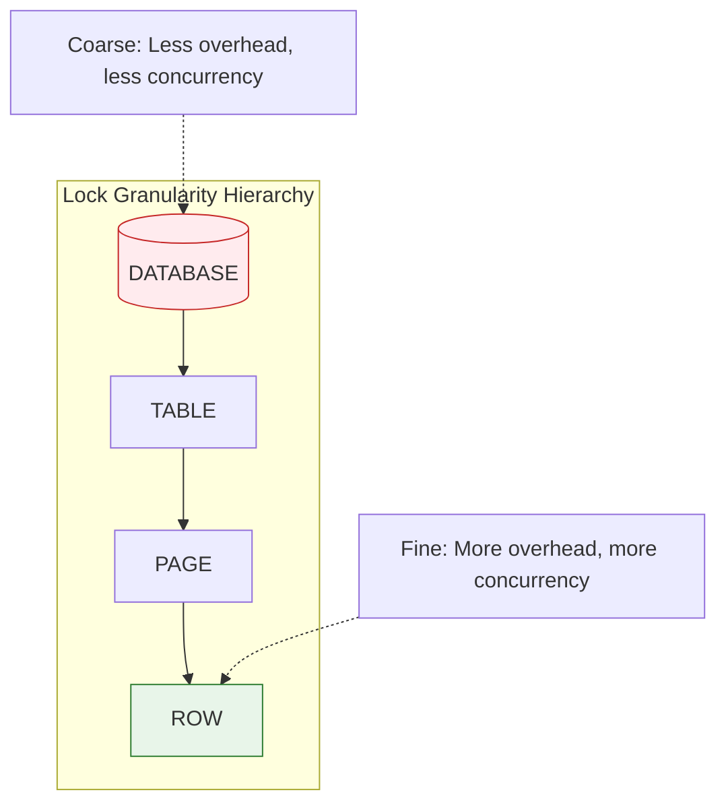

> [!TIP]
> Most modern databases use row-level locking by default

### 4.3 Two-Phase Locking (2PL)

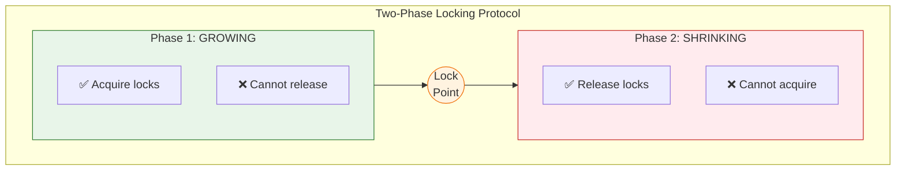

> [!IMPORTANT]
> **Strict 2PL:** Release all locks only at commit/abort (most common in practice - prevents cascading rollbacks)

---

## 5. Deadlocks

### 5.1 What is a Deadlock?

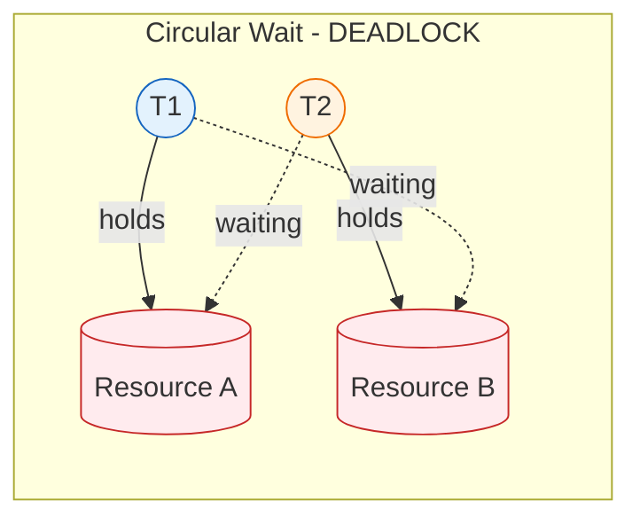

> [!CAUTION]
> Circular wait! Both transactions blocked forever.

### 5.2 Deadlock Prevention

```sql
-- Strategy 1: Lock ordering
-- Always acquire locks in the same order
BEGIN;
    SELECT * FROM accounts WHERE id = 1 FOR UPDATE;  -- Always lock lower ID first
    SELECT * FROM accounts WHERE id = 2 FOR UPDATE;
    -- Transfer funds...
COMMIT;

-- Strategy 2: Lock timeout
SET lock_timeout = '5s';  -- PostgreSQL
-- Transaction aborts if can't acquire lock in 5 seconds

-- Strategy 3: NOWAIT
SELECT * FROM accounts WHERE id = 1 FOR UPDATE NOWAIT;
-- Fails immediately if lock not available
```

### 5.3 Deadlock Detection

```sql
-- PostgreSQL deadlock detection
-- Automatic: Checks periodically (deadlock_timeout, default 1s)
-- Victim chosen to break cycle, transaction aborted

-- Check for waiting transactions
SELECT
    blocked.pid AS blocked_pid,
    blocked.query AS blocked_query,
    blocking.pid AS blocking_pid,
    blocking.query AS blocking_query
FROM pg_stat_activity blocked
JOIN pg_locks blocked_locks ON blocked.pid = blocked_locks.pid
JOIN pg_locks blocking_locks ON blocked_locks.locktype = blocking_locks.locktype
    AND blocked_locks.database = blocking_locks.database
    AND blocked_locks.relation = blocking_locks.relation
    AND blocked_locks.page = blocking_locks.page
    AND blocked_locks.tuple = blocking_locks.tuple
    AND blocked_locks.virtualxid = blocking_locks.virtualxid
    AND blocked_locks.transactionid = blocking_locks.transactionid
    AND blocked_locks.classid = blocking_locks.classid
    AND blocked_locks.objid = blocking_locks.objid
    AND blocked_locks.objsubid = blocking_locks.objsubid
    AND blocked_locks.pid != blocking_locks.pid
JOIN pg_stat_activity blocking ON blocking_locks.pid = blocking.pid
WHERE NOT blocked_locks.granted;
```

---

## 6. Optimistic Concurrency Control

### 6.1 Concept

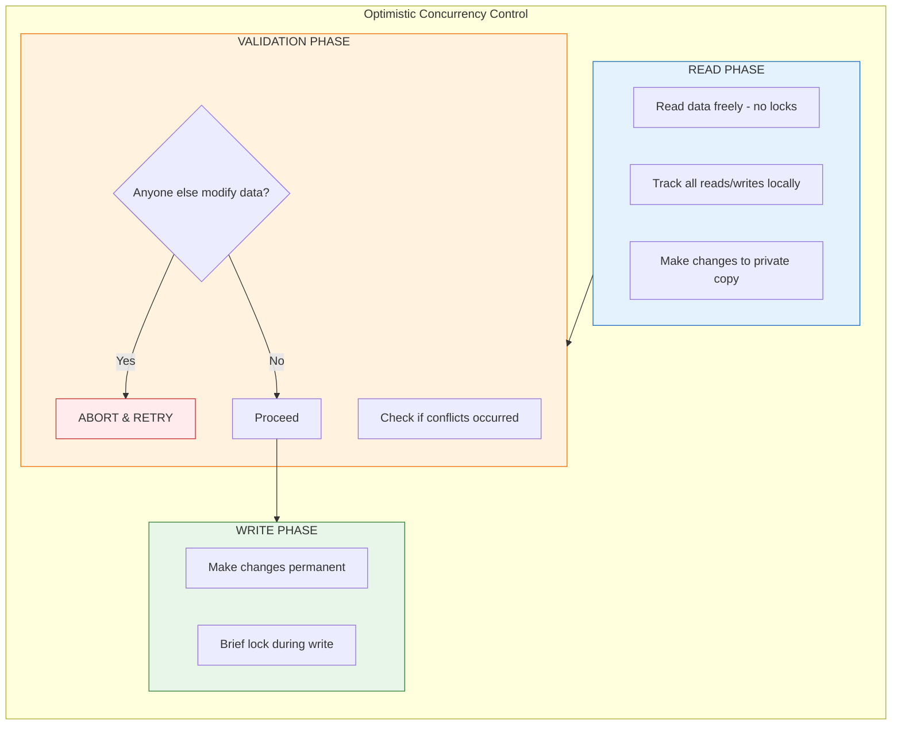

> [!TIP]
> - **Best for:** Read-heavy workloads with few conflicts
> - **Worst for:** Write-heavy workloads with many conflicts (lots of retries)

### 6.2 Application-Level Optimistic Locking

```sql
-- Using version column
CREATE TABLE accounts (
    id INT PRIMARY KEY,
    balance DECIMAL(10, 2),
    version INT DEFAULT 0
);

-- Read current version
SELECT id, balance, version FROM accounts WHERE id = 1;
-- Returns: id=1, balance=1000, version=5

-- Update with version check
UPDATE accounts
SET balance = 900, version = version + 1
WHERE id = 1 AND version = 5;

-- If 0 rows affected, someone else modified it
-- Application must retry with fresh data
```

```python
# Python implementation
def transfer_funds(from_id, to_id, amount, max_retries=3):
    for attempt in range(max_retries):
        try:
            # Read current state
            from_account = db.execute(
                "SELECT balance, version FROM accounts WHERE id = %s",
                (from_id,)
            ).fetchone()

            to_account = db.execute(
                "SELECT balance, version FROM accounts WHERE id = %s",
                (to_id,)
            ).fetchone()

            # Calculate new balances
            new_from_balance = from_account['balance'] - amount
            new_to_balance = to_account['balance'] + amount

            # Attempt updates with version checks
            rows = db.execute("""
                UPDATE accounts SET balance = %s, version = version + 1
                WHERE id = %s AND version = %s
            """, (new_from_balance, from_id, from_account['version']))

            if rows == 0:
                raise OptimisticLockError("Account modified by another transaction")

            rows = db.execute("""
                UPDATE accounts SET balance = %s, version = version + 1
                WHERE id = %s AND version = %s
            """, (new_to_balance, to_id, to_account['version']))

            if rows == 0:
                db.rollback()
                raise OptimisticLockError("Account modified by another transaction")

            db.commit()
            return True

        except OptimisticLockError:
            if attempt == max_retries - 1:
                raise
            time.sleep(0.1 * (attempt + 1))  # Backoff

    return False
```

---

## 7. Timestamp-Based Concurrency Control

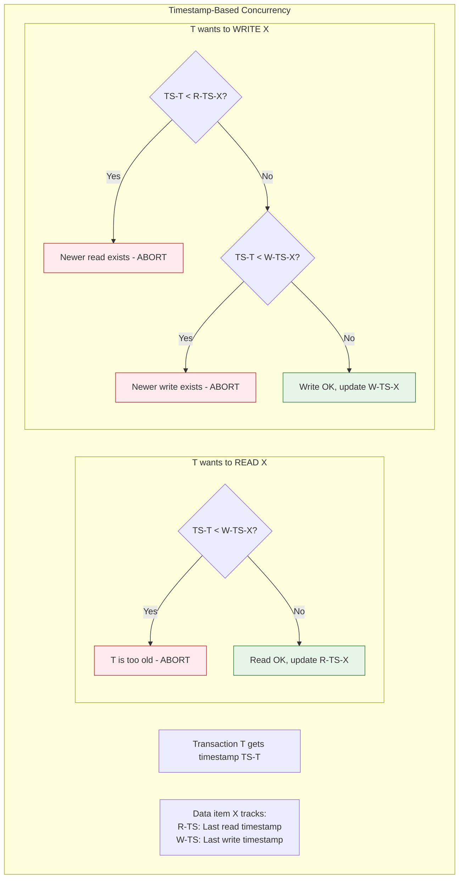

> [!NOTE]
> - Ensures serializable schedule equivalent to timestamp order
> - No deadlocks possible (transactions abort rather than wait)

---

## 8. Concurrency in Modern Databases

### 8.1 PostgreSQL

```sql
-- PostgreSQL uses MVCC primarily
-- Readers never block writers, writers never block readers

-- Explicit locking when needed
SELECT * FROM accounts FOR UPDATE;           -- Exclusive row lock
SELECT * FROM accounts FOR SHARE;            -- Shared row lock
SELECT * FROM accounts FOR NO KEY UPDATE;    -- Weaker exclusive lock
SELECT * FROM accounts FOR KEY SHARE;        -- Weaker shared lock

-- Advisory locks (application-defined)
SELECT pg_advisory_lock(12345);              -- Acquire lock
SELECT pg_advisory_unlock(12345);            -- Release lock
SELECT pg_try_advisory_lock(12345);          -- Non-blocking attempt
```

### 8.2 MySQL/InnoDB

```sql
-- InnoDB uses MVCC + row-level locking
-- Default isolation: REPEATABLE READ

-- Locking reads
SELECT * FROM accounts WHERE id = 1 FOR UPDATE;
SELECT * FROM accounts WHERE id = 1 FOR SHARE;

-- Gap locking prevents phantoms in REPEATABLE READ
-- Locks range between index values to prevent inserts
```

---

## 9. Summary

| Approach | Pros | Cons | Best For |
|----------|------|------|----------|
| 2PL | Guarantees serializability | Deadlocks possible | Write-heavy workloads |
| MVCC | High concurrency | More storage | Read-heavy workloads |
| Optimistic | No blocking | Retry overhead | Few conflicts |
| Timestamp | No deadlocks | Aborts possible | Distributed systems |

**Key Takeaways:**

1. Concurrency control prevents anomalies in concurrent transactions
2. Serializability is the gold standard for correctness
3. 2PL uses locks; MVCC uses versions - both achieve serializability
4. Deadlocks are possible with locking; handle with timeouts/detection
5. Optimistic approaches work well when conflicts are rare
6. Modern databases combine multiple techniques
7. Choose isolation level based on application requirements
