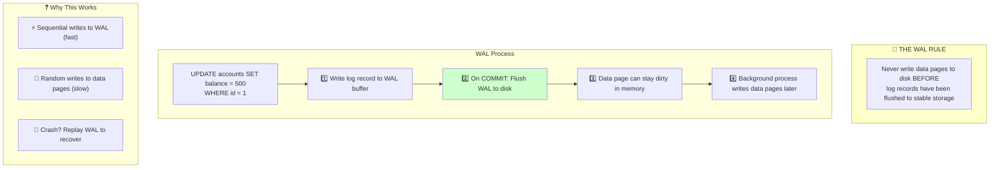
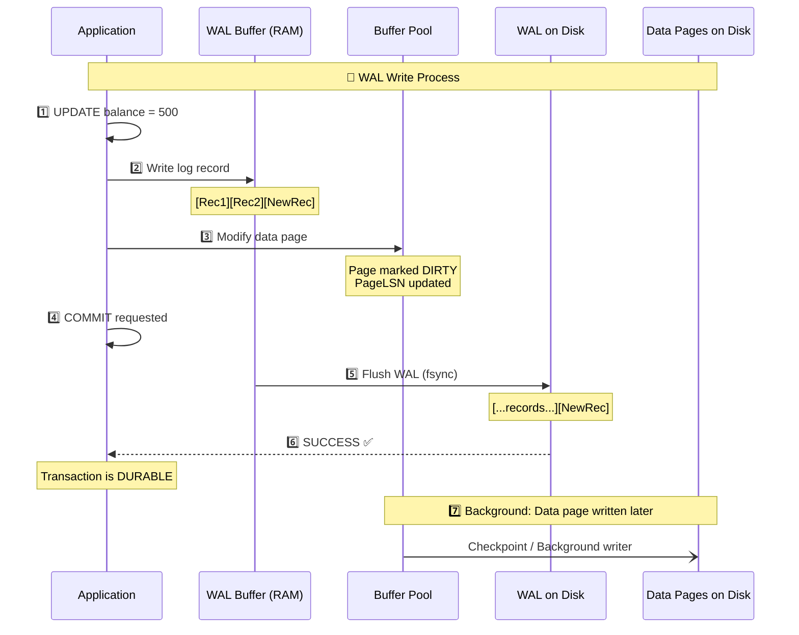
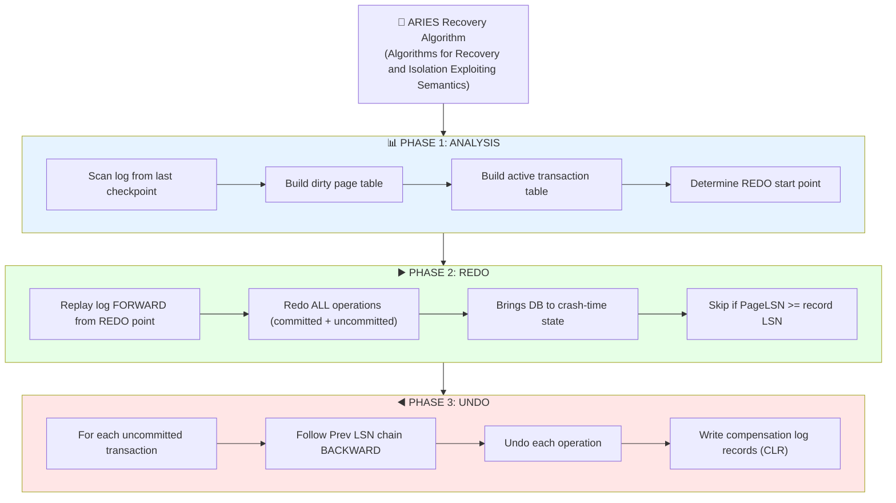
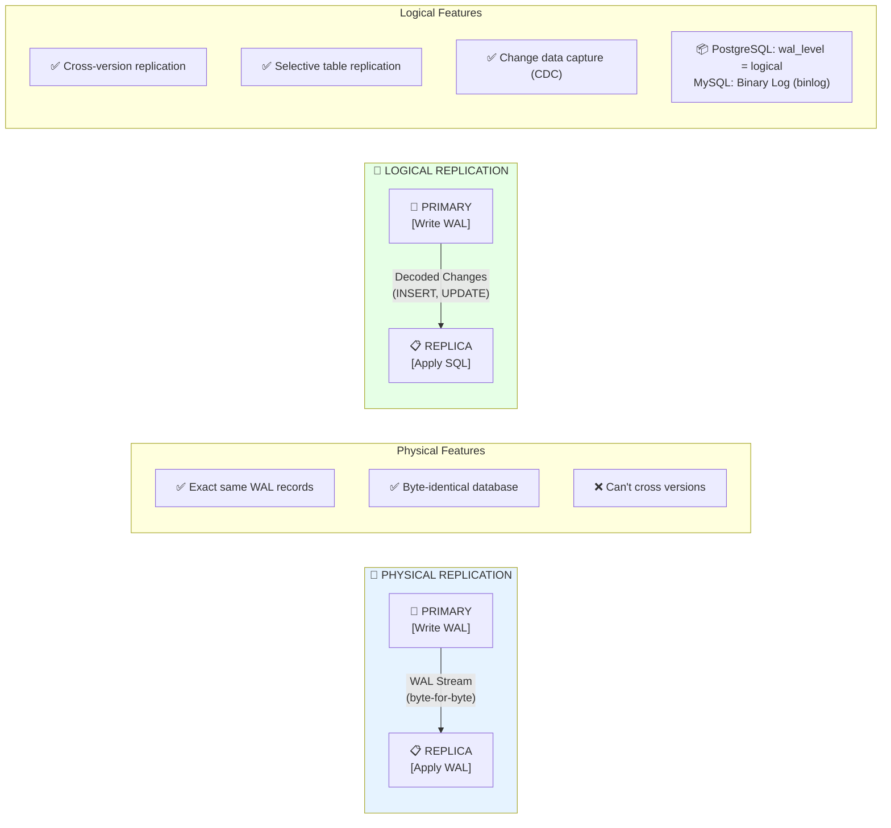

# Write-Ahead Logging (WAL)

## 1. Introduction

**Write-Ahead Logging (WAL)** is a technique that ensures data integrity by recording changes to a log before applying them to the actual data files. It's fundamental to ACID compliance and crash recovery.



---

## 2. WAL Components

### 2.1 Log Structure

```
┌─────────────────────────────────────────────────────────────────────────────┐
│                       WAL LOG STRUCTURE                                      │
├─────────────────────────────────────────────────────────────────────────────┤
│                                                                              │
│   WAL FILE (Segment):                                                       │
│   ┌─────────────────────────────────────────────────────────────────┐      │
│   │ Record │ Record │ Record │ Record │ Record │ Record │ ...       │      │
│   │   1    │   2    │   3    │   4    │   5    │   6    │           │      │
│   └─────────────────────────────────────────────────────────────────┘      │
│                                                                              │
│   LOG RECORD:                                                               │
│   ┌─────────────────────────────────────────────────────────────────┐      │
│   │ LSN │ Prev │ TxID │ Type │ Page │ Offset │ Before │ After │ CRC │      │
│   │     │ LSN  │      │      │ ID   │        │ Image  │ Image │     │      │
│   └─────────────────────────────────────────────────────────────────┘      │
│                                                                              │
│   Fields:                                                                   │
│   • LSN (Log Sequence Number): Unique identifier, monotonically increasing│
│   • Prev LSN: Previous record in same transaction                         │
│   • TxID: Transaction identifier                                          │
│   • Type: INSERT, UPDATE, DELETE, COMMIT, ABORT, CHECKPOINT               │
│   • Page ID: Which page was modified                                      │
│   • Before Image: Old value (for UNDO)                                    │
│   • After Image: New value (for REDO)                                     │
│   • CRC: Checksum for integrity                                           │
│                                                                              │
└─────────────────────────────────────────────────────────────────────────────┘
```

### 2.2 LSN (Log Sequence Number)

```
┌─────────────────────────────────────────────────────────────────────────────┐
│                    LOG SEQUENCE NUMBER (LSN)                                 │
├─────────────────────────────────────────────────────────────────────────────┤
│                                                                              │
│   LSN uniquely identifies each log record                                  │
│   Used to track recovery position and page freshness                       │
│                                                                              │
│   Components (PostgreSQL):                                                  │
│   • Segment number (file)                                                  │
│   • Offset within segment                                                  │
│   • Example: 0/16B3A40 (segment 0, offset 0x16B3A40)                       │
│                                                                              │
│   LSN stored in:                                                            │
│   • Each log record (its own LSN)                                         │
│   • Each data page (PageLSN = last WAL record that modified it)           │
│   • Checkpoint record (recovery start point)                              │
│                                                                              │
│   During recovery:                                                          │
│   ┌──────────────────────────────────────────────────────────────────┐     │
│   │ For each log record with LSN X:                                  │     │
│   │   If page's PageLSN < X:                                        │     │
│   │     → Apply this log record (REDO)                              │     │
│   │   Else:                                                          │     │
│   │     → Skip (page already has this change)                       │     │
│   └──────────────────────────────────────────────────────────────────┘     │
│                                                                              │
└─────────────────────────────────────────────────────────────────────────────┘
```

---

## 3. WAL Write Process



---

## 4. Recovery Process

### 4.1 ARIES Recovery Algorithm



### 4.2 Recovery Example

```
Log before crash:
┌─────────────────────────────────────────────────────────────────────────────┐
│ LSN │ TxID │ Type   │ Details                                               │
├─────┼──────┼────────┼───────────────────────────────────────────────────────┤
│ 10  │  -   │ CKPT   │ Checkpoint                                            │
│ 11  │ T1   │ UPDATE │ Page 5: balance 1000 → 900                           │
│ 12  │ T2   │ UPDATE │ Page 3: balance 500 → 600                            │
│ 13  │ T1   │ UPDATE │ Page 7: balance 200 → 100                            │
│ 14  │ T1   │ COMMIT │                                                       │
│ 15  │ T2   │ UPDATE │ Page 3: balance 600 → 700                            │
│     │      │ CRASH! │                                                       │
└─────────────────────────────────────────────────────────────────────────────┘

Recovery:
ANALYSIS: T1 committed, T2 active (uncommitted)
REDO: Apply LSN 11, 12, 13, 14, 15 (if needed based on PageLSN)
UNDO: Rollback T2 - undo LSN 15, then LSN 12
```

---

## 5. Checkpoints

```
┌─────────────────────────────────────────────────────────────────────────────┐
│                        CHECKPOINTS                                           │
├─────────────────────────────────────────────────────────────────────────────┤
│                                                                              │
│   A checkpoint is a known-good recovery point                              │
│                                                                              │
│   PURPOSE:                                                                  │
│   • Limit recovery time (don't replay entire log)                         │
│   • Allow WAL file recycling                                               │
│   • Flush dirty pages to reduce crash recovery I/O                        │
│                                                                              │
│   CHECKPOINT PROCESS:                                                       │
│   1. Write checkpoint start record to WAL                                  │
│   2. Flush all dirty pages to disk                                        │
│   3. Write checkpoint complete record to WAL                              │
│   4. Update checkpoint location in control file                           │
│   5. Old WAL files can be recycled                                        │
│                                                                              │
│   TYPES:                                                                    │
│   • Sharp Checkpoint: All dirty pages flushed (stops processing)          │
│   • Fuzzy Checkpoint: Pages flushed gradually (PostgreSQL default)        │
│                                                                              │
│   ┌─────────────────────────────────────────────────────────────────┐      │
│   │        WAL Timeline                                              │      │
│   │                                                                   │      │
│   │ [records...][CKPT][records...][CKPT][records...][CRASH]         │      │
│   │              ▲                  ▲                                │      │
│   │              │                  │                                │      │
│   │         Old checkpoint     Last checkpoint                       │      │
│   │         (can recycle)      (recovery starts here)               │      │
│   └─────────────────────────────────────────────────────────────────┘      │
│                                                                              │
└─────────────────────────────────────────────────────────────────────────────┘
```

---

## 6. WAL Configuration

### 6.1 PostgreSQL

```sql
-- WAL directory
-- $PGDATA/pg_wal/

-- Check WAL location
SHOW data_directory;
SELECT pg_current_wal_lsn();

-- WAL settings
SHOW wal_level;              -- minimal, replica, logical
SHOW wal_buffers;            -- WAL buffer size (default: 1/32 shared_buffers)
SHOW checkpoint_timeout;     -- Time between checkpoints (default: 5min)
SHOW max_wal_size;           -- Max WAL size before checkpoint (default: 1GB)
SHOW min_wal_size;           -- Min WAL to keep (default: 80MB)

-- Synchronous commit options
SHOW synchronous_commit;
-- on: Wait for WAL flush (default, safest)
-- off: Return before flush (faster, risk of data loss)
-- remote_write: Wait for replica to receive
-- remote_apply: Wait for replica to apply

-- For high-throughput writes
SET synchronous_commit = off;  -- Per-session, not recommended for critical data

-- WAL compression (PostgreSQL 15+)
SHOW wal_compression;  -- off, pglz, lz4, zstd
```

### 6.2 MySQL/InnoDB

```sql
-- Redo log files
-- /var/lib/mysql/ib_logfile0, ib_logfile1

-- Check redo log settings
SHOW VARIABLES LIKE 'innodb_log%';

-- Key settings:
-- innodb_log_file_size: Size of each log file (default: 50MB, recommend: 1-2GB)
-- innodb_log_files_in_group: Number of log files (default: 2)
-- innodb_log_buffer_size: Buffer before writing (default: 16MB)

-- Flush behavior
SHOW VARIABLES LIKE 'innodb_flush_log_at_trx_commit';
-- 1: Flush on every commit (safest, default)
-- 0: Flush every second (fastest, risk of 1s data loss)
-- 2: Write to OS buffer on commit, flush every second

-- Flush method
SHOW VARIABLES LIKE 'innodb_flush_method';
-- O_DIRECT: Bypass OS cache (recommended for dedicated server)
-- fsync: Default on some systems
```

---

## 7. WAL for Replication



---

## 8. WAL Performance Considerations

```
┌─────────────────────────────────────────────────────────────────────────────┐
│                 WAL PERFORMANCE OPTIMIZATION                                 │
├─────────────────────────────────────────────────────────────────────────────┤
│                                                                              │
│   BOTTLENECKS:                                                              │
│   • WAL flush on every commit (synchronous_commit = on)                   │
│   • Small transactions = many flushes                                     │
│   • WAL on slow disk                                                      │
│                                                                              │
│   SOLUTIONS:                                                                │
│                                                                              │
│   1. GROUP COMMIT                                                          │
│      • Multiple transactions share single WAL flush                       │
│      • Automatic in PostgreSQL when load is high                         │
│      • MySQL: binlog_group_commit_sync_delay                             │
│                                                                              │
│   2. SEPARATE WAL DISK                                                     │
│      • Dedicated fast storage for WAL                                     │
│      • SSD or NVMe for WAL, HDD for data                                 │
│      • Reduces contention                                                 │
│                                                                              │
│   3. BATCH TRANSACTIONS                                                    │
│      • Combine multiple operations in single transaction                  │
│      • One flush per transaction instead of per statement                │
│                                                                              │
│   4. ASYNC COMMIT (careful!)                                               │
│      • PostgreSQL: synchronous_commit = off                              │
│      • MySQL: innodb_flush_log_at_trx_commit = 0                         │
│      • Risk: Up to 3 * wal_writer_delay data loss                        │
│                                                                              │
│   5. WAL COMPRESSION                                                       │
│      • Reduces I/O at cost of CPU                                        │
│      • Good for WAL shipping/replication                                 │
│                                                                              │
└─────────────────────────────────────────────────────────────────────────────┘
```

---

## 9. Summary

| Concept | Purpose | Key Point |
|---------|---------|-----------|
| WAL Rule | Data integrity | Log before data page write |
| LSN | Ordering | Unique, monotonically increasing |
| Checkpoint | Recovery limit | Truncation point for WAL |
| REDO | Forward recovery | Replay committed operations |
| UNDO | Backward recovery | Rollback uncommitted transactions |

**WAL Benefits:**
- Crash recovery without data loss
- Enables point-in-time recovery
- Foundation for replication
- Allows lazy data page writes

**Key Settings:**
- PostgreSQL: `wal_level`, `synchronous_commit`, `checkpoint_timeout`
- MySQL: `innodb_flush_log_at_trx_commit`, `innodb_log_file_size`
