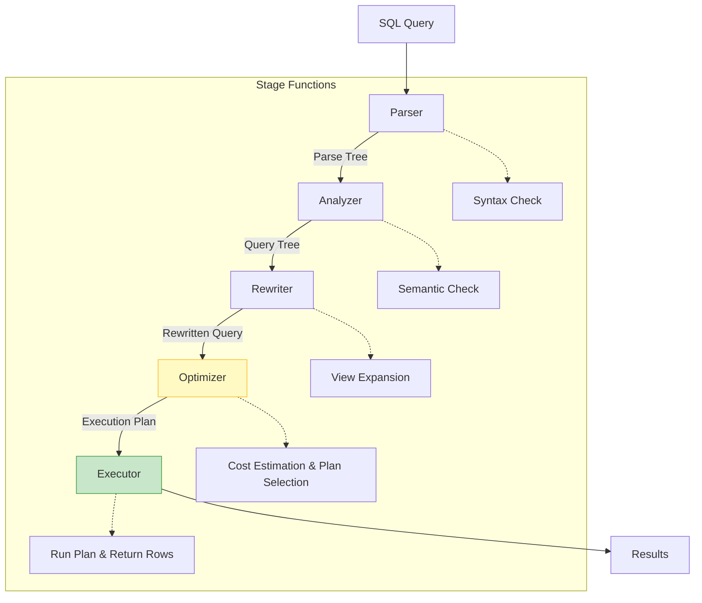
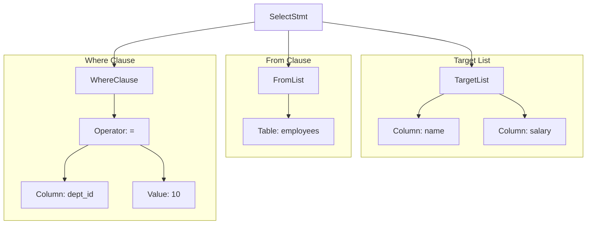
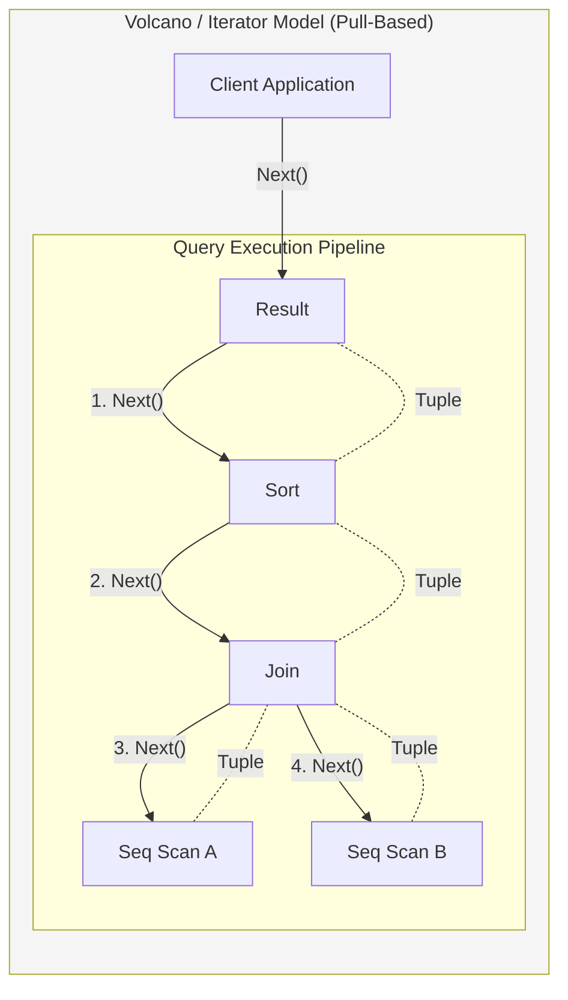

# Query Processing Pipeline

## 1. Introduction

When you execute a SQL query, it passes through multiple stages before returning results. Understanding this pipeline helps in writing efficient queries and diagnosing performance issues.



---

## 2. Parsing Stage

### 2.1 Lexical Analysis

```
┌─────────────────────────────────────────────────────────────────────────────┐
│                      LEXICAL ANALYSIS                                        │
├─────────────────────────────────────────────────────────────────────────────┤
│                                                                              │
│   Convert SQL text into tokens                                             │
│                                                                              │
│   Input:                                                                    │
│   SELECT name, salary FROM employees WHERE dept_id = 10;                   │
│                                                                              │
│   Tokens:                                                                   │
│   ┌─────────┬──────────────┐                                               │
│   │ Type    │ Value        │                                               │
│   ├─────────┼──────────────┤                                               │
│   │ KEYWORD │ SELECT       │                                               │
│   │ IDENT   │ name         │                                               │
│   │ COMMA   │ ,            │                                               │
│   │ IDENT   │ salary       │                                               │
│   │ KEYWORD │ FROM         │                                               │
│   │ IDENT   │ employees    │                                               │
│   │ KEYWORD │ WHERE        │                                               │
│   │ IDENT   │ dept_id      │                                               │
│   │ OP      │ =            │                                               │
│   │ NUMBER  │ 10           │                                               │
│   │ SEMI    │ ;            │                                               │
│   └─────────┴──────────────┘                                               │
│                                                                              │
│   Errors caught: Invalid characters, unterminated strings                  │
│                                                                              │
└─────────────────────────────────────────────────────────────────────────────┘
```

### 2.2 Syntax Analysis (Parse Tree)



---

## 3. Semantic Analysis

```
┌─────────────────────────────────────────────────────────────────────────────┐
│                    SEMANTIC ANALYSIS                                         │
├─────────────────────────────────────────────────────────────────────────────┤
│                                                                              │
│   Verify query makes semantic sense                                        │
│                                                                              │
│   CHECKS PERFORMED:                                                         │
│                                                                              │
│   1. NAME RESOLUTION                                                        │
│      • Table exists?                                                       │
│      • Columns exist in table?                                             │
│      • Resolve aliases                                                     │
│      • Resolve schema (public.employees)                                   │
│                                                                              │
│   2. TYPE CHECKING                                                          │
│      • dept_id = 10 (is dept_id numeric?)                                 │
│      • name = 'John' (is name a string type?)                             │
│      • Can't compare incompatible types                                   │
│                                                                              │
│   3. AUTHORIZATION                                                          │
│      • Does user have SELECT on employees?                                │
│      • Does user have access to all columns?                              │
│                                                                              │
│   4. AGGREGATE VALIDATION                                                   │
│      • Non-aggregated columns in GROUP BY?                                │
│      • Aggregate in WHERE clause? (error)                                 │
│                                                                              │
│   Example semantic errors:                                                  │
│   ERROR: relation "employes" does not exist (typo)                        │
│   ERROR: column "salry" does not exist                                    │
│   ERROR: permission denied for table employees                            │
│                                                                              │
└─────────────────────────────────────────────────────────────────────────────┘
```

---

## 4. Query Rewriting

```
┌─────────────────────────────────────────────────────────────────────────────┐
│                      QUERY REWRITING                                         │
├─────────────────────────────────────────────────────────────────────────────┤
│                                                                              │
│   Transform query before optimization                                       │
│                                                                              │
│   VIEW EXPANSION:                                                           │
│   ┌─────────────────────────────────────────────────────────────────┐      │
│   │ Original: SELECT * FROM active_users;                           │      │
│   │                                                                   │      │
│   │ View: CREATE VIEW active_users AS                               │      │
│   │       SELECT * FROM users WHERE status = 'active';              │      │
│   │                                                                   │      │
│   │ Rewritten: SELECT * FROM users WHERE status = 'active';         │      │
│   └─────────────────────────────────────────────────────────────────┘      │
│                                                                              │
│   RULE APPLICATION:                                                         │
│   • Rewrite rules (PostgreSQL)                                            │
│   • Materialized view query rewrite                                       │
│                                                                              │
│   SUBQUERY TRANSFORMATIONS:                                                 │
│   ┌─────────────────────────────────────────────────────────────────┐      │
│   │ Original:                                                        │      │
│   │ SELECT * FROM orders WHERE customer_id IN                       │      │
│   │   (SELECT id FROM customers WHERE country = 'US');              │      │
│   │                                                                   │      │
│   │ Rewritten (Semi-join):                                          │      │
│   │ SELECT o.* FROM orders o                                        │      │
│   │ SEMI JOIN customers c ON o.customer_id = c.id                   │      │
│   │ WHERE c.country = 'US';                                         │      │
│   └─────────────────────────────────────────────────────────────────┘      │
│                                                                              │
│   CTE INLINING:                                                             │
│   Some databases inline CTEs into main query for optimization              │
│                                                                              │
└─────────────────────────────────────────────────────────────────────────────┘
```

---

## 5. Query Optimization

### 5.1 Optimizer Overview

```
┌─────────────────────────────────────────────────────────────────────────────┐
│                      QUERY OPTIMIZER                                         │
├─────────────────────────────────────────────────────────────────────────────┤
│                                                                              │
│   The optimizer generates and evaluates execution plans                    │
│                                                                              │
│   ┌─────────────────────────────────────────────────────────────────┐      │
│   │                     Logical Plan                                 │      │
│   │   (What operations to perform)                                  │      │
│   └─────────────────────────────────────────────────────────────────┘      │
│                              │                                              │
│                              ▼                                              │
│   ┌─────────────────────────────────────────────────────────────────┐      │
│   │              Generate Physical Plans                            │      │
│   │   (How to perform operations)                                   │      │
│   │                                                                   │      │
│   │   Plan A: Seq Scan + Sort                    Cost: 1500         │      │
│   │   Plan B: Index Scan                         Cost: 100          │      │
│   │   Plan C: Bitmap Index Scan + Heap           Cost: 200          │      │
│   └─────────────────────────────────────────────────────────────────┘      │
│                              │                                              │
│                              ▼                                              │
│   ┌─────────────────────────────────────────────────────────────────┐      │
│   │              Choose Best Plan                                    │      │
│   │   Plan B selected (lowest cost)                                 │      │
│   └─────────────────────────────────────────────────────────────────┘      │
│                                                                              │
└─────────────────────────────────────────────────────────────────────────────┘
```

### 5.2 Cost Estimation

```
┌─────────────────────────────────────────────────────────────────────────────┐
│                      COST ESTIMATION                                         │
├─────────────────────────────────────────────────────────────────────────────┤
│                                                                              │
│   Optimizer estimates cost based on:                                        │
│                                                                              │
│   1. TABLE STATISTICS                                                       │
│      • Number of rows (n_tuples)                                          │
│      • Number of pages (n_pages)                                          │
│      • Column statistics (distinct values, histogram)                      │
│                                                                              │
│   2. OPERATION COSTS                                                        │
│      • Sequential page read: seq_page_cost = 1.0                          │
│      • Random page read: random_page_cost = 4.0                           │
│      • CPU tuple processing: cpu_tuple_cost = 0.01                        │
│      • CPU operator cost: cpu_operator_cost = 0.0025                      │
│                                                                              │
│   3. SELECTIVITY                                                            │
│      • What fraction of rows match condition?                             │
│      • WHERE age = 25: ~1/100 if 100 distinct ages                       │
│      • WHERE age > 50: ~50% if uniform distribution                       │
│                                                                              │
│   EXAMPLE CALCULATION:                                                      │
│   SELECT * FROM users WHERE age = 25;                                      │
│   • 10,000 rows, 100 pages                                                │
│   • Selectivity: 1% (100 matching rows expected)                          │
│                                                                              │
│   Sequential Scan Cost:                                                    │
│     = (pages × seq_page_cost) + (rows × cpu_tuple_cost)                   │
│     = (100 × 1.0) + (10,000 × 0.01)                                       │
│     = 100 + 100 = 200                                                      │
│                                                                              │
│   Index Scan Cost (if index exists on age):                               │
│     = (matching_rows × random_page_cost) + cpu_costs                      │
│     = (100 × 4.0) + small                                                  │
│     ≈ 400                                                                  │
│                                                                              │
│   → Sequential scan wins! (for low selectivity, index loses)             │
│                                                                              │
└─────────────────────────────────────────────────────────────────────────────┘
```

### 5.3 Join Algorithms

```
┌─────────────────────────────────────────────────────────────────────────────┐
│                      JOIN ALGORITHMS                                         │
├─────────────────────────────────────────────────────────────────────────────┤
│                                                                              │
│   NESTED LOOP JOIN                                                          │
│   ─────────────────                                                         │
│   For each row in outer table:                                             │
│       For each row in inner table:                                         │
│           If match, output row                                             │
│   • Best for: Small tables, indexed inner table                           │
│   • Cost: O(N × M)                                                         │
│                                                                              │
│   HASH JOIN                                                                 │
│   ─────────                                                                 │
│   1. Build hash table from smaller table                                   │
│   2. Probe hash table with larger table                                    │
│   • Best for: Equi-joins, medium-large tables                             │
│   • Cost: O(N + M)                                                         │
│   • Needs memory for hash table                                           │
│                                                                              │
│   MERGE JOIN                                                                │
│   ──────────                                                                │
│   1. Sort both tables by join key                                          │
│   2. Merge sorted streams                                                  │
│   • Best for: Already sorted data, range joins                            │
│   • Cost: O(N log N + M log M) for sort + O(N + M) for merge             │
│                                                                              │
│   ┌─────────────────────────────────────────────────────────────────┐      │
│   │           When optimizer chooses each:                           │      │
│   │                                                                   │      │
│   │   Nested Loop: Small inner table, good index                    │      │
│   │   Hash Join:   Medium tables, equality join, enough memory     │      │
│   │   Merge Join:  Pre-sorted data, range conditions               │      │
│   └─────────────────────────────────────────────────────────────────┘      │
│                                                                              │
└─────────────────────────────────────────────────────────────────────────────┘
```

---

## 6. Execution Engine

### 6.1 Execution Models



### Other Models
* **Materialization**: Each operator produces all results before parent starts (High memory, simple).
* **Vectorized**: Process batches (vectors) instead of single tuples. CPU cache friendly (DuckDB, ClickHouse).

### 6.2 Common Operators

```
┌─────────────────────────────────────────────────────────────────────────────┐
│                    EXECUTION OPERATORS                                       │
├─────────────────────────────────────────────────────────────────────────────┤
│                                                                              │
│   SCAN OPERATORS:                                                           │
│   • Seq Scan: Read all pages sequentially                                  │
│   • Index Scan: Use index to find rows                                    │
│   • Index Only Scan: Get data from index alone                            │
│   • Bitmap Scan: Build bitmap from index, then heap scan                  │
│                                                                              │
│   JOIN OPERATORS:                                                           │
│   • Nested Loop                                                            │
│   • Hash Join                                                              │
│   • Merge Join                                                             │
│                                                                              │
│   AGGREGATION OPERATORS:                                                   │
│   • HashAggregate: Group by hashing                                       │
│   • GroupAggregate: Group sorted data                                     │
│                                                                              │
│   SORTING OPERATORS:                                                       │
│   • Sort: In-memory quicksort                                             │
│   • External Sort: Disk-based merge sort for large data                  │
│                                                                              │
│   OTHER OPERATORS:                                                          │
│   • Limit: Stop after N rows                                              │
│   • Unique: Remove duplicates                                             │
│   • Materialize: Cache results in memory                                  │
│   • Append: Union of multiple inputs                                      │
│                                                                              │
└─────────────────────────────────────────────────────────────────────────────┘
```

---

## 7. Query Plans (EXPLAIN)

```sql
-- View query plan
EXPLAIN SELECT * FROM employees WHERE dept_id = 10;

-- View with execution statistics
EXPLAIN ANALYZE SELECT * FROM employees WHERE dept_id = 10;

-- PostgreSQL verbose output
EXPLAIN (ANALYZE, BUFFERS, FORMAT TEXT)
SELECT * FROM employees WHERE dept_id = 10;

-- MySQL
EXPLAIN FORMAT=TREE SELECT * FROM employees WHERE dept_id = 10;
```

```
┌─────────────────────────────────────────────────────────────────────────────┐
│                    READING EXPLAIN OUTPUT                                    │
├─────────────────────────────────────────────────────────────────────────────┤
│                                                                              │
│   PostgreSQL EXPLAIN ANALYZE output:                                        │
│                                                                              │
│   Seq Scan on employees  (cost=0.00..155.00 rows=10 width=64)              │
│                          (actual time=0.012..1.234 rows=15 loops=1)        │
│     Filter: (dept_id = 10)                                                 │
│     Rows Removed by Filter: 985                                            │
│   Planning Time: 0.123 ms                                                  │
│   Execution Time: 1.456 ms                                                 │
│                                                                              │
│   KEY METRICS:                                                              │
│   • cost=0.00..155.00: Startup cost .. Total cost                         │
│   • rows=10: Estimated rows                                                │
│   • actual rows=15: Real rows returned                                    │
│   • loops=1: How many times operator executed                             │
│   • Rows Removed: Filtered out rows                                       │
│                                                                              │
│   WARNING SIGNS:                                                            │
│   • Estimated rows ≠ Actual rows (stale statistics)                       │
│   • Seq Scan on large table (missing index?)                              │
│   • High Rows Removed by Filter (index could help)                        │
│   • Nested Loop with many loops (consider hash join)                      │
│                                                                              │
└─────────────────────────────────────────────────────────────────────────────┘
```

---

## 8. Summary

| Stage | Purpose | Key Output |
|-------|---------|------------|
| Parser | Syntax check | Parse tree |
| Analyzer | Semantic check | Query tree |
| Rewriter | Transform query | Rewritten query |
| Optimizer | Find best plan | Execution plan |
| Executor | Run the plan | Query results |

**Optimization Tips:**
- Keep statistics up to date (ANALYZE)
- Use EXPLAIN to understand plans
- Create appropriate indexes
- Write sargable WHERE clauses
- Avoid SELECT * when not needed

**Common Performance Issues:**
- Sequential scans on large tables
- Wrong join algorithm chosen
- Outdated statistics
- Missing indexes
- Suboptimal query structure
