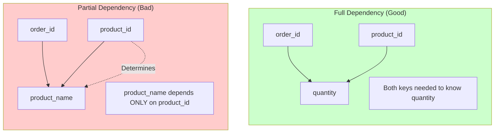
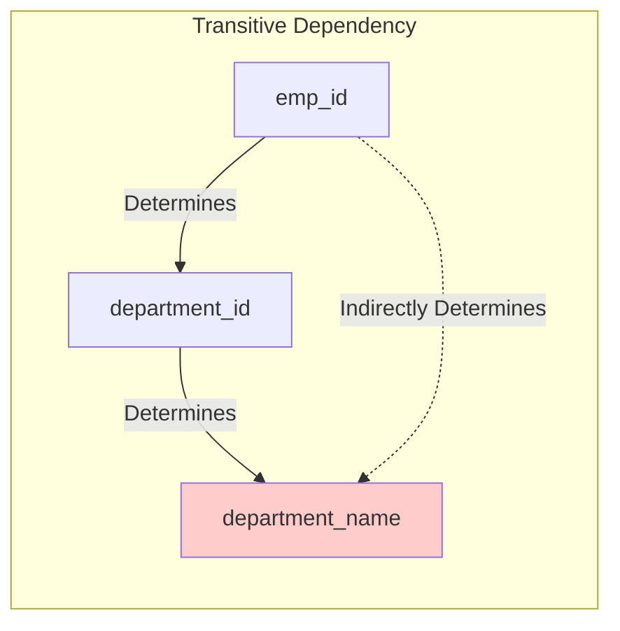

# Functional Dependencies

## 1. Introduction

A **functional dependency** (FD) is a constraint between two sets of attributes in a relation. Understanding FDs is essential for database normalization.

```
┌─────────────────────────────────────────────────────────────────────────────┐
│                     FUNCTIONAL DEPENDENCY NOTATION                           │
├─────────────────────────────────────────────────────────────────────────────┤
│                                                                              │
│   X → Y   means "X functionally determines Y"                               │
│           or "Y is functionally dependent on X"                             │
│                                                                              │
│   If two tuples have the same value for X,                                  │
│   they MUST have the same value for Y                                       │
│                                                                              │
│   Examples:                                                                  │
│   • student_id → student_name                                               │
│   • (order_id, product_id) → quantity                                       │
│   • email → (name, phone)                                                   │
│                                                                              │
└─────────────────────────────────────────────────────────────────────────────┘
```

---

## 2. Understanding Functional Dependencies

### 2.1 Definition

If attribute X determines attribute Y, then for any two rows with the same X value, the Y values must also be the same.

```
┌─────────────────────────────────────────────────────────────────────────────┐
│                      VALID vs INVALID DATA                                   │
├─────────────────────────────────────────────────────────────────────────────┤
│                                                                              │
│   Given: student_id → student_name                                          │
│                                                                              │
│   VALID:                              INVALID (violates FD):                │
│   ┌────────────┬──────────────┐       ┌────────────┬──────────────┐        │
│   │ student_id │ student_name │       │ student_id │ student_name │        │
│   ├────────────┼──────────────┤       ├────────────┼──────────────┤        │
│   │    101     │    Alice     │       │    101     │    Alice     │        │
│   │    101     │    Alice     │ ✓     │    101     │    Bob       │ ✗      │
│   │    102     │    Bob       │       │    102     │    Bob       │        │
│   └────────────┴──────────────┘       └────────────┴──────────────┘        │
│                                                                              │
│   Same student_id must always have same student_name                        │
│                                                                              │
└─────────────────────────────────────────────────────────────────────────────┘
```

### 2.2 Real-World Examples

```sql
-- Employee table
CREATE TABLE employees (
    emp_id INT PRIMARY KEY,    -- emp_id → (name, email, department, salary, hire_date)
    name VARCHAR(100),
    email VARCHAR(255),
    department_id INT,
    salary DECIMAL(10,2),
    hire_date DATE
);

-- Functional Dependencies:
-- emp_id → name
-- emp_id → email
-- emp_id → department_id
-- emp_id → salary
-- emp_id → hire_date
-- email → emp_id (if email is unique)

-- Order Items table
CREATE TABLE order_items (
    order_id INT,
    product_id INT,
    quantity INT,
    unit_price DECIMAL(10,2),
    PRIMARY KEY (order_id, product_id)
);

-- Functional Dependencies:
-- (order_id, product_id) → quantity
-- (order_id, product_id) → unit_price
-- product_id → unit_price (if prices are fixed - could be problematic!)
```

---

## 3. Types of Functional Dependencies

### 3.1 Trivial vs Non-Trivial

```
┌─────────────────────────────────────────────────────────────────────────────┐
│                    TRIVIAL vs NON-TRIVIAL FDs                                │
├─────────────────────────────────────────────────────────────────────────────┤
│                                                                              │
│   TRIVIAL FD: Y is a subset of X                                            │
│   • (A, B) → A        (Always true, not useful)                             │
│   • (A, B) → B        (Always true, not useful)                             │
│   • A → A             (Always true, not useful)                             │
│                                                                              │
│   NON-TRIVIAL FD: Y is not a subset of X                                    │
│   • A → B             (Useful constraint)                                   │
│   • (A, B) → C        (Useful constraint)                                   │
│   • A → (B, C)        (Useful constraint)                                   │
│                                                                              │
│   COMPLETELY NON-TRIVIAL: X and Y have no common attributes                 │
│   • A → B where A ∩ B = ∅                                                   │
│                                                                              │
└─────────────────────────────────────────────────────────────────────────────┘
```

### 3.2 Full vs Partial Dependency



### 3.3 Transitive Dependency



```
Problem: department_name depends on department_id, not emp_id directly.
Result: Redundant storage of "Engineering" for every employee in Dept 10.
Solution: Move (department_id, department_name) to separate table.
```

---

## 4. Armstrong's Axioms

Rules for inferring new FDs from existing ones.

```
┌─────────────────────────────────────────────────────────────────────────────┐
│                       ARMSTRONG'S AXIOMS                                     │
├─────────────────────────────────────────────────────────────────────────────┤
│                                                                              │
│   PRIMARY AXIOMS (Sound and Complete):                                      │
│                                                                              │
│   1. REFLEXIVITY: If Y ⊆ X, then X → Y                                      │
│      • {A, B} → A                                                           │
│      • {A, B, C} → {A, B}                                                   │
│                                                                              │
│   2. AUGMENTATION: If X → Y, then XZ → YZ                                   │
│      • A → B implies AC → BC                                                │
│      • Adding attributes to both sides preserves FD                         │
│                                                                              │
│   3. TRANSITIVITY: If X → Y and Y → Z, then X → Z                          │
│      • A → B and B → C implies A → C                                        │
│                                                                              │
│   DERIVED RULES:                                                            │
│                                                                              │
│   4. UNION: If X → Y and X → Z, then X → YZ                                │
│      • A → B and A → C implies A → BC                                       │
│                                                                              │
│   5. DECOMPOSITION: If X → YZ, then X → Y and X → Z                        │
│      • A → BC implies A → B and A → C                                       │
│                                                                              │
│   6. PSEUDOTRANSITIVITY: If X → Y and WY → Z, then WX → Z                  │
│                                                                              │
└─────────────────────────────────────────────────────────────────────────────┘
```

---

## 5. Closure of Attributes

The **closure** of a set of attributes X (written X⁺) is all attributes that can be determined by X.

```sql
-- Given FDs:
-- A → B
-- B → C
-- C → D
-- AD → E

-- Find closure of {A}:
-- Start: {A}
-- Apply A → B: {A, B}
-- Apply B → C: {A, B, C}
-- Apply C → D: {A, B, C, D}
-- Apply AD → E: {A, B, C, D, E}
-- Result: A⁺ = {A, B, C, D, E}

-- Since A⁺ contains all attributes, A is a candidate key
```

```python
def compute_closure(attributes, fds):
    """
    Compute closure of attribute set given functional dependencies.

    Args:
        attributes: set of starting attributes
        fds: list of tuples (lhs, rhs) representing X → Y

    Returns:
        set: closure of attributes
    """
    closure = set(attributes)
    changed = True

    while changed:
        changed = False
        for lhs, rhs in fds:
            # If LHS is subset of closure, add RHS to closure
            if lhs.issubset(closure) and not rhs.issubset(closure):
                closure = closure.union(rhs)
                changed = True

    return closure

# Example usage
fds = [
    ({'A'}, {'B'}),
    ({'B'}, {'C'}),
    ({'C'}, {'D'}),
    ({'A', 'D'}, {'E'})
]

print(compute_closure({'A'}, fds))  # {'A', 'B', 'C', 'D', 'E'}
print(compute_closure({'B'}, fds))  # {'B', 'C', 'D'}
```

---

## 6. Finding Candidate Keys

A **candidate key** is a minimal set of attributes whose closure is all attributes.

```
┌─────────────────────────────────────────────────────────────────────────────┐
│                     FINDING CANDIDATE KEYS                                   │
├─────────────────────────────────────────────────────────────────────────────┤
│                                                                              │
│   Algorithm:                                                                │
│   1. Find attributes that appear ONLY on the left side of FDs             │
│      → These MUST be part of every candidate key                           │
│                                                                              │
│   2. Find attributes that appear ONLY on the right side of FDs            │
│      → These can NEVER be part of any candidate key                        │
│                                                                              │
│   3. Find attributes that appear on BOTH sides                             │
│      → These MAY or MAY NOT be part of candidate keys                      │
│                                                                              │
│   4. Compute closure of step 1 attributes                                  │
│      → If closure = all attributes, that's a candidate key                 │
│      → Otherwise, try adding step 3 attributes one at a time              │
│                                                                              │
└─────────────────────────────────────────────────────────────────────────────┘
```

```sql
-- Example: R(A, B, C, D, E) with FDs:
-- AB → C
-- C → D
-- D → E

-- Step 1: Only on left: A, B (never determined by anything)
-- Step 2: Only on right: E (determined but never determines)
-- Step 3: Both sides: C, D

-- Check {A, B}⁺:
-- Start: {A, B}
-- AB → C: {A, B, C}
-- C → D: {A, B, C, D}
-- D → E: {A, B, C, D, E}  ← All attributes!

-- Candidate key: {A, B}

-- Is there a smaller key? No, because:
-- {A}⁺ = {A} (doesn't include B, C, D, E)
-- {B}⁺ = {B} (doesn't include A, C, D, E)
-- Both A and B are needed
```

---

## 7. Canonical Cover

A **canonical cover** (minimal cover) is a simplified set of FDs equivalent to the original.

```
┌─────────────────────────────────────────────────────────────────────────────┐
│                       CANONICAL COVER ALGORITHM                              │
├─────────────────────────────────────────────────────────────────────────────┤
│                                                                              │
│   1. Put FDs in standard form (single attribute on right)                   │
│      A → BC becomes A → B, A → C                                            │
│                                                                              │
│   2. Remove redundant attributes from left side                             │
│      If A can be removed from AB → C and B → C holds, do it                │
│                                                                              │
│   3. Remove redundant FDs                                                   │
│      If an FD can be derived from others, remove it                        │
│                                                                              │
│   Example:                                                                   │
│   Original: {A → BC, B → C, A → B, AB → C}                                  │
│                                                                              │
│   Step 1: {A → B, A → C, B → C, AB → C}                                    │
│   Step 2: AB → C becomes B → C (A redundant)                               │
│           But B → C already exists                                          │
│   Step 3: A → C is derivable (A → B, B → C)                                │
│                                                                              │
│   Canonical cover: {A → B, B → C}                                           │
│                                                                              │
└─────────────────────────────────────────────────────────────────────────────┘
```

---

## 8. Practical Application

### 8.1 Identifying FDs from Requirements

```
Business rules → Functional Dependencies

"Each product has a unique SKU"
→ sku → product_name, price, description

"Each order is placed by exactly one customer"
→ order_id → customer_id

"An employee works in exactly one department"
→ emp_id → department_id

"A department has exactly one manager"
→ department_id → manager_id

"Each line item in an order has one product and quantity"
→ (order_id, product_id) → quantity, unit_price
```

### 8.2 Checking Schema for Violations

```sql
-- Check for FD violations: student_id → student_name
SELECT student_id, COUNT(DISTINCT student_name) as name_count
FROM enrollments
GROUP BY student_id
HAVING COUNT(DISTINCT student_name) > 1;

-- If this returns any rows, the FD is violated!

-- Check for FD violations: email → user_id
SELECT email, COUNT(DISTINCT user_id) as user_count
FROM users
GROUP BY email
HAVING COUNT(DISTINCT user_id) > 1;
```

---

## 9. Summary

| Concept | Description | Importance |
|---------|-------------|------------|
| **Functional Dependency** | X → Y means X determines Y | Foundation of normalization |
| **Trivial FD** | Y ⊆ X | Always true, not useful |
| **Partial Dependency** | Subset of key determines non-key | Causes 2NF violations |
| **Transitive Dependency** | X → Y → Z | Causes 3NF violations |
| **Closure** | All attributes determined by X | Finding candidate keys |
| **Candidate Key** | Minimal attribute set that determines all | Primary key candidates |
| **Canonical Cover** | Minimal equivalent FD set | Simplifies analysis |

Understanding functional dependencies is the key to proper database normalization and avoiding data anomalies.
