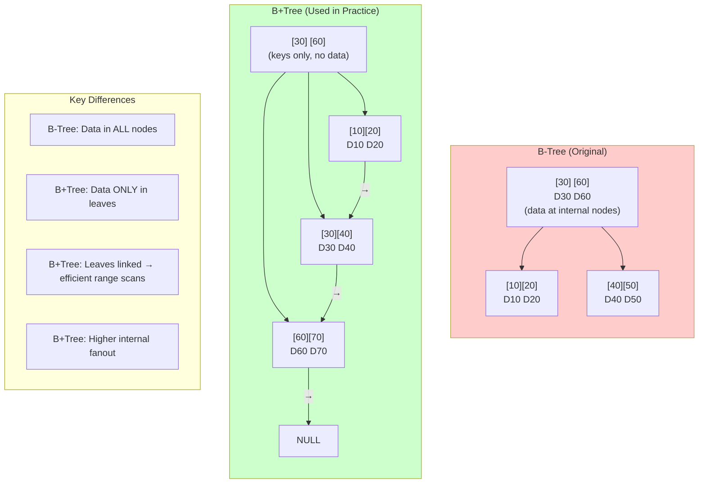
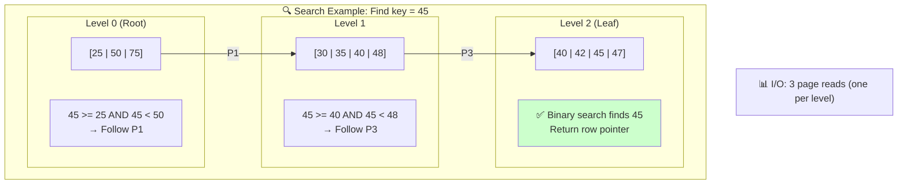
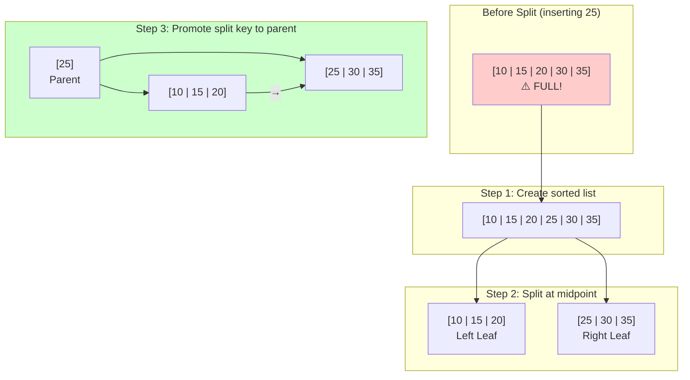
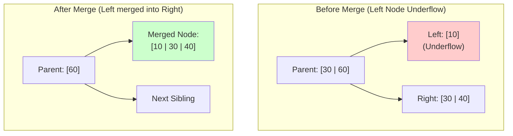
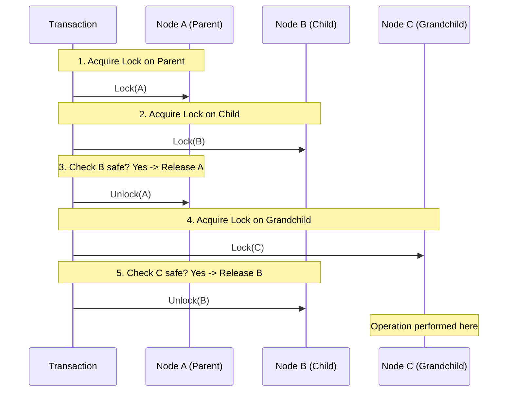

# B-Tree Internals

## Introduction

B-Trees (Balanced Trees) are the most widely used index structure in relational databases. Invented by Rudolf Bayer and Edward McCreight in 1972, they provide efficient O(log n) operations while minimizing disk I/O through high fanout and balanced structure.

## B-Tree vs B+Tree

Most databases actually use B+Trees, a variant optimized for disk-based storage:



## Node Structure

### Internal Node Layout

```
┌─────────────────────────────────────────────────────────────┐
│                    Internal Node (8KB page)                  │
├─────────────────────────────────────────────────────────────┤
│  Page Header (24 bytes)                                      │
│  ├── Page ID                                                 │
│  ├── Page Type (internal)                                    │
│  ├── Number of Keys                                          │
│  ├── Right Sibling Pointer                                   │
│  └── Checksum/LSN                                            │
├─────────────────────────────────────────────────────────────┤
│  Key-Pointer Pairs                                           │
│  ┌─────────────────────────────────────────────────────┐    │
│  │ P0 │ K1 │ P1 │ K2 │ P2 │ K3 │ P3 │ ... │ Kn │ Pn  │    │
│  └─────────────────────────────────────────────────────┘    │
│                                                              │
│  P0: Pointer to subtree with keys < K1                      │
│  P1: Pointer to subtree with keys >= K1 and < K2            │
│  Pn: Pointer to subtree with keys >= Kn                     │
└─────────────────────────────────────────────────────────────┘

Example with actual values:
┌─────────────────────────────────────────────────────────────┐
│  │ P0 │ "M" │ P1 │ "T" │ P2 │                              │
│  │    │     │    │     │    │                              │
│  │    │     │    │     │    │                              │
│  ▼    │     ▼    │     ▼                                   │
│ <"M"  │  "M"-"T" │  >="T"                                  │
└─────────────────────────────────────────────────────────────┘
```

### Leaf Node Layout

```
┌─────────────────────────────────────────────────────────────┐
│                     Leaf Node (8KB page)                     │
├─────────────────────────────────────────────────────────────┤
│  Page Header (24 bytes)                                      │
│  ├── Page ID                                                 │
│  ├── Page Type (leaf)                                        │
│  ├── Number of Entries                                       │
│  ├── Previous Leaf Pointer                                   │
│  ├── Next Leaf Pointer                                       │
│  └── Free Space Offset                                       │
├─────────────────────────────────────────────────────────────┤
│  Entry Array (variable size entries)                         │
│  ┌─────────────────────────────────────────────────────┐    │
│  │ Entry 1 │ Entry 2 │ Entry 3 │ ... │ Entry N │ Free │    │
│  └─────────────────────────────────────────────────────┘    │
│                                                              │
│  Each Entry:                                                 │
│  ┌──────────────────────────────────────────┐               │
│  │ Key Value │ Row Pointer (TID) │ Flags    │               │
│  └──────────────────────────────────────────┘               │
└─────────────────────────────────────────────────────────────┘
```

## Fanout and Height Calculation

### Fanout Formula

```
┌─────────────────────────────────────────────────────────────┐
│  Fanout Calculation                                          │
├─────────────────────────────────────────────────────────────┤
│  Page Size: P = 8192 bytes (8KB)                            │
│  Header Size: H = 24 bytes                                   │
│  Key Size: K bytes                                           │
│  Pointer Size: Ptr = 6 bytes                                │
│                                                              │
│  Internal Node Fanout:                                       │
│  F = floor((P - H) / (K + Ptr))                             │
│                                                              │
│  For 8-byte integer key:                                     │
│  F = floor((8192 - 24) / (8 + 6)) = floor(8168 / 14) = 583  │
│                                                              │
│  For 100-byte varchar key (average 50 bytes):               │
│  F = floor(8168 / 56) = 145                                 │
└─────────────────────────────────────────────────────────────┘
```

### Height vs Capacity

```
┌────────────────────────────────────────────────────────────────┐
│  B+Tree Capacity by Height (Fanout = 500)                      │
├────────────────────────────────────────────────────────────────┤
│  Height │ Max Leaf Nodes │ Max Records (100/leaf) │ Example   │
│─────────│────────────────│────────────────────────│───────────│
│    1    │       1        │         100            │ Tiny      │
│    2    │      500       │       50,000           │ Small     │
│    3    │    250,000     │    25,000,000          │ Medium    │
│    4    │  125,000,000   │ 12,500,000,000         │ Large     │
│    5    │ 62,500,000,000 │  6.25 trillion         │ Massive   │
└────────────────────────────────────────────────────────────────┘

Height Formula:
h = ceil(log_F(N/L))

Where:
  F = fanout
  N = number of records
  L = records per leaf
```

## Core Operations

### Search Algorithm

```
FUNCTION search(key):
    node = root

    WHILE node is not leaf:
        # Binary search within node
        i = binary_search(node.keys, key)
        node = node.pointers[i]

    # Search in leaf node
    i = binary_search(node.keys, key)
    IF node.keys[i] == key:
        RETURN node.values[i]
    ELSE:
        RETURN NOT_FOUND
```



### Insert Algorithm

```
FUNCTION insert(key, value):
    leaf = find_leaf(key)

    IF leaf has space:
        insert_in_leaf(leaf, key, value)
        RETURN

    # Leaf is full - need to split
    (new_leaf, split_key) = split_leaf(leaf, key, value)
    insert_in_parent(leaf, split_key, new_leaf)

FUNCTION insert_in_parent(left, key, right):
    parent = left.parent

    IF parent is NULL:
        # Create new root
        new_root = new_internal_node()
        new_root.pointers = [left, right]
        new_root.keys = [key]
        root = new_root
        RETURN

    IF parent has space:
        insert_in_internal(parent, key, right)
        RETURN

    # Parent is full - split recursively
    (new_internal, split_key) = split_internal(parent, key, right)
    insert_in_parent(parent, split_key, new_internal)
```

### Leaf Split Visualization



### Delete Algorithm

```
FUNCTION delete(key):
    leaf = find_leaf(key)

    IF key not in leaf:
        RETURN NOT_FOUND

    remove_from_leaf(leaf, key)

    IF leaf has enough entries (>= min_fill):
        RETURN SUCCESS

    # Underflow - try redistribution or merge
    sibling = get_sibling(leaf)

    IF can_redistribute(leaf, sibling):
        redistribute(leaf, sibling)
    ELSE:
        merge(leaf, sibling)
        delete_from_parent(leaf.parent, separator_key)
```

### Merge Visualization



## B+Tree Variations

### B*Tree

```
┌─────────────────────────────────────────────────────────────┐
│  B*Tree Characteristics:                                     │
│  • Minimum fill factor: 2/3 (vs 1/2 for B+Tree)             │
│  • Delay splits by redistributing to siblings               │
│  • Better space utilization                                  │
│  • More complex implementation                               │
└─────────────────────────────────────────────────────────────┘

Split Behavior Comparison:

B+Tree (splits at 50%):
Full node → Split → Two 50% full nodes

B*Tree (redistributes first):
Full node → Redistribute to sibling → Delay split
Only split when two siblings are full → Three 66% full nodes
```

### B-link Tree (Lehman-Yao)

```
┌─────────────────────────────────────────────────────────────┐
│  B-link Tree for Concurrency:                                │
│  • Each node has "high key" and right-link pointer          │
│  • Allows concurrent access without holding locks up tree    │
│  • Used in PostgreSQL                                        │
└─────────────────────────────────────────────────────────────┘

Node Structure:
┌─────────────────────────────────────────────────────────────┐
│  [K1 | K2 | K3 | ... | Kn | HIGH_KEY] → Right-Link         │
│   ↓    ↓    ↓           ↓                                   │
│   P0   P1   P2         Pn                                   │
└─────────────────────────────────────────────────────────────┘

Search with Right-Link:
1. Read node
2. If key > high_key, follow right-link
3. Else, descend to appropriate child
4. No need to lock parent during child access
```

### Prefix Compression (B+Tree)

```
Without Compression:
┌──────────────────────────────────────────────────────────────┐
│  "application_config" | "application_data" | "application_log"│
│  (18 bytes)           | (16 bytes)         | (15 bytes)       │
│  Total: 49 bytes                                              │
└──────────────────────────────────────────────────────────────┘

With Prefix Compression:
┌──────────────────────────────────────────────────────────────┐
│  Prefix: "application_" (12 bytes)                           │
│  Suffixes: "config" | "data" | "log"                         │
│  Total: 12 + 6 + 4 + 3 = 25 bytes (49% reduction)           │
└──────────────────────────────────────────────────────────────┘
```

### Suffix Truncation

```
┌─────────────────────────────────────────────────────────────┐
│  Internal nodes only need enough of the key to route        │
│  Example: Keys "alexander" and "alexandra"                   │
│                                                              │
│  Full separator: "alexandra"                                 │
│  Truncated separator: "alexand" (or even "alexan")          │
│                                                              │
│  Benefit: More keys per internal node = higher fanout        │
└─────────────────────────────────────────────────────────────┘
```

## Concurrency Control

### Lock Coupling (Crabbing)



### Safe Node Definition
* **Insert**: Node is not full (won't split)
* **Delete**: Node is more than half full (won't merge)

### Optimistic Locking

```
┌─────────────────────────────────────────────────────────────┐
│  Optimistic Protocol (for mostly-read workloads):           │
│                                                              │
│  1. Traverse tree with read locks only                       │
│  2. At leaf, upgrade to write lock                          │
│  3. If insert causes split:                                  │
│     - Release all locks                                      │
│     - Restart with pessimistic locking                       │
│                                                              │
│  Benefit: No write locks during traversal                    │
│  Cost: Occasional restart                                    │
└─────────────────────────────────────────────────────────────┘
```

## Buffer Pool Integration

```
┌─────────────────────────────────────────────────────────────┐
│                    B+Tree Buffer Management                  │
├─────────────────────────────────────────────────────────────┤
│                                                              │
│  Buffer Pool                                                 │
│  ┌──────────────────────────────────────────────────────┐  │
│  │ Frame 0: Root Page (pinned, high access)              │  │
│  │ Frame 1: Internal Page L1                             │  │
│  │ Frame 2: Leaf Page X                                  │  │
│  │ Frame 3: Leaf Page Y (dirty)                          │  │
│  │ ...                                                   │  │
│  └──────────────────────────────────────────────────────┘  │
│                                                              │
│  Access Pattern Optimization:                                │
│  • Root page often cached (LRU keeps it hot)                │
│  • Upper internal nodes stay in memory                       │
│  • Leaf pages cycled based on access pattern                │
│                                                              │
│  For 1M records, ~3 level tree:                             │
│  • Root: Always cached                                       │
│  • Level 1: ~500 pages, often cached                        │
│  • Leaves: ~10,000 pages, hot ones cached                   │
└─────────────────────────────────────────────────────────────┘
```

## Performance Analysis

### I/O Cost Model

```
Operation Costs (n = records, h = height, f = fanout):

┌─────────────────────────────────────────────────────────────┐
│  Point Query:                                                │
│    I/O = h page reads                                        │
│    h = log_f(n)                                              │
│    Example: n=1M, f=500 → h=3 → 3 page reads                │
├─────────────────────────────────────────────────────────────┤
│  Range Query (k results):                                    │
│    I/O = h + ceil(k / entries_per_leaf)                     │
│    Example: k=1000, 100 entries/leaf → 3 + 10 = 13 pages    │
├─────────────────────────────────────────────────────────────┤
│  Insert (no split):                                          │
│    I/O = h reads + 1 write = h + 1                          │
├─────────────────────────────────────────────────────────────┤
│  Insert (with split):                                        │
│    Worst case: 2h reads + 2h writes = 4h                    │
│    (split propagates to root)                                │
├─────────────────────────────────────────────────────────────┤
│  Delete (no merge):                                          │
│    I/O = h reads + 1 write = h + 1                          │
└─────────────────────────────────────────────────────────────┘
```

### Fill Factor Impact

```
┌─────────────────────────────────────────────────────────────┐
│  Fill Factor Trade-offs                                      │
├─────────────────────────────────────────────────────────────┤
│                                                              │
│  Higher Fill Factor (90-100%):                               │
│  ✓ Better space utilization                                  │
│  ✓ Fewer pages to read for scans                            │
│  ✗ More frequent splits on insert                            │
│  ✗ Poor for insert-heavy workloads                          │
│                                                              │
│  Lower Fill Factor (50-70%):                                 │
│  ✓ Room for inserts without splits                          │
│  ✓ Good for insert-heavy workloads                          │
│  ✗ Wasted space                                              │
│  ✗ More pages to scan                                        │
│                                                              │
│  Recommendations:                                            │
│  • OLTP with inserts: 70-80%                                 │
│  • Read-heavy/static: 90-100%                                │
│  • Sequential inserts: Higher is fine (appends to end)       │
│  • Random inserts: Lower to reduce splits                    │
└─────────────────────────────────────────────────────────────┘
```

## Database-Specific Implementations

### PostgreSQL B-Tree

```sql
-- View B-Tree structure
CREATE EXTENSION pageinspect;

-- Get metapage info
SELECT * FROM bt_metap('idx_users_email');

-- Get page stats
SELECT * FROM bt_page_stats('idx_users_email', 1);

-- View page items
SELECT * FROM bt_page_items('idx_users_email', 1);
```

```
PostgreSQL B-Tree Features:
┌─────────────────────────────────────────────────────────────┐
│  • Uses B-link tree variant (Lehman-Yao)                    │
│  • Supports concurrent reads during writes                   │
│  • INCLUDE columns for covering indexes                      │
│  • Deduplication for repeated values (v13+)                  │
│  • Bottom-up deletion for better performance                 │
└─────────────────────────────────────────────────────────────┘
```

### InnoDB B+Tree (MySQL)

```
InnoDB Clustered Index:
┌─────────────────────────────────────────────────────────────┐
│  Primary Key Index = Table Data                              │
│                                                              │
│  Leaf nodes contain ENTIRE ROW data                         │
│  Secondary indexes point to primary key (not row)           │
│                                                              │
│  Structure:                                                  │
│  Primary: [PK] → [Full Row Data]                            │
│  Secondary: [Col] → [PK Value]                              │
│                                                              │
│  Query via secondary index:                                  │
│  1. Search secondary index → get PK                         │
│  2. Search primary index with PK → get row                  │
│  (Double lookup)                                             │
└─────────────────────────────────────────────────────────────┘
```

## Key Takeaways

1. **B+Trees dominate** - Most relational databases use B+Tree variants
2. **Fanout determines height** - Larger keys = lower fanout = taller tree
3. **Leaf linking enables range scans** - Critical for ORDER BY and BETWEEN
4. **Split/merge affects write performance** - Fill factor matters
5. **Concurrency requires careful locking** - B-link trees enable better concurrency
6. **Buffer pool integration crucial** - Upper levels stay cached
