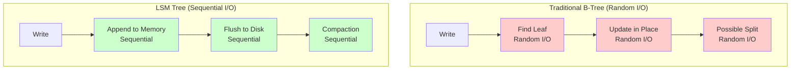
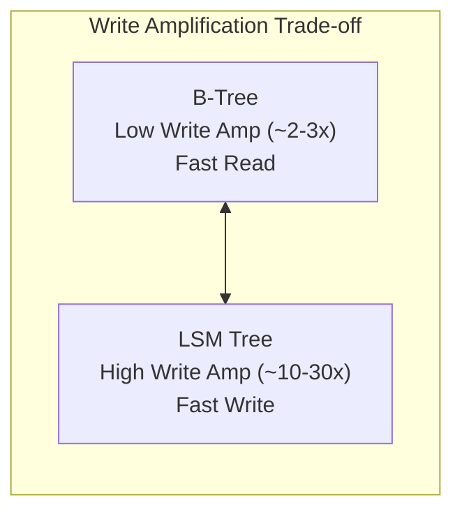
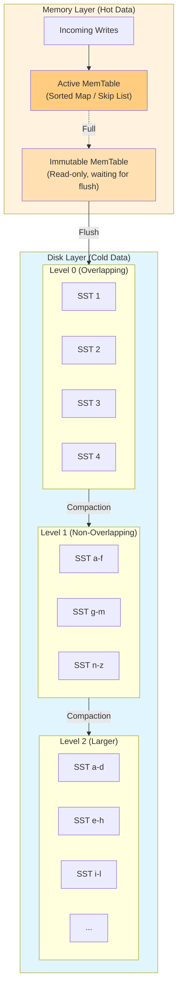
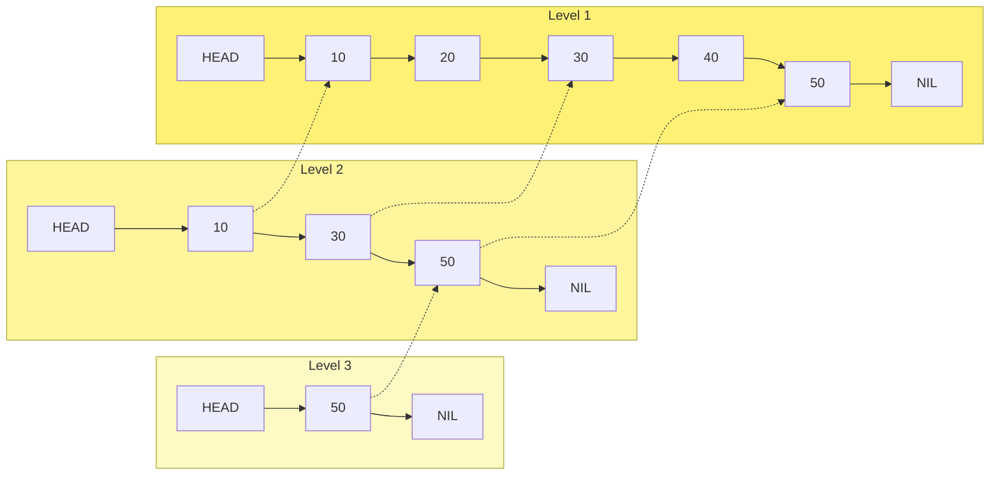

# LSM Trees (Log-Structured Merge Trees)

## Introduction

Log-Structured Merge Trees (LSM Trees) are write-optimized data structures that convert random writes into sequential writes. Invented by Patrick O'Neil in 1996, they power many modern databases including LevelDB, RocksDB, Cassandra, HBase, and ScyllaDB.

## Core Concept





## Architecture Overview



## MemTable

### Structure



### Write Path

```
Write Operation (key="user:123", value={...}):

┌─────────────────────────────────────────────────────────────┐
│  1. Write to WAL (Write-Ahead Log)                          │
│     ┌────────────────────────────────────────────────┐      │
│     │ [seq:1001][key:user:123][type:PUT][value:...]  │      │
│     └────────────────────────────────────────────────┘      │
│     Purpose: Durability guarantee                            │
│                                                              │
│  2. Insert into MemTable                                     │
│     Skip List insert at sorted position                      │
│     Key: "user:123"                                          │
│     Value: {seq:1001, type:PUT, data:...}                   │
│                                                              │
│  3. Return success to client                                 │
│     Total: 1 sequential WAL write + memory insert           │
└─────────────────────────────────────────────────────────────┘

Delete Operation (Tombstone):
┌─────────────────────────────────────────────────────────────┐
│  • Deletes are NOT immediate                                 │
│  • Insert a "tombstone" marker                               │
│  • Key: "user:123", Value: {seq:1002, type:DELETE}          │
│  • Actual deletion happens during compaction                 │
└─────────────────────────────────────────────────────────────┘
```

## SSTable (Sorted String Table)

### File Format

```
┌─────────────────────────────────────────────────────────────┐
│                    SSTable File Format                       │
├─────────────────────────────────────────────────────────────┤
│                                                              │
│  ┌────────────────────────────────────────────────────────┐ │
│  │                    Data Blocks                          │ │
│  │  ┌─────────────────────────────────────────────────┐   │ │
│  │  │ Block 0: [KV pairs sorted by key]               │   │ │
│  │  │ [key1:val1][key2:val2][key3:val3]...           │   │ │
│  │  └─────────────────────────────────────────────────┘   │ │
│  │  ┌─────────────────────────────────────────────────┐   │ │
│  │  │ Block 1: [KV pairs sorted by key]               │   │ │
│  │  └─────────────────────────────────────────────────┘   │ │
│  │  ...                                                   │ │
│  │  ┌─────────────────────────────────────────────────┐   │ │
│  │  │ Block N: [KV pairs sorted by key]               │   │ │
│  │  └─────────────────────────────────────────────────┘   │ │
│  └────────────────────────────────────────────────────────┘ │
│                                                              │
│  ┌────────────────────────────────────────────────────────┐ │
│  │                    Meta Blocks                          │ │
│  │  • Filter Block (Bloom filter for each data block)     │ │
│  │  • Stats Block (compression ratio, key range, etc.)    │ │
│  └────────────────────────────────────────────────────────┘ │
│                                                              │
│  ┌────────────────────────────────────────────────────────┐ │
│  │                    Index Block                          │ │
│  │  [block0_last_key → offset0]                           │ │
│  │  [block1_last_key → offset1]                           │ │
│  │  ...                                                    │ │
│  └────────────────────────────────────────────────────────┘ │
│                                                              │
│  ┌────────────────────────────────────────────────────────┐ │
│  │                    Footer                               │ │
│  │  [index_block_offset][meta_block_offset][magic]        │ │
│  └────────────────────────────────────────────────────────┘ │
└─────────────────────────────────────────────────────────────┘
```

### Block Format

```
┌─────────────────────────────────────────────────────────────┐
│                     Data Block (4KB typical)                 │
├─────────────────────────────────────────────────────────────┤
│  ┌─────────────────────────────────────────────────────┐    │
│  │                   Key-Value Entries                  │    │
│  │  ┌────────────────────────────────────────────────┐ │    │
│  │  │ Entry 1:                                       │ │    │
│  │  │  shared_key_len │ unshared_key_len │ value_len │ │    │
│  │  │  unshared_key_bytes │ value_bytes              │ │    │
│  │  └────────────────────────────────────────────────┘ │    │
│  │  ┌────────────────────────────────────────────────┐ │    │
│  │  │ Entry 2: (prefix compressed)                   │ │    │
│  │  │  shared: 5 │ unshared: 3 │ value_len: 100     │ │    │
│  │  │  "xyz" │ [value bytes]                         │ │    │
│  │  └────────────────────────────────────────────────┘ │    │
│  │  ...                                                │    │
│  └─────────────────────────────────────────────────────┘    │
│  ┌─────────────────────────────────────────────────────┐    │
│  │                   Restart Points                     │    │
│  │  [offset1][offset2][offset3]...[num_restarts]       │    │
│  │  (for binary search within block)                   │    │
│  └─────────────────────────────────────────────────────┘    │
│  ┌─────────────────────────────────────────────────────┐    │
│  │  Block Trailer: [compression_type][CRC32]           │    │
│  └─────────────────────────────────────────────────────┘    │
└─────────────────────────────────────────────────────────────┘
```

## Read Path

```
Read Operation (key="user:123"):

┌─────────────────────────────────────────────────────────────┐
│  Step 1: Search MemTable (Active)                            │
│          ┌─────────────┐                                     │
│          │  MemTable   │ ← Check here first                 │
│          │  (newest)   │                                     │
│          └─────────────┘                                     │
│          Found? → Return immediately                         │
│                                                              │
│  Step 2: Search MemTable (Immutable)                         │
│          ┌─────────────┐                                     │
│          │  Immutable  │ ← Being flushed                    │
│          │  MemTable   │                                     │
│          └─────────────┘                                     │
│          Found? → Return                                     │
│                                                              │
│  Step 3: Search Level 0 SSTables (newest to oldest)          │
│          ┌────┐ ┌────┐ ┌────┐ ┌────┐                        │
│          │SST4│→│SST3│→│SST2│→│SST1│ (may overlap)          │
│          └────┘ └────┘ └────┘ └────┘                        │
│          For each SST:                                       │
│            a. Check Bloom filter                             │
│            b. If positive, search index                      │
│            c. If found in index, read data block            │
│          Found? → Return                                     │
│                                                              │
│  Step 4: Search Level 1+ SSTables                            │
│          Non-overlapping: Binary search to find SST          │
│          ┌────────────┬────────────┬────────────┐           │
│          │SST[a-f]    │SST[g-m]    │SST[n-z]    │           │
│          └────────────┴────────────┴────────────┘           │
│          "user:123" falls in SST[n-z]                        │
│            a. Check Bloom filter                             │
│            b. Search index block                             │
│            c. Read data block                                │
│          Continue to deeper levels until found or exhausted │
└─────────────────────────────────────────────────────────────┘
```

### Read Amplification

```
Worst Case Read Amplification:
┌─────────────────────────────────────────────────────────────┐
│  Level 0: 4 SSTables (overlapping)                          │
│  Level 1: 10 SSTables                                        │
│  Level 2: 100 SSTables                                       │
│  Level 3: 1000 SSTables                                      │
│                                                              │
│  Without Bloom Filters:                                      │
│    Worst case: 4 + 1 + 1 + 1 = 7 SSTable searches           │
│    (L0 all, L1-L3 one each due to non-overlapping)          │
│                                                              │
│  With Bloom Filters (1% FPR):                               │
│    Expected: 4 * 0.01 + 3 * 0.01 + 1 = ~1.07 SSTable reads  │
│    (Bloom filter eliminates most negative lookups)          │
└─────────────────────────────────────────────────────────────┘
```

## Compaction Strategies

### Leveled Compaction (LevelDB/RocksDB default)

```
┌─────────────────────────────────────────────────────────────┐
│                   Leveled Compaction                         │
├─────────────────────────────────────────────────────────────┤
│                                                              │
│  Level Sizing (10x multiplier):                              │
│    L0: 4 files (triggers compaction when exceeded)          │
│    L1: 10 MB total                                           │
│    L2: 100 MB total                                          │
│    L3: 1 GB total                                            │
│    L4: 10 GB total                                           │
│                                                              │
│  Compaction Process:                                         │
│  ┌──────────────────────────────────────────────────────┐   │
│  │ L0 → L1 Compaction:                                  │   │
│  │   Pick all L0 files (they overlap)                   │   │
│  │   Merge with overlapping L1 files                    │   │
│  │   Write new non-overlapping L1 files                 │   │
│  └──────────────────────────────────────────────────────┘   │
│                                                              │
│  ┌──────────────────────────────────────────────────────┐   │
│  │ Ln → Ln+1 Compaction:                                │   │
│  │   Pick one Ln file                                   │   │
│  │   Find overlapping Ln+1 files                        │   │
│  │   Merge-sort and write to Ln+1                       │   │
│  │   Delete old files                                   │   │
│  └──────────────────────────────────────────────────────┘   │
│                                                              │
│  Write Amplification:                                        │
│    Each byte written ~10-30 times across levels             │
│                                                              │
│  Space Amplification:                                        │
│    ~1.1x (minimal, each key exists once per level)          │
└─────────────────────────────────────────────────────────────┘
```

### Size-Tiered Compaction (Cassandra default)

```
┌─────────────────────────────────────────────────────────────┐
│                 Size-Tiered Compaction                       │
├─────────────────────────────────────────────────────────────┤
│                                                              │
│  Structure:                                                  │
│    Group SSTables by similar size                            │
│    Compact when group reaches threshold (default: 4)        │
│                                                              │
│  ┌─────────────────────────────────────────────────────┐    │
│  │  Tier 1 (Small):    [1MB] [1MB] [1MB] [1MB]        │    │
│  │                            ↓ Compact                │    │
│  │  Tier 2 (Medium):   [4MB] [4MB] [4MB] [4MB]        │    │
│  │                            ↓ Compact                │    │
│  │  Tier 3 (Large):    [16MB] [16MB] [16MB]           │    │
│  │                            ↓ Compact                │    │
│  │  Tier 4:            [64MB] [64MB]                   │    │
│  └─────────────────────────────────────────────────────┘    │
│                                                              │
│  Write Amplification:                                        │
│    Lower than leveled (~4-8x)                               │
│                                                              │
│  Space Amplification:                                        │
│    Higher (~2x) - same key can exist in multiple tiers      │
│                                                              │
│  Read Amplification:                                         │
│    Higher - may need to check many files                    │
└─────────────────────────────────────────────────────────────┘
```

### FIFO Compaction

```
┌─────────────────────────────────────────────────────────────┐
│                    FIFO Compaction                           │
├─────────────────────────────────────────────────────────────┤
│                                                              │
│  Use Case: Time-series data with TTL                         │
│                                                              │
│  Behavior:                                                   │
│    • SSTables ordered by creation time                       │
│    • Delete oldest SSTables when size limit reached          │
│    • NO merge operations                                     │
│                                                              │
│  Timeline:                                                   │
│  [Day 1] [Day 2] [Day 3] [Day 4] [Day 5] ← Newest           │
│     ↑                                                        │
│     Oldest - deleted when limit reached                      │
│                                                              │
│  Write Amplification: 1x (minimal!)                         │
│  Space Amplification: ~1x                                   │
│  Trade-off: No deduplication, assumes data expires          │
└─────────────────────────────────────────────────────────────┘
```

## Compaction Visualization

```
Leveled Compaction Example:

Before Compaction:
L0:  [a-z:1] [a-z:2] [a-z:3] [a-z:4]  ← 4 files, trigger compaction
L1:  [a-f:0] [g-m:0] [n-z:0]

Step 1: Merge all L0 with overlapping L1
Input:  L0: all 4 files
        L1: all 3 files (all overlap with L0)
Output: New L1 files

After Compaction:
L0:  (empty)
L1:  [a-c:1] [d-f:1] [g-i:1] [j-m:1] [n-r:1] [s-z:1]

Key Points:
• Newest values override older ones
• Tombstones suppress older values
• Output is non-overlapping within level
```

## Write Amplification Analysis

```
┌─────────────────────────────────────────────────────────────┐
│              Write Amplification Comparison                  │
├─────────────────────────────────────────────────────────────┤
│                                                              │
│  B-Tree:                                                     │
│    WAL: 1x                                                   │
│    Page write: 1-2x (update + possible split)               │
│    Total: ~2-3x                                              │
│                                                              │
│  LSM (Leveled, 10x size ratio, 7 levels):                   │
│    WAL: 1x                                                   │
│    MemTable flush: 1x                                        │
│    L0→L1: ~10x (all L0 merged with L1)                      │
│    L1→L2: ~10x                                               │
│    ...                                                       │
│    Total: ~10-30x                                            │
│                                                              │
│  LSM (Size-Tiered, 4 files per tier):                       │
│    WAL: 1x                                                   │
│    MemTable flush: 1x                                        │
│    Per tier compaction: 4x                                   │
│    Total: ~4-8x                                              │
│                                                              │
│  Why LSM Still Wins for Writes:                              │
│    ALL writes are sequential (SSDs still prefer this)       │
│    Compaction happens in background                          │
│    Higher throughput despite amplification                   │
└─────────────────────────────────────────────────────────────┘
```

## Tuning Parameters

### RocksDB Configuration

```cpp
// Key LSM configuration options
Options options;

// MemTable configuration
options.write_buffer_size = 64 * 1024 * 1024;  // 64MB memtable
options.max_write_buffer_number = 3;            // 3 memtables max
options.min_write_buffer_number_to_merge = 1;   // merge before flush

// Level configuration
options.num_levels = 7;
options.level0_file_num_compaction_trigger = 4;  // L0 compaction trigger
options.level0_slowdown_writes_trigger = 20;     // slow writes at 20 L0
options.level0_stop_writes_trigger = 36;         // stop writes at 36 L0

// Compaction
options.max_bytes_for_level_base = 256 * 1024 * 1024;  // L1 = 256MB
options.max_bytes_for_level_multiplier = 10;            // 10x per level
options.target_file_size_base = 64 * 1024 * 1024;      // 64MB SST files

// Compression
options.compression_per_level = {
    kNoCompression,      // L0: no compression (speed)
    kSnappyCompression,  // L1-L2: light compression
    kSnappyCompression,
    kZstdCompression,    // L3+: heavy compression (space)
    kZstdCompression,
    kZstdCompression,
    kZstdCompression
};

// Bloom filters
BlockBasedTableOptions table_options;
table_options.filter_policy.reset(NewBloomFilterPolicy(10));  // 10 bits/key
options.table_factory.reset(NewBlockBasedTableFactory(table_options));
```

## LSM Tree Databases

```
┌─────────────────────────────────────────────────────────────┐
│  Database           │ Based On    │ Primary Use Case        │
├─────────────────────┼─────────────┼─────────────────────────┤
│  LevelDB            │ Original    │ Embedded, simple KV     │
│  RocksDB            │ LevelDB     │ High-perf embedded      │
│  Cassandra          │ Custom LSM  │ Wide-column, distributed│
│  HBase              │ Custom LSM  │ Hadoop ecosystem        │
│  ScyllaDB           │ Custom LSM  │ Cassandra-compatible    │
│  CockroachDB        │ RocksDB     │ Distributed SQL         │
│  TiKV               │ RocksDB     │ Distributed KV (TiDB)   │
│  FoundationDB       │ Custom LSM  │ Distributed ordered KV  │
│  BadgerDB           │ Custom      │ Go native, SSD-optimized│
│  Pebble             │ RocksDB     │ CockroachDB's new engine│
└─────────────────────────────────────────────────────────────┘
```

## LSM vs B-Tree Decision Guide

```
┌─────────────────────────────────────────────────────────────┐
│  Choose LSM Tree when:                                       │
│  ✓ Write-heavy workload (>70% writes)                       │
│  ✓ Sequential write performance critical                     │
│  ✓ Can tolerate higher read latency                          │
│  ✓ Have background CPU for compaction                        │
│  ✓ Time-series or log data                                   │
├─────────────────────────────────────────────────────────────┤
│  Choose B-Tree when:                                         │
│  ✓ Read-heavy workload                                       │
│  ✓ Need predictable latency                                  │
│  ✓ Random read/write pattern                                 │
│  ✓ OLTP with transactions                                    │
│  ✓ Limited CPU for background work                           │
└─────────────────────────────────────────────────────────────┘
```

## Key Takeaways

1. **LSM trades read for write performance** - Sequential writes beat random
2. **Compaction is the key cost** - Background merging causes write amplification
3. **Bloom filters essential** - Reduce read amplification dramatically
4. **Level vs Size-Tiered** - Space vs write amplification trade-off
5. **Tuning matters** - Level sizes, compaction triggers, compression
6. **Modern SSDs still benefit** - Sequential writes have higher throughput
