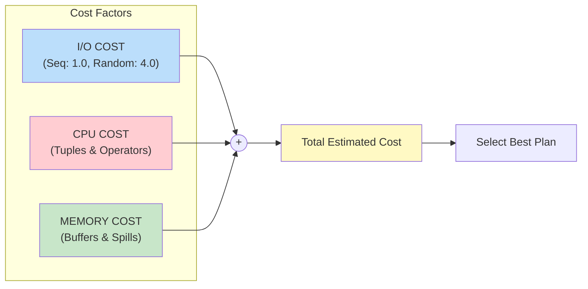
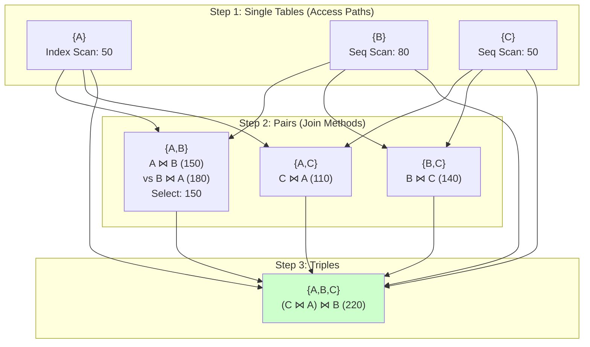

# Cost-Based Optimization

## Introduction

Cost-based optimization (CBO) is the process of estimating the resource cost of different query execution plans and selecting the one with the lowest estimated cost. This approach replaced rule-based optimization in modern databases because it can adapt to the actual data distribution.

## Cost Model Components



```
PostgreSQL Cost Parameters:
SET random_page_cost = 1.1;  -- For SSDs
SET effective_cache_size = 4GB;
SET work_mem = 256MB;
```

## Cost Estimation Formulas

### Sequential Scan Cost

```
┌─────────────────────────────────────────────────────────────┐
│                  Sequential Scan Cost                        │
├─────────────────────────────────────────────────────────────┤
│                                                              │
│  Cost = (pages × seq_page_cost) + (rows × cpu_tuple_cost)   │
│                                                              │
│  Example:                                                    │
│  Table: 10,000 pages, 1,000,000 rows                        │
│  seq_page_cost = 1.0                                        │
│  cpu_tuple_cost = 0.01                                      │
│                                                              │
│  Cost = (10,000 × 1.0) + (1,000,000 × 0.01)                 │
│       = 10,000 + 10,000                                      │
│       = 20,000                                               │
│                                                              │
│  With Filter (selectivity = 10%):                           │
│  Startup cost = 0                                            │
│  Total cost = 20,000 (must scan all pages)                  │
│  Rows returned = 100,000                                     │
│                                                              │
│  EXPLAIN output:                                             │
│  Seq Scan on users  (cost=0.00..20000.00 rows=100000)       │
│    Filter: (status = 'active')                               │
└─────────────────────────────────────────────────────────────┘
```

### Index Scan Cost

```
┌─────────────────────────────────────────────────────────────┐
│                    Index Scan Cost                           │
├─────────────────────────────────────────────────────────────┤
│                                                              │
│  Components:                                                 │
│  1. Index traversal cost                                     │
│  2. Index page reads                                         │
│  3. Heap page reads (random I/O)                            │
│                                                              │
│  Cost = index_cost + heap_cost                              │
│                                                              │
│  index_cost = (index_pages × random_page_cost)              │
│             + (index_tuples × cpu_index_tuple_cost)          │
│                                                              │
│  heap_cost = (heap_pages × random_page_cost)                │
│            + (rows × cpu_tuple_cost)                         │
│                                                              │
│  Example (selectivity = 1%):                                │
│  Table: 10,000 pages, 1M rows                               │
│  Index: 3 levels, 100 leaf pages for 1% = ~10 pages        │
│  Heap pages: ~100 pages (assuming random distribution)      │
│                                                              │
│  index_cost = (10 × 4.0) + (10,000 × 0.005) = 90           │
│  heap_cost = (100 × 4.0) + (10,000 × 0.01) = 500           │
│  Total = 590  (vs 20,000 for seq scan)                      │
│                                                              │
│  Crossover Point:                                            │
│  When selectivity > ~20-30%, seq scan often cheaper         │
└─────────────────────────────────────────────────────────────┘
```

### Index-Only Scan Cost

```
┌─────────────────────────────────────────────────────────────┐
│                  Index-Only Scan Cost                        │
├─────────────────────────────────────────────────────────────┤
│                                                              │
│  Avoids heap access when index contains all needed columns  │
│                                                              │
│  Cost = (index_pages × random_page_cost)                    │
│       + (index_tuples × cpu_index_tuple_cost)               │
│       + (visibility_map_pages × seq_page_cost)              │
│                                                              │
│  Requirement: All columns in SELECT from index              │
│                                                              │
│  CREATE INDEX idx_covering ON orders (customer_id)          │
│    INCLUDE (order_date, amount);                            │
│                                                              │
│  -- This query can use index-only scan:                     │
│  SELECT customer_id, order_date, amount                     │
│  FROM orders                                                 │
│  WHERE customer_id = 123;                                    │
│                                                              │
│  Cost savings:                                               │
│  • No heap random I/O                                        │
│  • Visibility map check instead (usually cached)            │
│  • ~80% cost reduction for selective queries                │
└─────────────────────────────────────────────────────────────┘
```

## Join Cost Estimation

### Nested Loop Join

```
┌─────────────────────────────────────────────────────────────┐
│                   Nested Loop Join Cost                      │
├─────────────────────────────────────────────────────────────┤
│                                                              │
│  Cost = outer_cost + (outer_rows × inner_cost)              │
│                                                              │
│  For each row in outer:                                      │
│    Scan/lookup inner table                                   │
│                                                              │
│  Example:                                                    │
│  Outer: customers (10,000 rows), cost to scan = 500         │
│  Inner: orders (100,000 rows), cost to scan = 5,000         │
│                                                              │
│  Without index on inner:                                     │
│  Cost = 500 + (10,000 × 5,000) = 50,000,500  (TERRIBLE!)   │
│                                                              │
│  With index on inner (cost per lookup = 5):                 │
│  Cost = 500 + (10,000 × 5) = 50,500  (Good!)               │
│                                                              │
│  Best for:                                                   │
│  • Small outer table                                         │
│  • Indexed inner table                                       │
│  • Highly selective join                                     │
│                                                              │
│  EXPLAIN:                                                    │
│  Nested Loop  (cost=0.43..50500.00 rows=100000)             │
│    ->  Seq Scan on customers  (cost=0.00..500.00)           │
│    ->  Index Scan on orders  (cost=0.43..5.00)              │
└─────────────────────────────────────────────────────────────┘
```

### Hash Join

```
┌─────────────────────────────────────────────────────────────┐
│                      Hash Join Cost                          │
├─────────────────────────────────────────────────────────────┤
│                                                              │
│  Phase 1: Build hash table from smaller table               │
│  Phase 2: Probe hash table with larger table                │
│                                                              │
│  Cost = build_cost + probe_cost                             │
│                                                              │
│  build_cost = scan_smaller + hash_creation                  │
│  probe_cost = scan_larger + hash_lookups                    │
│                                                              │
│  Example:                                                    │
│  Smaller (customers): 10,000 rows, scan cost = 500          │
│  Larger (orders): 100,000 rows, scan cost = 5,000           │
│  Hash table fits in memory (work_mem)                        │
│                                                              │
│  build_cost = 500 + (10,000 × 0.01) = 600                   │
│  probe_cost = 5,000 + (100,000 × 0.005) = 5,500             │
│  Total = 6,100  (Much better than nested loop!)             │
│                                                              │
│  Memory requirement:                                         │
│  hash_table_size ≈ smaller_rows × (key_size + pointer)     │
│  If exceeds work_mem: spill to disk (partitioned hash)     │
│                                                              │
│  Best for:                                                   │
│  • Large tables                                              │
│  • No useful indexes                                         │
│  • Sufficient memory                                         │
└─────────────────────────────────────────────────────────────┘
```

### Merge Join

```
┌─────────────────────────────────────────────────────────────┐
│                      Merge Join Cost                         │
├─────────────────────────────────────────────────────────────┤
│                                                              │
│  Requires both inputs sorted on join key                    │
│                                                              │
│  Cost = sort_outer + sort_inner + merge_cost                │
│                                                              │
│  If already sorted (index):                                  │
│  Cost = scan_outer + scan_inner + merge_cost                │
│                                                              │
│  merge_cost ≈ (outer_rows + inner_rows) × cpu_tuple_cost   │
│                                                              │
│  Example (both sorted via index):                           │
│  Outer: 10,000 rows, index scan cost = 800                  │
│  Inner: 100,000 rows, index scan cost = 8,000               │
│                                                              │
│  Cost = 800 + 8,000 + (110,000 × 0.01) = 9,900              │
│                                                              │
│  Example (needs sort):                                       │
│  Sort outer: 500 + 10,000 × log(10,000) × 0.01 = ~1,800    │
│  Sort inner: 5,000 + 100,000 × log(100,000) × 0.01 = ~22K  │
│  Merge: 1,100                                                │
│  Total: ~25,000                                              │
│                                                              │
│  Best for:                                                   │
│  • Inputs already sorted                                     │
│  • Large datasets                                            │
│  • Output needs to be sorted                                 │
└─────────────────────────────────────────────────────────────┘
```

## Search Space Exploration

### Dynamic Programming (System R)



```
Complexity: O(3^n) with pruning, O(n!) without
Goal: Build optimally from smaller subproblems
```

### Interesting Orders

```
┌─────────────────────────────────────────────────────────────┐
│                    Interesting Orders                        │
├─────────────────────────────────────────────────────────────┤
│                                                              │
│  Keep track of plans that produce sorted output             │
│  (may enable cheaper merge join or avoid sort later)        │
│                                                              │
│  Query: SELECT * FROM A JOIN B JOIN C ORDER BY A.x          │
│                                                              │
│  Plans to consider for {A}:                                  │
│  1. Seq Scan: cost=100, no order                            │
│  2. Index Scan on x: cost=150, ordered by A.x ← Keep!      │
│                                                              │
│  Even though (2) costs more, keep it because:               │
│  • Enables merge join with B if B is sorted                 │
│  • Avoids final ORDER BY sort                               │
│                                                              │
│  Final comparison:                                           │
│  Plan A (seq scans + hash joins + sort): 500 + 200 = 700   │
│  Plan B (index + merge joins, no sort): 450 + 0 = 450 ✓    │
└─────────────────────────────────────────────────────────────┘
```

## Cardinality Estimation

### Selectivity Formulas

```
┌─────────────────────────────────────────────────────────────┐
│                  Selectivity Estimation                      │
├─────────────────────────────────────────────────────────────┤
│                                                              │
│  Equality: column = value                                    │
│  ┌─────────────────────────────────────────────────────┐    │
│  │ If value in histogram: use frequency                │    │
│  │ If uniform assumption: 1/ndistinct                  │    │
│  │ Example: country = 'USA', 50 countries              │    │
│  │ Selectivity = 1/50 = 0.02 = 2%                     │    │
│  └─────────────────────────────────────────────────────┘    │
│                                                              │
│  Range: column > value                                       │
│  ┌─────────────────────────────────────────────────────┐    │
│  │ Selectivity = (max - value) / (max - min)           │    │
│  │ Example: age > 30, range [18, 80]                   │    │
│  │ Selectivity = (80-30)/(80-18) = 50/62 = 0.81       │    │
│  │ With histogram: sum frequencies of matching buckets│    │
│  └─────────────────────────────────────────────────────┘    │
│                                                              │
│  AND: column1 = v1 AND column2 = v2                         │
│  ┌─────────────────────────────────────────────────────┐    │
│  │ Independence assumption:                             │    │
│  │ Selectivity = sel(col1) × sel(col2)                 │    │
│  │ Example: country='USA' AND age>30                   │    │
│  │ Selectivity = 0.02 × 0.81 = 0.016                   │    │
│  │                                                      │    │
│  │ ⚠ Often wrong! Correlated columns violate this     │    │
│  └─────────────────────────────────────────────────────┘    │
│                                                              │
│  OR: column1 = v1 OR column2 = v2                           │
│  ┌─────────────────────────────────────────────────────┐    │
│  │ Selectivity = sel(A) + sel(B) - sel(A) × sel(B)    │    │
│  │ (Inclusion-exclusion principle)                     │    │
│  └─────────────────────────────────────────────────────┘    │
│                                                              │
│  JOIN: table1 JOIN table2 ON t1.a = t2.b                   │
│  ┌─────────────────────────────────────────────────────┐    │
│  │ Result rows = |t1| × |t2| / max(ndist(a), ndist(b))│    │
│  │ Or: |t1| × |t2| × (1/ndist(join_col))              │    │
│  └─────────────────────────────────────────────────────┘    │
└─────────────────────────────────────────────────────────────┘
```

### Cardinality Estimation Errors

```
┌─────────────────────────────────────────────────────────────┐
│              Common Estimation Errors                        │
├─────────────────────────────────────────────────────────────┤
│                                                              │
│  1. Correlation Blindness                                    │
│  ┌─────────────────────────────────────────────────────┐    │
│  │ Query: city = 'San Francisco' AND state = 'CA'      │    │
│  │ Estimated: 1/1000 × 1/50 = 1/50,000                │    │
│  │ Actual: 1/1000 (city implies state!)               │    │
│  │ Error: 50x underestimate                            │    │
│  └─────────────────────────────────────────────────────┘    │
│                                                              │
│  2. Join Underestimation                                     │
│  ┌─────────────────────────────────────────────────────┐    │
│  │ Multi-way joins: errors multiply                    │    │
│  │ A ⋈ B ⋈ C ⋈ D                                      │    │
│  │ Each join estimate 2x off → final 8x off           │    │
│  └─────────────────────────────────────────────────────┘    │
│                                                              │
│  3. Skewed Data                                              │
│  ┌─────────────────────────────────────────────────────┐    │
│  │ Query: product_id = 'best_seller'                   │    │
│  │ Estimated (uniform): 1M / 100K products = 10       │    │
│  │ Actual: 50,000 (popular product)                    │    │
│  │ Error: 5000x underestimate                          │    │
│  │ Solution: Use MCV (Most Common Values) list         │    │
│  └─────────────────────────────────────────────────────┘    │
│                                                              │
│  4. Out-of-Range Values                                      │
│  ┌─────────────────────────────────────────────────────┐    │
│  │ Query: date > '2025-01-01' (future date)           │    │
│  │ Histogram max: '2024-06-01'                         │    │
│  │ Estimated: 0 rows                                   │    │
│  │ May use default: 1/3 of table                       │    │
│  └─────────────────────────────────────────────────────┘    │
└─────────────────────────────────────────────────────────────┘
```

## PostgreSQL Cost Parameters

```sql
-- View current settings
SHOW seq_page_cost;           -- Default 1.0
SHOW random_page_cost;        -- Default 4.0
SHOW cpu_tuple_cost;          -- Default 0.01
SHOW cpu_index_tuple_cost;    -- Default 0.005
SHOW cpu_operator_cost;       -- Default 0.0025
SHOW effective_cache_size;    -- Default 4GB
SHOW work_mem;                -- Default 4MB

-- Adjust for SSD (reduce random I/O penalty)
SET random_page_cost = 1.1;

-- Increase for better hash/sort in-memory
SET work_mem = '256MB';

-- Tell planner about available cache
SET effective_cache_size = '8GB';

-- Enable/disable specific plans for testing
SET enable_seqscan = off;
SET enable_hashjoin = off;
SET enable_mergejoin = off;
SET enable_nestloop = off;

-- Force index usage (testing)
SET enable_seqscan = off;
EXPLAIN SELECT * FROM large_table WHERE indexed_col = 100;
SET enable_seqscan = on;
```

## Key Takeaways

1. **Cost = I/O + CPU** - I/O typically dominates, especially random I/O
2. **Statistics drive accuracy** - Outdated stats = bad plans
3. **Join order matters exponentially** - 10 tables = billions of orderings
4. **Selectivity estimation is error-prone** - Correlations, skew cause issues
5. **Parameters need tuning** - random_page_cost for SSDs, work_mem for hashing
6. **Dynamic programming finds optimal plans** - But limited to ~10-12 tables
