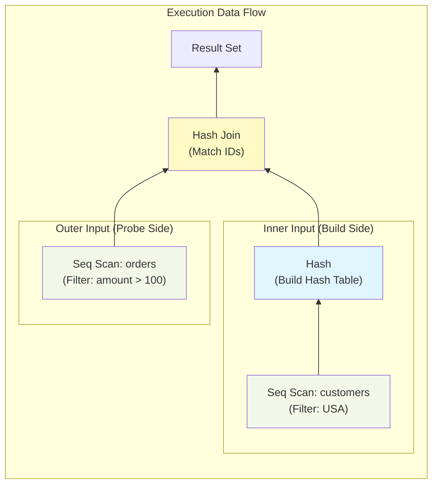
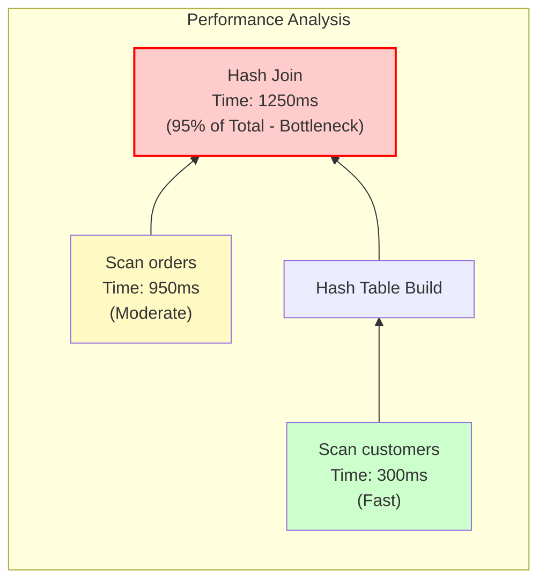

# Query Execution Plans

## Introduction

Query execution plans show how the database engine will execute a query. Understanding execution plans is essential for identifying performance bottlenecks and optimizing queries. Every database provides tools to view and analyze these plans.

## Reading EXPLAIN Output

### PostgreSQL EXPLAIN

```sql
-- Basic EXPLAIN
EXPLAIN SELECT * FROM users WHERE email = 'john@example.com';

-- With execution statistics
EXPLAIN ANALYZE SELECT * FROM users WHERE email = 'john@example.com';

-- Full details
EXPLAIN (ANALYZE, BUFFERS, FORMAT TEXT)
SELECT * FROM users WHERE email = 'john@example.com';

-- JSON format for programmatic analysis
EXPLAIN (ANALYZE, BUFFERS, FORMAT JSON)
SELECT * FROM users WHERE email = 'john@example.com';
```

### EXPLAIN Output Structure

```
EXPLAIN ANALYZE SELECT * FROM orders o
JOIN customers c ON o.customer_id = c.id
WHERE c.country = 'USA' AND o.amount > 100;

Output:
Hash Join  (cost=350.00..1250.00 rows=500 width=120)
           (actual time=5.2..45.8 rows=487 loops=1)
  Hash Cond: (o.customer_id = c.id)
  ->  Seq Scan on orders o
        (cost=0.00..800.00 rows=5000 width=80)
        (actual time=0.02..20.5 rows=4892 loops=1)
        Filter: (amount > 100)
        Rows Removed by Filter: 95108
  ->  Hash
        (cost=300.00..300.00 rows=2000 width=40)
        (actual time=4.5..4.5 rows=1987 loops=1)
        Buckets: 4096  Batches: 1  Memory: 150kB
        ->  Seq Scan on customers c
              (cost=0.00..300.00 rows=2000 width=40)
              (actual time=0.01..3.2 rows=1987)
              Filter: (country = 'USA')
              Rows Removed by Filter: 8013
Planning Time: 0.5 ms
Execution Time: 46.2 ms
```

### Visual Structure



### Cost Numbers Explained

```
┌─────────────────────────────────────────────────────────────┐
│                    Cost Numbers                              │
├─────────────────────────────────────────────────────────────┤
│                                                              │
│  (cost=350.00..1250.00 rows=500 width=120)                  │
│        │         │       │        │                          │
│        │         │       │        └── Average row width     │
│        │         │       └── Estimated rows returned        │
│        │         └── Total cost (arbitrary units)           │
│        └── Startup cost (before first row returned)         │
│                                                              │
│  (actual time=5.2..45.8 rows=487 loops=1)                   │
│               │     │       │        │                       │
│               │     │       │        └── Times executed     │
│               │     │       └── Actual rows returned        │
│               │     └── Time to last row (ms)               │
│               └── Time to first row (ms)                    │
│                                                              │
│  Key Observations:                                           │
│  • Estimated 500 rows, actual 487 - good estimate           │
│  • Total time 45.8ms matches cost proportion                │
│  • loops=1 means executed once                               │
└─────────────────────────────────────────────────────────────┘
```

## Common Plan Operators

### Scan Operators

```
┌─────────────────────────────────────────────────────────────┐
│                      Scan Operators                          │
├─────────────────────────────────────────────────────────────┤
│                                                              │
│  SEQ SCAN (Full Table Scan)                                 │
│  ┌─────────────────────────────────────────────────────┐    │
│  │ Seq Scan on users  (cost=0.00..1500.00 rows=50000)  │    │
│  │   Filter: (status = 'active')                       │    │
│  │   Rows Removed by Filter: 25000                     │    │
│  └─────────────────────────────────────────────────────┘    │
│  • Reads entire table                                        │
│  • Filter applied after reading                              │
│  • Fast for small tables or low selectivity                 │
│                                                              │
│  INDEX SCAN                                                  │
│  ┌─────────────────────────────────────────────────────┐    │
│  │ Index Scan using idx_email on users                 │    │
│  │   (cost=0.42..8.44 rows=1 width=100)                │    │
│  │   Index Cond: (email = 'john@example.com')          │    │
│  └─────────────────────────────────────────────────────┘    │
│  • Uses index to find rows                                   │
│  • Fetches rows from table (heap)                           │
│  • Good for selective queries                                │
│                                                              │
│  INDEX ONLY SCAN                                            │
│  ┌─────────────────────────────────────────────────────┐    │
│  │ Index Only Scan using idx_email_name on users       │    │
│  │   (cost=0.42..4.44 rows=1 width=50)                 │    │
│  │   Index Cond: (email = 'john@example.com')          │    │
│  │   Heap Fetches: 0                                   │    │
│  └─────────────────────────────────────────────────────┘    │
│  • All columns from index, no heap access                   │
│  • Heap Fetches shows visibility map misses                 │
│  • Fastest for covered queries                               │
│                                                              │
│  BITMAP INDEX SCAN + BITMAP HEAP SCAN                       │
│  ┌─────────────────────────────────────────────────────┐    │
│  │ Bitmap Heap Scan on users                           │    │
│  │   Recheck Cond: (age > 30)                          │    │
│  │   ->  Bitmap Index Scan on idx_age                  │    │
│  │         Index Cond: (age > 30)                      │    │
│  └─────────────────────────────────────────────────────┘    │
│  • Builds bitmap of matching rows                           │
│  • Sorts by physical location                               │
│  • Reduces random I/O for medium selectivity               │
└─────────────────────────────────────────────────────────────┘
```

### Join Operators

```
┌─────────────────────────────────────────────────────────────┐
│                      Join Operators                          │
├─────────────────────────────────────────────────────────────┤
│                                                              │
│  NESTED LOOP                                                 │
│  ┌─────────────────────────────────────────────────────┐    │
│  │ Nested Loop  (cost=0.43..2500.00 rows=1000)         │    │
│  │   ->  Seq Scan on orders                            │    │
│  │         (cost=0.00..500.00 rows=100)                │    │
│  │   ->  Index Scan on customers                       │    │
│  │         (cost=0.43..20.00 rows=10)                  │    │
│  │         Index Cond: (id = orders.customer_id)       │    │
│  │                     ↑ loops=100                     │    │
│  └─────────────────────────────────────────────────────┘    │
│  • For each outer row, scan inner                           │
│  • Best with small outer + indexed inner                    │
│                                                              │
│  HASH JOIN                                                   │
│  ┌─────────────────────────────────────────────────────┐    │
│  │ Hash Join  (cost=350.00..1500.00 rows=5000)         │    │
│  │   Hash Cond: (o.customer_id = c.id)                 │    │
│  │   ->  Seq Scan on orders o                          │    │
│  │   ->  Hash                                          │    │
│  │         Buckets: 4096  Memory Usage: 200kB         │    │
│  │         ->  Seq Scan on customers c                 │    │
│  └─────────────────────────────────────────────────────┘    │
│  • Build hash from smaller table                            │
│  • Probe with larger table                                   │
│  • Memory usage shows hash table size                       │
│                                                              │
│  MERGE JOIN                                                  │
│  ┌─────────────────────────────────────────────────────┐    │
│  │ Merge Join  (cost=500.00..2000.00 rows=5000)        │    │
│  │   Merge Cond: (c.id = o.customer_id)                │    │
│  │   ->  Index Scan on customers c                     │    │
│  │         (sorted by id)                              │    │
│  │   ->  Sort                                          │    │
│  │         Sort Key: o.customer_id                     │    │
│  │         Sort Method: quicksort  Memory: 500kB      │    │
│  │         ->  Seq Scan on orders o                    │    │
│  └─────────────────────────────────────────────────────┘    │
│  • Requires sorted inputs                                    │
│  • May include Sort operator                                 │
│  • External sort if Memory insufficient                     │
└─────────────────────────────────────────────────────────────┘
```

### Aggregate Operators

```
┌─────────────────────────────────────────────────────────────┐
│                   Aggregate Operators                        │
├─────────────────────────────────────────────────────────────┤
│                                                              │
│  AGGREGATE (no grouping)                                    │
│  ┌─────────────────────────────────────────────────────┐    │
│  │ Aggregate  (cost=1500.00..1500.01 rows=1)           │    │
│  │   ->  Seq Scan on orders                            │    │
│  └─────────────────────────────────────────────────────┘    │
│  SELECT COUNT(*), SUM(amount) FROM orders;                  │
│                                                              │
│  GROUP BY (Hash Aggregate)                                  │
│  ┌─────────────────────────────────────────────────────┐    │
│  │ HashAggregate  (cost=1500.00..1550.00 rows=100)     │    │
│  │   Group Key: customer_id                            │    │
│  │   Batches: 1  Memory Usage: 50kB                   │    │
│  │   ->  Seq Scan on orders                            │    │
│  └─────────────────────────────────────────────────────┘    │
│  SELECT customer_id, SUM(amount) FROM orders GROUP BY 1;   │
│                                                              │
│  GROUP BY (Sort + Group Aggregate)                          │
│  ┌─────────────────────────────────────────────────────┐    │
│  │ GroupAggregate  (cost=2000.00..2100.00 rows=100)    │    │
│  │   Group Key: customer_id                            │    │
│  │   ->  Sort                                          │    │
│  │         Sort Key: customer_id                       │    │
│  │         ->  Seq Scan on orders                      │    │
│  └─────────────────────────────────────────────────────┘    │
│  Used when: sorted output needed, or hash too large         │
│                                                              │
│  DISTINCT                                                    │
│  ┌─────────────────────────────────────────────────────┐    │
│  │ Unique  (cost=1500.00..1600.00 rows=50)             │    │
│  │   ->  Sort                                          │    │
│  │         Sort Key: country                           │    │
│  │         ->  Seq Scan on customers                   │    │
│  └─────────────────────────────────────────────────────┘    │
│  Or HashAggregate for unsorted distinct                     │
└─────────────────────────────────────────────────────────────┘
```

### Other Operators

```
┌─────────────────────────────────────────────────────────────┐
│                    Other Operators                           │
├─────────────────────────────────────────────────────────────┤
│                                                              │
│  SORT                                                        │
│  ┌─────────────────────────────────────────────────────┐    │
│  │ Sort  (cost=1000.00..1050.00 rows=10000)            │    │
│  │   Sort Key: created_at DESC                         │    │
│  │   Sort Method: quicksort  Memory: 500kB            │    │
│  │   ->  Seq Scan on orders                            │    │
│  └─────────────────────────────────────────────────────┘    │
│  Sort Method: quicksort (in memory), external merge (disk) │
│                                                              │
│  LIMIT                                                       │
│  ┌─────────────────────────────────────────────────────┐    │
│  │ Limit  (cost=0.00..10.00 rows=10)                   │    │
│  │   ->  Seq Scan on orders                            │    │
│  └─────────────────────────────────────────────────────┘    │
│  Stops after N rows (short-circuits)                        │
│                                                              │
│  MATERIALIZE                                                 │
│  ┌─────────────────────────────────────────────────────┐    │
│  │ Materialize  (cost=0.00..150.00 rows=1000)          │    │
│  │   ->  Subquery scan                                 │    │
│  └─────────────────────────────────────────────────────┘    │
│  Caches subquery results in memory/disk                     │
│                                                              │
│  CTE SCAN                                                    │
│  ┌─────────────────────────────────────────────────────┐    │
│  │ CTE Scan on cte_name  (cost=0.00..100.00 rows=500)  │    │
│  └─────────────────────────────────────────────────────┘    │
│  Reads from materialized CTE                                │
│                                                              │
│  APPEND (UNION ALL)                                         │
│  ┌─────────────────────────────────────────────────────┐    │
│  │ Append  (cost=0.00..500.00 rows=10000)              │    │
│  │   ->  Seq Scan on orders_2023                       │    │
│  │   ->  Seq Scan on orders_2024                       │    │
│  └─────────────────────────────────────────────────────┘    │
│  Concatenates multiple input sets                           │
└─────────────────────────────────────────────────────────────┘
```

## MySQL EXPLAIN

```sql
-- Basic EXPLAIN
EXPLAIN SELECT * FROM users WHERE email = 'john@example.com';

-- EXPLAIN FORMAT=TREE (MySQL 8.0+)
EXPLAIN FORMAT=TREE SELECT * FROM users WHERE email = 'john@example.com';

-- EXPLAIN ANALYZE (MySQL 8.0.18+)
EXPLAIN ANALYZE SELECT * FROM users WHERE email = 'john@example.com';
```

### MySQL EXPLAIN Output

```
┌─────────────────────────────────────────────────────────────┐
│                   MySQL EXPLAIN Columns                      │
├─────────────────────────────────────────────────────────────┤
│                                                              │
│  +----+-------------+-------+------+---------------+------+ │
│  | id | select_type | table | type | possible_keys | key  | │
│  +----+-------------+-------+------+---------------+------+ │
│  | 1  | SIMPLE      | users | ref  | idx_email     | idx_ | │
│  +----+-------------+-------+------+---------------+------+ │
│                                                              │
│  | key_len | ref   | rows | filtered | Extra              | │
│  +---------+-------+------+----------+--------------------+ │
│  | 767     | const | 1    | 100.00   | Using index        | │
│  +---------+-------+------+----------+--------------------+ │
│                                                              │
│  Key Columns:                                                │
│  • id: Query block identifier                               │
│  • select_type: SIMPLE, PRIMARY, SUBQUERY, DERIVED, etc.   │
│  • type: Access method (best to worst):                     │
│      system > const > eq_ref > ref > range > index > ALL   │
│  • possible_keys: Indexes that could be used               │
│  • key: Index actually chosen                               │
│  • key_len: Bytes of index used                             │
│  • rows: Estimated rows to examine                          │
│  • filtered: Percentage after table condition               │
│  • Extra: Additional information                            │
└─────────────────────────────────────────────────────────────┘
```

### MySQL Access Types

```
┌─────────────────────────────────────────────────────────────┐
│              MySQL Access Types (type column)                │
├─────────────────────────────────────────────────────────────┤
│                                                              │
│  BEST ──────────────────────────────────────────────► WORST │
│                                                              │
│  system  Table has one row (system table)                   │
│     │                                                        │
│  const   One row match (PRIMARY KEY = constant)             │
│     │    WHERE id = 1                                        │
│     │                                                        │
│  eq_ref  One row per combination (unique index)             │
│     │    JOIN on primary key                                 │
│     │                                                        │
│  ref     Multiple rows from index                            │
│     │    WHERE indexed_col = 'value'                        │
│     │                                                        │
│  range   Index range scan                                    │
│     │    WHERE date > '2024-01-01'                          │
│     │    WHERE id IN (1, 2, 3)                              │
│     │                                                        │
│  index   Full index scan (all index entries)                │
│     │    SELECT indexed_col FROM table                       │
│     │                                                        │
│  ALL     Full table scan                                     │
│          SELECT * FROM table WHERE non_indexed = 'val'       │
└─────────────────────────────────────────────────────────────┘
```

## Identifying Performance Issues

### Red Flags in Execution Plans

```
┌─────────────────────────────────────────────────────────────┐
│              Execution Plan Red Flags                        │
├─────────────────────────────────────────────────────────────┤
│                                                              │
│  1. ESTIMATION ERRORS                                        │
│  ┌─────────────────────────────────────────────────────┐    │
│  │ Seq Scan on orders                                  │    │
│  │   (cost=... rows=100)                              │    │
│  │   (actual ... rows=500000)     ← 5000x error!      │    │
│  └─────────────────────────────────────────────────────┘    │
│  Solution: ANALYZE table, check statistics                  │
│                                                              │
│  2. SEQUENTIAL SCAN ON LARGE TABLE                          │
│  ┌─────────────────────────────────────────────────────┐    │
│  │ Seq Scan on orders  (rows=10000000)                │    │
│  │   Filter: (customer_id = 123)                       │    │
│  │   Rows Removed by Filter: 9999900                  │    │
│  └─────────────────────────────────────────────────────┘    │
│  Solution: Create index on filter column                    │
│                                                              │
│  3. NESTED LOOP ON LARGE TABLES                             │
│  ┌─────────────────────────────────────────────────────┐    │
│  │ Nested Loop  (cost=0..50000000)                    │    │
│  │   ->  Seq Scan on orders (rows=100000)             │    │
│  │   ->  Seq Scan on products (loops=100000)          │    │
│  └─────────────────────────────────────────────────────┘    │
│  Solution: Add index or force hash join                     │
│                                                              │
│  4. EXTERNAL SORT (Disk spill)                              │
│  ┌─────────────────────────────────────────────────────┐    │
│  │ Sort  (cost=...)                                    │    │
│  │   Sort Key: created_at                              │    │
│  │   Sort Method: external merge  Disk: 500MB         │    │
│  └─────────────────────────────────────────────────────┘    │
│  Solution: Increase work_mem or add sorted index           │
│                                                              │
│  5. HIGH LOOPS COUNT                                        │
│  ┌─────────────────────────────────────────────────────┐    │
│  │ Index Scan on customers (loops=100000)             │    │
│  │   (actual time=0.01..0.02 rows=1)                  │    │
│  │   ↑ Total time = 0.02 × 100000 = 2000ms           │    │
│  └─────────────────────────────────────────────────────┘    │
│  Solution: Different join order or method                   │
│                                                              │
│  6. BITMAP HEAP SCAN RECHECK                                │
│  ┌─────────────────────────────────────────────────────┐    │
│  │ Bitmap Heap Scan                                    │    │
│  │   Recheck Cond: (status = 'active')                │    │
│  │   Rows Removed by Index Recheck: 50000            │    │
│  └─────────────────────────────────────────────────────┘    │
│  Cause: work_mem too small, bitmap lossy                   │
└─────────────────────────────────────────────────────────────┘
```

## Visual Explain Tools

### pgAdmin / DBeaver



### EXPLAIN.depesz.com (PostgreSQL)

```
Paste your EXPLAIN ANALYZE output to get:
- Formatted tree view
- Highlighted slow operations
- Estimation accuracy indicators
- Shareable URL

URL: https://explain.depesz.com/
```

## Key Takeaways

1. **Always use EXPLAIN ANALYZE** - Actual times reveal true performance
2. **Compare estimated vs actual rows** - Large differences indicate stale statistics
3. **Watch for Seq Scans on large tables** - Usually need an index
4. **Check loops count** - Multiply time by loops for true cost
5. **Monitor Sort Method** - External merge means disk spill
6. **Identify the bottleneck** - Focus on the slowest operator first
