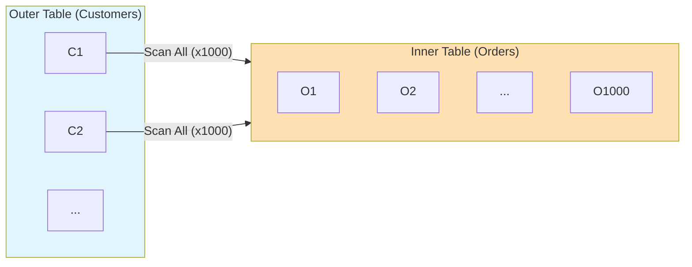
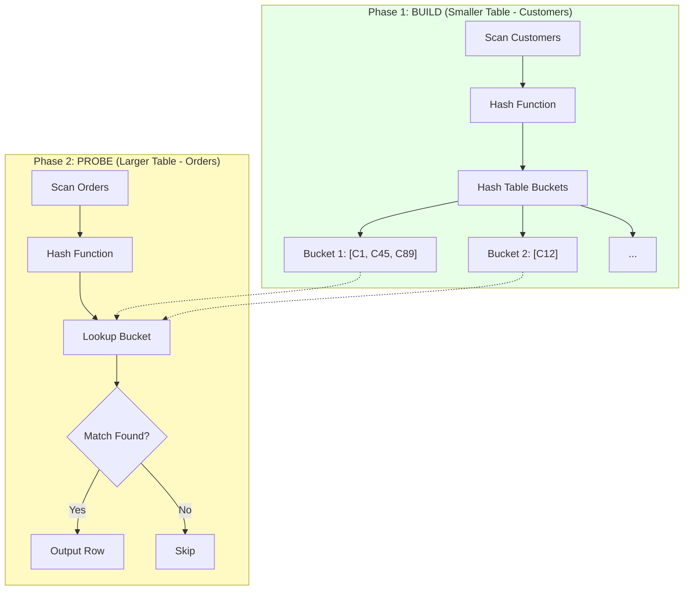
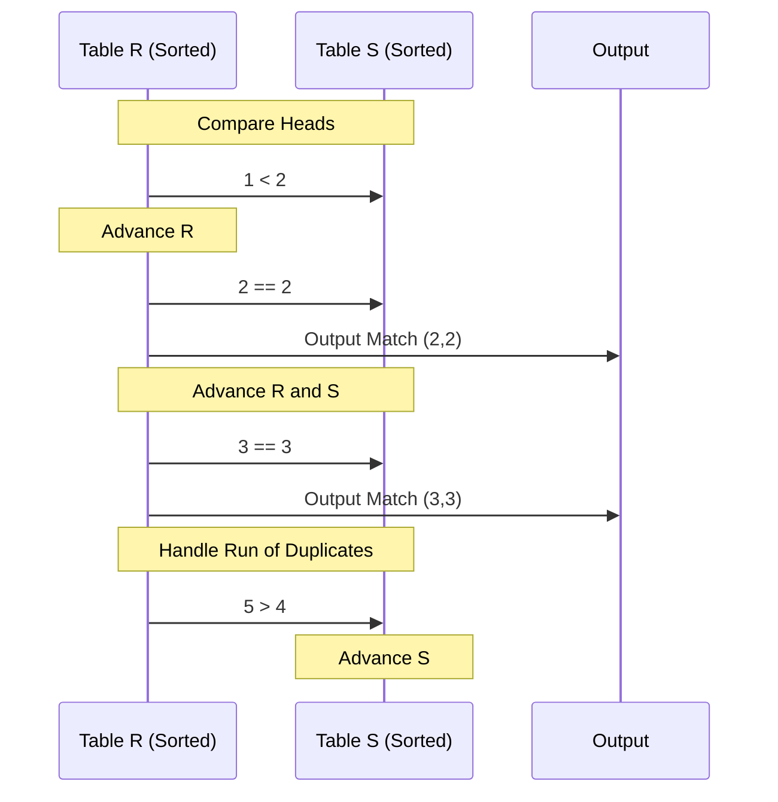

# Join Algorithms

## Introduction

Join operations combine rows from two or more tables based on a related column. The join algorithm chosen dramatically impacts query performance. Understanding when each algorithm excels helps in query optimization and index design.

## Join Algorithm Overview

```
┌─────────────────────────────────────────────────────────────┐
│                  Join Algorithm Comparison                   │
├─────────────────────────────────────────────────────────────┤
│                                                              │
│  Algorithm    │ Best For              │ Requires            │
│  ─────────────┼───────────────────────┼─────────────────────│
│  Nested Loop  │ Small outer, indexed  │ Index on inner      │
│               │ inner, OLTP           │                     │
│  ─────────────┼───────────────────────┼─────────────────────│
│  Hash Join    │ Large tables, no      │ Memory for hash     │
│               │ useful indexes        │ table               │
│  ─────────────┼───────────────────────┼─────────────────────│
│  Merge Join   │ Pre-sorted inputs,    │ Sorted inputs       │
│               │ sorted output needed  │ (or indexes)        │
│  ─────────────┼───────────────────────┼─────────────────────│
│                                                              │
│  Time Complexity:                                            │
│  • Nested Loop: O(n × m) or O(n × log m) with index        │
│  • Hash Join: O(n + m)                                      │
│  • Merge Join: O(n + m) if sorted, O(n log n + m log m) if not│
└─────────────────────────────────────────────────────────────┘
```

## Nested Loop Join

### Basic Nested Loop

```
Algorithm:
FOR each row r in outer_table:
    FOR each row s in inner_table:
        IF r.key = s.key:
            output (r, s)

Cost without index:
Pages: |Outer| + |Outer_rows| × |Inner|
Example: 10 + 100 × 1000 = 100,010 page reads
⚠️ Only use without index on tiny tables
```

### Visualization



### Index Nested Loop

```
┌─────────────────────────────────────────────────────────────┐
│                  Index Nested Loop Join                      │
├─────────────────────────────────────────────────────────────┤
│                                                              │
│  Algorithm:                                                  │
│  FOR each row r in outer_table:                             │
│      matches = index_lookup(inner_table, r.key)             │
│      FOR each row s in matches:                             │
│          output (r, s)                                       │
│                                                              │
│  Visualization:                                              │
│  ┌───────────────────────────────────────────────────────┐  │
│  │ Outer (customers): [C1, C2, C3, C4, C5]               │  │
│  │                     │                                  │  │
│  │        ┌────────────┘                                  │  │
│  │        ▼                                               │  │
│  │ For C1: Index lookup ──► [O5, O23, O156]  (3 matches) │  │
│  │         B-Tree traversal: 3-4 page reads              │  │
│  │                                                        │  │
│  │        ▼                                               │  │
│  │ For C2: Index lookup ──► [O12, O89]       (2 matches) │  │
│  │         B-Tree traversal: 3-4 page reads              │  │
│  │        ...                                             │  │
│  └───────────────────────────────────────────────────────┘  │
│                                                              │
│  Cost with index:                                            │
│  |Outer| + |Outer_rows| × (index_height + matches)         │
│  Example: 10 + 100 × (3 + 2) = 510 page reads              │
│                                                              │
│  ✅ Best when:                                               │
│  • Small outer table                                         │
│  • Good index on inner join column                          │
│  • High selectivity (few matches per outer row)             │
└─────────────────────────────────────────────────────────────┘
```

### Block Nested Loop (MySQL)

```
┌─────────────────────────────────────────────────────────────┐
│                   Block Nested Loop Join                     │
├─────────────────────────────────────────────────────────────┤
│                                                              │
│  Optimization: Buffer multiple outer rows                   │
│                                                              │
│  Algorithm:                                                  │
│  WHILE outer has more rows:                                 │
│      fill buffer with outer rows                            │
│      FOR each row s in inner:                               │
│          FOR each row r in buffer:                          │
│              IF r.key = s.key:                               │
│                  output (r, s)                               │
│                                                              │
│  Visualization:                                              │
│  ┌───────────────────────────────────────────────────────┐  │
│  │ Buffer: [C1, C2, C3, ... C100]  (100 rows)            │  │
│  │                                                        │  │
│  │ Single scan of inner: [O1, O2, O3, ... O1000]         │  │
│  │                                                        │  │
│  │ For each inner row:                                    │  │
│  │   Check against all 100 buffered outer rows           │  │
│  │   (hash lookup or linear scan of buffer)              │  │
│  │                                                        │  │
│  │ Repeat for next buffer batch                          │  │
│  └───────────────────────────────────────────────────────┘  │
│                                                              │
│  Cost improvement:                                           │
│  Scans of inner = ceiling(|Outer_rows| / buffer_size)      │
│  Example: ceiling(1000 / 100) = 10 inner scans             │
│  vs 1000 inner scans without blocking                       │
│                                                              │
│  MySQL: SET join_buffer_size = 256K;                        │
└─────────────────────────────────────────────────────────────┘
```

## Hash Join

### Basic Hash Join



```
Cost: O(|build| + |probe|)
Memory: O(|build|) for hash table

✅ Best when:
• Large tables
• No useful indexes
• Sufficient memory for smaller table
```

### Grace Hash Join (Disk-Based)

```
┌─────────────────────────────────────────────────────────────┐
│              Grace Hash Join (Partitioned)                   │
├─────────────────────────────────────────────────────────────┤
│                                                              │
│  When hash table doesn't fit in memory                      │
│                                                              │
│  Phase 1: PARTITION both tables                             │
│  ┌───────────────────────────────────────────────────────┐  │
│  │ Hash each row to partition (different from join hash)│  │
│  │                                                        │  │
│  │ Build (customers):              Probe (orders):       │  │
│  │ ┌────┐ ┌────┐ ┌────┐           ┌────┐ ┌────┐ ┌────┐  │  │
│  │ │ P0 │ │ P1 │ │ P2 │           │ P0 │ │ P1 │ │ P2 │  │  │
│  │ │C1  │ │C3  │ │C2  │           │O3  │ │O1  │ │O2  │  │  │
│  │ │C4  │ │C6  │ │C5  │           │O4  │ │O6  │ │O5  │  │  │
│  │ │... │ │... │ │... │           │... │ │... │ │... │  │  │
│  │ └────┘ └────┘ └────┘           └────┘ └────┘ └────┘  │  │
│  │   ↓       ↓       ↓               ↓       ↓       ↓   │  │
│  │ Disk   Disk   Disk            Disk   Disk   Disk     │  │
│  └───────────────────────────────────────────────────────┘  │
│                                                              │
│  Phase 2: JOIN matching partitions                          │
│  ┌───────────────────────────────────────────────────────┐  │
│  │ For each partition i:                                 │  │
│  │   Read build_partition[i] into memory hash table     │  │
│  │   Probe with probe_partition[i]                      │  │
│  │   Output matches                                      │  │
│  │                                                        │  │
│  │ Partition 0: Build hash(C1,C4,...) + Probe(O3,O4,...) │  │
│  │ Partition 1: Build hash(C3,C6,...) + Probe(O1,O6,...) │  │
│  │ Partition 2: Build hash(C2,C5,...) + Probe(O2,O5,...) │  │
│  └───────────────────────────────────────────────────────┘  │
│                                                              │
│  Key insight: Matching rows MUST be in same partition       │
│  Cost: 3 × (|R| + |S|) I/Os (read, write, read again)     │
└─────────────────────────────────────────────────────────────┘
```

### Hybrid Hash Join

```
┌─────────────────────────────────────────────────────────────┐
│                    Hybrid Hash Join                          │
├─────────────────────────────────────────────────────────────┤
│                                                              │
│  Optimization: Keep one partition in memory during build   │
│                                                              │
│  ┌───────────────────────────────────────────────────────┐  │
│  │ Memory during BUILD:                                  │  │
│  │ ┌─────────────────────────────────────────────────┐   │  │
│  │ │ Partition 0 (kept in memory as hash table)      │   │  │
│  │ │ ┌───┬───┬───┬───┐                               │   │  │
│  │ │ │ C1│ C4│ C7│...│                               │   │  │
│  │ │ └───┴───┴───┴───┘                               │   │  │
│  │ └─────────────────────────────────────────────────┘   │  │
│  │                                                        │  │
│  │ Partitions 1-N written to disk:                       │  │
│  │ ┌────┐ ┌────┐ ┌────┐                                  │  │
│  │ │ P1 │ │ P2 │ │ P3 │ → Disk                          │  │
│  │ └────┘ └────┘ └────┘                                  │  │
│  └───────────────────────────────────────────────────────┘  │
│                                                              │
│  During PROBE of larger table:                              │
│  ┌───────────────────────────────────────────────────────┐  │
│  │ For each probe row:                                   │  │
│  │   If hash(row) = partition 0:                        │  │
│  │     Probe in-memory hash table immediately           │  │
│  │   Else:                                               │  │
│  │     Write to corresponding probe partition on disk   │  │
│  └───────────────────────────────────────────────────────┘  │
│                                                              │
│  Savings: Partition 0 never written to disk                 │
│  Best when: Some partitions fit in memory                   │
└─────────────────────────────────────────────────────────────┘
```

## Merge Join (Sort-Merge Join)

### Algorithm

```
Precondition: Both inputs sorted on join key

Algorithm:
r = first row of R (sorted)
s = first row of S (sorted)

WHILE r and s are not exhausted:
  IF r.key < s.key:
      advance r
  ELSE IF r.key > s.key:
      advance s
  ELSE:  # r.key == s.key
      output all matching combinations
      advance both past matching keys
```

### Visualization



```
Cost: O(|R| + |S|) if already sorted
     O(|R| log |R| + |S| log |S|) if needs sorting
```

### Handling Duplicates

```
┌─────────────────────────────────────────────────────────────┐
│              Merge Join with Duplicates                      │
├─────────────────────────────────────────────────────────────┤
│                                                              │
│  Problem: Many-to-many on same key value                    │
│                                                              │
│  R: [3, 3, 3]  (3 rows with key=3)                          │
│  S: [3, 3]    (2 rows with key=3)                          │
│                                                              │
│  Output: 3 × 2 = 6 result rows                              │
│                                                              │
│  Algorithm (with backtracking):                              │
│  ┌───────────────────────────────────────────────────────┐  │
│  │ mark = current position in S                          │  │
│  │                                                        │  │
│  │ WHILE r.key == s.key:                                 │  │
│  │   FOR each s with same key (from mark):               │  │
│  │     output (r, s)                                      │  │
│  │   advance r                                            │  │
│  │   IF r.key == mark.key:                               │  │
│  │     reset s to mark  # backtrack                      │  │
│  │   ELSE:                                                │  │
│  │     mark = current s                                   │  │
│  └───────────────────────────────────────────────────────┘  │
│                                                              │
│  ⚠️ Worst case: All keys same → O(|R| × |S|)              │
└─────────────────────────────────────────────────────────────┘
```

## Comparison and Selection

### When to Use Each

```
┌─────────────────────────────────────────────────────────────┐
│                Algorithm Selection Guide                     │
├─────────────────────────────────────────────────────────────┤
│                                                              │
│  NESTED LOOP:                                                │
│  ┌─────────────────────────────────────────────────────┐    │
│  │ ✅ Small outer table (< 1000 rows)                  │    │
│  │ ✅ Index on inner join column                       │    │
│  │ ✅ LIMIT clause (can stop early)                    │    │
│  │ ✅ Highly selective predicates                      │    │
│  │ ❌ Large tables without indexes                     │    │
│  └─────────────────────────────────────────────────────┘    │
│                                                              │
│  HASH JOIN:                                                  │
│  ┌─────────────────────────────────────────────────────┐    │
│  │ ✅ Large tables, no useful indexes                  │    │
│  │ ✅ Equality join conditions                         │    │
│  │ ✅ Sufficient memory for smaller table              │    │
│  │ ✅ One-time (hash table not reusable)              │    │
│  │ ❌ Non-equality joins (>, <, LIKE)                 │    │
│  │ ❌ Very small tables (overhead not worth it)       │    │
│  └─────────────────────────────────────────────────────┘    │
│                                                              │
│  MERGE JOIN:                                                 │
│  ┌─────────────────────────────────────────────────────┐    │
│  │ ✅ Inputs already sorted (index scans)             │    │
│  │ ✅ Output needs to be sorted                        │    │
│  │ ✅ Non-equality joins supported                     │    │
│  │ ✅ Very large tables (streaming, low memory)       │    │
│  │ ❌ Unsorted inputs without ORDER BY needed         │    │
│  │ ❌ Highly skewed key distributions                  │    │
│  └─────────────────────────────────────────────────────┘    │
└─────────────────────────────────────────────────────────────┘
```

### Performance Characteristics

```
┌─────────────────────────────────────────────────────────────┐
│                Performance Comparison                        │
├─────────────────────────────────────────────────────────────┤
│                                                              │
│  Scenario: Join 10,000 × 100,000 rows                       │
│                                                              │
│  Nested Loop (no index):                                    │
│    Operations: 10,000 × 100,000 = 1 billion comparisons    │
│    Time: ~minutes to hours                                   │
│                                                              │
│  Nested Loop (with index):                                  │
│    Operations: 10,000 × 4 (index lookups)                   │
│    Time: ~milliseconds to seconds                            │
│                                                              │
│  Hash Join:                                                  │
│    Build: 10,000 rows hashed                                 │
│    Probe: 100,000 lookups                                    │
│    Operations: 110,000                                       │
│    Time: ~100ms (if fits in memory)                         │
│                                                              │
│  Merge Join:                                                 │
│    Sort: 10K log 10K + 100K log 100K                        │
│    Merge: 110,000                                            │
│    Operations: ~2.5 million (dominated by sort)             │
│    Time: ~500ms                                              │
│                                                              │
│  Already sorted Merge Join:                                 │
│    Operations: 110,000                                       │
│    Time: ~50ms                                               │
└─────────────────────────────────────────────────────────────┘
```

## Join Hints

### PostgreSQL

```sql
-- Disable specific join types to force alternatives
SET enable_hashjoin = off;
SET enable_mergejoin = off;
SET enable_nestloop = off;

-- Using pg_hint_plan extension
/*+ HashJoin(orders customers) */
SELECT * FROM orders o JOIN customers c ON o.customer_id = c.id;

/*+ NestLoop(orders customers) IndexScan(orders idx_customer_id) */
SELECT * FROM orders o JOIN customers c ON o.customer_id = c.id;

/*+ MergeJoin(orders customers) */
SELECT * FROM orders o JOIN customers c ON o.customer_id = c.id;
```

### MySQL

```sql
-- Force join order (STRAIGHT_JOIN)
SELECT STRAIGHT_JOIN *
FROM customers c
JOIN orders o ON c.id = o.customer_id;

-- Optimizer hints (MySQL 8.0+)
SELECT /*+ HASH_JOIN(o, c) */ *
FROM orders o JOIN customers c ON o.customer_id = c.id;

SELECT /*+ NO_HASH_JOIN(o, c) */ *
FROM orders o JOIN customers c ON o.customer_id = c.id;

SELECT /*+ JOIN_ORDER(c, o, p) */ *
FROM customers c
JOIN orders o ON c.id = o.customer_id
JOIN products p ON o.product_id = p.id;
```

## Key Takeaways

1. **Nested Loop with index** - Best for OLTP with small result sets
2. **Hash Join** - Workhorse for analytical queries on large tables
3. **Merge Join** - Optimal when inputs are pre-sorted
4. **Index design matters** - Can change O(n²) to O(n log n)
5. **Memory is critical for Hash Join** - Disk spill hurts performance
6. **Optimizer usually chooses correctly** - But hints available when needed
