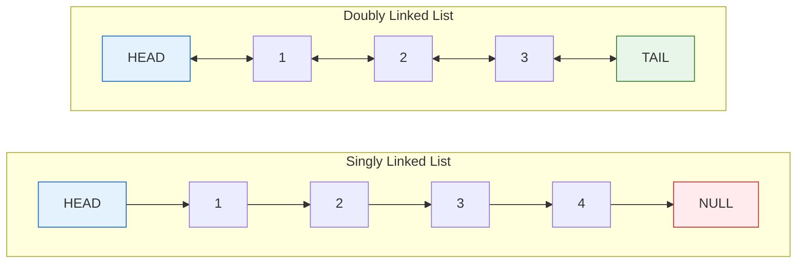

# Linked Lists

A linked list is a linear data structure where elements are stored in nodes, with each node pointing to the next.

## Overview

Unlike arrays, linked lists don't require contiguous memory. Each node contains data and a reference to the next node.



## Topics

- [4.1 Singly Linked List](Types/01_singly_linked_list.md)
- [4.2 Doubly Linked List](Types/02_doubly_linked_list.md)
- [4.3 Fast and Slow Pointers](Techniques/01_fast_and_slow_pointers.md)
- [4.4 Reversing Linked Lists](Techniques/02_reversing_linked_lists.md)
- [4.5 Practice Problems](Practice_Problems/00_practice_problems.md)

## Comparison: Array vs Linked List

| Operation | Array | Linked List |
|-----------|-------|-------------|
| Access by index | O(1) | O(n) |
| Insert at beginning | O(n) | O(1) |
| Insert at end | O(1)* | O(n) or O(1)** |
| Insert in middle | O(n) | O(1)*** |
| Delete | O(n) | O(1)*** |
| Memory | Contiguous | Scattered |
| Cache performance | Excellent | Poor |

*Amortized for dynamic arrays
**O(1) if tail pointer maintained
***After reaching position

## Node Structure

### Singly Linked List Node

>[!example]- C++
>```cpp
>struct ListNode {
>    int val;
>    ListNode *next;
>    ListNode() : val(0), next(nullptr) {}
>    ListNode(int x) : val(x), next(nullptr) {}
>    ListNode(int x, ListNode *next) : val(x), next(next) {}
>};
>```

>[!example]- Java
>```java
>public class ListNode {
>    int val;
>    ListNode next;
>    ListNode() {}
>    ListNode(int val) { this.val = val; }
>    ListNode(int val, ListNode next) { this.val = val; this.next = next; }
>}
>```

>[!example]- Python
>```python
>class ListNode:
>    def __init__(self, val=0, next=None):
>        self.val = val
>        self.next = next
>```

>[!example]- JavaScript
>```javascript
>class ListNode {
>    constructor(val = 0, next = null) {
>        this.val = val;
>        this.next = next;
>    }
>}
>```

### Doubly Linked List Node

>[!example]- C++
>```cpp
>struct DoublyListNode {
>    int val;
>    DoublyListNode *prev;
>    DoublyListNode *next;
>    DoublyListNode() : val(0), prev(nullptr), next(nullptr) {}
>    DoublyListNode(int x) : val(x), prev(nullptr), next(nullptr) {}
>};
>```

>[!example]- Java
>```java
>public class DoublyListNode {
>    int val;
>    DoublyListNode prev;
>    DoublyListNode next;
>    public DoublyListNode(int val) {
>        this.val = val;
>    }
>}
>```

>[!example]- Python
>```python
>class DoublyListNode:
>    def __init__(self, val=0, prev=None, next=None):
>        self.val = val
>        self.prev = prev
>        self.next = next
>```

>[!example]- JavaScript
>```javascript
>class DoublyListNode {
>    constructor(val = 0, prev = null, next = null) {
>        this.val = val;
>        this.prev = prev;
>        this.next = next;
>    }
>}
>```

## Key Techniques

1. **Dummy Head Node** - Simplifies edge cases
2. **Two Pointers** - Fast and slow for cycle detection
3. **Reversal** - In-place or recursive
4. **Merge** - Combine sorted lists

## Common Interview Problems

| Problem | Technique | Difficulty | LeetCode Link |
| --------- | ----------- | ------------ | --- |
| Reverse Linked List | Iteration/Recursion | Easy | [Link](https://leetcode.com/problems/reverse-linked-list/) |
| Detect Cycle | Fast-Slow Pointers | Easy | [Link](https://leetcode.com/problems/detect-cycle/) |
| Find Cycle Start | Floyd's Algorithm | Medium | [Link](https://leetcode.com/problems/find-cycle-start/) |
| Merge Two Sorted Lists | Two Pointers | Easy | [Link](https://leetcode.com/problems/merge-two-sorted-lists/) |
| Remove Nth from End | Two Pointers | Medium | [Link](https://leetcode.com/problems/remove-nth-node-from-end-of-list/) |
| Middle of Linked List | Fast-Slow | Easy | [Link](https://leetcode.com/problems/middle-of-linked-list/) |
| Palindrome Linked List | Reverse Half | Medium | [Link](https://leetcode.com/problems/palindrome-linked-list/) |
| Intersection of Two Lists | Two Pointers | Medium | [Link](https://leetcode.com/problems/intersection-of-two-linked-lists/) |
| LRU Cache | HashMap + DLL | Medium | [Link](https://leetcode.com/problems/lru-cache/) |
