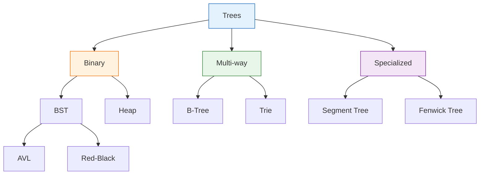
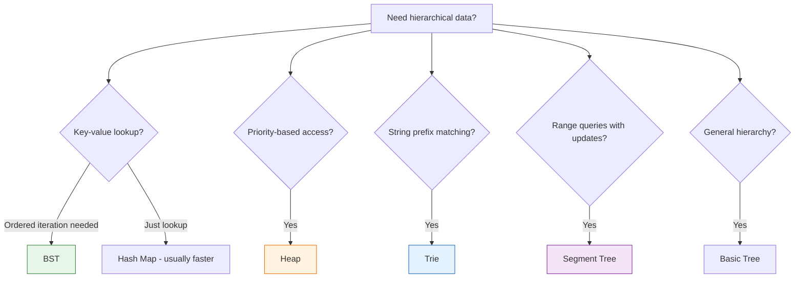

# Trees

Trees are hierarchical data structures consisting of nodes connected by edges, with exactly one path between any two nodes. They model hierarchical relationships and enable efficient searching, sorting, and organization of data.

## Overview

Tree terminology:
- **Root**: Top node (no parent)
- **Leaf**: Node with no children
- **Internal node**: Node with at least one child
- **Height**: Maximum depth from root to any leaf
- **Depth**: Distance from root to a node

## Topics

### Binary Trees
- [7. Binary Trees](Binary_Trees/00_binary_trees.md) - Fundamental tree operations and traversals

### Binary Search Trees
- [8. Binary Search Trees](Binary_Search_Trees/00_binary_search_trees.md) - Ordered trees for efficient search

### Tries
- [9. Tries (Prefix Trees)](Tries/00_tries.md) - String-optimized trees

### Advanced Trees
- [12. Advanced Trees](Advanced_Trees/00_advanced_trees.md) - Segment trees, Fenwick trees, AVL, Red-Black

## Tree Classification



## Memory Layout

### Implicit (Array-Based)

Used for complete binary trees (heaps):

```
Array:  [10, 5, 15, 3, 7, 12, 20]

Tree representation:
         10           index 0
        /  \
       5    15        indices 1, 2
      / \   / \
     3   7 12  20     indices 3, 4, 5, 6

Navigation formulas:
- Parent of i: (i - 1) // 2
- Left child of i: 2*i + 1
- Right child of i: 2*i + 2
```

**Advantage**: No pointer overhead, excellent cache locality.

### Explicit (Node-Based)

Used for general trees:

>[!example]- C++
>```cpp
>struct TreeNode {
>    int val;
>    TreeNode *left;
>    TreeNode *right;
>    TreeNode() : val(0), left(nullptr), right(nullptr) {}
>    TreeNode(int x) : val(x), left(nullptr), right(nullptr) {}
>    TreeNode(int x, TreeNode *left, TreeNode *right) : val(x), left(left), right(right) {}
>};
>```

>[!example]- Java
>```java
>public class TreeNode {
>    int val;
>    TreeNode left;
>    TreeNode right;
>    TreeNode() {}
>    TreeNode(int val) { this.val = val; }
>    TreeNode(int val, TreeNode left, TreeNode right) {
>        this.val = val;
>        this.left = left;
>        this.right = right;
>    }
>}
>```

>[!example]- Python
>```python
>class TreeNode:
>    def __init__(self, val=0, left=None, right=None):
>        self.val = val
>        self.left = left    # 8 bytes pointer
>        self.right = right  # 8 bytes pointer
>```

>[!example]- JavaScript
>```javascript
>class TreeNode {
>    constructor(val = 0, left = null, right = null) {
>        this.val = val;
>        this.left = left;
>        this.right = right;
>    }
>}
>```

**Memory per node**: ~24 bytes (value + 2 pointers) on 64-bit system.

## Traversal Patterns

### Depth-First (DFS)

>[!example]- C++
>```cpp
>// Preorder: Root -> Left -> Right
>void preorder(TreeNode* node) {
>    if (!node) return;
>    process(node->val);
>    preorder(node->left);
>    preorder(node->right);
>}
>
>// Inorder: Left -> Root -> Right
>void inorder(TreeNode* node) {
>    if (!node) return;
>    inorder(node->left);
>    process(node->val);
>    inorder(node->right);
>}
>
>// Postorder: Left -> Right -> Root
>void postorder(TreeNode* node) {
>    if (!node) return;
>    postorder(node->left);
>    postorder(node->right);
>    process(node->val);
>}
>```

>[!example]- Java
>```java
>// Preorder: Root -> Left -> Right
>void preorder(TreeNode node) {
>    if (node == null) return;
>    process(node.val);
>    preorder(node.left);
>    preorder(node.right);
>}
>
>// Inorder: Left -> Root -> Right
>void inorder(TreeNode node) {
>    if (node == null) return;
>    inorder(node.left);
>    process(node.val);
>    inorder(node.right);
>}
>
>// Postorder: Left -> Right -> Root
>void postorder(TreeNode node) {
>    if (node == null) return;
>    postorder(node.left);
>    postorder(node.right);
>    process(node.val);
>}
>```

>[!example]- Python
>```python
># Preorder: Root -> Left -> Right
>def preorder(node):
>    if not node:
>        return
>    process(node.val)
>    preorder(node.left)
>    preorder(node.right)
>
># Inorder: Left -> Root -> Right
>def inorder(node):
>    if not node:
>        return
>    inorder(node.left)
>    process(node.val)
>    inorder(node.right)
>
># Postorder: Left -> Right -> Root
>def postorder(node):
>    if not node:
>        return
>    postorder(node.left)
>    postorder(node.right)
>    process(node.val)
>```

>[!example]- JavaScript
>```javascript
>// Preorder: Root -> Left -> Right
>function preorder(node) {
>    if (!node) return;
>    process(node.val);
>    preorder(node.left);
>    preorder(node.right);
>}
>
>// Inorder: Left -> Root -> Right
>function inorder(node) {
>    if (!node) return;
>    inorder(node.left);
>    process(node.val);
>    inorder(node.right);
>}
>
>// Postorder: Left -> Right -> Root
>function postorder(node) {
>    if (!node) return;
>    postorder(node.left);
>    postorder(node.right);
>    process(node.val);
>}
>```

**Use cases**:
- **Preorder**: Copy tree, serialize tree
- **Inorder**: BST produces sorted order
- **Postorder**: Delete tree (children before parent), calculate tree properties

### Breadth-First (BFS)

>[!example]- C++
>```cpp
>vector<int> levelOrder(TreeNode* root) {
>    if (!root) return {};
>    vector<int> result;
>    queue<TreeNode*> q;
>    q.push(root);
>    while (!q.empty()) {
>        TreeNode* node = q.front();
>        q.pop();
>        result.push_back(node->val);
>        if (node->left) q.push(node->left);
>        if (node->right) q.push(node->right);
>    }
>    return result;
>}
>```

>[!example]- Java
>```java
>public List<Integer> levelOrder(TreeNode root) {
>    List<Integer> result = new ArrayList<>();
>    if (root == null) return result;
>    Queue<TreeNode> queue = new LinkedList<>();
>    queue.offer(root);
>    while (!queue.isEmpty()) {
>        TreeNode node = queue.poll();
>        result.add(node.val);
>        if (node.left != null) queue.offer(node.left);
>        if (node.right != null) queue.offer(node.right);
>    }
>    return result;
>}
>```

>[!example]- Python
>```python
>def level_order(root):
>    if not root:
>        return []
>    queue = deque([root])
>    result = []
>    while queue:
>        node = queue.popleft()
>        result.append(node.val)
>        if node.left:
>            queue.append(node.left)
>        if node.right:
>            queue.append(node.right)
>    return result
>```

>[!example]- JavaScript
>```javascript
>function levelOrder(root) {
>    if (!root) return [];
>    const result = [];
>    const queue = [root];
>    while (queue.length > 0) {
>        const node = queue.shift();
>        result.push(node.val);
>        if (node.left) queue.push(node.left);
>        if (node.right) queue.push(node.right);
>    }
>    return result;
>}
>```

**Use case**: Level-by-level processing, shortest path in unweighted tree.

## Common Tree Properties

| Property | Definition | Verification |
|----------|------------|--------------|
| Height | Longest root-to-leaf path | Recursive: max(left_height, right_height) + 1 |
| Balanced | Heights differ by ≤ 1 at every node | Check recursively |
| Complete | All levels full except last, filled left-to-right | BFS verification |
| Full | Every node has 0 or 2 children | Recursive check |
| Perfect | All leaves at same level, all internal nodes have 2 children | 2^h - 1 nodes at height h |

## Decision Framework



## Complexity Comparison

| Operation | BST (avg) | BST (worst) | Heap | Trie |
|-----------|-----------|-------------|------|------|
| Search | O(log n) | O(n) | O(n) | O(m)* |
| Insert | O(log n) | O(n) | O(log n) | O(m) |
| Delete | O(log n) | O(n) | O(log n) | O(m) |
| Min/Max | O(log n) | O(n) | O(1) | N/A |

*m = length of string

## Common Pitfalls

1. **Unbalanced BST**: Degenerate to linked list with O(n) operations
2. **Null pointer access**: Always check `if node` before accessing children
3. **Stack overflow**: Deep recursion on large trees—consider iteration
4. **Confusing height vs depth**: Height is down from node, depth is down from root
5. **Forgetting edge cases**: Empty tree, single node, all left/right children

## Key Interview Topics by Frequency

### Most Common
1. Binary tree traversals (all types)
2. Tree height/depth calculations
3. BST validation and operations
4. Lowest Common Ancestor

### Common
5. Tree serialization/deserialization
6. Path sum problems
7. Tree construction from traversals
8. Balanced tree checks

### Less Common but Important
9. Trie implementation
10. Segment tree / Fenwick tree
11. AVL/Red-Black rotations (usually conceptual)
