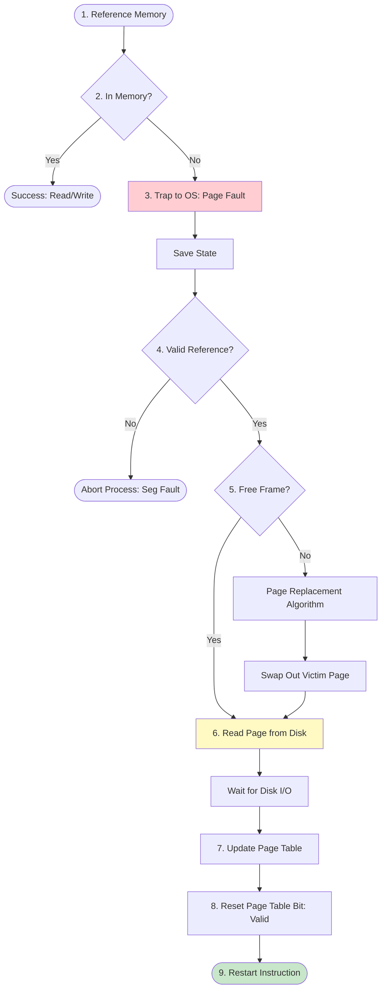

# Demand Paging

## Introduction

**Demand Paging** is a memory management technique where pages are loaded into main memory only when they are requested (demanded) by the executing process. This is the core mechanism behind modern Virtual Memory systems.

*   **Lazy Launcher**: Never swaps a page into memory unless it is needed.
*   **Pager**: The swapper that deals with individual pages.

## The Page Fault Mechanism

When a process tries to access a page that is not currently in memory (marked invalid in the page table), a **Page Fault** trap is triggered. The OS handles this as follows:

## Detailed Steps

1.  **Memory Reference**: The CPU tries to access a logical address.
2.  **Page Table Check**: Hardware looks at the Valid-Invalid bit. 0 = Invalid/Not in RAM.
3.  **Trap**: A hardware interrupt (trap) transfers control to the OS.
4.  **Check Legality**: OS determines if the address was actually valid (part of the process address space) or an illegal access (Segmentation Fault).
5.  **Find Free Frame**: OS looks for an empty physical frame in the `free-frame list`.
    *   If no free frame, run **Page Replacement Algorithm** (select victim, swap out).
6.  **Disk Operation**: Schedule a disk read to bring the missing page into the allocated frame.
7.  **Wait**: The managing process is blocked while disk I/O occurs. Context switch to another process.
8.  **Update Tables**: When disk I/O completes, update the Page Table (set Frame #, Valid bit = 1).
9.  **Restart**: Restore the register state and restart the instruction that caused the trap.

## Advantages & Disadvantages

| Pros | Cons |
| :--- | :--- |
| **Large Virtual Memory**: Programs > Physical RAM | **Latency**: Access time increases on page faults |
| **Multi-programming**: More processes in RAM | **Thrashing**: If Working Set > RAM, excessive swapping |
| **Fast Startup**: Only load needed code | **Complexity**: Hardware support required (TLB, Swap) |

## Performance (Effective Access Time)

The performance depends heavily on the **Page Fault Rate ($p$)**.

$$ \text{EAT} = (1 - p) \times \text{Memory Access} + p \times \text{Page Fault Overhead} $$

*   Memory Access: ~10-100 nanoseconds.
*   Page Fault Overhead: ~5-10 milliseconds (disk seek + latency).

Even a small $p$ (e.g., 0.1%) can degrade performance by factor of 1000!
