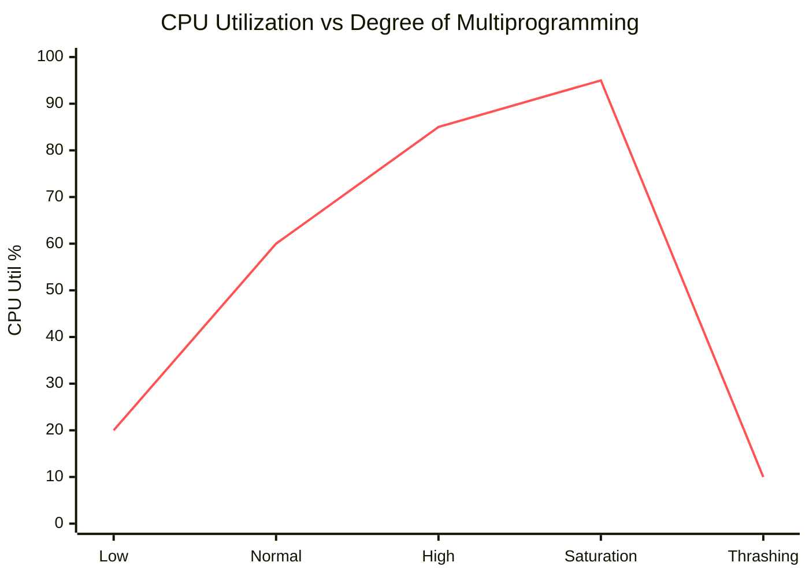

# Thrashing

## Introduction

**Thrashing** occurs when a system spends more time paging (swapping pages in and out of memory) than executing actual processes. It is a state of near-collapse in a virtual memory system.

*   **Symptom**: High disk I/O activity, very low CPU utilization.
*   **Cause**: The total size of the **Working Sets** of all active processes exceeds available physical memory.

## The Thrashing Curve

As the Degree of Multiprogramming (number of processes) increases, CPU utilization initially rises. However, past a certain point (saturation), memory fills up, page faults skyrocket, and the CPU goes idle waiting for disk.

*(Note: Interpretation of chart)*
1.  **Rise**: More processes keep CPU busy.
2.  **Peak**: Optimal utilization.
3.  **Cliff**: Thrashing begins. CPU utilization drops because processes are blocked on Page Faults.

## Working Set Model

To prevent thrashing, the OS must ensure that the sum of the **Working Sets** ($\Sigma WSS_i$) fits in RAM.

$$ D = \sum WSS_i $$

*   If $D > \text{Total Memory}$, Thrashing occurs.
*   **Solution**: Suspend one or more processes (swap them out entirely) to free frames for the others.

## Page Fault Frequency (PFF) Strategy

A dynamic method to prevent thrashing:
1.  Establish "acceptable" Page Fault Rate limits (Upper and Lower bounds).
2.  **If Rate > Upper Bound**: Process needs more frames. (If none available, suspend/swap out).
3.  **If Rate < Lower Bound**: Process has too many frames. Take some away.

## Key Takeaways

1.  **Don't Overcommit**: Adding more processes isn't always better.
2.  **Global vs Local**: Global page replacement (stealing frames from other processes) exacerbates thrashing if not managed.
3.  **NVMe helps but doesn't solve**: Faster SSDs reduce the *penalty* of paging, but thrashing will still kill performance.
