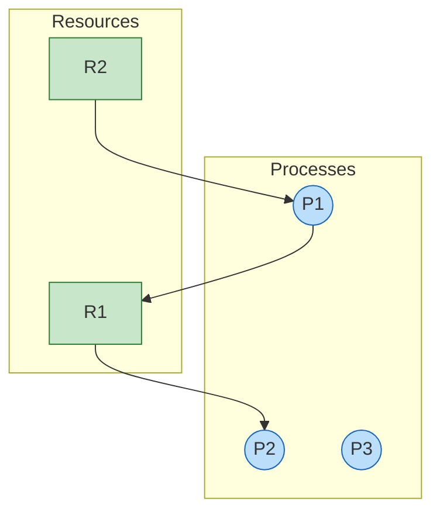
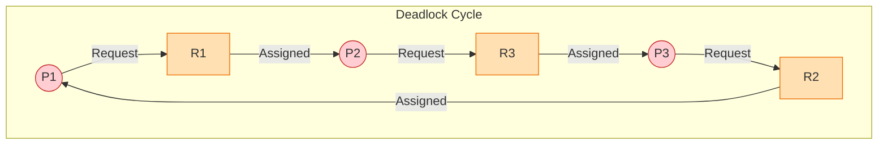

# Resource Allocation Graph (RAG)

## Introduction

A **Resource Allocation Graph (RAG)** is a directed graph used to model the state of a system in terms of processes and resources. It is a powerful tool for visual deadlock detection.

## Graph Components

The graph $G = (V, E)$ consists of:

1.  **Vertices ($V$):**
    *   **Processes ($P = \{P_1, P_2, \dots, P_n\}$)**: Represented by **circles**.
    *   **Resources ($R = \{R_1, R_2, \dots, R_m\}$)**: Represented by **rectangles**.
        *   Dots inside the rectangle represent the number of instances of that resource.

2.  **Edges ($E$):**
    *   **Request Edge ($P_i \to R_j$)**: Process $P_i$ is waiting for an instance of Resource $R_j$.
    *   **Assignment Edge ($R_j \to P_i$)**: An instance of Resource $R_j$ has been allocated to Process $P_i$.

## Visualizing States

### 1. Safe State (No Cycle)

In this scenario, there are no cycles in the graph. The system is safe, and processes can finish execution.

**Analysis**:
1. $P_2$ holds $R_1$. It waits for nothing. It can finish.
2. $P_2$ releases $R_1$.
3. $P_1$ can now acquire $R_1$ (along with held $R_2$). It finishes.
4. $P_1$ releases $R_1$ and $R_2$.

### 2. Deadlock State (Cycle Detected)

If the graph contains a cycle and each resource type has exactly one instance, then a deadlock exists.

**Analysis**:
*   $P_1$ waiting for $R_1$ (held by $P_2$)
*   $P_2$ waiting for $R_3$ (held by $P_3$)
*   $P_3$ waiting for $R_2$ (held by $P_1$)
*   **Cycle**: $P_1 \to R_1 \to P_2 \to R_3 \to P_3 \to R_2 \to P_1$
*   No process can proceed. DEADLOCK.

## Detection Algorithm

1.  Initialize `Work = Available`.
2.  For each process $P_i$, if `Allocation != 0` then `Finish[i] = false`, else `true`.
3.  Find an index $i$ such that:
    *   `Finish[i] == false`
    *   `Request_i <= Work`
4.  If found:
    *   `Work = Work + Allocation_i`
    *   `Finish[i] = true`
    *   Go to step 3.
5.  If no such $i$ exists, and there is some $i$ where `Finish[i] == false`, then the system is in deadlock.

## Key Takeaways

1.  **Cycle Rule**:
    *   Single instance per resource type: Cycle $\iff$ Deadlock.
    *   Multiple instances: Cycle $\implies$ Possibility of Deadlock (not necessary).
2.  **Usage**: RAG is primarily used for theoretical analysis and deadlock detection in systems with few resources.
