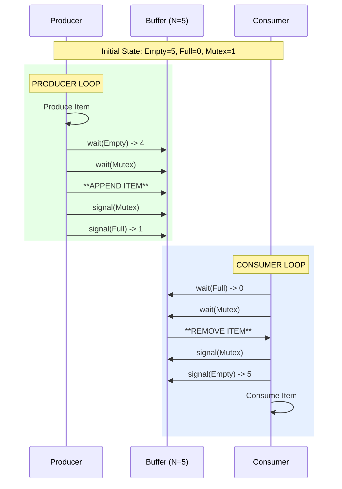

# Semaphores

## Introduction

A **Semaphore** is a synchronization primitive used to control access to strict shared resources by multiple processes. It was proposed by Edsger Dijkstra.

Essentially, it is an integer variable `S` that can only be accessed via two atomic operations: `wait()` (or `P`) and `signal()` (or `V`).

## Operations

### 1. Wait (P)
Conceptually decrements the semaphore value. If the value is negative or zero, the process blocks.

```c
wait(S) {
    while (S <= 0)
        ; // busy wait or block
    S--;
}
```

### 2. Signal (V)
Increments the semaphore value. If there are blocked processes, one is woken up.

```c
signal(S) {
    S++;
}
```

## Types of Semaphores

| Type | Description |
| :--- | :--- |
| **Binary Semaphore** | Value ranges between 0 and 1. Same as a **Mutex** lock. Used for mutual exclusion. |
| **Counting Semaphore** | Value ranges over an unrestricted domain. Used for resource management (e.g., 5 printers). |

## Visualizing Synchronization: Producer-Consumer

An infinite buffer problem managed by two semaphores:
*   `Empty`: Count of empty slots (Initialized to N).
*   `Full`: Count of filled slots (Initialized to 0).
*   `Mutex`: Lock for buffer access (Initialized to 1).



## Correct Implementation Example

Unlike the previous placeholder, this shows actual Semaphore usage in C (POSIX Semaphores) and Python.

### C (POSIX)
```c
#include <semaphore.h>
#include <pthread.h>

sem_t mutex;

void* thread_func(void* arg) {
    sem_wait(&mutex); // P()
    // Critical Section
    sem_post(&mutex); // V()
}

int main() {
    sem_init(&mutex, 0, 1); // Init to 1 (Binary)
    // ... create threads
    sem_destroy(&mutex);
}
```

### Python
```python
import threading
import time

# Counting Semaphore allowing 3 concurrent accesses
pool_sema = threading.Semaphore(value=3)

def worker(id):
    with pool_sema:
        print(f"Thread {id} acquired semaphore")
        time.sleep(1)
        print(f"Thread {id} releasing")

# This will only run 3 at a time, protecting resources
```

## Key Takeaways

1.  **Atomic**: `wait` and `signal` must be atomic (no interrupts).
2.  **Deadlocks**: Improper ordering (e.g., `wait(mutex)` before `wait(full)`) can cause deadlocks.
3.  **Busy Waiting**: Spinlocks busy wait; efficient semaphores use block/wakeup system calls.
