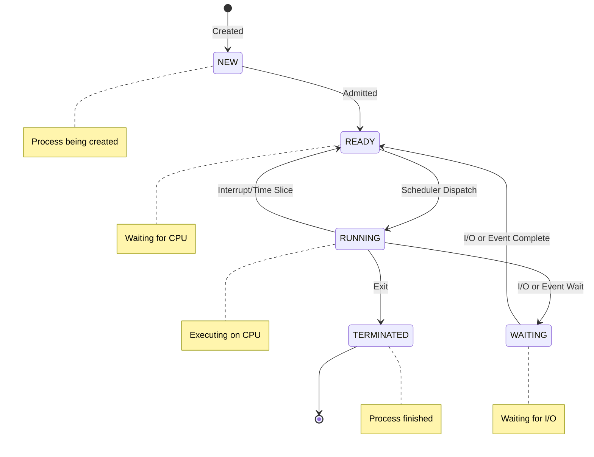
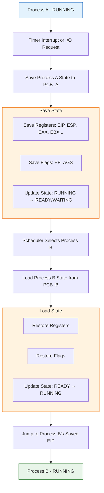

# Process State and PCB

## Process States

A process transitions through different states during its lifecycle. The operating system maintains this state information in the **Process Control Block (PCB)**.

## Five-State Process Model



### State Definitions

**1. NEW (Created)**:
- Process is being created
- Resources are being allocated
- PCB is being initialized

**2. READY**:
- Process is waiting to be assigned to CPU
- Has all resources except CPU
- In ready queue

**3. RUNNING**:
- Instructions are being executed
- Has CPU allocated
- Only one process per CPU core

**4. WAITING (Blocked)**:
- Waiting for some event (I/O completion, signal)
- Cannot use CPU even if available
- In waiting queue

**5. TERMINATED (Exit)**:
- Process has finished execution
- Resources being deallocated
- PCB about to be removed

## State Transitions

```c
// Conceptual state machine
typedef enum {
    STATE_NEW,
    STATE_READY,
    STATE_RUNNING,
    STATE_WAITING,
    STATE_TERMINATED
} ProcessState;

void state_transition(Process *proc, ProcessState new_state) {
    switch (proc->state) {
        case STATE_NEW:
            if (new_state == STATE_READY) {
                // Admitted to ready queue
                enqueue(ready_queue, proc);
            }
            break;

        case STATE_READY:
            if (new_state == STATE_RUNNING) {
                // Scheduler dispatch
                proc->cpu_time_start = get_current_time();
            }
            break;

        case STATE_RUNNING:
            if (new_state == STATE_READY) {
                // Interrupt or time slice expired
                enqueue(ready_queue, proc);
            } else if (new_state == STATE_WAITING) {
                // I/O or event wait
                enqueue(waiting_queue, proc);
            } else if (new_state == STATE_TERMINATED) {
                // Exit
                cleanup_process(proc);
            }
            break;

        case STATE_WAITING:
            if (new_state == STATE_READY) {
                // I/O completion
                enqueue(ready_queue, proc);
            }
            break;
    }

    proc->state = new_state;
}
```

## Process Control Block (PCB)

**Definition**: Data structure containing all information about a process.

### PCB Structure

```c
typedef struct process_control_block {
    // Process identification
    int pid;                    // Process ID
    int ppid;                   // Parent process ID
    int uid;                    // User ID
    int gid;                    // Group ID

    // Process state
    ProcessState state;         // Current state
    int priority;               // Scheduling priority
    int exit_code;              // Exit status

    // CPU scheduling information
    unsigned long cpu_time_used;
    unsigned long time_slice;
    int nice_value;             // Priority adjustment

    // Memory management information
    void *page_table_base;      // Page table pointer
    size_t memory_limit;        // Memory usage limit
    void *stack_pointer;        // Current stack top
    void *heap_pointer;         // Current heap top

    // I/O status information
    struct file *open_files[MAX_FILES];  // File descriptor table
    int num_open_files;
    struct io_request *pending_io;       // Pending I/O operations

    // CPU context (saved during context switch)
    struct cpu_context {
        unsigned long eip;      // Instruction pointer
        unsigned long esp;      // Stack pointer
        unsigned long ebp;      // Base pointer
        unsigned long eax;      // General purpose registers
        unsigned long ebx;
        unsigned long ecx;
        unsigned long edx;
        unsigned long esi;
        unsigned long edi;
        unsigned long eflags;   // CPU flags
    } context;

    // Accounting information
    time_t creation_time;
    time_t start_time;
    unsigned long total_cpu_time;

    // Pointers for process lists
    struct process_control_block *next;
    struct process_control_block *prev;
    struct process_control_block *parent;
    struct process_control_block *children;

} PCB;
```

### PCB in Different Operating Systems

**Linux (task_struct)**:
```c
// Simplified Linux task_struct
struct task_struct {
    volatile long state;        // Process state
    void *stack;                // Kernel stack
    unsigned int flags;         // Process flags
    int prio;                   // Priority
    pid_t pid;                  // Process ID
    pid_t tgid;                 // Thread group ID

    struct task_struct *parent; // Parent process
    struct list_head children;  // Child processes
    struct list_head sibling;   // Sibling processes

    struct mm_struct *mm;       // Memory descriptor
    struct files_struct *files; // Open files
    struct fs_struct *fs;       // Filesystem info
    struct signal_struct *signal; // Signal handlers

    // CPU scheduling
    struct sched_entity se;
    unsigned int policy;
    cpumask_t cpus_allowed;

    // Credentials
    const struct cred *cred;

    // Many more fields...
};
```

**Windows (EPROCESS)**:
```c
// Simplified Windows EPROCESS
typedef struct _EPROCESS {
    KPROCESS Pcb;               // Kernel process block
    EX_PUSH_LOCK ProcessLock;
    LARGE_INTEGER CreateTime;
    LARGE_INTEGER ExitTime;

    EX_RUNDOWN_REF RundownProtect;
    HANDLE UniqueProcessId;
    LIST_ENTRY ActiveProcessLinks;

    SIZE_T QuotaPeak[2];
    SIZE_T VirtualSize;
    SIZE_T PeakVirtualSize;

    MMPTE *PageTablePte;        // Page table
    HANDLE DebugPort;
    PVOID ExceptionPort;

    PHANDLE_TABLE ObjectTable;
    EX_FAST_REF Token;

    // Many more fields...
} EPROCESS;
```

## Context Switching

**Definition**: Saving state of current process and loading state of next process.



**Context Switch Code (Conceptual)**:
```c
void context_switch(PCB *current, PCB *next) {
    // Save current process context
    save_context(&current->context);
    current->state = STATE_READY;

    // Switch page tables (change address space)
    switch_page_table(next->page_table_base);

    // Restore next process context
    restore_context(&next->context);
    next->state = STATE_RUNNING;

    // Jump to next process
    // (done by restore_context restoring EIP)
}

// Assembly helper functions
void save_context(struct cpu_context *ctx) {
    __asm__ volatile (
        "mov %%eax, %0\n"
        "mov %%ebx, %1\n"
        "mov %%ecx, %2\n"
        "mov %%edx, %3\n"
        "mov %%esi, %4\n"
        "mov %%edi, %5\n"
        "mov %%esp, %6\n"
        "mov %%ebp, %7\n"
        "pushf\n"
        "pop %8\n"
        : "=m"(ctx->eax), "=m"(ctx->ebx), "=m"(ctx->ecx),
          "=m"(ctx->edx), "=m"(ctx->esi), "=m"(ctx->edi),
          "=m"(ctx->esp), "=m"(ctx->ebp), "=m"(ctx->eflags)
    );
}

void restore_context(struct cpu_context *ctx) {
    __asm__ volatile (
        "mov %0, %%eax\n"
        "mov %1, %%ebx\n"
        "mov %2, %%ecx\n"
        "mov %3, %%edx\n"
        "mov %4, %%esi\n"
        "mov %5, %%edi\n"
        "mov %6, %%esp\n"
        "mov %7, %%ebp\n"
        "push %8\n"
        "popf\n"
        :
        : "m"(ctx->eax), "m"(ctx->ebx), "m"(ctx->ecx),
          "m"(ctx->edx), "m"(ctx->esi), "m"(ctx->edi),
          "m"(ctx->esp), "m"(ctx->ebp), "m"(ctx->eflags)
    );
}
```

## Process Queues

### Ready Queue

**Structure**: List of processes ready to execute

```c
typedef struct ready_queue {
    PCB *head;
    PCB *tail;
    int count;
} ReadyQueue;

void enqueue_ready(ReadyQueue *queue, PCB *process) {
    process->state = STATE_READY;
    process->next = NULL;

    if (queue->tail) {
        queue->tail->next = process;
    } else {
        queue->head = process;
    }

    queue->tail = process;
    queue->count++;
}

PCB* dequeue_ready(ReadyQueue *queue) {
    if (queue->head == NULL) {
        return NULL;
    }

    PCB *process = queue->head;
    queue->head = process->next;

    if (queue->head == NULL) {
        queue->tail = NULL;
    }

    queue->count--;
    return process;
}
```

### Device Queues

**Purpose**: Processes waiting for specific I/O devices

```c
typedef struct device_queue {
    PCB *waiting_list;
    void *device;
    int device_id;
} DeviceQueue;

// Example: Disk device queue
DeviceQueue disk_queue[NUM_DISKS];

void wait_for_disk(PCB *process, int disk_id) {
    process->state = STATE_WAITING;
    process->next = disk_queue[disk_id].waiting_list;
    disk_queue[disk_id].waiting_list = process;
}

void disk_interrupt_handler(int disk_id) {
    // Disk operation completed
    PCB *process = disk_queue[disk_id].waiting_list;

    if (process) {
        // Remove from device queue
        disk_queue[disk_id].waiting_list = process->next;

        // Move to ready queue
        enqueue_ready(&ready_queue, process);
    }
}
```

## Process State Diagram with Queues

```mermaid
flowchart TD
    NEW[\"NEW\"] -->|\"Long-term Scheduler\"| RQ
    
    subgraph RQ[\"READY QUEUE\"]
        P1[\"P1\"] --> P2[\"P2\"] --> P3[\"P3\"] --> P4[\"P4\"]
    end
    
    RQ -->|\"Short-term Scheduler\"| RUNNING[\"RUNNING\"]
    RUNNING -->|\"Exit\"| TERM[\"TERMINATED\"]
    RUNNING -->|\"I/O or Event Wait\"| DQ
    
    subgraph DQ[\"DEVICE QUEUES\"]
        D0[\"Disk 0: P5 → P7\"]
        D1[\"Disk 1: P6\"]
        T[\"Tape: P8\"]
        N[\"Network: P9 → P10\"]
    end
    
    DQ -->|\"I/O Completion Interrupt\"| RQ
    
    style NEW fill:#e3f2fd,stroke:#1565c0
    style RUNNING fill:#e8f5e9,stroke:#2e7d32
    style TERM fill:#ffebee,stroke:#c62828
    style RQ fill:#fff3e0,stroke:#ef6c00
    style DQ fill:#f3e5f5,stroke:#7b1fa2
```
```

## Python Process State Example

```python
import os
import time
from enum import Enum

class ProcessState(Enum):
    NEW = 1
    READY = 2
    RUNNING = 3
    WAITING = 4
    TERMINATED = 5

class ProcessControlBlock:
    def __init__(self, pid, name):
        self.pid = pid
        self.name = name
        self.state = ProcessState.NEW
        self.priority = 0
        self.cpu_time = 0
        self.memory_allocated = 0
        self.open_files = []
        self.parent_pid = os.getppid()

    def transition_to(self, new_state):
        print(f"Process {self.pid} ({self.name}): {self.state.name} → {new_state.name}")
        self.state = new_state

    def __repr__(self):
        return f"PCB(pid={self.pid}, name={self.name}, state={self.state.name})"

# Simulate process lifecycle
def simulate_process():
    pcb = ProcessControlBlock(os.getpid(), "example_process")

    # NEW → READY
    pcb.transition_to(ProcessState.READY)

    # READY → RUNNING
    time.sleep(0.1)
    pcb.transition_to(ProcessState.RUNNING)

    # RUNNING → WAITING (simulate I/O)
    time.sleep(0.2)
    pcb.transition_to(ProcessState.WAITING)
    print("Waiting for I/O...")
    time.sleep(0.5)

    # WAITING → READY
    pcb.transition_to(ProcessState.READY)

    # READY → RUNNING
    time.sleep(0.1)
    pcb.transition_to(ProcessState.RUNNING)

    # RUNNING → TERMINATED
    time.sleep(0.2)
    pcb.transition_to(ProcessState.TERMINATED)

    return pcb

if __name__ == "__main__":
    result = simulate_process()
    print(f"Final PCB: {result}")
```

## Key Takeaways

1. **Five process states**: NEW, READY, RUNNING, WAITING, TERMINATED
2. **PCB** stores all process information (state, priority, registers, memory, files)
3. **Context switching** saves current process state and loads next process state
4. **Process queues** organize processes (ready queue, device queues)
5. **State transitions** triggered by scheduler, interrupts, I/O operations

## Interview Focus

**Common Questions**:
1. Explain the process state diagram
2. What information is stored in a PCB?
3. What is context switching and why is it expensive?
4. Describe the ready queue and device queues
5. What happens during a context switch?

**Coding Questions**:
- Implement a simple PCB structure
- Simulate process state transitions
- Write code to save and restore CPU context

**Real-World Examples**:
- Linux task_struct structure
- Windows EPROCESS structure
- Context switch overhead measurement
- Process states in task manager/ps command
