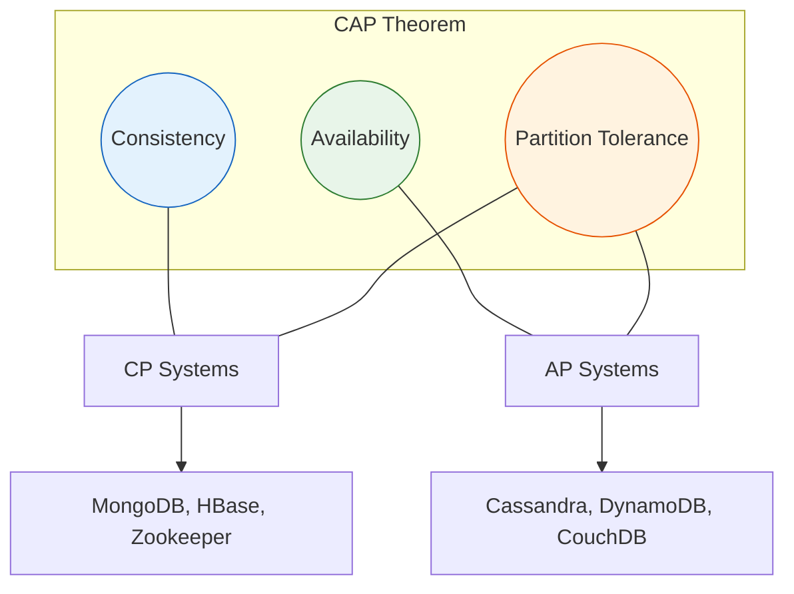
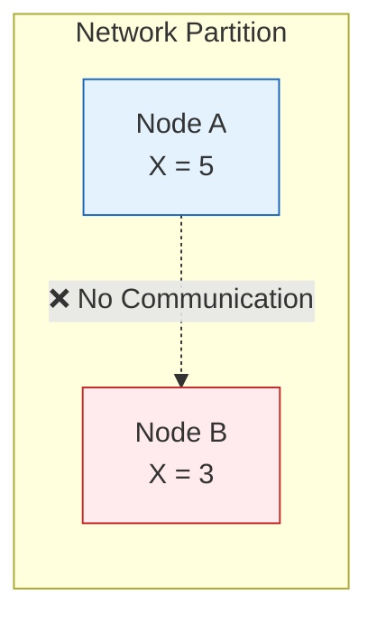

# CAP Theorem & Distributed Systems

The CAP theorem, also known as Brewer's theorem, states that a distributed system can only provide two of the following three guarantees simultaneously.

## Visualization




---

## The Three Guarantees

### Consistency (C)
Every read receives the most recent write or an error.

```
Write X=5 → Node A
Read X from Node B → Returns 5 (latest value)
```

### Availability (A)
Every request receives a response (success or failure), without guarantee that it contains the most recent write.

```
Even if some nodes are down, remaining nodes respond to requests
```

### Partition Tolerance (P)
The system continues to operate despite network partitions (communication breakdowns between nodes).

```
Node A ←✗ Network Partition ✗→ Node B
Both nodes continue to serve requests
```

---

## Why Can't We Have All Three?

During a network partition:



**Choice 1 (CP)**: Refuse to respond until partition heals (sacrifice Availability)
**Choice 2 (AP)**: Respond with potentially stale data (sacrifice Consistency)

You MUST be partition tolerant in distributed systems (network failures are inevitable), so the real choice is between **C** and **A**.

---

## CAP Trade-off Matrix

| System Type | Consistency | Availability | Example Use Case |
|-------------|-------------|--------------|------------------|
| **CP** | Strong | Degraded during partition | Banking, inventory |
| **AP** | Eventual | Always available | Social media feeds |

---

## Topics in This Section

- [2.1 Consistency vs Availability Trade-offs](01_consistency_availability_tradeoffs.md)
- [2.2 Eventual Consistency](02_eventual_consistency.md)
- [2.3 Consensus Algorithms](03_consensus_algorithms.md)

---

## Real-World Examples

### CP Systems (Consistency + Partition Tolerance)
- **MongoDB** (with majority write concern)
- **HBase**
- **Zookeeper**
- **etcd**
- Traditional RDBMS in single-master mode

### AP Systems (Availability + Partition Tolerance)
- **Cassandra** (tunable, but default AP)
- **DynamoDB**
- **CouchDB**
- **Riak**
- DNS

---

## Interview Quick Reference

```
Question: "How do you handle consistency in a distributed system?"

Answer Framework:
1. Identify the consistency requirement (strong vs eventual)
2. Choose appropriate system (CP vs AP)
3. Discuss trade-offs:
   - Strong: Higher latency, lower availability
   - Eventual: Lower latency, higher availability, need conflict resolution
4. Mention specific strategies (read quorums, write quorums, vector clocks)
```
