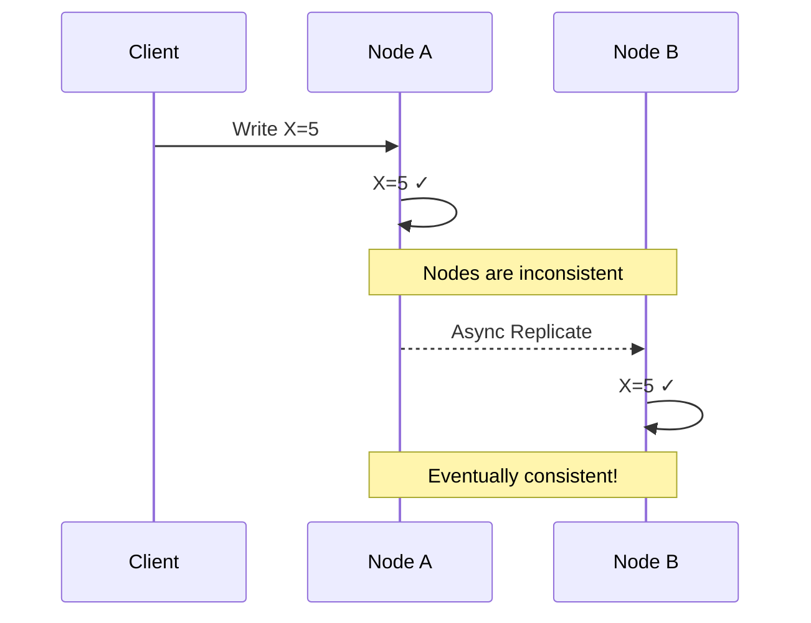

# Eventual Consistency

Eventual consistency is a consistency model where, given enough time without new updates, all replicas will converge to the same value.

## Visualization




---

## Core Concept

```
Write X=5 to Node A at T1
    ↓ (async replication)
Node B receives update at T3

Between T1 and T3, Node A and Node B are inconsistent
After T3, they are consistent again
```

The "eventual" part means:
- There's no guaranteed time bound
- But convergence IS guaranteed (eventually)

---

## Conflict Resolution Strategies

When multiple nodes accept writes during a partition, conflicts can arise.

### 1. Last-Write-Wins (LWW)

The write with the latest timestamp wins.

```python
class LWWRegister:
    def __init__(self):
        self.value = None
        self.timestamp = 0

    def write(self, value, timestamp):
        if timestamp > self.timestamp:
            self.value = value
            self.timestamp = timestamp

    def merge(self, other):
        if other.timestamp > self.timestamp:
            self.value = other.value
            self.timestamp = other.timestamp
```

**Pros**: Simple, deterministic
**Cons**: Data loss (losing write is discarded), clock synchronization issues

**Use case**: Cassandra default, DynamoDB

### 2. Version Vectors / Vector Clocks

Track causality between events to detect concurrent writes.

```python
class VectorClock:
    def __init__(self, node_id):
        self.clock = defaultdict(int)
        self.node_id = node_id

    def increment(self):
        self.clock[self.node_id] += 1

    def merge(self, other_clock):
        for node, count in other_clock.clock.items():
            self.clock[node] = max(self.clock[node], count)

    def is_concurrent(self, other):
        # Neither clock dominates the other
        self_greater = any(self.clock[k] > other.clock.get(k, 0) for k in self.clock)
        other_greater = any(other.clock[k] > self.clock.get(k, 0) for k in other.clock)
        return self_greater and other_greater
```

**Pros**: Detects conflicts, preserves causality
**Cons**: Growing metadata, complexity

**Use case**: Riak, Amazon Dynamo (original)

### 3. CRDTs (Conflict-free Replicated Data Types)

Data structures that automatically merge without conflicts.

#### G-Counter (Grow-only Counter)
```python
class GCounter:
    def __init__(self, node_id):
        self.counts = defaultdict(int)
        self.node_id = node_id

    def increment(self):
        self.counts[self.node_id] += 1

    def value(self):
        return sum(self.counts.values())

    def merge(self, other):
        for node, count in other.counts.items():
            self.counts[node] = max(self.counts[node], count)
```

#### G-Set (Grow-only Set)
```python
class GSet:
    def __init__(self):
        self.elements = set()

    def add(self, element):
        self.elements.add(element)

    def merge(self, other):
        self.elements = self.elements.union(other.elements)
```

#### OR-Set (Observed-Remove Set)
Supports both add and remove operations.

**Use case**: Redis CRDT, Riak data types, collaborative editing

### 4. Application-Level Resolution

Let the application or user resolve conflicts.

```python
class ShoppingCart:
    def merge(self, cart1, cart2):
        # Merge strategy: union of all items, max quantity for each
        merged = {}
        for item, qty in {**cart1, **cart2}.items():
            merged[item] = max(
                cart1.get(item, 0),
                cart2.get(item, 0)
            )
        return merged
```

**Use case**: Shopping carts, collaborative documents (Git)

---

## Read Repair

Fix inconsistencies during read operations.

```
Read request for key X:
1. Query multiple replicas
2. If values differ, determine correct value
3. Write correct value back to stale replicas
4. Return correct value to client
```

```python
class ReadRepairClient:
    def read(self, key):
        responses = []
        for replica in self.replicas:
            responses.append(replica.read(key))

        # Find the most recent value
        latest = max(responses, key=lambda r: r.timestamp)

        # Repair stale replicas
        for replica, response in zip(self.replicas, responses):
            if response.timestamp < latest.timestamp:
                replica.write(key, latest.value, latest.timestamp)

        return latest.value
```

---

## Anti-Entropy (Merkle Trees)

Background process to detect and fix inconsistencies.

```
Node A                    Node B
┌─────────────────┐      ┌─────────────────┐
│   Merkle Tree   │      │   Merkle Tree   │
│                 │      │                 │
│       H         │      │       H'        │
│      / \        │      │      / \        │
│    H1   H2      │      │    H1   H2'     │
│   / \   / \     │      │   / \   / \     │
│  a   b c   d    │      │  a   b c   d'   │
└─────────────────┘      └─────────────────┘

1. Compare root hashes (H ≠ H')
2. Compare children (H1 = H1, H2 ≠ H2')
3. Drill down to find d ≠ d'
4. Sync only the differing data
```

**Use case**: Cassandra, DynamoDB, BitTorrent

---

## Consistency Windows

The time between a write and when all replicas have the update.

```
Factors affecting consistency window:
- Network latency between replicas
- Replication strategy (sync vs async)
- System load
- Network partitions
```

### Measuring Consistency

```python
class ConsistencyMonitor:
    def measure_staleness(self, key):
        primary_version = self.primary.get_version(key)
        replica_version = self.replica.get_version(key)

        staleness = primary_version - replica_version
        latency = time.now() - self.replica.last_sync_time(key)

        return {
            'version_lag': staleness,
            'time_lag_ms': latency
        }
```

---

## Interview Talking Points

1. **Trade-offs**: Eventual consistency enables higher availability and lower latency
2. **Conflict resolution**: Know LWW, vector clocks, and CRDTs
3. **Use cases**: Social media, shopping carts, analytics
4. **NOT suitable for**: Banking, inventory, anything requiring strong consistency
5. **Monitoring**: Track replication lag, consistency windows
