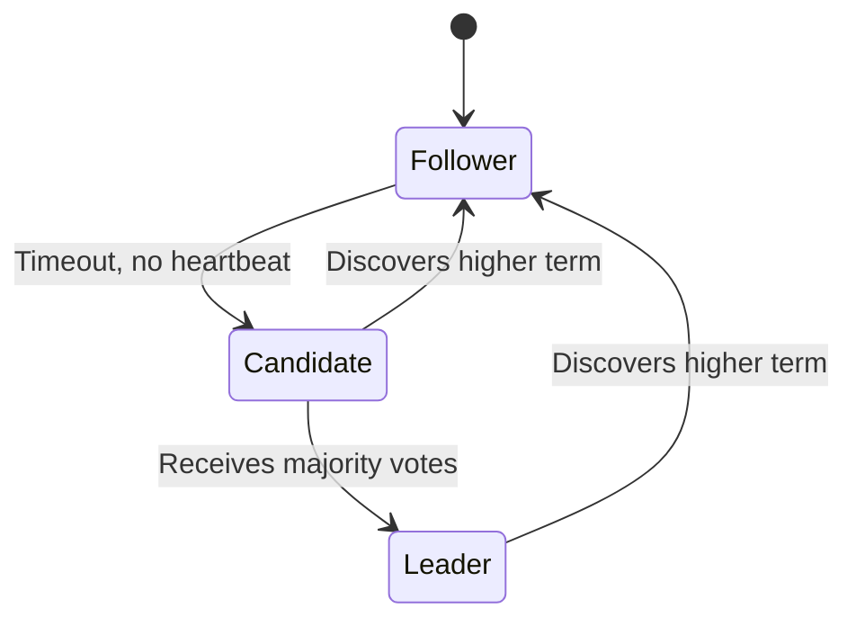

# Consensus Algorithms

Consensus algorithms enable distributed systems to agree on a single value or sequence of values, even in the presence of failures.

## Visualization (Raft States)




---

## Why Consensus?

Distributed systems need agreement on:
- **Leader election**: Which node is the primary?
- **Atomic broadcast**: Ensure all nodes see the same sequence of operations
- **Distributed locks**: Which process holds the lock?
- **Configuration management**: What's the current cluster state?

---

## The Consensus Problem

```
Multiple nodes must agree on a value, satisfying:

1. Agreement: All non-faulty nodes decide on the same value
2. Validity: The decided value was proposed by some node
3. Termination: All non-faulty nodes eventually decide
```

---

## Paxos

The foundational consensus algorithm, known for being difficult to understand.

### Roles
- **Proposers**: Propose values
- **Acceptors**: Vote on proposals
- **Learners**: Learn the decided value

### Two Phases

**Phase 1: Prepare**
```
Proposer → Acceptors: PREPARE(n)
  "I want to make a proposal with number n"

Acceptors → Proposer: PROMISE(n, accepted_value)
  "I promise not to accept proposals < n"
  "Here's what I've already accepted (if any)"
```

**Phase 2: Accept**
```
Proposer → Acceptors: ACCEPT(n, value)
  "Please accept this value with proposal number n"

Acceptors → Proposer: ACCEPTED(n)
  "I've accepted proposal n"
```

### Quorum Requirement
Need majority (N/2 + 1) of acceptors to agree.

```
With 5 acceptors:
- Need 3 to promise in Phase 1
- Need 3 to accept in Phase 2
```

### Paxos Issues
- Complex to implement correctly
- Multiple rounds may be needed
- Livelock possible (competing proposers)

---

## Raft

Designed to be understandable, widely used in practice.

### Key Concepts
- **Leader-based**: One leader handles all client requests
- **Log replication**: Leader replicates log entries to followers
- **Terms**: Logical time periods, each with at most one leader

### Node States
```
                    times out,
                    starts election
     ┌──────────────────────────────────────┐
     ↓                                      │
┌──────────┐      receives votes    ┌───────┴────┐
│ Follower │ ────────────────────→  │ Candidate  │
└──────────┘      from majority     └────────────┘
     ↑                                      │
     │                                      │
     │              discovers current       │
     │              leader or new term      ↓
     │            ┌─────────────────────────┘
     │            ↓
     │      ┌──────────┐
     └───── │  Leader  │
   steps    └──────────┘
   down
```

### Leader Election

```
1. Follower doesn't hear from leader (heartbeat timeout)
2. Becomes Candidate, increments term
3. Votes for itself, requests votes from others
4. If receives majority: becomes Leader
5. If discovers higher term: reverts to Follower
```

```python
class RaftNode:
    def __init__(self, node_id, peers):
        self.node_id = node_id
        self.peers = peers
        self.state = 'follower'
        self.current_term = 0
        self.voted_for = None
        self.log = []

    def start_election(self):
        self.state = 'candidate'
        self.current_term += 1
        self.voted_for = self.node_id
        votes = 1  # Vote for self

        for peer in self.peers:
            response = peer.request_vote(
                self.current_term,
                self.node_id,
                len(self.log) - 1,
                self.log[-1].term if self.log else 0
            )
            if response.vote_granted:
                votes += 1

        if votes > len(self.peers) / 2:
            self.become_leader()

    def request_vote(self, term, candidate_id, last_log_index, last_log_term):
        if term < self.current_term:
            return VoteResponse(term=self.current_term, vote_granted=False)

        if self.voted_for is None or self.voted_for == candidate_id:
            if self.log_is_up_to_date(last_log_index, last_log_term):
                self.voted_for = candidate_id
                return VoteResponse(term=self.current_term, vote_granted=True)

        return VoteResponse(term=self.current_term, vote_granted=False)
```

### Log Replication

```
Client → Leader: Write("x = 5")

Leader:
1. Append to local log (uncommitted)
2. Send AppendEntries RPC to followers
3. Wait for majority acknowledgment
4. Commit entry
5. Apply to state machine
6. Respond to client
```

```
Leader Log:  [1:a] [2:b] [3:c] [4:d]
                                 ↑ commit index

Follower 1:  [1:a] [2:b] [3:c]        ← needs replication
Follower 2:  [1:a] [2:b] [3:c] [4:d]  ← up to date
Follower 3:  [1:a] [2:b]              ← needs replication
```

### Safety Guarantees
- Election Safety: At most one leader per term
- Leader Append-Only: Leader never overwrites log
- Log Matching: Same index+term → same command
- Leader Completeness: Committed entries in future leaders' logs
- State Machine Safety: Applied entries never conflict

---

## Comparison

| Aspect | Paxos | Raft |
|--------|-------|------|
| Understandability | Complex | Simple |
| Leader | Multi-Paxos has leader | Always leader-based |
| Implementation | Error-prone | Straightforward |
| Performance | Similar | Similar |
| Real-world use | Chubby, Spanner | etcd, CockroachDB, TiKV |

---

## Practical Implementations

### etcd (Raft)
```go
// Example: Using etcd for leader election
import "go.etcd.io/etcd/client/v3/concurrency"

session, _ := concurrency.NewSession(client)
election := concurrency.NewElection(session, "/my-election/")

// Campaign to become leader
election.Campaign(ctx, "node-1")

// As leader, do work...

// Resign leadership
election.Resign(ctx)
```

### ZooKeeper (ZAB - Zookeeper Atomic Broadcast)
```java
// Example: Leader election with ZooKeeper
LeaderSelector selector = new LeaderSelector(client, "/leader", new LeaderSelectorListener() {
    @Override
    public void takeLeadership(CuratorFramework client) throws Exception {
        // This node is now the leader
        // Do leader work here
        // Method returns when this node should give up leadership
    }
});
selector.start();
```

---

## Byzantine Fault Tolerance

Standard consensus assumes nodes fail by crashing (crash-fault tolerance).
Byzantine fault tolerance handles nodes that behave maliciously.

### PBFT (Practical Byzantine Fault Tolerance)
- Tolerates up to f faulty nodes with 3f+1 total nodes
- Three-phase protocol: Pre-prepare, Prepare, Commit
- Used in blockchain systems

```
With 4 nodes: Can tolerate 1 Byzantine node
With 7 nodes: Can tolerate 2 Byzantine nodes
```

---

## Interview Talking Points

1. **When to use**: Leader election, distributed locks, configuration management
2. **Raft vs Paxos**: Raft is easier to implement, same guarantees
3. **Trade-offs**: Consensus adds latency (multiple round trips)
4. **Failure tolerance**: N nodes can tolerate (N-1)/2 failures
5. **Real systems**: etcd (Raft), ZooKeeper (ZAB), Consul (Raft)
