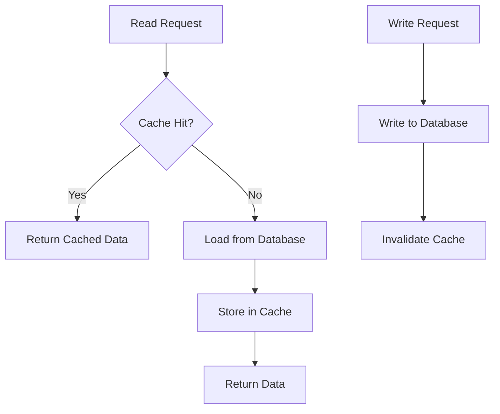

# Caching Strategies

Different caching strategies suit different use cases. Understanding when to use each is crucial for system design.

---

## Cache-Aside (Lazy Loading)

Application manages the cache. Most common pattern.

```
Read:
1. Check cache for data
2. If hit: return cached data
3. If miss: read from database, store in cache, return

Write:
1. Write to database
2. Invalidate (delete) cache entry
```

### Flowchart




```python
class CacheAsideService:
    def __init__(self, cache, db):
        self.cache = cache
        self.db = db

    def get_user(self, user_id):
        # Try cache first
        cached = self.cache.get(f"user:{user_id}")
        if cached:
            return cached

        # Cache miss: load from DB
        user = self.db.get_user(user_id)
        if user:
            self.cache.set(f"user:{user_id}", user, ttl=3600)
        return user

    def update_user(self, user_id, data):
        # Update database
        self.db.update_user(user_id, data)
        # Invalidate cache
        self.cache.delete(f"user:{user_id}")
```

**Pros**:
- Simple to implement
- Only caches data that's actually requested
- Cache failures don't break the system

**Cons**:
- First request always slow (cache miss)
- Potential for stale data between update and next read
- Application complexity (manages cache logic)

**Use case**: Most read-heavy workloads

---

## Read-Through

Cache sits in front of database. Cache handles loading.

```
Read:
1. Request data from cache
2. Cache checks if data exists
3. If miss: cache loads from database automatically
4. Return data

Application never talks directly to database for reads.
```

```python
class ReadThroughCache:
    def __init__(self, db):
        self.cache = {}
        self.db = db

    def get(self, key):
        if key not in self.cache:
            # Cache handles the loading
            self.cache[key] = self.db.get(key)
        return self.cache[key]
```

**Pros**:
- Simpler application code (cache handles loading)
- Consistent caching behavior

**Cons**:
- Cache implementation is more complex
- First request still slow

**Use case**: When you want cache to be the single point of access

---

## Write-Through

Writes go through cache to database synchronously.

```
Write:
1. Write to cache
2. Cache writes to database (synchronously)
3. Return success when both complete
```

```python
class WriteThroughCache:
    def __init__(self, db):
        self.cache = {}
        self.db = db

    def write(self, key, value):
        # Write to database first (or simultaneously)
        self.db.write(key, value)
        # Then update cache
        self.cache[key] = value
```

**Pros**:
- Cache always has latest data
- No stale data issues
- Read-after-write consistency

**Cons**:
- Higher write latency (two writes)
- Cache may fill with rarely-read data

**Use case**: When read-after-write consistency is critical

---

## Write-Behind (Write-Back)

Writes go to cache immediately, database updated asynchronously.

```
Write:
1. Write to cache
2. Return success immediately
3. Asynchronously write to database (batch or delayed)
```

```python
class WriteBehindCache:
    def __init__(self, db):
        self.cache = {}
        self.write_queue = Queue()
        self.db = db
        self.start_background_writer()

    def write(self, key, value):
        # Write to cache immediately
        self.cache[key] = value
        # Queue for async database write
        self.write_queue.put((key, value))
        # Return immediately

    def start_background_writer(self):
        def writer():
            while True:
                batch = []
                while not self.write_queue.empty() and len(batch) < 100:
                    batch.append(self.write_queue.get())
                if batch:
                    self.db.batch_write(batch)
                time.sleep(0.1)

        Thread(target=writer, daemon=True).start()
```

**Pros**:
- Very low write latency
- Batching improves database efficiency
- Handles write spikes gracefully

**Cons**:
- Risk of data loss if cache fails before DB write
- Complexity in handling failures
- Eventual consistency

**Use case**: Write-heavy workloads, analytics, logging

---

## Refresh-Ahead

Proactively refresh cache before expiration.

```
1. Cache entry has TTL
2. Before expiration (e.g., at 80% of TTL), refresh in background
3. Subsequent reads get fresh data without waiting
```

```python
class RefreshAheadCache:
    def __init__(self, db, ttl=3600, refresh_threshold=0.8):
        self.cache = {}
        self.timestamps = {}
        self.db = db
        self.ttl = ttl
        self.refresh_threshold = refresh_threshold

    def get(self, key):
        now = time.time()
        if key in self.cache:
            age = now - self.timestamps[key]
            # If approaching expiration, refresh in background
            if age > self.ttl * self.refresh_threshold:
                self.refresh_async(key)
            return self.cache[key]
        return self.load(key)

    def refresh_async(self, key):
        Thread(target=self.load, args=(key,)).start()

    def load(self, key):
        value = self.db.get(key)
        self.cache[key] = value
        self.timestamps[key] = time.time()
        return value
```

**Pros**:
- Reduces cache miss latency for hot data
- Keeps frequently accessed data fresh

**Cons**:
- More complex
- May refresh data that won't be read again
- More database load

**Use case**: Predictable access patterns, time-sensitive data

---

## Strategy Comparison

| Strategy | Write Latency | Read Latency | Data Freshness | Complexity |
|----------|---------------|--------------|----------------|------------|
| Cache-Aside | Low (DB only) | Variable | May be stale | Low |
| Read-Through | Low (DB only) | Variable | May be stale | Medium |
| Write-Through | High (cache+DB) | Low | Always fresh | Medium |
| Write-Behind | Very Low | Low | Eventual | High |
| Refresh-Ahead | Low | Very Low | Fresh for hot data | High |

---

## Hybrid Approaches

Real systems often combine strategies:

```python
class HybridCache:
    """
    Write-through for critical data
    Cache-aside for less critical data
    Write-behind for analytics
    """
    def __init__(self, cache, db):
        self.cache = cache
        self.db = db
        self.analytics_queue = Queue()

    def update_user_profile(self, user_id, data):
        # Write-through: profile must be consistent
        self.db.update_user(user_id, data)
        self.cache.set(f"user:{user_id}", data)

    def get_product(self, product_id):
        # Cache-aside: products change less frequently
        cached = self.cache.get(f"product:{product_id}")
        if cached:
            return cached
        product = self.db.get_product(product_id)
        self.cache.set(f"product:{product_id}", product, ttl=3600)
        return product

    def log_page_view(self, page_id, user_id):
        # Write-behind: analytics can be eventual
        self.analytics_queue.put({'page': page_id, 'user': user_id})
```

---

## Interview Tips

1. **Know the trade-offs**: Each strategy has pros/cons
2. **Match to use case**: Read-heavy vs write-heavy, consistency requirements
3. **Consider failures**: What happens if cache dies?
4. **Discuss invalidation**: How and when to expire cached data
