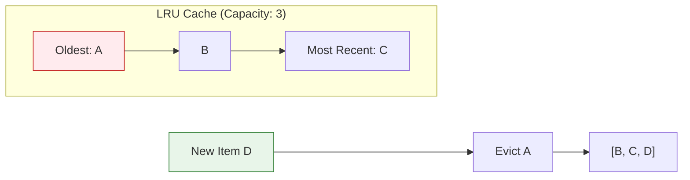

# Cache Eviction Policies

When cache is full, we need to decide which entries to remove. The eviction policy significantly impacts cache hit ratio.

## Visualization (LRU)




---

## Common Eviction Policies

### LRU (Least Recently Used)

Evict the entry that hasn't been accessed for the longest time.

```
Cache (capacity 3): [A, B, C] (C is most recent)

Access D:
1. Cache is full, evict A (least recent)
2. Add D
3. Cache: [B, C, D]

Access B:
1. B moves to most recent position
2. Cache: [C, D, B]
```

**Implementation**:
```python
from collections import OrderedDict

class LRUCache:
    def __init__(self, capacity):
        self.capacity = capacity
        self.cache = OrderedDict()

    def get(self, key):
        if key not in self.cache:
            return None
        # Move to end (most recently used)
        self.cache.move_to_end(key)
        return self.cache[key]

    def put(self, key, value):
        if key in self.cache:
            self.cache.move_to_end(key)
        self.cache[key] = value
        if len(self.cache) > self.capacity:
            # Remove oldest (first item)
            self.cache.popitem(last=False)
```

**Pros**: Simple, effective for most workloads
**Cons**: Doesn't consider frequency (one-time scan pollutes cache)
**Use case**: General-purpose caching (Redis, Memcached default)

---

### LFU (Least Frequently Used)

Evict the entry with the lowest access count.

```
Cache: {A: 5 hits, B: 2 hits, C: 10 hits}

Add D (cache full):
1. Evict B (lowest frequency)
2. Cache: {A: 5, C: 10, D: 1}
```

**Implementation**:
```python
from collections import defaultdict

class LFUCache:
    def __init__(self, capacity):
        self.capacity = capacity
        self.cache = {}           # key -> value
        self.freq = {}            # key -> frequency
        self.freq_to_keys = defaultdict(OrderedDict)  # freq -> keys (LRU order)
        self.min_freq = 0

    def get(self, key):
        if key not in self.cache:
            return None
        self._update_freq(key)
        return self.cache[key]

    def put(self, key, value):
        if self.capacity <= 0:
            return

        if key in self.cache:
            self.cache[key] = value
            self._update_freq(key)
            return

        if len(self.cache) >= self.capacity:
            # Evict least frequent (and least recent among ties)
            evict_key, _ = self.freq_to_keys[self.min_freq].popitem(last=False)
            del self.cache[evict_key]
            del self.freq[evict_key]

        self.cache[key] = value
        self.freq[key] = 1
        self.freq_to_keys[1][key] = None
        self.min_freq = 1

    def _update_freq(self, key):
        f = self.freq[key]
        del self.freq_to_keys[f][key]
        if not self.freq_to_keys[f] and f == self.min_freq:
            self.min_freq += 1
        self.freq[key] = f + 1
        self.freq_to_keys[f + 1][key] = None
```

**Pros**: Better for skewed access patterns
**Cons**: Doesn't adapt quickly to changing patterns
**Use case**: Content with stable popularity (videos, articles)

---

### FIFO (First In, First Out)

Evict the oldest entry (regardless of access pattern).

```
Cache: [A (oldest), B, C (newest)]

Add D:
1. Evict A (first in)
2. Cache: [B, C, D]
```

**Pros**: Very simple, predictable
**Cons**: Ignores access patterns, poor hit ratio
**Use case**: Simple scenarios, TTL-based caches

---

### Random Replacement

Evict a random entry.

**Pros**: No overhead tracking access patterns
**Cons**: Unpredictable, may evict hot data
**Use case**: When simplicity matters more than hit ratio

---

### ARC (Adaptive Replacement Cache)

Balances between LRU and LFU dynamically.

```
Maintains four lists:
- T1: Recently accessed once (like LRU)
- T2: Recently accessed more than once (like LFU)
- B1: Ghost entries recently evicted from T1
- B2: Ghost entries recently evicted from T2

Dynamically adjusts balance based on hit patterns.
```

**Pros**: Adapts to workload, scan-resistant
**Cons**: Complex, patented by IBM
**Use case**: Database buffer pools (PostgreSQL)

---

### W-TinyLFU (Caffeine)

Window + LFU with small footprint.

```
1. New entries go to "Window" (small LRU)
2. Winners from Window compete with main cache (LFU)
3. Uses Count-Min Sketch for frequency (low memory)
```

**Pros**: Best hit ratio for many workloads, memory efficient
**Cons**: More complex
**Use case**: Caffeine cache (Java), high-performance caching

---

## TTL (Time-To-Live)

Not an eviction policy, but used alongside them.

```python
class TTLCache:
    def __init__(self):
        self.cache = {}
        self.expiry = {}

    def set(self, key, value, ttl_seconds):
        self.cache[key] = value
        self.expiry[key] = time.time() + ttl_seconds

    def get(self, key):
        if key not in self.cache:
            return None
        if time.time() > self.expiry[key]:
            del self.cache[key]
            del self.expiry[key]
            return None
        return self.cache[key]
```

### Passive vs Active Expiration

**Passive**: Check TTL on access, evict if expired
**Active**: Background thread periodically scans for expired entries

```python
# Redis-style: Passive + Active
class RedisStyleTTL:
    def __init__(self):
        self.cache = {}
        self.expiry = {}
        self.start_background_cleaner()

    def get(self, key):
        # Passive: check on access
        if key in self.expiry and time.time() > self.expiry[key]:
            self.delete(key)
            return None
        return self.cache.get(key)

    def start_background_cleaner(self):
        # Active: periodic cleanup
        def cleaner():
            while True:
                time.sleep(1)
                now = time.time()
                # Sample 20 random keys
                sample = random.sample(list(self.expiry.keys()), min(20, len(self.expiry)))
                for key in sample:
                    if self.expiry.get(key, float('inf')) < now:
                        self.delete(key)
```

---

## Comparison

| Policy | Hit Ratio | Scan Resistance | Complexity | Memory Overhead |
|--------|-----------|-----------------|------------|-----------------|
| LRU | Good | Poor | Low | Low |
| LFU | Good | Good | Medium | Medium |
| FIFO | Poor | Poor | Very Low | Very Low |
| Random | Poor | Medium | Very Low | Very Low |
| ARC | Excellent | Excellent | High | High |
| W-TinyLFU | Excellent | Excellent | Medium | Low |

---

## Choosing an Eviction Policy

```
Default choice: LRU
  - Simple, works well for most cases
  - Supported by Redis, Memcached

Skewed access patterns: LFU
  - Some items much more popular than others
  - Video/content platforms

High-performance Java: W-TinyLFU (Caffeine)
  - Best overall hit ratio
  - Low memory overhead

Database buffer pools: ARC
  - Handles both recency and frequency
  - Scan-resistant
```

---

## Interview Tips

1. **LRU is the default answer**: Simple and effective
2. **Know the trade-offs**: LRU vs LFU for different patterns
3. **Mention TTL**: Almost always used alongside eviction policy
4. **Be aware of scan resistance**: LRU's weakness with one-time scans
