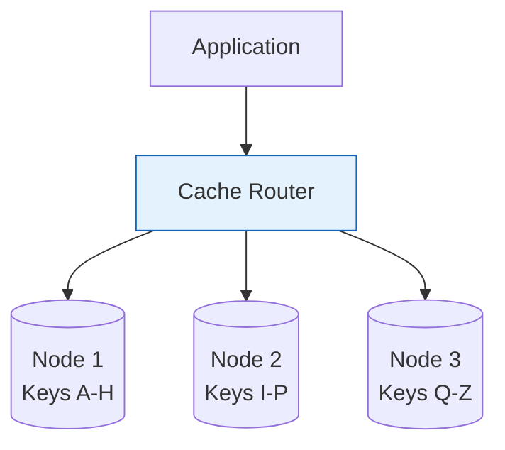

# Distributed Caching

Distributed caching spreads cached data across multiple nodes, enabling scalability beyond a single machine's memory.

## Visualization




---

## Why Distributed Cache?

```
Single Node Cache:
- Limited to one machine's memory (e.g., 64GB)
- Single point of failure
- Can't scale horizontally

Distributed Cache:
- Aggregate memory of multiple nodes (e.g., 64GB × 10 = 640GB)
- Fault tolerant (replication)
- Horizontally scalable
```

---

## Popular Distributed Caches

### Redis

In-memory data store with rich data structures.

```python
import redis

r = redis.Redis(host='localhost', port=6379)

# String
r.set('user:1234', json.dumps(user_data), ex=3600)  # TTL 1 hour
user = json.loads(r.get('user:1234'))

# Hash
r.hset('user:1234', mapping={'name': 'John', 'email': 'john@example.com'})
name = r.hget('user:1234', 'name')

# List
r.lpush('queue:notifications', json.dumps(notification))
notification = r.rpop('queue:notifications')

# Set
r.sadd('user:1234:followers', 'user:5678', 'user:9012')
followers = r.smembers('user:1234:followers')

# Sorted Set (for leaderboards)
r.zadd('leaderboard', {'player1': 100, 'player2': 85, 'player3': 92})
top_players = r.zrevrange('leaderboard', 0, 9, withscores=True)
```

**Features**: Rich data structures, pub/sub, Lua scripting, persistence
**Use case**: Session storage, caching, real-time leaderboards, rate limiting

### Memcached

Simple key-value cache, optimized for simplicity.

```python
import memcache

mc = memcache.Client(['cache1:11211', 'cache2:11211'])

mc.set('user:1234', user_data, time=3600)
user = mc.get('user:1234')

# Multi-get (batch)
users = mc.get_multi(['user:1', 'user:2', 'user:3'])
```

**Features**: Simple, multi-threaded, efficient memory usage
**Use case**: Simple caching, when you don't need Redis features

### Comparison

| Feature | Redis | Memcached |
|---------|-------|-----------|
| Data structures | Rich (strings, hashes, lists, sets, sorted sets) | Strings only |
| Persistence | Optional (RDB, AOF) | None |
| Replication | Built-in | None |
| Clustering | Redis Cluster | Client-side |
| Memory efficiency | Good | Better (no overhead for features) |
| Threading | Single-threaded (with I/O threads in 6.0+) | Multi-threaded |

---

## Distribution Strategies

### Consistent Hashing

Distributes keys across nodes, minimizing redistribution when nodes change.

```python
class ConsistentHashRing:
    def __init__(self, nodes, virtual_nodes=100):
        self.ring = SortedDict()
        self.nodes = set()

        for node in nodes:
            self.add_node(node, virtual_nodes)

    def add_node(self, node, virtual_nodes=100):
        self.nodes.add(node)
        for i in range(virtual_nodes):
            key = self._hash(f"{node}:{i}")
            self.ring[key] = node

    def remove_node(self, node):
        self.nodes.remove(node)
        keys_to_remove = [k for k, v in self.ring.items() if v == node]
        for k in keys_to_remove:
            del self.ring[k]

    def get_node(self, key):
        if not self.ring:
            return None
        hash_key = self._hash(key)
        # Find first node clockwise
        idx = self.ring.bisect_left(hash_key)
        if idx == len(self.ring):
            idx = 0
        return self.ring.peekitem(idx)[1]

    def _hash(self, key):
        return int(hashlib.md5(key.encode()).hexdigest(), 16)
```

### Redis Cluster

Built-in sharding with 16384 hash slots.

```
Hash Slots: 0-16383

Node A: slots 0-5460
Node B: slots 5461-10922
Node C: slots 10923-16383

Key placement: slot = CRC16(key) % 16384
```

```python
from redis.cluster import RedisCluster

rc = RedisCluster(host='node1', port=6379)

# Automatically routes to correct node
rc.set('user:1234', 'data')
value = rc.get('user:1234')
```

---

## Cache Patterns for Distributed Systems

### Cache Stampede Prevention

When cache expires, many requests hit database simultaneously.

```python
class StampedePreventionCache:
    def __init__(self, cache, db):
        self.cache = cache
        self.db = db
        self.locks = {}

    def get(self, key):
        # Try cache
        value = self.cache.get(key)
        if value:
            return value

        # Acquire lock to prevent stampede
        lock = self.get_or_create_lock(key)
        if lock.acquire(blocking=False):
            try:
                # Double-check cache
                value = self.cache.get(key)
                if value:
                    return value
                # Load from DB
                value = self.db.get(key)
                self.cache.set(key, value, ttl=3600)
                return value
            finally:
                lock.release()
        else:
            # Another request is loading, wait and retry
            time.sleep(0.1)
            return self.get(key)
```

### Distributed Lock with Redis

```python
import redis
import uuid

class RedisLock:
    def __init__(self, redis_client, key, ttl=10):
        self.redis = redis_client
        self.key = f"lock:{key}"
        self.ttl = ttl
        self.token = str(uuid.uuid4())

    def acquire(self):
        # SET NX (only if not exists) with TTL
        return self.redis.set(self.key, self.token, nx=True, ex=self.ttl)

    def release(self):
        # Only release if we own the lock (Lua for atomicity)
        script = """
        if redis.call('get', KEYS[1]) == ARGV[1] then
            return redis.call('del', KEYS[1])
        else
            return 0
        end
        """
        self.redis.eval(script, 1, self.key, self.token)
```

### Hot Key Mitigation

When one key receives disproportionate traffic.

```python
class HotKeyCache:
    def __init__(self, redis_clients):
        self.clients = redis_clients  # Multiple Redis nodes

    def set_hot_key(self, key, value, replicas=3):
        # Replicate hot key to multiple nodes
        for i in range(replicas):
            replica_key = f"{key}:replica:{i}"
            random.choice(self.clients).set(replica_key, value)

    def get_hot_key(self, key, replicas=3):
        # Randomly pick a replica
        replica_num = random.randint(0, replicas - 1)
        replica_key = f"{key}:replica:{replica_num}"
        return random.choice(self.clients).get(replica_key)
```

---

## High Availability

### Redis Sentinel

Automatic failover for Redis master-slave setup.

```
┌─────────────┐
│  Sentinel 1 │──┐
└─────────────┘  │
                 │  Monitor & Failover
┌─────────────┐  │
│  Sentinel 2 │──┤
└─────────────┘  │
                 │
┌─────────────┐  │
│  Sentinel 3 │──┘
└─────────────┘
       │
       ↓
┌─────────────┐     ┌─────────────┐
│   Master    │────→│   Slave     │
└─────────────┘     └─────────────┘
```

### Redis Cluster Replication

Each master has replicas.

```
Master A ──→ Replica A1, Replica A2
Master B ──→ Replica B1, Replica B2
Master C ──→ Replica C1, Replica C2
```

---

## Cache Warming

Pre-populate cache before traffic hits.

```python
class CacheWarmer:
    def __init__(self, cache, db):
        self.cache = cache
        self.db = db

    def warm_hot_data(self):
        # Load most popular items
        hot_items = self.db.query("""
            SELECT id, data FROM items
            ORDER BY view_count DESC
            LIMIT 10000
        """)

        for item in hot_items:
            self.cache.set(f"item:{item['id']}", item['data'], ttl=3600)

    def warm_on_deploy(self):
        # Pre-warm during deployment (before traffic switch)
        self.warm_hot_data()
        print("Cache warmed successfully")
```

---

## Interview Talking Points

1. **Redis vs Memcached**: Features vs simplicity
2. **Distribution**: Consistent hashing, Redis Cluster
3. **Common problems**: Stampede, hot keys, cache warming
4. **High availability**: Sentinel, Cluster replication
5. **Monitoring**: Hit ratio, memory usage, latency
