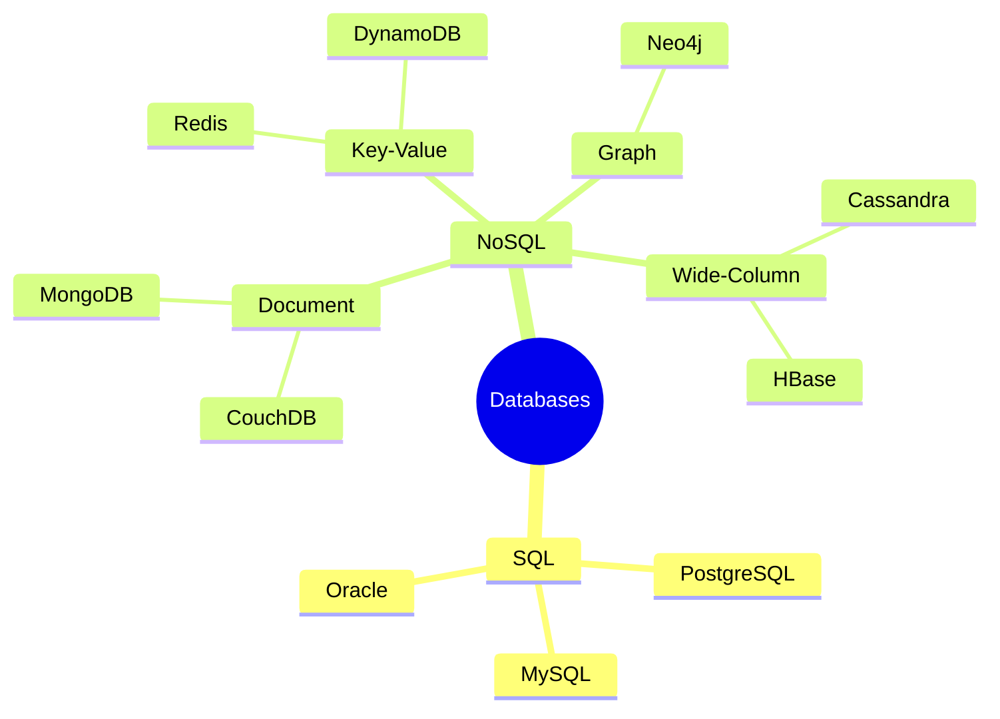

# SQL vs NoSQL

Choosing between SQL and NoSQL databases is one of the most fundamental decisions in system design.

## Visualization




---

## SQL Databases (Relational)

Store data in tables with predefined schemas. Use SQL for queries.

### Characteristics
- **Structured schema**: Define tables, columns, types upfront
- **ACID compliance**: Strong consistency guarantees
- **Relationships**: Foreign keys, joins
- **Mature ecosystem**: Well-understood, lots of tooling

### Popular SQL Databases

| Database | Use Case |
|----------|----------|
| PostgreSQL | General purpose, feature-rich |
| MySQL | Web applications, read-heavy |
| Oracle | Enterprise, complex transactions |
| SQL Server | Microsoft ecosystem |
| SQLite | Embedded, single-file |

### When to Use SQL
- Complex queries with joins
- ACID transactions required
- Data has clear relationships
- Schema is stable and well-defined
- Need strong consistency

### Example Schema

```sql
CREATE TABLE users (
    id SERIAL PRIMARY KEY,
    email VARCHAR(255) UNIQUE NOT NULL,
    created_at TIMESTAMP DEFAULT NOW()
);

CREATE TABLE orders (
    id SERIAL PRIMARY KEY,
    user_id INTEGER REFERENCES users(id),
    total DECIMAL(10, 2),
    status VARCHAR(50),
    created_at TIMESTAMP DEFAULT NOW()
);

-- Complex query with join
SELECT u.email, COUNT(o.id) as order_count, SUM(o.total) as total_spent
FROM users u
LEFT JOIN orders o ON u.id = o.user_id
GROUP BY u.id
HAVING COUNT(o.id) > 5;
```

---

## NoSQL Databases

Umbrella term for non-relational databases with various data models.

### Types of NoSQL

#### 1. Document Stores
Store data as JSON-like documents.

```javascript
// MongoDB example
{
  "_id": ObjectId("..."),
  "email": "user@example.com",
  "profile": {
    "name": "John Doe",
    "preferences": {
      "theme": "dark",
      "notifications": true
    }
  },
  "orders": [
    { "id": 1, "total": 99.99, "items": [...] },
    { "id": 2, "total": 149.99, "items": [...] }
  ]
}
```

**Examples**: MongoDB, CouchDB, Amazon DocumentDB
**Use case**: Content management, user profiles, catalogs

#### 2. Key-Value Stores
Simple key-value pairs, extremely fast.

```python
# Redis example
SET user:1234:session {"user_id": 1234, "token": "abc123"}
GET user:1234:session
EXPIRE user:1234:session 3600
```

**Examples**: Redis, Memcached, DynamoDB
**Use case**: Caching, session storage, real-time data

#### 3. Wide-Column Stores
Store data in column families, optimized for writes.

```cql
-- Cassandra example
CREATE TABLE user_activity (
    user_id UUID,
    timestamp TIMESTAMP,
    activity_type TEXT,
    metadata MAP<TEXT, TEXT>,
    PRIMARY KEY (user_id, timestamp)
) WITH CLUSTERING ORDER BY (timestamp DESC);
```

**Examples**: Cassandra, HBase, Google Bigtable
**Use case**: Time-series data, IoT, logging

#### 4. Graph Databases
Store nodes and relationships as first-class citizens.

```cypher
// Neo4j example
CREATE (john:Person {name: "John"})
CREATE (jane:Person {name: "Jane"})
CREATE (john)-[:FRIEND]->(jane)

// Find friends of friends
MATCH (p:Person {name: "John"})-[:FRIEND]->()-[:FRIEND]->(fof)
RETURN fof.name
```

**Examples**: Neo4j, Amazon Neptune, ArangoDB
**Use case**: Social networks, fraud detection, recommendations

---

## Comparison Table

| Aspect | SQL | NoSQL |
|--------|-----|-------|
| Schema | Fixed, predefined | Flexible, dynamic |
| Scaling | Vertical (primarily) | Horizontal (designed for it) |
| Consistency | Strong (ACID) | Eventual (BASE) |
| Joins | Native support | Limited/none |
| Transactions | Complex, multi-table | Limited (single document) |
| Query language | Standard SQL | Database-specific |

---

## Hybrid Approaches

Modern systems often use multiple databases:

```
┌─────────────────────────────────────────────────────────┐
│                     Application                         │
└─────────────────────────────────────────────────────────┘
         ↓              ↓               ↓
    ┌─────────┐   ┌──────────┐   ┌─────────────┐
    │ PostgreSQL│   │  Redis   │   │ Elasticsearch│
    │ (Orders, │   │ (Session,│   │ (Search,    │
    │  Users)  │   │  Cache)  │   │  Analytics) │
    └─────────┘   └──────────┘   └─────────────┘
```

### PostgreSQL with JSON

```sql
-- SQL database with document flexibility
CREATE TABLE events (
    id SERIAL PRIMARY KEY,
    event_type VARCHAR(50),
    payload JSONB,
    created_at TIMESTAMP DEFAULT NOW()
);

-- Query JSON fields
SELECT * FROM events
WHERE payload->>'user_id' = '1234'
  AND payload->'metadata'->>'source' = 'mobile';

-- Index JSON fields
CREATE INDEX idx_events_user ON events ((payload->>'user_id'));
```

---

## Decision Framework

```
┌─────────────────────────────────────────┐
│        Do you need ACID transactions?   │
└─────────────────────────────────────────┘
                    │
        ┌───────────┴───────────┐
        Yes                     No
        ↓                       ↓
   ┌─────────┐          ┌──────────────────────┐
   │   SQL   │          │ What's your primary  │
   └─────────┘          │ access pattern?      │
                        └──────────────────────┘
                                │
            ┌───────┬───────────┼───────────┬───────┐
            ↓       ↓           ↓           ↓       ↓
       Key-Value  Document  Wide-Column  Graph   Search
            ↓       ↓           ↓           ↓       ↓
         Redis   MongoDB   Cassandra    Neo4j  Elasticsearch
```

---

## Interview Tips

1. **Don't be dogmatic**: Modern systems often use both SQL and NoSQL
2. **Know trade-offs**: Be able to explain why you'd choose one over the other
3. **Consider access patterns**: This often determines the best choice
4. **Think about scale**: NoSQL often scales more easily, but SQL can scale too
5. **Mention specific databases**: Show you know the ecosystem
