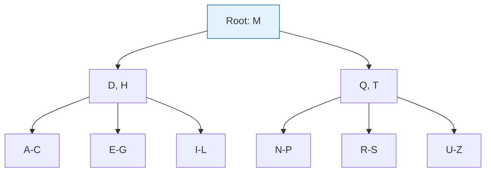

# Database Indexing

Indexes are data structures that improve query performance by allowing faster data retrieval. Understanding indexing is crucial for optimizing database performance.

## Visualization (B-Tree Index)




---

## Why Indexing?

Without an index:
```
Query: SELECT * FROM users WHERE email = 'john@example.com'

Database must scan ALL rows (O(n)) to find matches
With 1M rows, this is slow
```

With an index:
```
Index on email column uses B-tree
Lookup is O(log n) instead of O(n)
With 1M rows: ~20 comparisons instead of 1M
```

---

## Index Types

### B-Tree Index (Most Common)
Balanced tree structure, excellent for range queries and equality.

```
                    [M]
                   /   \
              [D,H]     [Q,T]
             /  |  \    /  |  \
          [A-C][E-G][I-L][N-P][R-S][U-Z]
```

**Best for**:
- Equality queries: `WHERE id = 5`
- Range queries: `WHERE created_at > '2024-01-01'`
- Prefix matching: `WHERE name LIKE 'John%'`

**Not good for**:
- Suffix matching: `WHERE name LIKE '%john'`
- Functions on column: `WHERE YEAR(created_at) = 2024`

### Hash Index
Hash table for O(1) lookups.

```sql
-- PostgreSQL hash index
CREATE INDEX idx_users_email ON users USING hash (email);
```

**Best for**: Exact equality queries only
**Not good for**: Range queries, sorting

### Full-Text Index
For text search with relevance ranking.

```sql
-- PostgreSQL
CREATE INDEX idx_posts_content ON posts USING gin(to_tsvector('english', content));

SELECT * FROM posts
WHERE to_tsvector('english', content) @@ to_tsquery('database & performance');
```

### GiST / GIN Indexes
For complex data types (arrays, JSON, geometry).

```sql
-- Index on JSONB field
CREATE INDEX idx_events_payload ON events USING gin (payload);

-- Query
SELECT * FROM events WHERE payload @> '{"type": "click"}';
```

---

## Composite Indexes

Index on multiple columns. Column order matters!

```sql
CREATE INDEX idx_orders_user_date ON orders (user_id, created_at);

-- This query uses the index efficiently
SELECT * FROM orders
WHERE user_id = 123
  AND created_at > '2024-01-01';

-- This also uses the index (leftmost prefix)
SELECT * FROM orders WHERE user_id = 123;

-- This does NOT use the index efficiently (missing leftmost column)
SELECT * FROM orders WHERE created_at > '2024-01-01';
```

### Column Order Rule
Put columns in order of:
1. **Equality conditions first**: `WHERE status = 'active'`
2. **Range conditions last**: `AND created_at > '2024-01-01'`

```sql
-- Good: equality columns first
CREATE INDEX idx_orders ON orders (status, user_id, created_at);

-- Query: efficient
SELECT * FROM orders
WHERE status = 'pending'
  AND user_id = 123
  AND created_at > '2024-01-01';
```

---

## Covering Indexes

Index contains all columns needed for query (no table lookup needed).

```sql
-- Query
SELECT user_id, email FROM users WHERE email = 'john@example.com';

-- Covering index
CREATE INDEX idx_users_email_covering ON users (email) INCLUDE (user_id);

-- Query is satisfied entirely from index (index-only scan)
```

---

## Primary Key vs Secondary Index

### Primary Key (Clustered Index)
- Data is physically sorted by primary key
- Only one per table
- Usually auto-increment ID or UUID

### Secondary Index
- Separate structure pointing to primary key
- Multiple per table
- Additional storage and maintenance overhead

```
Primary Key (Clustered):
┌─────────────────────────────────────────┐
│  id  │  email          │  name         │
├──────┼─────────────────┼───────────────┤
│  1   │  alice@...      │  Alice        │  ← Data sorted by id
│  2   │  bob@...        │  Bob          │
│  3   │  charlie@...    │  Charlie      │
└─────────────────────────────────────────┘

Secondary Index on email:
┌─────────────────────────────────────────┐
│  email          │  → Primary Key (id)   │
├─────────────────┼───────────────────────┤
│  alice@...      │  → 1                  │
│  bob@...        │  → 2                  │
│  charlie@...    │  → 3                  │
└─────────────────────────────────────────┘
```

---

## Index Overhead

Indexes aren't free:

### Storage Cost
```
Table: 10 GB
Index on email: ~2 GB
Index on name: ~2 GB
Index on (email, name): ~3 GB

Total storage: 17 GB (70% overhead)
```

### Write Performance
```
INSERT without index: 1 write
INSERT with 3 indexes: 4 writes (1 table + 3 indexes)

Each index slows down writes
```

### Best Practices
1. Only index columns used in WHERE, JOIN, ORDER BY
2. Remove unused indexes
3. Monitor index usage

```sql
-- PostgreSQL: Find unused indexes
SELECT schemaname, tablename, indexname, idx_scan
FROM pg_stat_user_indexes
WHERE idx_scan = 0;
```

---

## Query Optimization with EXPLAIN

```sql
-- Analyze query execution plan
EXPLAIN ANALYZE SELECT * FROM users WHERE email = 'john@example.com';

-- Output:
-- Index Scan using idx_users_email on users  (cost=0.42..8.44 rows=1 width=100)
--   Index Cond: (email = 'john@example.com')
--   Actual time: 0.025..0.026 rows=1 loops=1
```

### Key Metrics
- **Seq Scan**: Full table scan (usually bad for large tables)
- **Index Scan**: Using index (good)
- **Index Only Scan**: Covering index (excellent)
- **Bitmap Index Scan**: Multiple indexes combined (can be good)

---

## Common Indexing Mistakes

### 1. Indexing Low-Cardinality Columns
```sql
-- Bad: Only 2 values (true/false)
CREATE INDEX idx_users_active ON users (is_active);

-- Better: Compound index with high-cardinality column
CREATE INDEX idx_users_active_created ON users (is_active, created_at);
```

### 2. Function on Indexed Column
```sql
-- Index on created_at won't be used
SELECT * FROM orders WHERE YEAR(created_at) = 2024;

-- Better: Range query
SELECT * FROM orders
WHERE created_at >= '2024-01-01'
  AND created_at < '2025-01-01';
```

### 3. Over-Indexing
```sql
-- Don't create indexes "just in case"
-- Each index slows writes and uses storage
-- Start with essential indexes, add based on query analysis
```

---

## Interview Talking Points

1. **Why index**: O(log n) vs O(n) for lookups
2. **Types**: B-tree (general), Hash (equality only), Full-text, GIN/GiST
3. **Composite indexes**: Column order matters, leftmost prefix rule
4. **Trade-offs**: Faster reads, slower writes, more storage
5. **Analysis**: Use EXPLAIN to verify index usage
