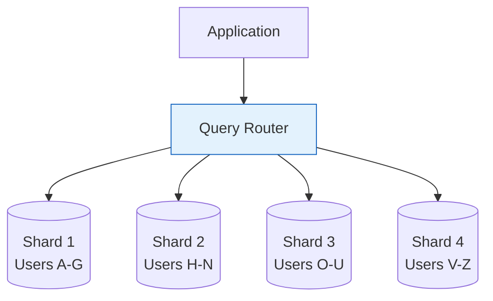

# Database Sharding

Sharding (horizontal partitioning) distributes data across multiple database servers. Each shard holds a subset of the data.

## Visualization




---

## Why Sharding?

When a single database can't handle:
- **Data volume**: Terabytes/petabytes of data
- **Write throughput**: Millions of writes per second
- **Read throughput**: Millions of reads per second

```
Before Sharding:
┌─────────────────────────────────────┐
│        Single Database              │
│        1 TB of data                 │
│        10,000 QPS max               │
└─────────────────────────────────────┘

After Sharding:
┌─────────────┐ ┌─────────────┐ ┌─────────────┐ ┌─────────────┐
│  Shard 1    │ │  Shard 2    │ │  Shard 3    │ │  Shard 4    │
│  250 GB     │ │  250 GB     │ │  250 GB     │ │  250 GB     │
│  2,500 QPS  │ │  2,500 QPS  │ │  2,500 QPS  │ │  2,500 QPS  │
└─────────────┘ └─────────────┘ └─────────────┘ └─────────────┘
                    Total: 1 TB, 10,000 QPS
                    Can scale by adding more shards
```

---

## Sharding Strategies

### 1. Range-Based Sharding

Partition by value ranges.

```
Shard 1: user_id 1 - 1,000,000
Shard 2: user_id 1,000,001 - 2,000,000
Shard 3: user_id 2,000,001 - 3,000,000
```

**Pros**:
- Simple to implement
- Range queries are efficient

**Cons**:
- Hot spots (new users always hit last shard)
- Uneven distribution if data isn't uniform

```python
def get_shard_range(user_id, shard_size=1_000_000):
    shard_id = (user_id - 1) // shard_size
    return f"shard_{shard_id}"
```

### 2. Hash-Based Sharding

Partition by hash of shard key.

```
shard_id = hash(user_id) % num_shards

User 12345 → hash(12345) % 4 = 1 → Shard 1
User 67890 → hash(67890) % 4 = 3 → Shard 3
```

**Pros**:
- Even distribution
- No hot spots

**Cons**:
- Range queries require hitting all shards
- Resharding is painful (data moves when shards added)

```python
import hashlib

def get_shard_hash(user_id, num_shards=4):
    hash_value = int(hashlib.md5(str(user_id).encode()).hexdigest(), 16)
    return f"shard_{hash_value % num_shards}"
```

### 3. Consistent Hashing

Minimizes data movement when adding/removing shards.

```
Hash Ring:
        0
    ┌───┴───┐
    │       │
  Shard A   Shard B
    │       │
    └───┬───┘
       180

Keys are assigned to the next shard clockwise on the ring.
Adding a new shard only affects neighboring keys.
```

**Pros**:
- Adding shard only moves ~1/n of data
- Better than hash-based for dynamic scaling

**Cons**:
- More complex to implement
- Can have uneven distribution (use virtual nodes)

```python
import hashlib
from bisect import bisect

class ConsistentHash:
    def __init__(self, nodes, virtual_nodes=100):
        self.ring = []
        self.node_map = {}

        for node in nodes:
            for i in range(virtual_nodes):
                key = self._hash(f"{node}:{i}")
                self.ring.append(key)
                self.node_map[key] = node

        self.ring.sort()

    def _hash(self, key):
        return int(hashlib.md5(key.encode()).hexdigest(), 16)

    def get_node(self, key):
        if not self.ring:
            return None
        hash_value = self._hash(str(key))
        idx = bisect(self.ring, hash_value) % len(self.ring)
        return self.node_map[self.ring[idx]]
```

### 4. Directory-Based Sharding

Lookup service maps keys to shards.

```
┌─────────────────────────────────────┐
│        Lookup Service               │
│   user_id 1-50000 → Shard A        │
│   user_id 50001-75000 → Shard B    │
│   user_id 75001-100000 → Shard C   │
└─────────────────────────────────────┘
```

**Pros**:
- Flexible, can handle any mapping
- Easy to rebalance

**Cons**:
- Lookup service is single point of failure
- Extra hop for every query

---

## Choosing a Shard Key

The shard key determines data distribution. Choose wisely!

### Good Shard Keys
- **High cardinality**: Many unique values
- **Even distribution**: Data spread evenly
- **Query pattern aligned**: Most queries include shard key

### Bad Shard Keys
- **Low cardinality**: Few unique values (e.g., country)
- **Monotonically increasing**: Causes hot spots (e.g., timestamp)
- **Not in common queries**: Forces cross-shard queries

### Example Analysis

```
E-commerce platform sharding options:

Option 1: Shard by user_id
✓ Users evenly distributed
✓ "Get user's orders" → single shard
✗ "Get all orders today" → all shards

Option 2: Shard by order_id
✓ Orders evenly distributed
✗ "Get user's orders" → all shards
✗ "Get all orders today" → all shards

Option 3: Shard by user_id, replicate to analytics DB
✓ User queries → single shard
✓ Analytics queries → analytics DB
```

---

## Cross-Shard Queries

When a query spans multiple shards:

```python
class ShardedQuery:
    def __init__(self, shards):
        self.shards = shards

    def query_all_shards(self, sql):
        results = []
        for shard in self.shards:
            results.extend(shard.execute(sql))
        return results

    def aggregate(self, sql, aggregation='sum'):
        partial_results = self.query_all_shards(sql)
        # Merge results from all shards
        if aggregation == 'sum':
            return sum(partial_results)
        elif aggregation == 'count':
            return sum(partial_results)
        elif aggregation == 'avg':
            total = sum(r['sum'] for r in partial_results)
            count = sum(r['count'] for r in partial_results)
            return total / count
```

### Challenges
- **Joins**: No native cross-shard joins
- **Transactions**: Distributed transactions are complex
- **Aggregations**: Must merge results from all shards

---

## Rebalancing Shards

When shards become uneven or you add capacity:

### Online Resharding

```
1. Create new shard
2. Start copying data (double-write during migration)
3. Catch up with changes
4. Switch traffic to new shard
5. Remove old data
```

### Strategies to Minimize Resharding
- Use consistent hashing
- Over-provision shard count initially
- Use virtual shards (many logical shards, fewer physical)

---

## Sharding vs Replication

| Aspect | Sharding | Replication |
|--------|----------|-------------|
| Purpose | Scale capacity | High availability, read scaling |
| Data | Split across nodes | Copied to all nodes |
| Writes | Split across shards | Single primary |
| Reads | Split across shards | Can read from replicas |
| Complexity | High | Medium |

**Common pattern**: Both together

```
Shard 1                    Shard 2
┌─────────────┐            ┌─────────────┐
│   Primary   │            │   Primary   │
└─────────────┘            └─────────────┘
      ↓                          ↓
┌─────────────┐            ┌─────────────┐
│  Replica 1  │            │  Replica 1  │
└─────────────┘            └─────────────┘
      ↓                          ↓
┌─────────────┐            ┌─────────────┐
│  Replica 2  │            │  Replica 2  │
└─────────────┘            └─────────────┘
```

---

## Interview Talking Points

1. **When to shard**: Data/traffic exceeds single server capacity
2. **Shard key selection**: High cardinality, even distribution, query-aligned
3. **Strategies**: Range, hash, consistent hash, directory
4. **Trade-offs**: Complexity vs scalability
5. **Challenges**: Cross-shard queries, transactions, rebalancing
