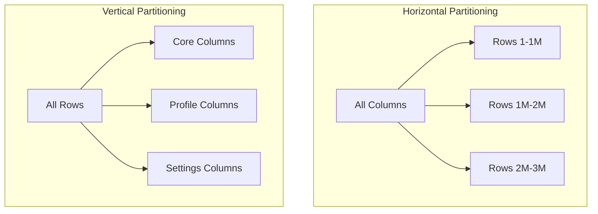

# Database Partitioning

Partitioning divides a large table into smaller, more manageable pieces. While sharding distributes data across servers, partitioning can be done within a single database server.

## Visualization




---

## Types of Partitioning

### Horizontal Partitioning (Row-based)
Divide rows across partitions based on a partition key.

```sql
-- PostgreSQL: Partition by range
CREATE TABLE orders (
    id SERIAL,
    user_id INTEGER,
    total DECIMAL(10, 2),
    created_at TIMESTAMP
) PARTITION BY RANGE (created_at);

CREATE TABLE orders_2023 PARTITION OF orders
    FOR VALUES FROM ('2023-01-01') TO ('2024-01-01');

CREATE TABLE orders_2024 PARTITION OF orders
    FOR VALUES FROM ('2024-01-01') TO ('2025-01-01');

CREATE TABLE orders_2025 PARTITION OF orders
    FOR VALUES FROM ('2025-01-01') TO ('2026-01-01');
```

### Vertical Partitioning (Column-based)
Split columns into separate tables.

```sql
-- Before: Wide table
CREATE TABLE users (
    id SERIAL PRIMARY KEY,
    email VARCHAR(255),
    password_hash VARCHAR(255),
    name VARCHAR(255),
    bio TEXT,
    profile_picture BYTEA,  -- Large!
    settings JSONB          -- Rarely accessed
);

-- After: Vertical partitioning
CREATE TABLE users_core (
    id SERIAL PRIMARY KEY,
    email VARCHAR(255),
    password_hash VARCHAR(255),
    name VARCHAR(255)
);

CREATE TABLE users_profile (
    user_id INTEGER REFERENCES users_core(id),
    bio TEXT,
    profile_picture BYTEA
);

CREATE TABLE users_settings (
    user_id INTEGER REFERENCES users_core(id),
    settings JSONB
);
```

**Benefits**:
- Frequently accessed columns in smaller table
- Large/rarely accessed columns don't slow down common queries

---

## Horizontal Partitioning Strategies

### 1. Range Partitioning
Partition by value ranges.

```sql
-- Partition by date
PARTITION BY RANGE (created_at)

-- Partition by ID range
PARTITION BY RANGE (id)
```

**Use case**: Time-series data, logs, historical records
**Pros**: Easy to drop old partitions, range queries efficient
**Cons**: Uneven distribution if data isn't uniform

### 2. List Partitioning
Partition by specific values.

```sql
CREATE TABLE orders (
    id SERIAL,
    region VARCHAR(10),
    total DECIMAL(10, 2)
) PARTITION BY LIST (region);

CREATE TABLE orders_us PARTITION OF orders FOR VALUES IN ('US');
CREATE TABLE orders_eu PARTITION OF orders FOR VALUES IN ('EU', 'UK');
CREATE TABLE orders_apac PARTITION OF orders FOR VALUES IN ('APAC', 'JP', 'AU');
```

**Use case**: Multi-tenant, regional data
**Pros**: Queries on single region hit one partition
**Cons**: Need to know all values upfront

### 3. Hash Partitioning
Partition by hash of key.

```sql
CREATE TABLE events (
    id SERIAL,
    user_id INTEGER,
    event_type VARCHAR(50)
) PARTITION BY HASH (user_id);

CREATE TABLE events_p0 PARTITION OF events FOR VALUES WITH (MODULUS 4, REMAINDER 0);
CREATE TABLE events_p1 PARTITION OF events FOR VALUES WITH (MODULUS 4, REMAINDER 1);
CREATE TABLE events_p2 PARTITION OF events FOR VALUES WITH (MODULUS 4, REMAINDER 2);
CREATE TABLE events_p3 PARTITION OF events FOR VALUES WITH (MODULUS 4, REMAINDER 3);
```

**Use case**: Even distribution needed
**Pros**: Balanced data distribution
**Cons**: Can't prune partitions for range queries

### 4. Composite Partitioning
Combine multiple strategies.

```sql
-- First partition by range (date), then by list (region)
CREATE TABLE sales (
    id SERIAL,
    region VARCHAR(10),
    amount DECIMAL(10, 2),
    sale_date DATE
) PARTITION BY RANGE (sale_date);

CREATE TABLE sales_2024 PARTITION OF sales
    FOR VALUES FROM ('2024-01-01') TO ('2025-01-01')
    PARTITION BY LIST (region);

CREATE TABLE sales_2024_us PARTITION OF sales_2024 FOR VALUES IN ('US');
CREATE TABLE sales_2024_eu PARTITION OF sales_2024 FOR VALUES IN ('EU');
```

---

## Partition Pruning

Database automatically queries only relevant partitions.

```sql
-- Table partitioned by created_at (monthly)
SELECT * FROM orders WHERE created_at >= '2024-06-01' AND created_at < '2024-07-01';

-- Query plan shows only orders_2024_06 partition is scanned
-- Other partitions are "pruned" (skipped)
```

### Enabling Pruning
- Include partition key in WHERE clause
- Use compatible operators (=, <, >, BETWEEN, IN)

```sql
-- Good: Partition key in WHERE
SELECT * FROM orders WHERE created_at >= '2024-01-01';

-- Bad: Function on partition key (may prevent pruning)
SELECT * FROM orders WHERE YEAR(created_at) = 2024;
```

---

## Partition Maintenance

### Adding New Partitions

```sql
-- Add partition for new month
CREATE TABLE orders_2025_01 PARTITION OF orders
    FOR VALUES FROM ('2025-01-01') TO ('2025-02-01');
```

### Dropping Old Partitions

```sql
-- Fast! Just drops the partition, no row-by-row delete
DROP TABLE orders_2020_01;

-- Or detach first (keeps data, removes from partition set)
ALTER TABLE orders DETACH PARTITION orders_2020_01;
```

### Archiving

```sql
-- Detach partition
ALTER TABLE orders DETACH PARTITION orders_2020_01;

-- Move to archive schema or database
ALTER TABLE orders_2020_01 SET SCHEMA archive;
```

---

## Partitioning Benefits

### 1. Query Performance
```
Without partitioning: Full table scan of 1 billion rows
With partitioning: Scan only relevant partition (1 million rows)
```

### 2. Maintenance Operations
```
Without partitioning:
  DELETE FROM orders WHERE created_at < '2020-01-01';
  -- Scans entire table, locks rows, slow

With partitioning:
  DROP TABLE orders_2019;
  -- Instant, no row scanning
```

### 3. Parallel Query Execution
```sql
-- Database can scan multiple partitions in parallel
SELECT COUNT(*) FROM orders WHERE created_at >= '2024-01-01';
-- Partitions 2024_01, 2024_02, ... scanned concurrently
```

---

## Partitioning vs Sharding

| Aspect | Partitioning | Sharding |
|--------|-------------|----------|
| Scope | Single database | Multiple servers |
| Purpose | Query performance, maintenance | Scale beyond single server |
| Complexity | Low | High |
| Cross-partition queries | Native | Requires coordination |
| Transactions | Native ACID | Distributed transactions |

**Common pattern**: Partition first, shard when single server is insufficient

```
Single Server with Partitioning:
┌─────────────────────────────────────────┐
│              PostgreSQL                 │
│  ┌──────────┐ ┌──────────┐ ┌──────────┐ │
│  │ 2024_Q1  │ │ 2024_Q2  │ │ 2024_Q3  │ │
│  └──────────┘ └──────────┘ └──────────┘ │
└─────────────────────────────────────────┘

Sharded with Partitions:
┌─────────────────────┐  ┌─────────────────────┐
│      Shard 1        │  │      Shard 2        │
│  ┌───────┐ ┌───────┐│  │ ┌───────┐ ┌───────┐ │
│  │2024_Q1│ │2024_Q2││  │ │2024_Q1│ │2024_Q2│ │
│  └───────┘ └───────┘│  │ └───────┘ └───────┘ │
└─────────────────────┘  └─────────────────────┘
```

---

## Interview Talking Points

1. **When to partition**: Large tables, time-series data, maintenance benefits
2. **Strategies**: Range (dates), List (categories), Hash (even distribution)
3. **Benefits**: Query pruning, fast maintenance, parallel execution
4. **Partition key**: Must be in most queries for pruning
5. **vs Sharding**: Partitioning is single-server, sharding is multi-server
