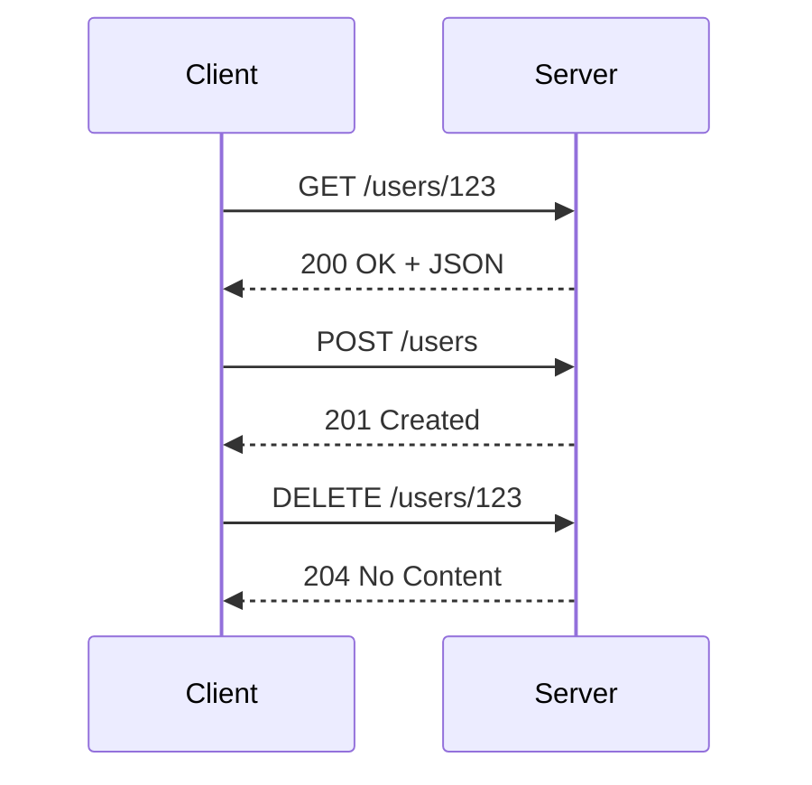

# HTTP/HTTPS & REST

REST (Representational State Transfer) is the most common architectural style for web APIs.

## Visualization




---

## HTTP Fundamentals

### HTTP Methods

| Method | Purpose | Idempotent | Safe | Cacheable |
|--------|---------|------------|------|-----------|
| GET | Retrieve resource | Yes | Yes | Yes |
| POST | Create resource | No | No | No |
| PUT | Replace resource | Yes | No | No |
| PATCH | Partial update | No | No | No |
| DELETE | Remove resource | Yes | No | No |

### Status Codes

```
2xx Success:
  200 OK - Request succeeded
  201 Created - Resource created
  204 No Content - Success, no body

3xx Redirection:
  301 Moved Permanently
  304 Not Modified (cached)

4xx Client Error:
  400 Bad Request - Invalid input
  401 Unauthorized - Authentication required
  403 Forbidden - No permission
  404 Not Found - Resource doesn't exist
  429 Too Many Requests - Rate limited

5xx Server Error:
  500 Internal Server Error
  502 Bad Gateway
  503 Service Unavailable
  504 Gateway Timeout
```

---

## REST API Design

### Resource Naming

```
Good:
GET /users/123/orders           # User's orders
GET /products?category=electronics
POST /users/123/addresses

Bad:
GET /getUser/123               # Verb in URL
GET /user_orders/123           # Inconsistent naming
POST /createNewAddress         # Verb, not resource
```

### API Versioning

```
URL Path (most common):
GET /v1/users/123
GET /v2/users/123

Header:
GET /users/123
Accept: application/vnd.api+json; version=2

Query Parameter:
GET /users/123?version=2
```

### Pagination

```
Offset-based:
GET /users?limit=20&offset=40

Cursor-based (better for large datasets):
GET /users?limit=20&cursor=eyJpZCI6MTAwfQ==

Response:
{
  "data": [...],
  "pagination": {
    "next_cursor": "eyJpZCI6MTIwfQ==",
    "has_more": true
  }
}
```

### Filtering & Sorting

```
GET /products?category=electronics&price_min=100&price_max=500
GET /products?sort=price&order=desc
GET /users?status=active,pending   # Multiple values
```

---

## Request/Response Design

### Request Body

```json
// POST /users
{
  "email": "john@example.com",
  "name": "John Doe",
  "preferences": {
    "notifications": true
  }
}
```

### Response Body

```json
// 200 OK
{
  "data": {
    "id": "123",
    "email": "john@example.com",
    "name": "John Doe",
    "created_at": "2024-01-15T10:30:00Z"
  }
}

// Error response
{
  "error": {
    "code": "VALIDATION_ERROR",
    "message": "Invalid email format",
    "details": [
      { "field": "email", "message": "Must be a valid email" }
    ]
  }
}
```

---

## HTTPS & TLS

### TLS Handshake

```
Client                                Server
   │                                     │
   │──── ClientHello (supported ciphers) ────→│
   │                                     │
   │←─── ServerHello (chosen cipher) ────│
   │←─── Certificate (server's cert) ────│
   │←─── ServerHelloDone ────────────────│
   │                                     │
   │──── ClientKeyExchange ──────────────→│
   │──── ChangeCipherSpec ───────────────→│
   │──── Finished ───────────────────────→│
   │                                     │
   │←─── ChangeCipherSpec ───────────────│
   │←─── Finished ───────────────────────│
   │                                     │
   │←════ Encrypted Communication ═══════→│
```

### Certificate Chain

```
Root CA (trusted, built into browser/OS)
    │
    └── Intermediate CA
            │
            └── Server Certificate
```

---

## HTTP/2 vs HTTP/1.1

### HTTP/1.1 Limitations
- One request per connection (or keep-alive queue)
- Text-based headers (verbose)
- No server push

### HTTP/2 Features

```
Multiplexing: Multiple requests on single connection
┌──────────────────────────────────────────────┐
│                 Connection                    │
│  Stream 1: GET /users ──────────────→        │
│  Stream 2: GET /products ───────────→        │
│  Stream 1: ←──────────── Response            │
│  Stream 3: GET /orders ─────────────→        │
│  Stream 2: ←──────────── Response            │
│  Stream 3: ←──────────── Response            │
└──────────────────────────────────────────────┘

Header Compression: HPACK reduces header size
Server Push: Server can push resources before client requests
Binary Protocol: More efficient than text
```

---

## Rate Limiting

```python
# Token Bucket implementation
class RateLimiter:
    def __init__(self, rate, capacity):
        self.rate = rate          # tokens per second
        self.capacity = capacity   # max tokens
        self.tokens = capacity
        self.last_update = time.time()

    def allow_request(self):
        now = time.time()
        # Add tokens based on elapsed time
        elapsed = now - self.last_update
        self.tokens = min(self.capacity, self.tokens + elapsed * self.rate)
        self.last_update = now

        if self.tokens >= 1:
            self.tokens -= 1
            return True
        return False
```

### Rate Limit Headers

```
HTTP/1.1 200 OK
X-RateLimit-Limit: 100
X-RateLimit-Remaining: 45
X-RateLimit-Reset: 1640995200

HTTP/1.1 429 Too Many Requests
Retry-After: 60
```

---

## Caching Headers

```
Response caching:
Cache-Control: max-age=3600, public     # Cache for 1 hour
Cache-Control: no-cache                 # Validate before use
Cache-Control: no-store                 # Don't cache

Conditional requests:
ETag: "abc123"                          # Version identifier
Last-Modified: Wed, 15 Jan 2024 10:30:00 GMT

Client sends:
If-None-Match: "abc123"                 # Check if changed
If-Modified-Since: Wed, 15 Jan 2024...

Server responds:
304 Not Modified                        # Use cached version
```

---

## Interview Implementation

```python
from flask import Flask, request, jsonify

app = Flask(__name__)
users = {}

@app.route('/users', methods=['GET'])
def list_users():
    page = int(request.args.get('page', 1))
    limit = int(request.args.get('limit', 20))
    offset = (page - 1) * limit

    user_list = list(users.values())[offset:offset + limit]
    return jsonify({
        'data': user_list,
        'pagination': {
            'page': page,
            'limit': limit,
            'total': len(users)
        }
    })

@app.route('/users/<user_id>', methods=['GET'])
def get_user(user_id):
    if user_id not in users:
        return jsonify({'error': 'User not found'}), 404
    return jsonify({'data': users[user_id]})

@app.route('/users', methods=['POST'])
def create_user():
    data = request.json
    if not data.get('email'):
        return jsonify({'error': 'Email required'}), 400

    user_id = str(len(users) + 1)
    users[user_id] = {'id': user_id, **data}
    return jsonify({'data': users[user_id]}), 201
```

---

## Interview Tips

1. **Know HTTP methods**: GET/POST/PUT/PATCH/DELETE semantics
2. **Status codes**: Use appropriate codes (201 for create, 404 for not found)
3. **Idempotency**: PUT and DELETE should be idempotent
4. **Pagination**: Cursor-based is better for large datasets
5. **Versioning**: Always version your APIs
