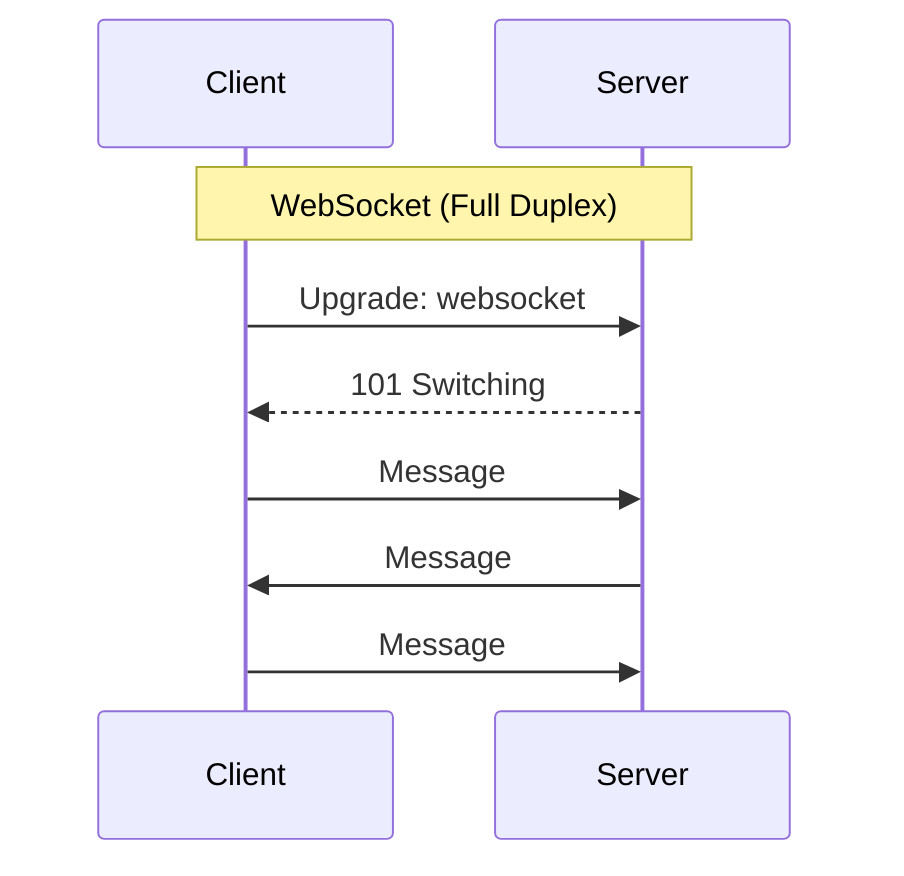

# WebSockets & Long Polling

Real-time communication patterns for bidirectional and server-push scenarios.

## Visualization




---

## Communication Patterns Comparison

### Regular Polling

```
Client                    Server
   │                         │
   │──GET /messages──────────→│
   │←─────────────[empty]────│
   │         (wait 5s)       │
   │──GET /messages──────────→│
   │←─────────────[empty]────│
   │         (wait 5s)       │
   │──GET /messages──────────→│
   │←────────[new message]───│

Problem: Wasteful when no updates, delayed when there are
```

### Long Polling

```
Client                    Server
   │                         │
   │──GET /messages──────────→│
   │         (server holds connection)
   │         (waits for new data or timeout)
   │←────────[new message]───│
   │──GET /messages──────────→│  (immediately reconnect)
   │         (server holds...)
   │←────────[new message]───│

Better: No wasted requests, still has reconnection overhead
```

### Server-Sent Events (SSE)

```
Client                    Server
   │                         │
   │──GET /stream────────────→│
   │←─────(connection open)──│
   │←────data: message 1─────│
   │←────data: message 2─────│
   │←────data: message 3─────│
   │         ...             │

One-way: Server to client only
```

### WebSocket

```
Client                    Server
   │                         │
   │──Upgrade: websocket────→│
   │←─────101 Switching──────│
   │←════════════════════════│  (full-duplex connection)
   │──message from client───→│
   │←──message from server───│
   │──message from client───→│
   │←──message from server───│

Bidirectional: Both can send anytime
```

---

## Long Polling Implementation

```python
# Server (Flask)
from flask import Flask
import time
from queue import Queue

app = Flask(__name__)
message_queues = {}  # user_id -> Queue

@app.route('/poll/<user_id>')
def long_poll(user_id):
    if user_id not in message_queues:
        message_queues[user_id] = Queue()

    queue = message_queues[user_id]

    # Wait for message or timeout (30 seconds)
    try:
        message = queue.get(timeout=30)
        return jsonify({'message': message})
    except:
        return jsonify({'message': None}), 204

@app.route('/send/<user_id>', methods=['POST'])
def send_message(user_id):
    if user_id in message_queues:
        message_queues[user_id].put(request.json)
    return jsonify({'status': 'sent'})
```

```javascript
// Client
async function longPoll(userId) {
    while (true) {
        try {
            const response = await fetch(`/poll/${userId}`);
            if (response.status === 200) {
                const data = await response.json();
                handleMessage(data.message);
            }
        } catch (error) {
            await sleep(1000); // Retry after error
        }
    }
}
```

---

## WebSocket Implementation

### Server (Python with websockets)

```python
import asyncio
import websockets
import json

connected_clients = {}

async def handler(websocket, path):
    user_id = path.split('/')[-1]
    connected_clients[user_id] = websocket

    try:
        async for message in websocket:
            data = json.loads(message)
            await handle_message(user_id, data)
    finally:
        del connected_clients[user_id]

async def handle_message(sender_id, data):
    if data['type'] == 'chat':
        recipient = data['to']
        if recipient in connected_clients:
            await connected_clients[recipient].send(json.dumps({
                'type': 'chat',
                'from': sender_id,
                'message': data['message']
            }))

async def main():
    async with websockets.serve(handler, "localhost", 8765):
        await asyncio.Future()  # run forever

asyncio.run(main())
```

### Client (JavaScript)

```javascript
class WebSocketClient {
    constructor(url) {
        this.url = url;
        this.ws = null;
        this.reconnectInterval = 1000;
        this.maxReconnectInterval = 30000;
        this.messageHandlers = [];
    }

    connect() {
        this.ws = new WebSocket(this.url);

        this.ws.onopen = () => {
            console.log('Connected');
            this.reconnectInterval = 1000; // Reset on success
        };

        this.ws.onmessage = (event) => {
            const data = JSON.parse(event.data);
            this.messageHandlers.forEach(handler => handler(data));
        };

        this.ws.onclose = () => {
            console.log('Disconnected, reconnecting...');
            setTimeout(() => this.connect(), this.reconnectInterval);
            this.reconnectInterval = Math.min(
                this.reconnectInterval * 2,
                this.maxReconnectInterval
            );
        };

        this.ws.onerror = (error) => {
            console.error('WebSocket error:', error);
            this.ws.close();
        };
    }

    send(data) {
        if (this.ws.readyState === WebSocket.OPEN) {
            this.ws.send(JSON.stringify(data));
        }
    }

    onMessage(handler) {
        this.messageHandlers.push(handler);
    }
}

// Usage
const ws = new WebSocketClient('ws://localhost:8765/user123');
ws.connect();
ws.onMessage((data) => console.log('Received:', data));
ws.send({ type: 'chat', to: 'user456', message: 'Hello!' });
```

---

## Server-Sent Events (SSE)

### Server

```python
from flask import Flask, Response

@app.route('/stream/<user_id>')
def stream(user_id):
    def generate():
        queue = get_user_queue(user_id)
        while True:
            message = queue.get()  # Blocking wait
            yield f"data: {json.dumps(message)}\n\n"

    return Response(
        generate(),
        mimetype='text/event-stream',
        headers={
            'Cache-Control': 'no-cache',
            'Connection': 'keep-alive'
        }
    )
```

### Client

```javascript
const eventSource = new EventSource('/stream/user123');

eventSource.onmessage = (event) => {
    const data = JSON.parse(event.data);
    console.log('Received:', data);
};

eventSource.onerror = () => {
    console.log('Connection error, will auto-reconnect');
};
```

---

## Scaling WebSockets

### Challenge

```
Problem: WebSocket connections are stateful
User connects to Server A
Message needs to go to user on Server B

Server A ←──X──→ Server B
User 1            User 2
```

### Solution: Pub/Sub

```
           ┌─────────────────┐
           │   Redis Pub/Sub │
           └─────────────────┘
              ↑           ↑
              │           │
        ┌─────┴───┐ ┌─────┴───┐
        │Server A │ │Server B │
        └─────────┘ └─────────┘
            ↑           ↑
            │           │
         User 1      User 2
```

```python
import redis
import asyncio

redis_client = redis.Redis()
pubsub = redis_client.pubsub()

async def message_broker(websocket, user_id):
    # Subscribe to user's channel
    pubsub.subscribe(f'user:{user_id}')

    # Forward messages to WebSocket
    for message in pubsub.listen():
        if message['type'] == 'message':
            await websocket.send(message['data'])

def send_to_user(user_id, message):
    # Publish to Redis (reaches user regardless of which server)
    redis_client.publish(f'user:{user_id}', json.dumps(message))
```

---

## Heartbeat / Ping-Pong

Keep connections alive and detect dead connections.

```python
async def websocket_handler(websocket):
    try:
        async for message in websocket:
            if message == 'ping':
                await websocket.send('pong')
            else:
                await handle_message(message)
    except websockets.ConnectionClosed:
        pass
```

```javascript
// Client-side heartbeat
setInterval(() => {
    if (ws.readyState === WebSocket.OPEN) {
        ws.send('ping');
    }
}, 30000);
```

---

## Comparison Table

| Feature | Long Polling | SSE | WebSocket |
|---------|-------------|-----|-----------|
| Direction | Client → Server | Server → Client | Bidirectional |
| Connection | Repeated | Persistent | Persistent |
| Protocol | HTTP | HTTP | WS/WSS |
| Reconnection | Automatic | Automatic | Manual |
| Browser support | Universal | Good | Good |
| Firewall friendly | Yes | Yes | Sometimes issues |
| Resource usage | Higher | Medium | Lower |

---

## When to Use What

```
Chat/Messaging:         WebSocket (bidirectional, low latency)
Live notifications:     SSE (simple, one-way push)
Dashboard updates:      SSE or WebSocket
Real-time collaboration: WebSocket (needs bidirectional)
Simple status updates:  Long Polling (if SSE not available)
```

---

## Interview Tips

1. **Know the trade-offs**: Connection overhead, resource usage, complexity
2. **Scaling challenge**: WebSockets are stateful, need pub/sub for multi-server
3. **Fallbacks**: WebSocket → Long Polling for older browsers
4. **Heartbeats**: Essential for detecting dead connections
5. **Reconnection**: Always implement automatic reconnection
