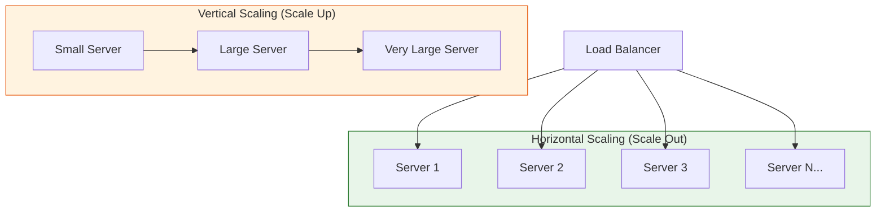

# Horizontal vs Vertical Scaling

Understanding when and how to scale your system is fundamental to system design.

## Visualization




---

## Vertical Scaling (Scale Up)

Adding more resources (CPU, RAM, Storage) to an existing machine.

### When to Use
- Early-stage startups with simple architecture
- Database servers (often easier to scale up first)
- When application isn't designed for distribution

### Advantages
- **Simplicity**: No code changes required
- **No data consistency issues**: Single machine
- **Lower operational complexity**: Fewer machines to manage

### Disadvantages
- **Hardware limits**: Can't scale indefinitely
- **Single point of failure**: One machine goes down = entire system down
- **Expensive**: High-end hardware costs exponentially more
- **Downtime during upgrades**: Need to restart machine

### Example

```
Before: 4 CPU cores, 16GB RAM, 500GB SSD
After:  32 CPU cores, 256GB RAM, 4TB SSD
```

---

## Horizontal Scaling (Scale Out)

Adding more machines to the resource pool.

### When to Use
- High availability requirements
- Stateless applications
- When vertical scaling limits are reached
- Unpredictable or spiky traffic

### Advantages
- **No hardware limits**: Add machines as needed
- **Fault tolerance**: System survives individual machine failures
- **Cost effective**: Use commodity hardware
- **No downtime for scaling**: Add/remove machines dynamically

### Disadvantages
- **Complexity**: Requires load balancing, data synchronization
- **Data consistency challenges**: CAP theorem trade-offs
- **Network overhead**: Communication between machines adds latency
- **State management**: Sessions must be externalized

### Example

```
Before: 1 server handling 1000 RPS
After:  10 servers each handling 100 RPS = 1000 RPS total (with room to grow)
```

---

## Comparison Table

| Aspect | Vertical | Horizontal |
|--------|----------|------------|
| Cost curve | Exponential | Linear |
| Complexity | Low | High |
| Failure impact | Catastrophic | Graceful degradation |
| Downtime for scaling | Required | Not required |
| Hardware limits | Yes | No |
| Best for | Databases, simple apps | Stateless services |

---

## Real-World Strategy

Most systems use **both** approaches:

```
               ┌─────────────────────────────────────┐
               │         Load Balancer               │
               └─────────────────────────────────────┘
                            ↓ (Horizontal)
        ┌───────────────────┼───────────────────┐
        ↓                   ↓                   ↓
   [App Server 1]     [App Server 2]     [App Server N]
        └───────────────────┼───────────────────┘
                            ↓
               ┌─────────────────────────────────────┐
               │    Database (Scaled Vertically)     │
               │    - Large CPU, RAM, Fast SSDs      │
               └─────────────────────────────────────┘
```

1. **Stateless layers** (API servers, web servers) → Scale horizontally
2. **Stateful layers** (databases) → Scale vertically first, then shard horizontally

---

## Code Example: Stateless Design for Horizontal Scaling

```java
// BAD: Storing session in memory (can't scale horizontally)
public class BadSessionService {
    private Map<String, UserSession> sessions = new HashMap<>();

    public void saveSession(String sessionId, UserSession session) {
        sessions.put(sessionId, session); // Lost if server restarts or request goes to different server
    }
}

// GOOD: Externalize session storage (horizontally scalable)
public class GoodSessionService {
    private RedisClient redis;

    public void saveSession(String sessionId, UserSession session) {
        redis.set(sessionId, serialize(session), Duration.ofHours(24));
    }
}
```

```python
# BAD: In-memory cache (server-specific)
class BadCacheService:
    cache = {}

    def get(self, key):
        return self.cache.get(key)

# GOOD: Distributed cache (works across servers)
class GoodCacheService:
    def __init__(self):
        self.redis = Redis(host='redis-cluster', port=6379)

    def get(self, key):
        return self.redis.get(key)
```

---

## Interview Tips

1. **Start vertical, go horizontal**: For a startup, vertical scaling is simpler. Mention the transition point.
2. **Identify stateless vs stateful**: Web/API servers are typically stateless. Databases are stateful.
3. **Mention the trade-offs**: There's no free lunch. Horizontal scaling adds complexity.
4. **Use numbers**: "A single server can handle ~10K concurrent connections, so at 100K users..."
