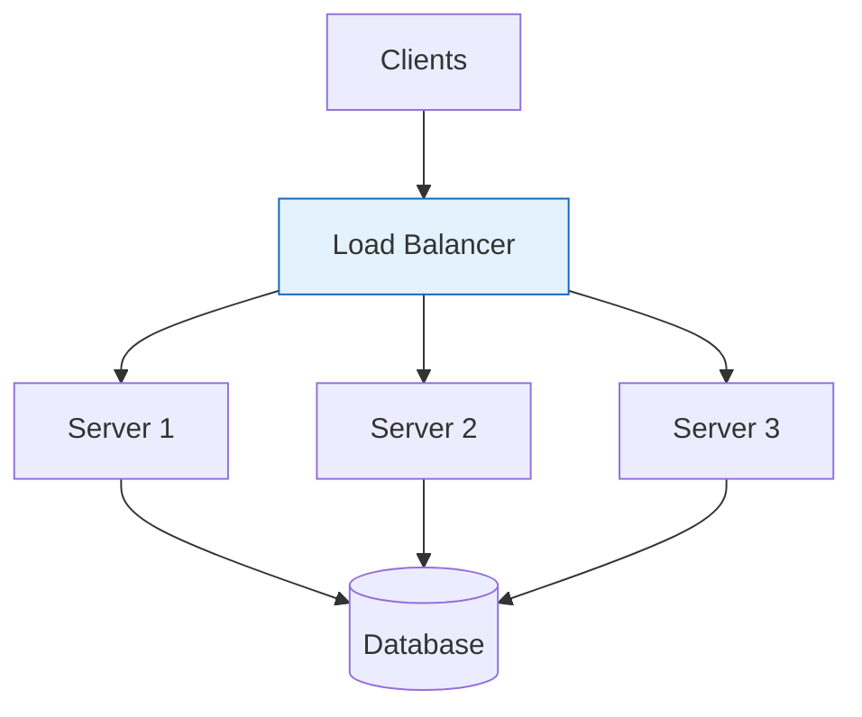
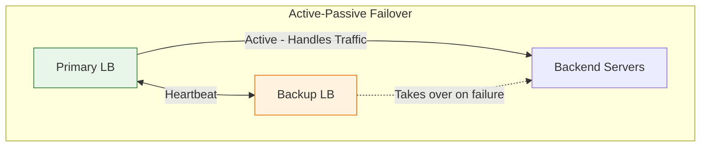
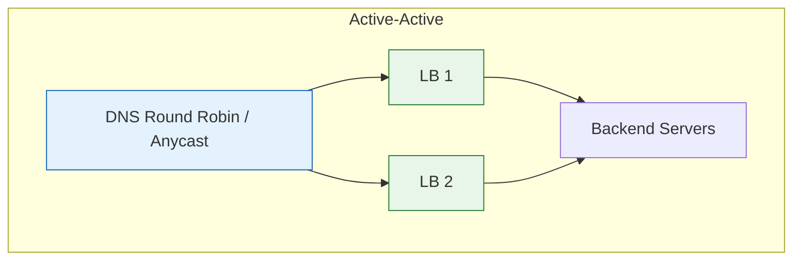
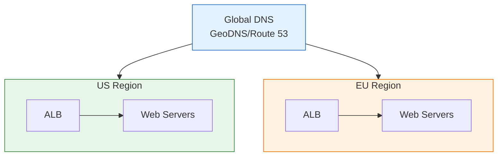

# Load Balancing

Load balancing distributes incoming network traffic across multiple servers to ensure no single server becomes overwhelmed.

---

## Why Load Balancing?

1. **High Availability**: If one server fails, traffic is routed to healthy servers
2. **Scalability**: Distribute load across multiple servers
3. **Performance**: Route requests to the least busy server
4. **Flexibility**: Add/remove servers without downtime

### Visualization




---

## Load Balancing Algorithms

### 1. Round Robin
Distributes requests sequentially across servers.

```
Request 1 → Server A
Request 2 → Server B
Request 3 → Server C
Request 4 → Server A (cycle repeats)
```

**Pros**: Simple, fair distribution
**Cons**: Doesn't account for server capacity or current load

### 2. Weighted Round Robin
Assigns weights based on server capacity.

```
Weights: Server A = 3, Server B = 2, Server C = 1
Requests go: A, A, A, B, B, C, A, A, A, B, B, C...
```

**Use case**: Servers with different hardware specifications

### 3. Least Connections
Routes to the server with fewest active connections.

```
Server A: 10 connections
Server B: 5 connections  ← New request goes here
Server C: 8 connections
```

**Use case**: Long-lived connections (WebSocket, database connections)

### 4. Least Response Time
Routes to the server with lowest response time + fewest connections.

**Use case**: When server performance varies

### 5. IP Hash
Routes based on client IP address hash.

```python
server_index = hash(client_ip) % num_servers
```

**Use case**: Session persistence without sticky sessions

### 6. Consistent Hashing
Distributes requests using a hash ring, minimizing redistribution when servers are added/removed.

**Use case**: Distributed caching, database sharding

---

## Types of Load Balancers

### Layer 4 (Transport Layer)
- Operates on TCP/UDP level
- Faster (no need to inspect content)
- Based on IP address and port
- Example: AWS NLB, HAProxy (TCP mode)

```
Client → [L4 Load Balancer] → Server
         (Looks at: IP, Port)
```

### Layer 7 (Application Layer)
- Operates on HTTP/HTTPS level
- Can inspect request content (URL, headers, cookies)
- More intelligent routing decisions
- Example: AWS ALB, Nginx, HAProxy (HTTP mode)

```
Client → [L7 Load Balancer] → Server
         (Looks at: URL path, headers, cookies, body)
```

**L7 Routing Examples**:
```
/api/* → API Servers
/static/* → CDN/Static Servers
/admin/* → Admin Servers
User-Agent: Mobile → Mobile-optimized Servers
```

---

## Health Checks

Load balancers must detect unhealthy servers:

### Active Health Checks
```
Load Balancer periodically sends:
GET /health → Server

Server responds:
200 OK {"status": "healthy", "db": "connected"}
or
503 Service Unavailable
```

### Passive Health Checks
Monitor actual traffic responses:
- Track error rates
- Track response times
- Remove servers with high failure rates

---

## High Availability Setup

### Active-Passive (Failover)


### Active-Active


---

## Implementation Examples

### Nginx Configuration

```nginx
upstream backend {
    least_conn;  # Load balancing algorithm

    server backend1.example.com weight=3;
    server backend2.example.com weight=2;
    server backend3.example.com weight=1;

    server backend4.example.com backup;  # Only used if others fail
}

server {
    listen 80;

    location / {
        proxy_pass http://backend;
        proxy_connect_timeout 5s;
        proxy_read_timeout 60s;

        # Health check
        health_check interval=5s fails=3 passes=2;
    }
}
```

### HAProxy Configuration

```haproxy
frontend http_front
    bind *:80
    default_backend http_back

backend http_back
    balance roundrobin
    option httpchk GET /health

    server server1 192.168.1.1:8080 check weight 3
    server server2 192.168.1.2:8080 check weight 2
    server server3 192.168.1.3:8080 check weight 1
```

---

## Cloud Load Balancers

| Provider | L4 | L7 | Global |
|----------|----|----|--------|
| AWS | NLB | ALB | Global Accelerator |
| GCP | Network LB | HTTP(S) LB | Cloud Load Balancing |
| Azure | Load Balancer | Application Gateway | Front Door |

---

## Common Interview Points

1. **L4 vs L7**: Know when to use each
2. **Health checks**: How to detect and handle failures
3. **Session persistence**: Sticky sessions vs externalized sessions
4. **SSL termination**: Offload SSL at LB vs end-to-end encryption
5. **Global load balancing**: GeoDNS, Anycast for multi-region deployments

---

## Architecture Example


