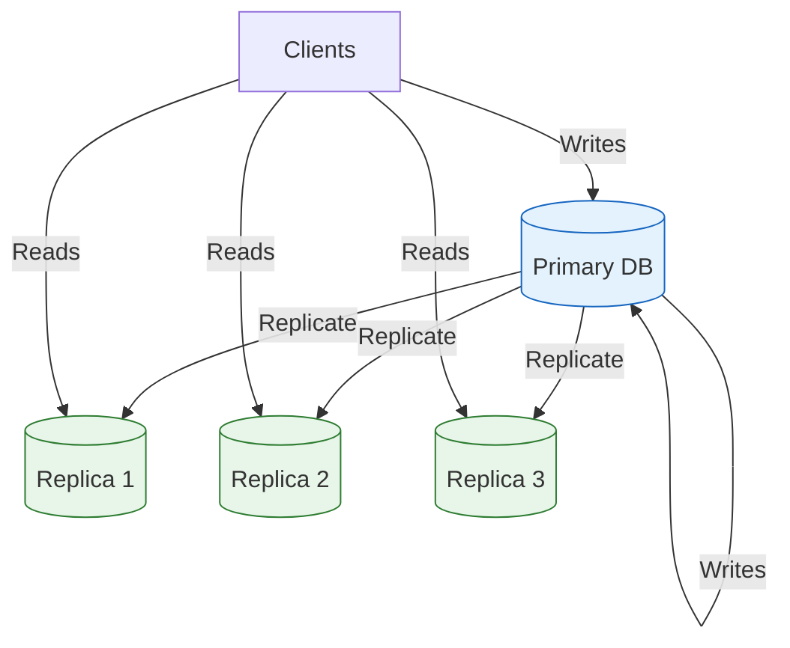
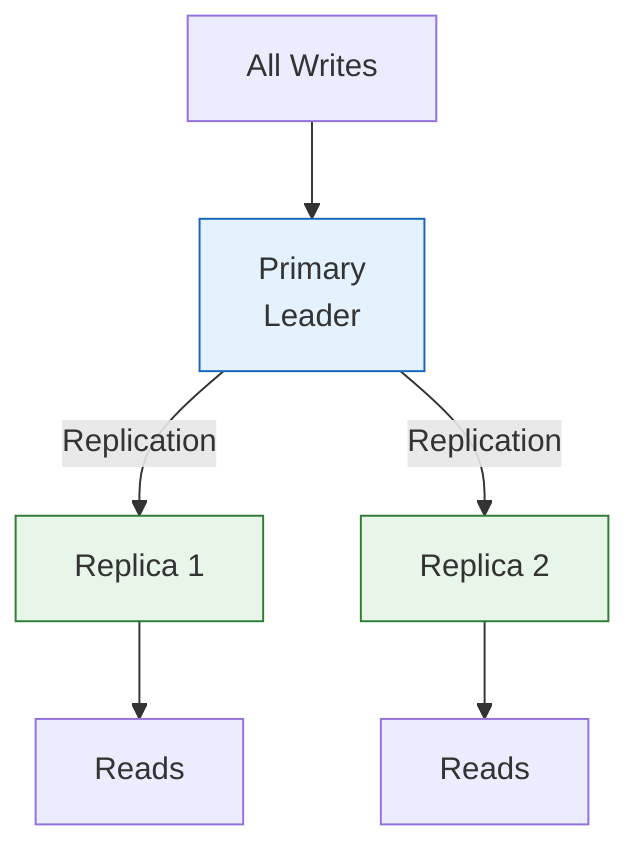
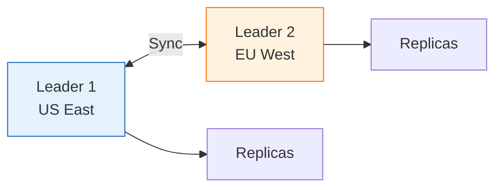
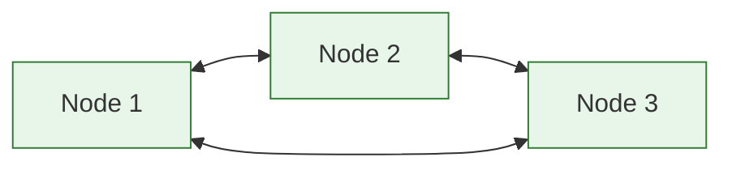

# Database Replication

Database replication is the process of copying data from one database server (primary) to one or more servers (replicas) to improve availability, fault tolerance, and read performance.

## Visualization




---

## Why Replication?

1. **High Availability**: If primary fails, promote a replica
2. **Read Scalability**: Distribute read queries across replicas
3. **Geographic Distribution**: Place replicas closer to users
4. **Backup**: Replicas serve as live backups

---

## Replication Topologies

### 1. Single-Leader (Master-Slave)



**Pros**: Simple, no write conflicts
**Cons**: Single point of failure for writes, replication lag

**Use case**: Most common pattern (MySQL, PostgreSQL, MongoDB)

### 2. Multi-Leader (Master-Master)



**Pros**: Write availability in multiple regions
**Cons**: Conflict resolution complexity

**Use case**: Multi-datacenter deployments, offline-first apps

### 3. Leaderless (Peer-to-Peer)



**Pros**: High availability, no single point of failure
**Cons**: Complex conflict resolution, read/write quorums

**Use case**: Cassandra, DynamoDB, Riak

---

## Synchronous vs Asynchronous Replication

### Synchronous
```
Client → Primary → Wait for Replica ACK → Respond to Client
```

**Pros**: Strong consistency (replica always has latest data)
**Cons**: Higher latency, reduced availability (if replica is slow/down)

### Asynchronous
```
Client → Primary → Respond to Client
                → (async) Replicate to Replica
```

**Pros**: Lower latency, higher availability
**Cons**: Replication lag, potential data loss on primary failure

### Semi-Synchronous
```
Client → Primary → Wait for 1 Replica ACK → Respond to Client
                → (async) Replicate to other Replicas
```

**Use case**: Balance between consistency and performance

---

## Replication Lag

The delay between a write on the primary and its appearance on replicas.

### Problems Caused by Lag

```
1. User writes profile update → Primary
2. User refreshes page → Reads from Replica (old data!)
3. User thinks update failed
```

### Solutions

1. **Read-your-writes consistency**: Route user's reads to primary after their writes
2. **Monotonic reads**: Ensure user always reads from same replica
3. **Consistent prefix reads**: Ensure causally related writes appear in order

### Code Example

```python
class UserService:
    def __init__(self, primary_db, replica_db, cache):
        self.primary = primary_db
        self.replica = replica_db
        self.cache = cache

    def update_profile(self, user_id, data):
        # Write to primary
        self.primary.update(user_id, data)
        # Cache the write timestamp
        self.cache.set(f"last_write:{user_id}", time.time(), ttl=30)

    def get_profile(self, user_id):
        # Check if user recently wrote
        last_write = self.cache.get(f"last_write:{user_id}")
        if last_write and time.time() - last_write < 30:
            # Read from primary to avoid lag
            return self.primary.get(user_id)
        else:
            # Safe to read from replica
            return self.replica.get(user_id)
```

---

## Failover Strategies

### Automatic Failover

```
1. Primary fails
2. Replicas detect failure (heartbeat timeout)
3. Election process selects new primary
4. Other replicas reconfigure to follow new primary
5. Application redirects writes to new primary
```

**Challenges**:
- Split-brain: Two nodes think they're primary
- Data loss: Async replicated writes may be lost
- Client redirection: Applications need to discover new primary

### Manual Failover

Operator manually promotes replica after verifying primary failure.

**Pros**: Safer, avoid false positives
**Cons**: Higher downtime

---

## Implementation Examples

### PostgreSQL Streaming Replication

```sql
-- On Primary: postgresql.conf
wal_level = replica
max_wal_senders = 3
synchronous_standby_names = 'replica1'

-- On Replica: recovery.conf
standby_mode = on
primary_conninfo = 'host=primary port=5432 user=replicator'
trigger_file = '/tmp/promote_to_primary'
```

### MySQL Replication

```sql
-- On Primary
CREATE USER 'replicator'@'%' IDENTIFIED BY 'password';
GRANT REPLICATION SLAVE ON *.* TO 'replicator'@'%';

SHOW MASTER STATUS;  -- Get binlog position

-- On Replica
CHANGE MASTER TO
    MASTER_HOST='primary',
    MASTER_USER='replicator',
    MASTER_PASSWORD='password',
    MASTER_LOG_FILE='mysql-bin.000001',
    MASTER_LOG_POS=154;

START SLAVE;
```

---

## Read/Write Splitting

```java
public class DatabaseRouter {
    private DataSource primary;
    private List<DataSource> replicas;
    private int replicaIndex = 0;

    public Connection getConnection(boolean isWrite) {
        if (isWrite) {
            return primary.getConnection();
        } else {
            // Round-robin across replicas
            DataSource replica = replicas.get(replicaIndex);
            replicaIndex = (replicaIndex + 1) % replicas.size();
            return replica.getConnection();
        }
    }
}
```

---

## Interview Talking Points

1. **Trade-offs**: Sync vs async replication (consistency vs availability)
2. **Failover**: Automatic vs manual, split-brain prevention
3. **Replication lag**: How to handle read-your-writes consistency
4. **Scaling reads**: Add replicas to distribute read load
5. **Geographic distribution**: Place replicas near users
