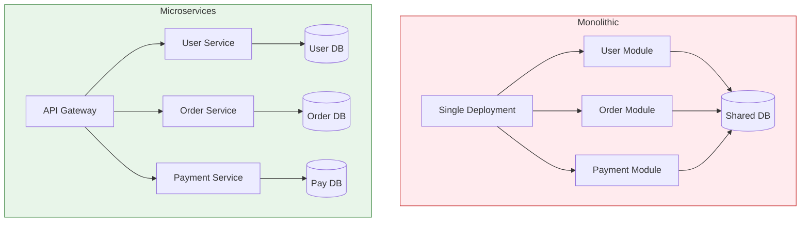

# Monolithic vs Microservices

Understanding when to use each architecture is crucial for system design.

## Visualization




---

## Monolithic Architecture

All components in a single deployable unit.

```
┌─────────────────────────────────────────────────────────┐
│                    Monolith Application                  │
│  ┌─────────────┐  ┌─────────────┐  ┌─────────────┐     │
│  │    User     │  │    Order    │  │   Product   │     │
│  │   Module    │  │   Module    │  │   Module    │     │
│  └─────────────┘  └─────────────┘  └─────────────┘     │
│  ┌─────────────┐  ┌─────────────┐  ┌─────────────┐     │
│  │  Payment    │  │  Inventory  │  │  Shipping   │     │
│  │   Module    │  │   Module    │  │   Module    │     │
│  └─────────────┘  └─────────────┘  └─────────────┘     │
│                                                         │
│                    Shared Database                      │
└─────────────────────────────────────────────────────────┘
```

### Advantages
- **Simple development**: Single codebase, easy to understand
- **Easy deployment**: One artifact to deploy
- **Simple testing**: End-to-end testing straightforward
- **No network latency**: In-process function calls
- **Shared data**: Direct database access

### Disadvantages
- **Scaling limitations**: Scale entire app, not individual components
- **Deployment risk**: Any change requires full deployment
- **Technology lock-in**: One stack for everything
- **Team bottlenecks**: All teams work in same codebase
- **Reliability**: One bug can crash entire system

---

## Microservices Architecture

Application as a collection of loosely coupled services.

```
┌─────────────┐  ┌─────────────┐  ┌─────────────┐
│    User     │  │    Order    │  │   Product   │
│   Service   │  │   Service   │  │   Service   │
│  ┌───────┐  │  │  ┌───────┐  │  │  ┌───────┐  │
│  │  DB   │  │  │  │  DB   │  │  │  │  DB   │  │
│  └───────┘  │  │  └───────┘  │  │  └───────┘  │
└─────────────┘  └─────────────┘  └─────────────┘
       │               │               │
       └───────────────┼───────────────┘
                       ↓
               [Message Queue / API Gateway]
```

### Advantages
- **Independent scaling**: Scale only what needs scaling
- **Independent deployment**: Deploy services separately
- **Technology diversity**: Right tool for each service
- **Team autonomy**: Teams own their services
- **Fault isolation**: One service failure doesn't crash all

### Disadvantages
- **Complexity**: Distributed system challenges
- **Network latency**: Remote calls instead of in-process
- **Data consistency**: No easy transactions across services
- **Operational overhead**: Many services to monitor/deploy
- **Testing complexity**: Integration testing is harder

---

## Comparison

| Aspect | Monolith | Microservices |
|--------|----------|---------------|
| Complexity | Lower | Higher |
| Deployment | All or nothing | Independent |
| Scaling | Vertical (primarily) | Horizontal (per service) |
| Team size | Any | Better for large teams |
| Data consistency | ACID transactions | Eventual consistency |
| Technology | Single stack | Polyglot possible |
| Development speed | Faster initially | Slower initially |
| Performance | No network overhead | Network calls add latency |

---

## When to Use Each

### Choose Monolith When
- Small team (< 10 developers)
- Simple domain
- Startup/MVP phase
- Uncertain requirements
- Need to move fast

### Choose Microservices When
- Large team (20+ developers)
- Complex domain with clear boundaries
- Different scaling requirements per component
- Need independent deployments
- Mature DevOps practices

---

## Migration Path

```
Start: Monolith
  ↓
Modular Monolith (clear internal boundaries)
  ↓
Extract high-value services first
  ↓
Gradual migration to Microservices
```

### Strangler Fig Pattern

```
1. Add proxy in front of monolith
2. Route new features to new service
3. Gradually migrate old features
4. Eventually retire monolith

         ┌──────────────────────────────────────┐
         │              API Gateway             │
         └──────────────────────────────────────┘
                  │              │
          New Traffic      Legacy Traffic
                  ↓              ↓
         ┌─────────────┐  ┌─────────────┐
         │    New      │  │  Monolith   │
         │  Service    │  │ (shrinking) │
         └─────────────┘  └─────────────┘
```

---

## Microservices Best Practices

### 1. Service Boundaries
Design around business capabilities, not technical layers.

```
Good: User Service, Order Service, Payment Service
Bad: Database Service, Cache Service, API Service
```

### 2. Database per Service
Each service owns its data.

```
User Service → User DB
Order Service → Order DB
(No direct database access between services)
```

### 3. API Contracts
Clear, versioned APIs between services.

```
/api/v1/users/{id}
/api/v2/users/{id}  # New version, old still works
```

### 4. Async Communication
Use events for decoupling.

```
Order Service publishes: OrderCreated
Payment Service subscribes: Process payment
Inventory Service subscribes: Reserve stock
```

---

## Interview Talking Points

1. **Start simple**: Monolith first, migrate when needed
2. **Clear boundaries**: Service boundaries = team boundaries
3. **Data ownership**: Each service owns its database
4. **Communication**: Sync for queries, async for commands
5. **Operational maturity**: Microservices need good DevOps
