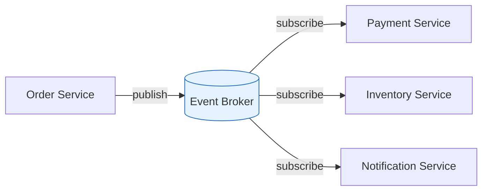
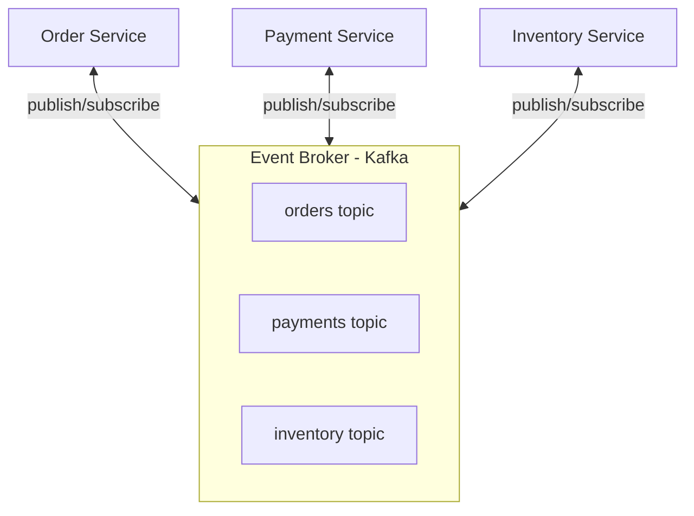

# Event-Driven Architecture

Event-driven architecture (EDA) uses events to trigger and communicate between decoupled services.

## Visualization




---

## Core Concepts

### Event
A record of something that happened.

```json
{
  "event_type": "OrderCreated",
  "timestamp": "2024-01-15T10:30:00Z",
  "data": {
    "order_id": "12345",
    "user_id": "user_789",
    "total": 99.99
  }
}
```

### Event Producer
Service that publishes events.

### Event Consumer
Service that reacts to events.

### Event Broker
Infrastructure that routes events (Kafka, RabbitMQ).

---

## Architecture



---

## Event Patterns

### 1. Event Notification
Notify that something happened, minimal data.

```json
{
  "event_type": "OrderCreated",
  "order_id": "12345"
}

// Consumer fetches full data if needed
GET /orders/12345
```

**Pros**: Small events, up-to-date data
**Cons**: Requires API call, coupling

### 2. Event-Carried State Transfer
Include all relevant data in event.

```json
{
  "event_type": "OrderCreated",
  "data": {
    "order_id": "12345",
    "user_id": "user_789",
    "items": [...],
    "total": 99.99,
    "shipping_address": {...}
  }
}
```

**Pros**: No API calls needed, decoupled
**Cons**: Larger events, data might be stale

### 3. Event Sourcing
Store state changes as sequence of events.

```json
// Instead of storing current state:
{ "balance": 150 }

// Store all events:
{ "type": "AccountCreated", "balance": 0 }
{ "type": "Deposit", "amount": 100 }
{ "type": "Deposit", "amount": 100 }
{ "type": "Withdrawal", "amount": 50 }
// Current state = replay events
```

**Pros**: Full audit trail, can rebuild state
**Cons**: Complex queries, storage growth

---

## Sync vs Async

### Synchronous
```
User → Order Service → Payment Service → Inventory → Response
                    (waits for each step)
```

**When to use**: Need immediate confirmation

### Asynchronous
```
User → Order Service → Response ("Order received")
                    ↓
            [Event: OrderCreated]
                    ↓
         ┌─────────┴─────────┐
         ↓                   ↓
   Payment Service     Inventory Service
```

**When to use**: Long-running tasks, decoupling needed

---

## Implementation

### Producer (Python + Kafka)

```python
from kafka import KafkaProducer
import json

producer = KafkaProducer(
    bootstrap_servers=['localhost:9092'],
    value_serializer=lambda v: json.dumps(v).encode('utf-8')
)

def create_order(order_data):
    # Save to database
    order = save_order(order_data)

    # Publish event
    event = {
        'event_type': 'OrderCreated',
        'timestamp': datetime.utcnow().isoformat(),
        'data': {
            'order_id': order.id,
            'user_id': order.user_id,
            'total': order.total
        }
    }
    producer.send('orders', event)
    producer.flush()

    return order
```

### Consumer (Python + Kafka)

```python
from kafka import KafkaConsumer
import json

consumer = KafkaConsumer(
    'orders',
    bootstrap_servers=['localhost:9092'],
    group_id='payment-service',
    value_deserializer=lambda m: json.loads(m.decode('utf-8'))
)

for message in consumer:
    event = message.value

    if event['event_type'] == 'OrderCreated':
        process_payment(event['data'])
    elif event['event_type'] == 'OrderCancelled':
        refund_payment(event['data'])
```

---

## Challenges

### 1. Event Ordering
```
Events might arrive out of order

Solution:
- Partition by entity ID (all user events to same partition)
- Include sequence numbers
- Idempotent consumers
```

### 2. Exactly-Once Processing
```
Consumer might process same event twice

Solutions:
- Idempotent operations
- Store processed event IDs
- Use transactional outbox pattern
```

### 3. Schema Evolution
```json
// Version 1
{ "user_id": "123" }

// Version 2 (added field)
{ "user_id": "123", "email": "user@example.com" }

Solutions:
- Schema registry (Avro, Protobuf)
- Backward/forward compatible changes
```

---

## Transactional Outbox Pattern

Ensure events are published exactly once.

```
Instead of:
1. Save to DB
2. Publish event (might fail!)

Use outbox:
1. Save to DB + write to outbox table (single transaction)
2. Background process reads outbox, publishes events
3. Mark as published

┌─────────────────────────────────────┐
│          Order Service              │
│  ┌─────────────┐ ┌───────────────┐  │
│  │   Orders    │ │    Outbox     │  │
│  │   Table     │ │    Table      │  │
│  └─────────────┘ └───────────────┘  │
│          ↑              ↓           │
│     Transaction    Background       │
│                    Publisher        │
└─────────────────────────────────────┘
                          ↓
                   [Event Broker]
```

---

## Benefits

1. **Loose coupling**: Services don't know about each other
2. **Scalability**: Scale consumers independently
3. **Resilience**: Broker handles failures
4. **Audit trail**: Events provide history
5. **Flexibility**: Add new consumers easily

---

## Interview Talking Points

1. **When to use**: Decoupling, async processing, audit needs
2. **Event types**: Notification vs state transfer vs sourcing
3. **Challenges**: Ordering, exactly-once, schema evolution
4. **Patterns**: Outbox, saga, CQRS
5. **Tools**: Kafka, RabbitMQ, AWS EventBridge
