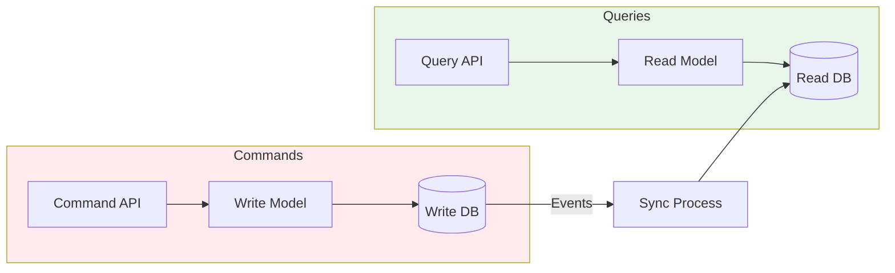

# CQRS (Command Query Responsibility Segregation)

CQRS separates read and write operations into different models, allowing independent optimization of each.

## Visualization




---

## The Problem

```
Traditional: Single model for reads and writes

┌─────────────────────────────────────────┐
│              Application                │
│    ┌─────────────────────────────┐     │
│    │       Single Model          │     │
│    │   (User, Order, Product)    │     │
│    └─────────────────────────────┘     │
│                  ↓                      │
│    ┌─────────────────────────────┐     │
│    │       Single Database       │     │
│    └─────────────────────────────┘     │
└─────────────────────────────────────────┘

Issues:
- Read queries need denormalized data → complex joins
- Write operations need normalized data → simpler writes
- Can't scale reads and writes independently
- Complex queries slow down writes
```

---

## CQRS Solution

```
┌────────────────────────────────────────────────────────────────┐
│                        Application                              │
│                                                                 │
│   ┌─────────────────┐              ┌─────────────────┐         │
│   │   Write Model   │              │   Read Model    │         │
│   │   (Commands)    │              │   (Queries)     │         │
│   └────────┬────────┘              └────────┬────────┘         │
│            │                                │                   │
│            ↓                                ↓                   │
│   ┌─────────────────┐              ┌─────────────────┐         │
│   │  Write Database │ ──events──→  │  Read Database  │         │
│   │  (normalized)   │              │ (denormalized)  │         │
│   └─────────────────┘              └─────────────────┘         │
└────────────────────────────────────────────────────────────────┘
```

---

## Commands vs Queries

### Commands (Write)
Intent to change state.

```python
class CreateOrderCommand:
    user_id: str
    items: List[OrderItem]
    shipping_address: Address

class CommandHandler:
    def handle_create_order(self, command: CreateOrderCommand):
        # Validate
        user = self.user_repo.get(command.user_id)
        if not user.is_active:
            raise ValidationError("User not active")

        # Create aggregate
        order = Order.create(
            user_id=command.user_id,
            items=command.items,
            shipping_address=command.shipping_address
        )

        # Persist
        self.order_repo.save(order)

        # Publish event
        self.event_bus.publish(OrderCreatedEvent(order))
```

### Queries (Read)
Retrieve data without side effects.

```python
class GetOrderDetailsQuery:
    order_id: str

class QueryHandler:
    def handle_get_order_details(self, query: GetOrderDetailsQuery):
        # Read from optimized read model
        return self.read_db.query("""
            SELECT o.*, u.name, u.email,
                   json_agg(i.*) as items
            FROM orders_view o
            JOIN users_view u ON o.user_id = u.id
            JOIN order_items_view i ON o.id = i.order_id
            WHERE o.id = %s
            GROUP BY o.id, u.name, u.email
        """, query.order_id)
```

---

## Synchronization

### Event-Based Sync

```
Write Model → Events → Event Handler → Read Model

┌─────────────┐     ┌──────────────┐     ┌─────────────┐
│   Write     │     │    Event     │     │    Read     │
│  Database   │────→│    Bus       │────→│  Database   │
└─────────────┘     └──────────────┘     └─────────────┘

class OrderCreatedEventHandler:
    def handle(self, event: OrderCreatedEvent):
        # Update read model
        self.read_db.execute("""
            INSERT INTO orders_view (id, user_id, total, status, created_at)
            VALUES (%s, %s, %s, %s, %s)
        """, event.order_id, event.user_id, event.total,
             'created', event.timestamp)
```

### Change Data Capture (CDC)

```
Database → CDC (Debezium) → Kafka → Read Model Updater

Captures database changes automatically
No need to publish events manually
```

---

## Read Model Design

### Materialized Views
Pre-computed views optimized for specific queries.

```sql
-- Write model (normalized)
orders (id, user_id, status, created_at)
order_items (order_id, product_id, quantity, price)
users (id, name, email)
products (id, name, description)

-- Read model (denormalized for dashboard)
CREATE TABLE user_dashboard_view (
    user_id UUID PRIMARY KEY,
    user_name TEXT,
    total_orders INT,
    total_spent DECIMAL,
    last_order_date TIMESTAMP,
    recent_orders JSONB  -- Array of last 5 orders
);

-- Updated when OrderCreated/OrderCompleted events arrive
```

### Query-Specific Models

```python
# Different read models for different queries

# For product search
class ProductSearchModel:
    product_id: str
    name: str
    description: str
    price: float
    category: str
    rating: float
    review_count: int
    # Stored in Elasticsearch for full-text search

# For product page
class ProductDetailModel:
    product_id: str
    name: str
    description: str
    price: float
    images: List[str]
    specifications: Dict
    reviews: List[Review]
    related_products: List[ProductSummary]
    # Stored in Redis for fast access
```

---

## Eventual Consistency

```
Timeline:
T1: User creates order (write model updated)
T2: Event published
T3: Read model handler processes event
T4: Read model updated

Between T1 and T4: Read model is stale

Strategies:
1. Accept eventual consistency (most cases)
2. Read-your-writes consistency (route recent writers to write DB)
3. Show pending indicator to user
```

```python
class OrderService:
    def create_order(self, command):
        order = self.write_handler.create_order(command)

        # Cache the write for read-your-writes consistency
        self.cache.set(
            f"order:{order.id}",
            order,
            ttl=60  # 60 seconds, enough for sync
        )
        return order

    def get_order(self, user_id, order_id):
        # Check cache first (recent write)
        cached = self.cache.get(f"order:{order_id}")
        if cached and cached.user_id == user_id:
            return cached

        # Otherwise use read model
        return self.read_handler.get_order(order_id)
```

---

## When to Use CQRS

### Good Fit
- High read-to-write ratio (10:1 or more)
- Complex read queries (dashboards, reports)
- Different scaling needs for reads vs writes
- Event sourcing architecture
- Multiple read models for different use cases

### Poor Fit
- Simple CRUD applications
- Low traffic systems
- Real-time consistency required
- Small team / limited resources

---

## Architecture Variations

### Simple CQRS (Same Database)
```
API → Command Handler → Database
    ↘                 ↗
      Query Handler
```

### CQRS with Separate Databases
```
Command Handler → Write DB
                      ↓ (events)
Query Handler ← Read DB
```

### CQRS with Event Sourcing
```
Command Handler → Event Store
                      ↓ (events)
Query Handler ← Read DB (projections)
```

---

## Interview Talking Points

1. **Problem solved**: Read/write optimization mismatch
2. **Trade-offs**: Complexity, eventual consistency
3. **Sync strategies**: Events, CDC
4. **Read models**: Denormalized, query-specific
5. **When to use**: High read ratio, complex queries
