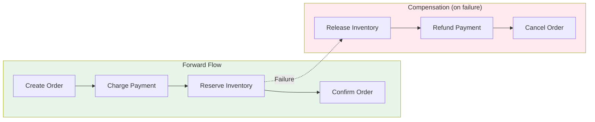
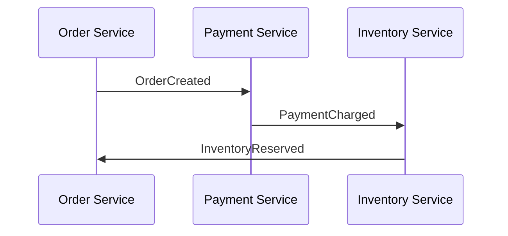
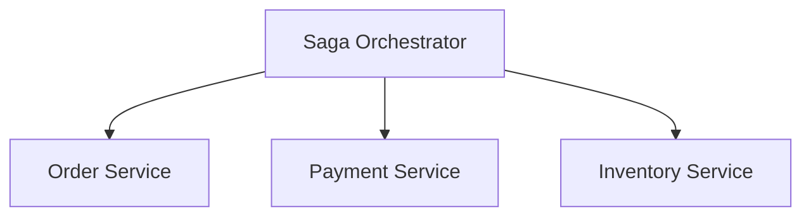

# Saga Pattern

The Saga pattern manages distributed transactions across multiple services without using traditional two-phase commit.

## Visualization




---

## The Problem

```
Traditional Transaction (Monolith):
BEGIN TRANSACTION
  1. Deduct from account A
  2. Add to account B
  3. Log the transfer
COMMIT

Distributed Services:
User Service ──→ Payment Service ──→ Inventory Service
        (Each has its own database)
        (No shared transaction!)

What if Payment succeeds but Inventory fails?
```

---

## Saga Solution

A saga is a sequence of local transactions. If a step fails, compensating transactions undo previous steps.

```
Forward Flow:
Order Created → Payment Charged → Inventory Reserved → Order Confirmed

Compensation (if Inventory fails):
Inventory Failed → Refund Payment → Cancel Order
```

---

## Saga Types

### Choreography (Event-Based)

Services communicate through events, no central coordinator.



```python
# Payment Service
class PaymentEventHandler:
    def handle_order_created(self, event):
        try:
            payment = self.charge_customer(event.user_id, event.total)
            self.publish(PaymentChargedEvent(
                order_id=event.order_id,
                payment_id=payment.id
            ))
        except PaymentFailedError:
            self.publish(PaymentFailedEvent(order_id=event.order_id))

    def handle_inventory_failed(self, event):
        # Compensating transaction
        self.refund_customer(event.payment_id)
        self.publish(PaymentRefundedEvent(order_id=event.order_id))
```

**Pros**: Loosely coupled, simple services
**Cons**: Hard to track, complex failure handling

### Orchestration (Central Coordinator)

A central orchestrator directs the saga.



```python
class OrderSagaOrchestrator:
    def execute(self, order_request):
        # Step 1: Create Order
        order = self.order_service.create(order_request)
        if not order:
            return SagaResult.FAILED

        # Step 2: Process Payment
        payment = self.payment_service.charge(order.user_id, order.total)
        if not payment:
            # Compensate
            self.order_service.cancel(order.id)
            return SagaResult.FAILED

        # Step 3: Reserve Inventory
        inventory = self.inventory_service.reserve(order.items)
        if not inventory:
            # Compensate
            self.payment_service.refund(payment.id)
            self.order_service.cancel(order.id)
            return SagaResult.FAILED

        # Step 4: Confirm Order
        self.order_service.confirm(order.id)
        return SagaResult.SUCCESS
```

**Pros**: Clear flow, easier to understand, centralized error handling
**Cons**: Single point of failure, orchestrator coupling

---

## State Machine Implementation

```python
from enum import Enum

class OrderSagaState(Enum):
    STARTED = "started"
    PAYMENT_PENDING = "payment_pending"
    PAYMENT_COMPLETED = "payment_completed"
    INVENTORY_PENDING = "inventory_pending"
    COMPLETED = "completed"
    COMPENSATING = "compensating"
    FAILED = "failed"

class OrderSaga:
    def __init__(self, order_id):
        self.order_id = order_id
        self.state = OrderSagaState.STARTED
        self.payment_id = None
        self.inventory_reservation_id = None

    def transition(self, event):
        transitions = {
            (OrderSagaState.STARTED, "OrderCreated"):
                (OrderSagaState.PAYMENT_PENDING, self.request_payment),

            (OrderSagaState.PAYMENT_PENDING, "PaymentCharged"):
                (OrderSagaState.INVENTORY_PENDING, self.reserve_inventory),

            (OrderSagaState.PAYMENT_PENDING, "PaymentFailed"):
                (OrderSagaState.FAILED, self.cancel_order),

            (OrderSagaState.INVENTORY_PENDING, "InventoryReserved"):
                (OrderSagaState.COMPLETED, self.confirm_order),

            (OrderSagaState.INVENTORY_PENDING, "InventoryFailed"):
                (OrderSagaState.COMPENSATING, self.refund_payment),

            (OrderSagaState.COMPENSATING, "PaymentRefunded"):
                (OrderSagaState.FAILED, self.cancel_order),
        }

        key = (self.state, event.type)
        if key in transitions:
            new_state, action = transitions[key]
            self.state = new_state
            action(event)
```

---

## Compensating Transactions

Each step needs a compensating action.

| Step | Action | Compensation |
|------|--------|--------------|
| 1 | Create Order | Cancel Order |
| 2 | Charge Payment | Refund Payment |
| 3 | Reserve Inventory | Release Inventory |
| 4 | Ship Order | ??? (hard to undo!) |

### Semantic Compensation

When you can't truly undo (e.g., shipped order):

```python
def compensate_shipment(order_id):
    # Can't un-ship, but can:
    # 1. Create return label
    # 2. Notify customer
    # 3. Schedule pickup
    # 4. Issue refund when returned
```

---

## Handling Failures

### Retry Logic

```python
class SagaStep:
    def __init__(self, action, compensation, max_retries=3):
        self.action = action
        self.compensation = compensation
        self.max_retries = max_retries

    def execute(self, data):
        for attempt in range(self.max_retries):
            try:
                return self.action(data)
            except TransientError:
                if attempt == self.max_retries - 1:
                    raise
                time.sleep(2 ** attempt)  # Exponential backoff
```

### Saga Persistence

```sql
CREATE TABLE sagas (
    id UUID PRIMARY KEY,
    type VARCHAR(50),
    state VARCHAR(50),
    data JSONB,
    current_step INT,
    created_at TIMESTAMP,
    updated_at TIMESTAMP
);

CREATE TABLE saga_events (
    id UUID PRIMARY KEY,
    saga_id UUID REFERENCES sagas(id),
    event_type VARCHAR(50),
    event_data JSONB,
    created_at TIMESTAMP
);
```

---

## Example: E-Commerce Order Saga

```
┌───────────────────────────────────────────────────────────────────────────┐
│                         Order Saga                                         │
│                                                                            │
│  ┌─────────┐    ┌─────────┐    ┌─────────┐    ┌─────────┐    ┌─────────┐ │
│  │ Create  │───→│ Process │───→│ Reserve │───→│ Create  │───→│ Confirm │ │
│  │ Order   │    │ Payment │    │ Stock   │    │Shipment │    │ Order   │ │
│  └─────────┘    └─────────┘    └─────────┘    └─────────┘    └─────────┘ │
│       │              │              │              │                      │
│       ↓              ↓              ↓              ↓                      │
│  ┌─────────┐    ┌─────────┐    ┌─────────┐    ┌─────────┐                │
│  │ Cancel  │←───│ Refund  │←───│ Release │←───│ Cancel  │                │
│  │ Order   │    │ Payment │    │ Stock   │    │Shipment │                │
│  └─────────┘    └─────────┘    └─────────┘    └─────────┘                │
│  (Compensations)                                                          │
└───────────────────────────────────────────────────────────────────────────┘
```

---

## Comparison

| Aspect | Choreography | Orchestration |
|--------|--------------|---------------|
| Coupling | Loose | Tight to orchestrator |
| Visibility | Hard to see full flow | Clear, centralized |
| Failure handling | Distributed | Centralized |
| Testing | Complex | Easier |
| Single point of failure | No | Orchestrator |

---

## Interview Talking Points

1. **Problem**: Distributed transactions without 2PC
2. **Types**: Choreography vs orchestration
3. **Compensation**: Every step needs an undo
4. **State machine**: Track saga progress
5. **Trade-offs**: Eventual consistency, complexity
