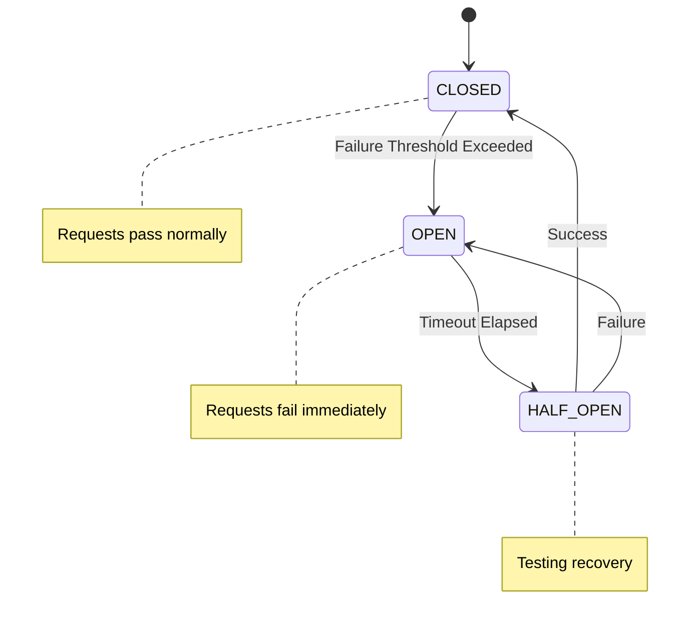

# Circuit Breaker Pattern

The Circuit Breaker pattern prevents cascade failures by stopping requests to a failing service.

## State Diagram




---

## The Problem

```
Normal Flow:
Service A → Service B → Service C → Database

If Service C is slow/down:
Service A → Service B → Service C (timeout 30s)
                              ↓
Thread blocked, resources exhausted
                              ↓
Service B becomes slow → Service A becomes slow
                              ↓
Entire system fails (cascade failure)
```

---

## Circuit Breaker Solution

```
         ┌─────────────────────────────────────┐
         │         Circuit Breaker             │
         │                                     │
         │   CLOSED → OPEN → HALF-OPEN → CLOSED │
         │                                     │
         └─────────────────────────────────────┘

CLOSED: Requests pass through normally
OPEN: Requests fail immediately (fast failure)
HALF-OPEN: Test if service recovered
```

---

## State Transitions

```
        ┌──────────────────────────────────────────────────┐
        │                                                  │
        │              Failure threshold                   │
        │                 exceeded                         │
        ↓                                                  │
    ┌────────┐              ┌────────┐              ┌────────────┐
    │ CLOSED │──────────────→│  OPEN  │──────────────→│ HALF-OPEN  │
    └────────┘              └────────┘              └────────────┘
        ↑                                                  │
        │                                                  │
        │              Success in                          │
        │              half-open                           │
        └──────────────────────────────────────────────────┘
                                │
                                │ Failure in half-open
                                ↓
                           ┌────────┐
                           │  OPEN  │
                           └────────┘
```

---

## Implementation

```python
import time
from enum import Enum
from threading import Lock

class CircuitState(Enum):
    CLOSED = "closed"
    OPEN = "open"
    HALF_OPEN = "half_open"

class CircuitBreaker:
    def __init__(
        self,
        failure_threshold: int = 5,
        recovery_timeout: int = 30,
        half_open_max_calls: int = 3
    ):
        self.failure_threshold = failure_threshold
        self.recovery_timeout = recovery_timeout
        self.half_open_max_calls = half_open_max_calls

        self.state = CircuitState.CLOSED
        self.failure_count = 0
        self.success_count = 0
        self.last_failure_time = None
        self.half_open_calls = 0
        self.lock = Lock()

    def call(self, func, *args, **kwargs):
        with self.lock:
            if self.state == CircuitState.OPEN:
                if self._should_try_reset():
                    self.state = CircuitState.HALF_OPEN
                    self.half_open_calls = 0
                else:
                    raise CircuitOpenError("Circuit is OPEN")

            if self.state == CircuitState.HALF_OPEN:
                if self.half_open_calls >= self.half_open_max_calls:
                    raise CircuitOpenError("Circuit is HALF-OPEN, max calls reached")
                self.half_open_calls += 1

        try:
            result = func(*args, **kwargs)
            self._on_success()
            return result
        except Exception as e:
            self._on_failure()
            raise

    def _on_success(self):
        with self.lock:
            if self.state == CircuitState.HALF_OPEN:
                self.success_count += 1
                if self.success_count >= self.half_open_max_calls:
                    self._reset()
            else:
                self.failure_count = 0

    def _on_failure(self):
        with self.lock:
            self.failure_count += 1
            self.last_failure_time = time.time()

            if self.state == CircuitState.HALF_OPEN:
                self.state = CircuitState.OPEN
            elif self.failure_count >= self.failure_threshold:
                self.state = CircuitState.OPEN

    def _should_try_reset(self):
        return (
            self.last_failure_time is not None and
            time.time() - self.last_failure_time >= self.recovery_timeout
        )

    def _reset(self):
        self.state = CircuitState.CLOSED
        self.failure_count = 0
        self.success_count = 0
        self.half_open_calls = 0
```

---

## Usage

```python
# Create circuit breaker for each external service
payment_circuit = CircuitBreaker(
    failure_threshold=5,
    recovery_timeout=30
)

class PaymentService:
    def charge(self, user_id, amount):
        try:
            return payment_circuit.call(
                self._call_payment_api,
                user_id,
                amount
            )
        except CircuitOpenError:
            # Fallback: queue for later processing
            self.queue_payment(user_id, amount)
            return PaymentResult(status="pending")

    def _call_payment_api(self, user_id, amount):
        response = requests.post(
            "https://payment-api.com/charge",
            json={"user_id": user_id, "amount": amount},
            timeout=5
        )
        response.raise_for_status()
        return response.json()
```

---

## Fallback Strategies

### 1. Default Value
```python
def get_recommendations(user_id):
    try:
        return circuit.call(recommendation_service.get, user_id)
    except CircuitOpenError:
        return DEFAULT_RECOMMENDATIONS  # Static fallback
```

### 2. Cache
```python
def get_product(product_id):
    try:
        product = circuit.call(product_service.get, product_id)
        cache.set(f"product:{product_id}", product)
        return product
    except CircuitOpenError:
        return cache.get(f"product:{product_id}")  # Stale cache
```

### 3. Queue for Later
```python
def send_notification(user_id, message):
    try:
        circuit.call(notification_service.send, user_id, message)
    except CircuitOpenError:
        queue.add(NotificationTask(user_id, message))  # Retry later
```

### 4. Graceful Degradation
```python
def get_dashboard(user_id):
    dashboard = {}

    # Essential data - fail if unavailable
    dashboard['account'] = account_service.get(user_id)

    # Optional data - degrade gracefully
    try:
        dashboard['recommendations'] = rec_circuit.call(
            recommendation_service.get, user_id
        )
    except CircuitOpenError:
        dashboard['recommendations'] = None

    return dashboard
```

---

## Monitoring

```python
class CircuitBreakerMetrics:
    def __init__(self, circuit_breaker, name):
        self.circuit = circuit_breaker
        self.name = name

    def report(self):
        return {
            "circuit_name": self.name,
            "state": self.circuit.state.value,
            "failure_count": self.circuit.failure_count,
            "last_failure": self.circuit.last_failure_time,
            "is_healthy": self.circuit.state == CircuitState.CLOSED
        }

# Dashboard alerts:
# - Circuit OPEN for > 5 minutes
# - High failure rate approaching threshold
# - Frequent state changes (flapping)
```

---

## Libraries

| Language | Library |
|----------|---------|
| Python | `pybreaker`, `circuitbreaker` |
| Java | `resilience4j`, `Hystrix` (deprecated) |
| Go | `sony/gobreaker`, `hystrix-go` |
| JavaScript | `opossum` |

### Resilience4j Example (Java)

```java
CircuitBreakerConfig config = CircuitBreakerConfig.custom()
    .failureRateThreshold(50)
    .waitDurationInOpenState(Duration.ofSeconds(30))
    .permittedNumberOfCallsInHalfOpenState(3)
    .build();

CircuitBreaker circuitBreaker = CircuitBreaker.of("payment", config);

Supplier<PaymentResult> supplier = CircuitBreaker
    .decorateSupplier(circuitBreaker, () -> paymentService.charge(amount));

Try<PaymentResult> result = Try.ofSupplier(supplier)
    .recover(CircuitBreakerOpenException.class, ex -> fallbackPayment());
```

---

## Related Patterns

### Bulkhead
Isolate resources to prevent failure spread.

```python
# Separate thread pools for different services
payment_pool = ThreadPoolExecutor(max_workers=10)
inventory_pool = ThreadPoolExecutor(max_workers=10)

# Payment failures don't exhaust inventory threads
```

### Retry with Backoff
Retry transient failures before circuit opens.

```python
@retry(
    stop=stop_after_attempt(3),
    wait=wait_exponential(multiplier=1, max=10)
)
def call_service():
    return requests.get("http://service/api")
```

---

## Interview Talking Points

1. **Problem**: Cascade failures, resource exhaustion
2. **States**: Closed, Open, Half-Open
3. **Configuration**: Failure threshold, timeout, test calls
4. **Fallbacks**: Cache, default, queue, degradation
5. **Monitoring**: Track state changes, alert on issues
