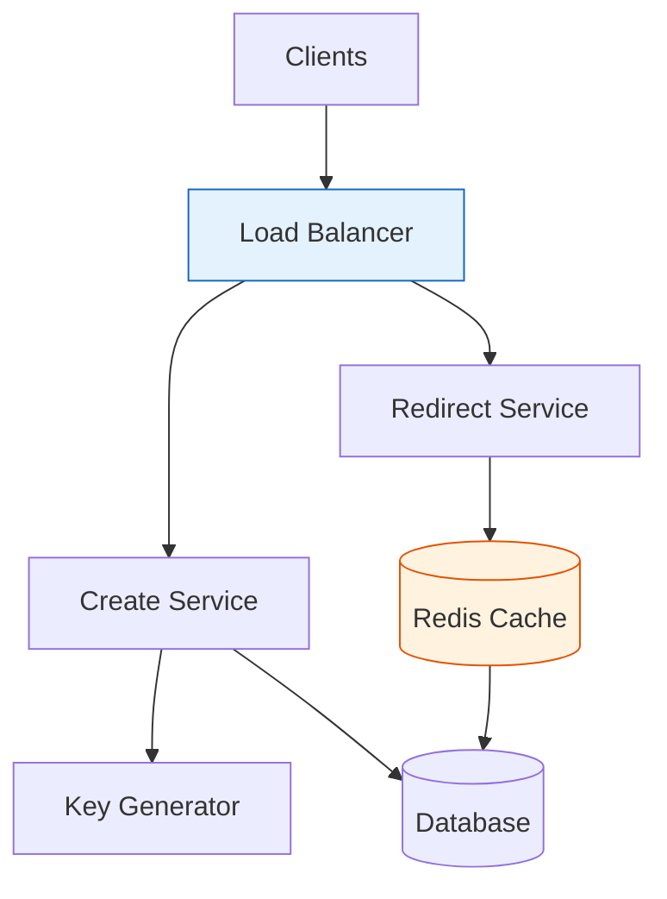
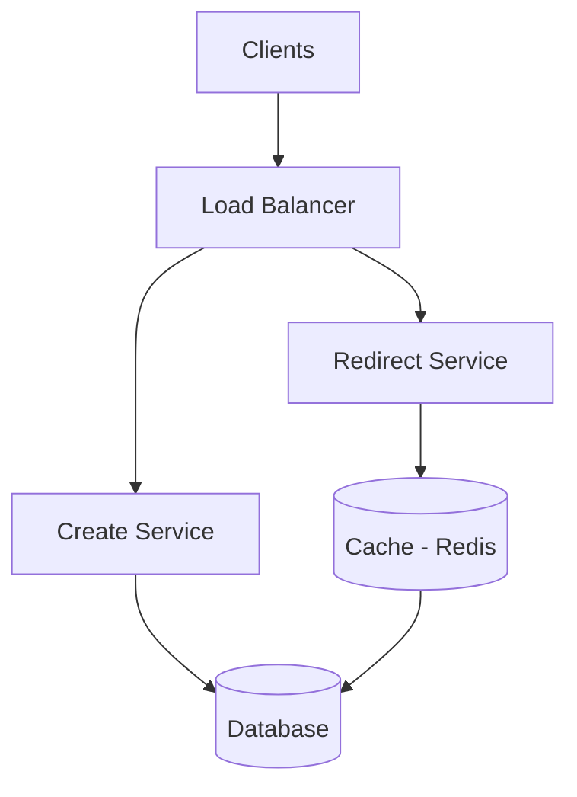

# Design URL Shortener (TinyURL)

A classic system design problem that covers core concepts in a manageable scope.

## Architecture Overview




---

## 1. Requirements

### Functional Requirements
- Given a URL, generate a shorter unique alias
- When user accesses short URL, redirect to original
- Optional: Custom short links
- Optional: Link expiration
- Optional: Analytics (click count)

### Non-Functional Requirements
- High availability (URL shortener is a critical path)
- Low latency redirection
- Links should not be predictable (security)

### Out of Scope
- User accounts
- Spam detection
- Rate limiting (would be at API gateway)

---

## 2. Estimation

### Scale
- 100M new URLs per month
- Read:Write ratio = 100:1 (redirects vs creates)
- 10B redirects per month

### Traffic
```
Writes: 100M / (30 × 24 × 3600) ≈ 40 URLs/sec
Reads: 100 × 40 = 4000 redirects/sec
Peak (2x): 8000 redirects/sec
```

### Storage
```
Each URL record: ~500 bytes
- Short URL: 7 chars = 7 bytes
- Long URL: avg 100 chars = 100 bytes
- Created at: 8 bytes
- Expiration: 8 bytes
- Metadata: ~300 bytes

100M URLs/month × 500 bytes = 50 GB/month
5 years: 50 GB × 60 = 3 TB
```

### URL Space
```
Short URL: 7 characters (a-z, A-Z, 0-9 = 62 chars)
62^7 = 3.5 trillion combinations (more than enough)
```

---

## 3. High Level Design



---

## 4. API Design

### Create Short URL
```http
POST /api/v1/urls
Content-Type: application/json

{
  "long_url": "https://example.com/very/long/path",
  "custom_alias": "my-link",     // optional
  "expires_at": "2025-12-31"     // optional
}

Response:
{
  "short_url": "https://tinyurl.com/abc123X",
  "long_url": "https://example.com/very/long/path",
  "expires_at": "2025-12-31T00:00:00Z"
}
```

### Redirect
```http
GET /abc123X

Response:
HTTP 301 Moved Permanently
Location: https://example.com/very/long/path
```

### Get Analytics (Optional)
```http
GET /api/v1/urls/abc123X/stats

Response:
{
  "short_url": "abc123X",
  "click_count": 12345,
  "created_at": "2024-01-15T10:30:00Z"
}
```

---

## 5. Data Model

### URL Table
```sql
CREATE TABLE urls (
    id BIGINT PRIMARY KEY,           -- Internal ID
    short_code VARCHAR(10) UNIQUE,   -- abc123X
    long_url TEXT NOT NULL,
    created_at TIMESTAMP DEFAULT NOW(),
    expires_at TIMESTAMP,
    click_count BIGINT DEFAULT 0
);

CREATE INDEX idx_short_code ON urls(short_code);
```

### Database Choice
- **PostgreSQL**: ACID compliance, good for writes
- **Cassandra**: If extreme scale needed (billions of URLs)

---

## 6. Short URL Generation

### Option 1: Counter + Base62 Encoding

```python
import string

ALPHABET = string.ascii_letters + string.digits  # 62 chars

def encode_base62(num):
    if num == 0:
        return ALPHABET[0]

    result = []
    while num:
        num, remainder = divmod(num, 62)
        result.append(ALPHABET[remainder])

    return ''.join(reversed(result))

# Counter: 1000000 → encode_base62(1000000) = "4c92"
```

**Challenge**: Single counter is bottleneck
**Solution**: Range-based counter assignment

```
Server 1: counter range 1-1,000,000
Server 2: counter range 1,000,001-2,000,000
Server 3: counter range 2,000,001-3,000,000

Each server increments within its range
Request new range from ZooKeeper/Redis when exhausted
```

### Option 2: Hash + Collision Handling

```python
import hashlib

def generate_short_code(long_url):
    # MD5 hash (128 bits)
    hash_value = hashlib.md5(long_url.encode()).hexdigest()

    # Take first 7 characters of base62 encoding
    short_code = encode_base62(int(hash_value[:12], 16))[:7]

    # Handle collision
    while exists_in_db(short_code):
        short_code = encode_base62(int(hash_value[:12], 16) + random.randint(1, 1000))[:7]

    return short_code
```

### Option 3: Pre-generated Keys

```
1. Background service generates random 7-char codes
2. Stores in key_db table (unused keys)
3. When needed, claim a key from the pool

Pros: Fast, no collision
Cons: Need to manage key pool
```

---

## 7. Caching Strategy

```
Read Flow:
1. Check Redis cache for short_code → long_url
2. If hit: redirect (most cases)
3. If miss: query database, cache result, redirect

Cache Policy:
- LRU eviction
- TTL: 24 hours (adjust based on traffic patterns)
- Cache size: Top 20% of URLs (Pareto principle)
```

```python
class URLService:
    def get_long_url(self, short_code):
        # Try cache
        cached = redis.get(f"url:{short_code}")
        if cached:
            return cached

        # Cache miss
        url_record = db.query("SELECT long_url FROM urls WHERE short_code = %s", short_code)
        if url_record:
            redis.setex(f"url:{short_code}", 86400, url_record.long_url)
            return url_record.long_url

        return None
```

---

## 8. Analytics (Optional)

### Async Click Counting

```python
def redirect(short_code):
    long_url = get_long_url(short_code)

    # Async increment (don't block redirect)
    kafka.send('click_events', {
        'short_code': short_code,
        'timestamp': datetime.now(),
        'user_agent': request.user_agent,
        'ip': request.remote_addr
    })

    return redirect(long_url, code=301)

# Background consumer aggregates clicks
```

---

## 9. 301 vs 302 Redirect

| Code | Type | Browser Caches | Use Case |
|------|------|----------------|----------|
| 301 | Permanent | Yes | SEO benefit, faster subsequent requests |
| 302 | Temporary | No | Need to track every click |

Recommendation: 301 for performance, 302 if analytics are critical.

---

## 10. Scaling

### Read Scaling
- Add more redirect service instances
- Increase cache size
- Database read replicas

### Write Scaling
- Multiple create service instances with counter ranges
- Database sharding by short_code (consistent hashing)

### High Availability
```
Region 1                  Region 2
┌─────────────────┐      ┌─────────────────┐
│  Load Balancer  │      │  Load Balancer  │
│  Redis Cluster  │←────→│  Redis Cluster  │
│  DB Primary     │      │  DB Replica     │
└─────────────────┘      └─────────────────┘
```

---

## 11. Summary

| Component | Choice | Reason |
|-----------|--------|--------|
| Database | PostgreSQL | ACID, handles our scale |
| Cache | Redis | Low latency, high throughput |
| URL Generation | Counter + Base62 | Simple, no collisions |
| Redirect | 301 | Performance (cache in browser) |
