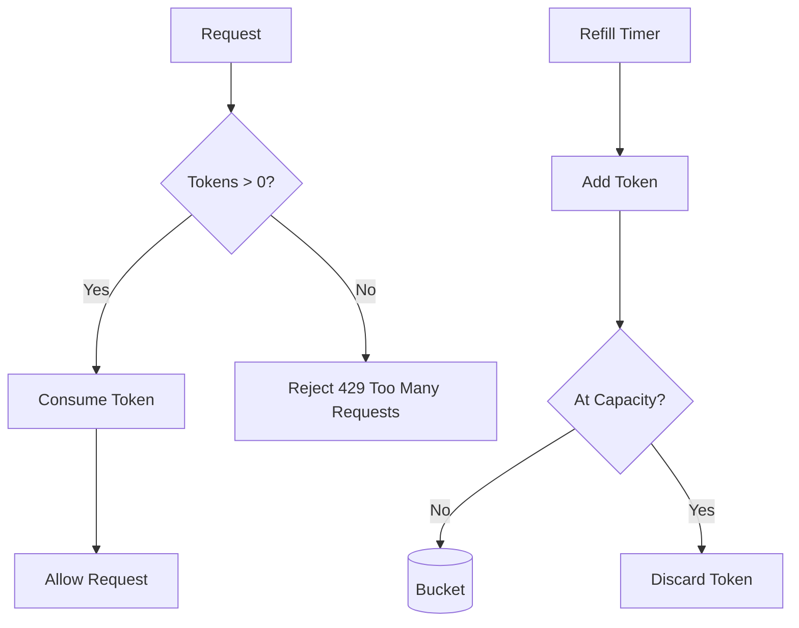
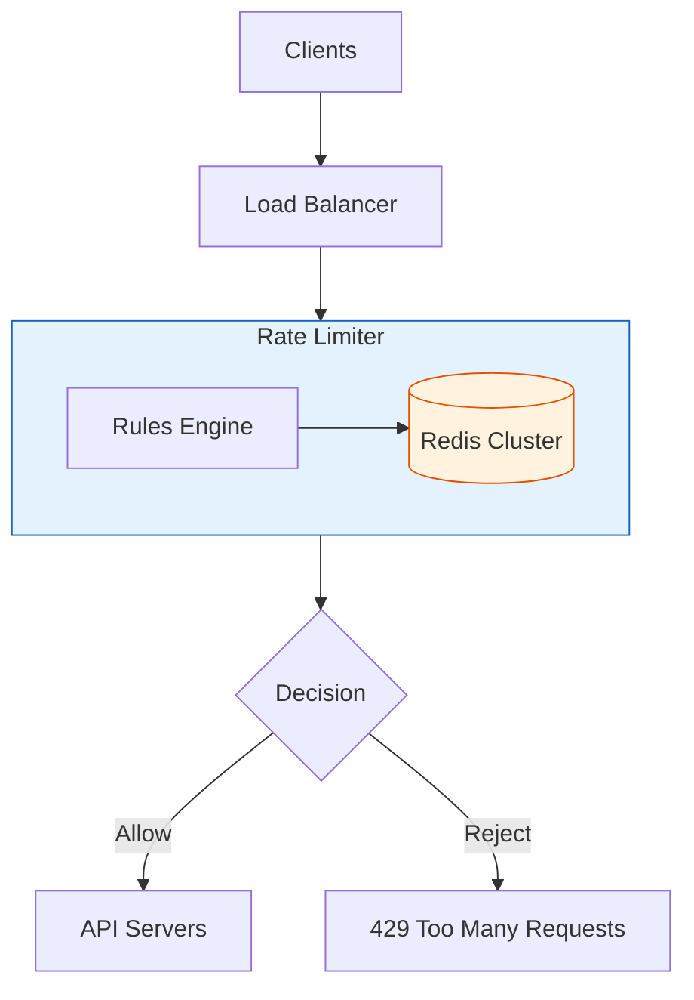

# Design Rate Limiter

A rate limiter controls the rate of requests a client can send to an API within a time window.

---

## 1. Requirements

### Functional
- Limit requests per client (user ID, IP, API key)
- Support different rate limits for different APIs
- Return appropriate response when limit exceeded
- Distributed rate limiting (multiple servers)

### Non-Functional
- Low latency (< 1ms overhead)
- High availability
- Accurate limiting (no significant over/under limiting)
- Scalable to millions of users

---

## 2. Rate Limiting Algorithms

### Token Bucket

```
Bucket capacity: 10 tokens
Refill rate: 1 token/second

Request comes in:
- If tokens > 0: Remove token, allow request
- If tokens = 0: Reject request

┌─────────────────────────────────────┐
│  Bucket (capacity: 10)              │
│  [●][●][●][●][●][○][○][○][○][○]    │
│   5 tokens remaining                │
└─────────────────────────────────────┘
          ↑
    Refill: 1 token/sec
```

### Token Bucket Flowchart




```python
import time
from threading import Lock

class TokenBucket:
    def __init__(self, capacity: int, refill_rate: float):
        self.capacity = capacity
        self.tokens = capacity
        self.refill_rate = refill_rate  # tokens per second
        self.last_refill = time.time()
        self.lock = Lock()

    def allow_request(self) -> bool:
        with self.lock:
            self._refill()
            if self.tokens >= 1:
                self.tokens -= 1
                return True
            return False

    def _refill(self):
        now = time.time()
        elapsed = now - self.last_refill
        tokens_to_add = elapsed * self.refill_rate
        self.tokens = min(self.capacity, self.tokens + tokens_to_add)
        self.last_refill = now
```

**Pros**: Handles bursts, smooth rate limiting
**Cons**: Memory for each bucket

### Leaky Bucket

```
Requests enter bucket, processed at fixed rate

         ┌───────────────┐
Request →│   Queue       │
         │ [R][R][R][R]  │
         └───────┬───────┘
                 │ Fixed rate output
                 ↓
            Process
```

```python
from collections import deque
import time

class LeakyBucket:
    def __init__(self, capacity: int, leak_rate: float):
        self.capacity = capacity
        self.queue = deque()
        self.leak_rate = leak_rate  # requests per second
        self.last_leak = time.time()

    def allow_request(self, request) -> bool:
        self._leak()
        if len(self.queue) < self.capacity:
            self.queue.append(request)
            return True
        return False

    def _leak(self):
        now = time.time()
        elapsed = now - self.last_leak
        leaks = int(elapsed * self.leak_rate)
        for _ in range(min(leaks, len(self.queue))):
            self.queue.popleft()
        self.last_leak = now
```

**Pros**: Smooth output rate, prevents bursts
**Cons**: Bursts may be dropped even if capacity available later

### Fixed Window Counter

```
Window: 1 minute, Limit: 100 requests

Time:     |-------- Minute 1 --------|-------- Minute 2 --------|
Requests: [######### 85 ##########]  [### 20 ###................]
                     ✓                      ✓
```

```python
import time

class FixedWindowCounter:
    def __init__(self, window_size: int, max_requests: int):
        self.window_size = window_size  # seconds
        self.max_requests = max_requests
        self.current_window = 0
        self.request_count = 0

    def allow_request(self) -> bool:
        current_time = int(time.time())
        window = current_time // self.window_size

        if window != self.current_window:
            self.current_window = window
            self.request_count = 0

        if self.request_count < self.max_requests:
            self.request_count += 1
            return True
        return False
```

**Pros**: Simple, memory efficient
**Cons**: Burst at window edges (can allow 2x limit)

### Sliding Window Log

```
Keep timestamp of each request, count requests in sliding window

Now: 1:00:30
Window: 1 minute
Requests: [0:59:45, 0:59:50, 1:00:10, 1:00:20, 1:00:25]
Count in window [0:59:30 - 1:00:30]: 5
```

```python
import time
from collections import deque

class SlidingWindowLog:
    def __init__(self, window_size: int, max_requests: int):
        self.window_size = window_size
        self.max_requests = max_requests
        self.request_log = deque()

    def allow_request(self) -> bool:
        now = time.time()
        window_start = now - self.window_size

        # Remove old entries
        while self.request_log and self.request_log[0] < window_start:
            self.request_log.popleft()

        if len(self.request_log) < self.max_requests:
            self.request_log.append(now)
            return True
        return False
```

**Pros**: Accurate, no boundary issues
**Cons**: High memory (stores all timestamps)

### Sliding Window Counter (Hybrid)

```
Combines fixed window efficiency with sliding window accuracy

Previous window: 80 requests
Current window: 30 requests (50% elapsed)

Weighted count = 80 * 0.5 + 30 = 70
```

```python
import time

class SlidingWindowCounter:
    def __init__(self, window_size: int, max_requests: int):
        self.window_size = window_size
        self.max_requests = max_requests
        self.prev_count = 0
        self.curr_count = 0
        self.curr_window = 0

    def allow_request(self) -> bool:
        now = time.time()
        curr_window = int(now) // self.window_size
        window_elapsed = (now % self.window_size) / self.window_size

        if curr_window != self.curr_window:
            self.prev_count = self.curr_count
            self.curr_count = 0
            self.curr_window = curr_window

        # Weighted count
        count = self.prev_count * (1 - window_elapsed) + self.curr_count

        if count < self.max_requests:
            self.curr_count += 1
            return True
        return False
```

**Pros**: Memory efficient, smooth limiting
**Cons**: Approximate (but good enough)

---

## 3. High Level Design




---

## 4. Distributed Rate Limiting

### Challenge
```
Server A: User sends request → Count = 1
Server B: Same user, same time → Count = 1

Both allow! User gets 2x limit.
```

### Solution: Centralized Counter (Redis)

```python
import redis
import time

class DistributedRateLimiter:
    def __init__(self, redis_client, window_size: int, max_requests: int):
        self.redis = redis_client
        self.window_size = window_size
        self.max_requests = max_requests

    def allow_request(self, client_id: str) -> bool:
        now = int(time.time())
        window = now // self.window_size
        key = f"rate:{client_id}:{window}"

        # Atomic increment
        pipe = self.redis.pipeline()
        pipe.incr(key)
        pipe.expire(key, self.window_size * 2)
        results = pipe.execute()

        count = results[0]
        return count <= self.max_requests
```

### Sliding Window with Redis

```python
def allow_request_sliding(self, client_id: str) -> bool:
    now = time.time()
    window_start = now - self.window_size
    key = f"rate:{client_id}"

    pipe = self.redis.pipeline()
    # Remove old entries
    pipe.zremrangebyscore(key, 0, window_start)
    # Count current entries
    pipe.zcard(key)
    # Add current request
    pipe.zadd(key, {str(now): now})
    # Set expiry
    pipe.expire(key, self.window_size)
    results = pipe.execute()

    count = results[1]
    return count < self.max_requests
```

---

## 5. Rate Limit Rules

```yaml
# Configuration
rules:
  - endpoint: "/api/search"
    limit: 100
    window: 60  # seconds
    key: "user_id"

  - endpoint: "/api/post"
    limit: 10
    window: 60
    key: "user_id"

  - endpoint: "/api/*"
    limit: 1000
    window: 60
    key: "ip_address"

  # Premium users
  - endpoint: "/api/*"
    limit: 10000
    window: 60
    key: "user_id"
    condition: "user.tier == 'premium'"
```

---

## 6. Response Headers

```http
HTTP/1.1 200 OK
X-RateLimit-Limit: 100
X-RateLimit-Remaining: 45
X-RateLimit-Reset: 1704067260

# When rate limited
HTTP/1.1 429 Too Many Requests
X-RateLimit-Limit: 100
X-RateLimit-Remaining: 0
X-RateLimit-Reset: 1704067260
Retry-After: 30
```

---

## 7. Algorithm Comparison

| Algorithm | Memory | Accuracy | Burst Handling |
|-----------|--------|----------|----------------|
| Token Bucket | O(1) per user | Good | Allows bursts |
| Leaky Bucket | O(queue size) | Exact | Smooths bursts |
| Fixed Window | O(1) per user | Approximate | Edge bursts |
| Sliding Log | O(requests) | Exact | Good |
| Sliding Counter | O(1) per user | Good | Good |

**Recommendation**: Sliding Window Counter for most use cases.

---

## 8. Interview Talking Points

1. **Algorithm choice**: Sliding window counter is usually best balance
2. **Distributed**: Must use centralized store (Redis)
3. **Race conditions**: Use atomic operations (INCR, Lua scripts)
4. **Headers**: Return rate limit info to clients
5. **Graceful degradation**: What if Redis is down?
