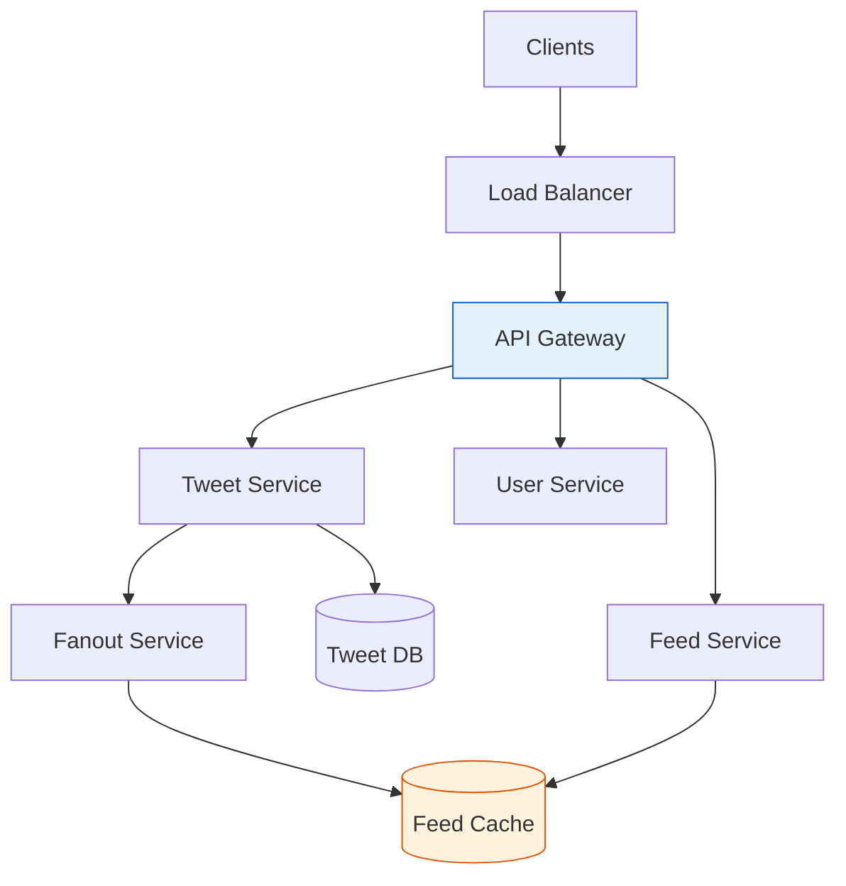
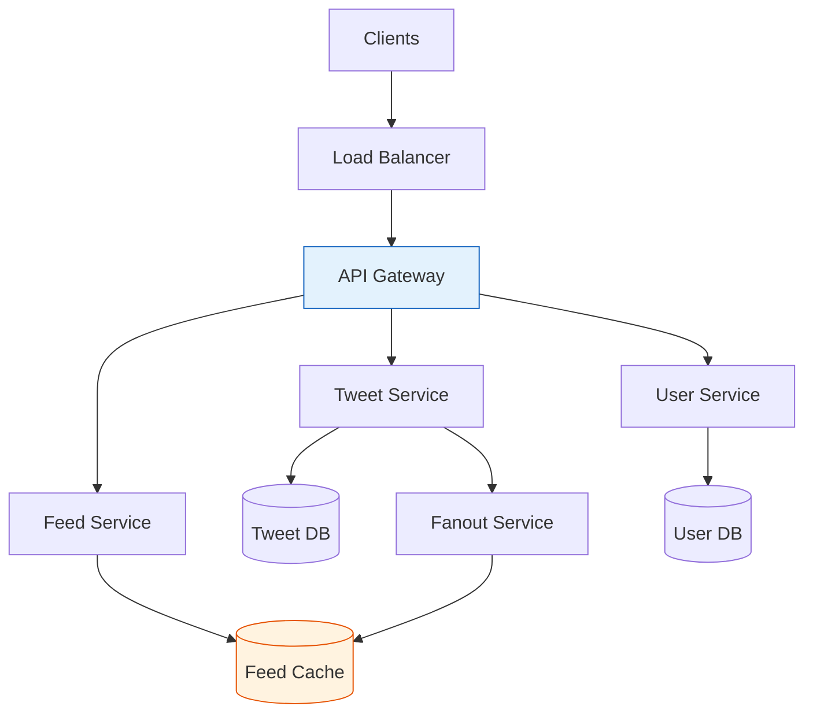

# Design Twitter / X

Design a social media platform where users can post tweets, follow others, and view a personalized feed.

## Architecture Overview




---

## 1. Requirements

### Functional
- Post tweets (280 chars, images, videos)
- Follow/unfollow users
- View home feed (tweets from followed users)
- Like and retweet
- Search tweets and users

### Non-Functional
- 300M DAU, 500M tweets/day
- Feed latency < 500ms
- High availability (99.99%)
- Eventually consistent is acceptable

### Out of Scope
- DMs, notifications, trends, ads

---

## 2. Estimation

### Traffic
```
DAU: 300M
Tweets/day: 500M
Reads/day: 300M × 10 reads = 3B

Write QPS: 500M / 86400 ≈ 6000 tweets/sec
Read QPS: 3B / 86400 ≈ 35000 reads/sec
Peak: 70K read QPS, 12K write QPS
```

### Storage
```
Tweet: 280 chars + metadata ≈ 500 bytes
500M tweets/day × 500 bytes = 250 GB/day
Per year: 90 TB
With media: 10x → 900 TB/year
```

### Fanout
```
Average followers: 200
Celebrity followers: 10M+

Tweet from normal user: Fanout to 200 feeds
Tweet from celebrity: Fanout to 10M feeds (expensive!)
```

---

## 3. High Level Design




---

## 4. Core Components

### Tweet Service

```python
class TweetService:
    def create_tweet(self, user_id: str, content: str, media_ids: List[str] = None):
        # Validate
        if len(content) > 280:
            raise ValidationError("Tweet too long")

        # Create tweet
        tweet = Tweet(
            id=generate_snowflake_id(),
            user_id=user_id,
            content=content,
            media_ids=media_ids,
            created_at=datetime.now()
        )

        # Save to database
        self.tweet_db.save(tweet)

        # Trigger fanout
        self.fanout_queue.publish(TweetCreatedEvent(tweet))

        return tweet

    def get_tweet(self, tweet_id: str):
        # Check cache
        cached = self.cache.get(f"tweet:{tweet_id}")
        if cached:
            return cached

        tweet = self.tweet_db.get(tweet_id)
        self.cache.set(f"tweet:{tweet_id}", tweet, ttl=3600)
        return tweet
```

### User Service

```python
class UserService:
    def follow(self, follower_id: str, followee_id: str):
        # Add to followers list
        self.graph_db.add_edge(follower_id, followee_id, "follows")

        # Update counts
        self.user_db.increment(follower_id, "following_count")
        self.user_db.increment(followee_id, "follower_count")

        # Invalidate feed cache
        self.feed_cache.delete(f"feed:{follower_id}")

    def get_followers(self, user_id: str, cursor: str = None, limit: int = 20):
        return self.graph_db.get_edges(user_id, "followed_by", cursor, limit)

    def get_following(self, user_id: str, cursor: str = None, limit: int = 20):
        return self.graph_db.get_edges(user_id, "follows", cursor, limit)
```

---

## 5. Feed Generation

### Option 1: Pull Model (Fan-in on Read)

```
User requests feed:
1. Get list of followed users
2. For each user, get recent tweets
3. Merge and sort by time
4. Return top N

Pros: Simple, no storage for feeds
Cons: Slow for users following many accounts
```

```python
def get_feed_pull(self, user_id: str, limit: int = 20):
    following = self.user_service.get_following(user_id)

    tweets = []
    for followee_id in following:
        user_tweets = self.tweet_db.get_recent(followee_id, limit=100)
        tweets.extend(user_tweets)

    # Sort by time
    tweets.sort(key=lambda t: t.created_at, reverse=True)

    return tweets[:limit]
```

### Option 2: Push Model (Fan-out on Write)

```
User posts tweet:
1. Get all followers
2. Push tweet to each follower's feed cache
3. Feed read is instant (just fetch cache)

Pros: Fast reads
Cons: Expensive for celebrities (millions of writes)
```

```python
class FanoutService:
    def fanout_tweet(self, tweet: Tweet):
        followers = self.user_service.get_all_followers(tweet.user_id)

        for follower_id in followers:
            # Add to follower's feed cache
            self.feed_cache.zadd(
                f"feed:{follower_id}",
                {tweet.id: tweet.created_at.timestamp()}
            )
            # Trim to last 1000 tweets
            self.feed_cache.zremrangebyrank(f"feed:{follower_id}", 0, -1001)

def get_feed_push(self, user_id: str, limit: int = 20):
    tweet_ids = self.feed_cache.zrevrange(f"feed:{user_id}", 0, limit-1)
    tweets = self.tweet_service.get_tweets_batch(tweet_ids)
    return tweets
```

### Option 3: Hybrid (Recommended)

```
For normal users (< 10K followers): Push model
For celebrities (> 10K followers): Pull model on read

User's feed = Pre-computed feed + Pull from celebrities they follow
```

```python
class HybridFeedService:
    CELEBRITY_THRESHOLD = 10000

    def get_feed(self, user_id: str, limit: int = 20):
        # Get pre-computed feed (from push)
        precomputed = self.feed_cache.zrevrange(f"feed:{user_id}", 0, limit * 2)

        # Get followed celebrities
        following = self.user_service.get_following(user_id)
        celebrities = [u for u in following if u.follower_count > self.CELEBRITY_THRESHOLD]

        # Pull celebrity tweets
        celebrity_tweets = []
        for celeb in celebrities:
            tweets = self.tweet_db.get_recent(celeb.id, limit=10)
            celebrity_tweets.extend(tweets)

        # Merge
        all_tweet_ids = set(precomputed + [t.id for t in celebrity_tweets])
        tweets = self.tweet_service.get_tweets_batch(list(all_tweet_ids))

        # Sort and return
        tweets.sort(key=lambda t: t.created_at, reverse=True)
        return tweets[:limit]
```

---

## 6. Data Model

### Tweet Table (Cassandra)
```sql
CREATE TABLE tweets (
    tweet_id BIGINT,
    user_id BIGINT,
    content TEXT,
    media_ids LIST<TEXT>,
    created_at TIMESTAMP,
    like_count INT,
    retweet_count INT,
    PRIMARY KEY (tweet_id)
);

-- For user's tweets
CREATE TABLE user_tweets (
    user_id BIGINT,
    created_at TIMESTAMP,
    tweet_id BIGINT,
    PRIMARY KEY (user_id, created_at)
) WITH CLUSTERING ORDER BY (created_at DESC);
```

### User Table (PostgreSQL)
```sql
CREATE TABLE users (
    user_id BIGINT PRIMARY KEY,
    username VARCHAR(50) UNIQUE,
    email VARCHAR(255),
    follower_count BIGINT DEFAULT 0,
    following_count BIGINT DEFAULT 0,
    created_at TIMESTAMP
);
```

### Follows (Graph DB or Cassandra)
```sql
CREATE TABLE follows (
    follower_id BIGINT,
    followee_id BIGINT,
    created_at TIMESTAMP,
    PRIMARY KEY (follower_id, followee_id)
);

-- Reverse index
CREATE TABLE followers (
    followee_id BIGINT,
    follower_id BIGINT,
    created_at TIMESTAMP,
    PRIMARY KEY (followee_id, follower_id)
);
```

### Feed Cache (Redis)
```
Key: feed:{user_id}
Type: Sorted Set
Score: Tweet timestamp
Value: Tweet ID

ZADD feed:123 1704067200 "tweet_456"
ZREVRANGE feed:123 0 19  # Get latest 20
```

---

## 7. Tweet ID Generation (Snowflake)

```
64-bit ID:
[1 bit unused][41 bits timestamp][10 bits machine ID][12 bits sequence]

- Timestamp: ms since epoch (69 years)
- Machine ID: 1024 machines
- Sequence: 4096 IDs per ms per machine

Benefits:
- Sortable by time
- No coordination needed
- High throughput
```

```python
class SnowflakeGenerator:
    def __init__(self, machine_id: int):
        self.machine_id = machine_id
        self.sequence = 0
        self.last_timestamp = 0
        self.epoch = 1609459200000  # Jan 1, 2021

    def generate(self) -> int:
        timestamp = int(time.time() * 1000) - self.epoch

        if timestamp == self.last_timestamp:
            self.sequence = (self.sequence + 1) & 0xFFF
            if self.sequence == 0:
                timestamp = self._wait_next_ms(timestamp)
        else:
            self.sequence = 0

        self.last_timestamp = timestamp

        return (timestamp << 22) | (self.machine_id << 12) | self.sequence
```

---

## 8. Search

```
┌─────────────────────────────────────────────────────────────────────────┐
│                        Elasticsearch Cluster                             │
│                                                                          │
│  Index: tweets                                                          │
│  Fields: content (analyzed), user_id, created_at, hashtags              │
│                                                                          │
└─────────────────────────────────────────────────────────────────────────┘
                                    ↑
                    Tweet Created → Index
```

```json
{
  "query": {
    "bool": {
      "must": [
        { "match": { "content": "system design" } }
      ],
      "filter": [
        { "range": { "created_at": { "gte": "now-7d" } } }
      ]
    }
  },
  "sort": [
    { "_score": "desc" },
    { "created_at": "desc" }
  ]
}
```

---

## 9. Media Storage

```
┌─────────────────────────────────────────────────────────────────────────┐
│                              CDN                                         │
│         (CloudFront, Cloudflare - cache at edge)                        │
└─────────────────────────────────────────────────────────────────────────┘
                                    ↑
┌─────────────────────────────────────────────────────────────────────────┐
│                        Object Storage (S3)                               │
│                                                                          │
│  /images/{tweet_id}/{size}.jpg                                          │
│  /videos/{tweet_id}/{quality}.mp4                                       │
└─────────────────────────────────────────────────────────────────────────┘
```

---

## 10. Architecture Summary

| Component | Technology | Purpose |
|-----------|------------|---------|
| API Gateway | Kong/Nginx | Routing, auth, rate limiting |
| Tweet Store | Cassandra | High write throughput |
| User Store | PostgreSQL | ACID for user data |
| Feed Cache | Redis | Pre-computed feeds |
| Graph Store | Neo4j/Cassandra | Follow relationships |
| Search | Elasticsearch | Full-text search |
| Media | S3 + CDN | Image/video storage |
| Queue | Kafka | Async fanout |

---

## 11. Interview Talking Points

1. **Feed generation**: Hybrid push/pull model
2. **Celebrity problem**: Pull on read for high-follower accounts
3. **ID generation**: Snowflake for sortable, distributed IDs
4. **Data partitioning**: Shard by user_id
5. **Caching**: Feed cache is critical for read performance
