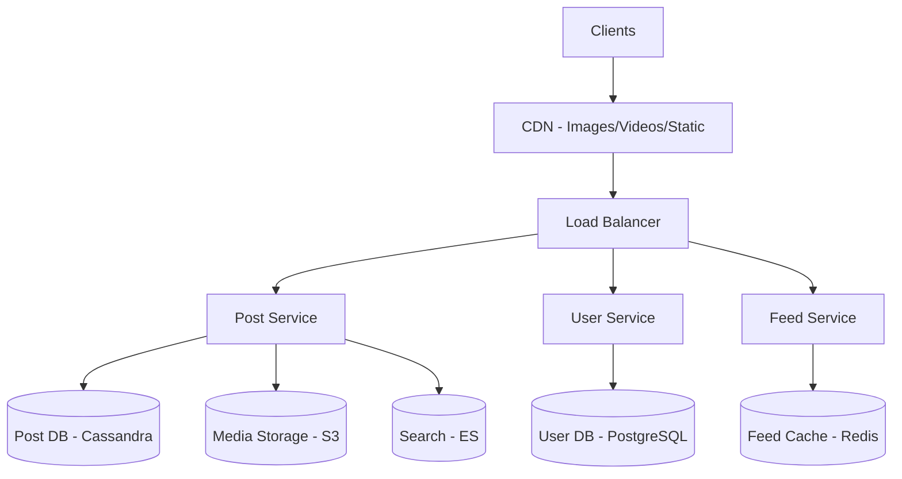

# Design Instagram

Design a photo and video sharing social network.

---

## 1. Requirements

### Functional
- Upload photos/videos with captions
- Follow/unfollow users
- View feed (photos from followed users)
- Like and comment on posts
- View user profiles
- Search users and hashtags

### Non-Functional
- 500M DAU, 100M posts/day
- Feed latency < 500ms
- Photo upload < 2 seconds
- High availability
- Eventually consistent

### Out of Scope
- Stories, Reels, DMs, Ads

---

## 2. Estimation

### Traffic
```
DAU: 500M
Posts/day: 100M
Photo views/user/day: 50

Write: 100M / 86400 ≈ 1200 uploads/sec
Read: 500M × 50 = 25B views/day ≈ 300K QPS
Peak: 600K read QPS
```

### Storage
```
Average photo: 2 MB original
Multiple sizes: 200KB + 500KB + 2MB ≈ 3 MB total
100M photos/day × 3 MB = 300 TB/day
Per year: 110 PB

Video would be 10x more
```

### Bandwidth
```
Photo serving: 300K QPS × 500 KB = 150 GB/s
CDN is essential!
```

---

## 3. High Level Design




---

## 4. Photo Upload Flow

```
┌─────────────────────────────────────────────────────────────────────────┐
│  Upload Flow                                                             │
│                                                                          │
│  1. Client → Upload Service: Request pre-signed URL                     │
│  2. Upload Service → S3: Generate pre-signed URL                        │
│  3. Client → S3: Direct upload using pre-signed URL                     │
│  4. S3 → Lambda: Trigger on upload complete                             │
│  5. Lambda → Image Processor: Resize, compress                          │
│  6. Image Processor → S3: Store multiple sizes                          │
│  7. Lambda → Post Service: Create post record                           │
│  8. Post Service → Fanout: Trigger feed update                          │
│                                                                          │
└─────────────────────────────────────────────────────────────────────────┘
```

```python
class UploadService:
    def request_upload(self, user_id: str, content_type: str):
        # Generate unique key
        upload_id = str(uuid.uuid4())
        key = f"uploads/{user_id}/{upload_id}"

        # Generate pre-signed URL
        presigned_url = self.s3.generate_presigned_url(
            'put_object',
            Params={
                'Bucket': 'instagram-media',
                'Key': key,
                'ContentType': content_type
            },
            ExpiresIn=3600
        )

        return {
            'upload_id': upload_id,
            'upload_url': presigned_url,
            'expires_in': 3600
        }

    def complete_upload(self, user_id: str, upload_id: str, caption: str):
        # Verify upload exists
        key = f"uploads/{user_id}/{upload_id}"
        if not self.s3.object_exists(key):
            raise UploadNotFoundError()

        # Queue image processing
        self.queue.publish('image-processing', {
            'user_id': user_id,
            'upload_id': upload_id,
            'source_key': key,
            'caption': caption
        })

        return {'status': 'processing'}
```

---

## 5. Image Processing

```python
class ImageProcessor:
    SIZES = {
        'thumbnail': (150, 150),
        'medium': (600, 600),
        'large': (1080, 1080)
    }

    def process(self, event):
        source_key = event['source_key']
        upload_id = event['upload_id']
        user_id = event['user_id']

        # Download original
        original = self.s3.download(source_key)
        image = Image.open(original)

        # Generate sizes
        media_urls = {}
        for size_name, dimensions in self.SIZES.items():
            resized = self.resize_and_compress(image, dimensions)
            key = f"media/{user_id}/{upload_id}/{size_name}.jpg"
            self.s3.upload(key, resized)
            media_urls[size_name] = f"https://cdn.instagram.com/{key}"

        # Create post
        self.post_service.create_post(
            user_id=user_id,
            media_urls=media_urls,
            caption=event['caption']
        )

        # Delete original upload
        self.s3.delete(source_key)

    def resize_and_compress(self, image, dimensions, quality=85):
        image.thumbnail(dimensions, Image.LANCZOS)
        buffer = BytesIO()
        image.save(buffer, format='JPEG', quality=quality, optimize=True)
        return buffer.getvalue()
```

---

## 6. Feed Generation

### Hybrid Approach (Push + Pull)

```python
class FeedService:
    CELEBRITY_THRESHOLD = 100000

    def generate_feed(self, user_id: str, cursor: str = None, limit: int = 20):
        # Get pre-computed feed from cache
        cached_posts = self.get_cached_feed(user_id, limit * 2)

        # Get celebrities user follows
        following = self.user_service.get_following(user_id)
        celebrities = [f for f in following if f.follower_count > self.CELEBRITY_THRESHOLD]

        # Pull celebrity posts
        celebrity_posts = []
        for celeb in celebrities[:10]:  # Limit to top 10
            posts = self.post_db.get_recent(celeb.id, limit=5)
            celebrity_posts.extend(posts)

        # Merge and rank
        all_posts = cached_posts + celebrity_posts
        ranked = self.rank_posts(all_posts, user_id)

        return ranked[:limit]

    def rank_posts(self, posts, user_id):
        # Simple chronological + engagement score
        for post in posts:
            age_hours = (datetime.now() - post.created_at).total_seconds() / 3600
            engagement = post.like_count + post.comment_count * 2
            post.score = engagement / (age_hours + 2) ** 1.5

        posts.sort(key=lambda p: p.score, reverse=True)
        return posts
```

### Fanout Service

```python
class FanoutService:
    def fanout_post(self, post):
        user = self.user_service.get(post.user_id)

        # Only fanout for non-celebrities
        if user.follower_count > self.CELEBRITY_THRESHOLD:
            return  # Pull on read instead

        followers = self.user_service.get_all_followers(post.user_id)

        # Batch updates
        batch_size = 1000
        for i in range(0, len(followers), batch_size):
            batch = followers[i:i + batch_size]
            self.update_feed_cache_batch(batch, post)

    def update_feed_cache_batch(self, user_ids, post):
        pipe = self.redis.pipeline()
        for user_id in user_ids:
            pipe.zadd(f"feed:{user_id}", {post.id: post.created_at.timestamp()})
            pipe.zremrangebyrank(f"feed:{user_id}", 0, -801)  # Keep 800 posts
        pipe.execute()
```

---

## 7. Data Model

### Posts (Cassandra)

```sql
CREATE TABLE posts (
    post_id BIGINT,
    user_id BIGINT,
    media_urls MAP<TEXT, TEXT>,  -- size -> url
    caption TEXT,
    location TEXT,
    like_count BIGINT,
    comment_count BIGINT,
    created_at TIMESTAMP,
    PRIMARY KEY (post_id)
);

-- User's posts (for profile)
CREATE TABLE user_posts (
    user_id BIGINT,
    created_at TIMESTAMP,
    post_id BIGINT,
    thumbnail_url TEXT,
    PRIMARY KEY (user_id, created_at)
) WITH CLUSTERING ORDER BY (created_at DESC);
```

### Likes (Cassandra)

```sql
CREATE TABLE likes (
    post_id BIGINT,
    user_id BIGINT,
    created_at TIMESTAMP,
    PRIMARY KEY (post_id, user_id)
);

-- For "users who liked this"
CREATE TABLE post_likes (
    post_id BIGINT,
    created_at TIMESTAMP,
    user_id BIGINT,
    PRIMARY KEY (post_id, created_at)
) WITH CLUSTERING ORDER BY (created_at DESC);
```

### Comments (Cassandra)

```sql
CREATE TABLE comments (
    post_id BIGINT,
    comment_id BIGINT,
    user_id BIGINT,
    content TEXT,
    created_at TIMESTAMP,
    PRIMARY KEY (post_id, comment_id)
) WITH CLUSTERING ORDER BY (comment_id DESC);
```

---

## 8. CDN Strategy

```
┌─────────────────────────────────────────────────────────────────────────┐
│                           CDN Architecture                               │
│                                                                          │
│  User in Tokyo                                                          │
│       ↓                                                                 │
│  CDN Edge (Tokyo)  ← Cache hit? Return image                            │
│       ↓ (miss)                                                          │
│  Regional Cache (Asia)                                                  │
│       ↓ (miss)                                                          │
│  Origin (S3 + CloudFront Origin Shield)                                 │
│                                                                          │
└─────────────────────────────────────────────────────────────────────────┘

Cache-Control: public, max-age=31536000  // 1 year
(Media URLs are immutable - change URL for new version)
```

---

## 9. Search

### Hashtag Search

```python
class SearchService:
    def search_hashtags(self, query: str, limit: int = 20):
        # Extract hashtags from posts at write time
        # Index: hashtag -> [post_ids]

        return self.elasticsearch.search({
            "query": {
                "match": {
                    "hashtags": query
                }
            },
            "sort": [{"created_at": "desc"}],
            "size": limit
        })

    def search_users(self, query: str, limit: int = 20):
        return self.elasticsearch.search({
            "query": {
                "multi_match": {
                    "query": query,
                    "fields": ["username^3", "display_name^2", "bio"]
                }
            },
            "size": limit
        })
```

---

## 10. Scaling Considerations

### Read Path
- CDN for all media (99% cache hit rate target)
- Redis cluster for feed cache
- Read replicas for databases

### Write Path
- Async image processing
- Async fanout via message queue
- Batch operations

### Database Sharding
- Posts: Shard by post_id (even distribution)
- User data: Shard by user_id
- Feeds: Shard by user_id

---

## 11. Summary

| Component | Technology | Purpose |
|-----------|------------|---------|
| Media Storage | S3 | Original and processed images |
| CDN | CloudFront | Global image delivery |
| Post DB | Cassandra | High write throughput |
| User DB | PostgreSQL | ACID for user accounts |
| Feed Cache | Redis Cluster | Pre-computed feeds |
| Search | Elasticsearch | User and hashtag search |
| Queue | Kafka | Async processing |
| Image Processing | Lambda | Resize, compress |

---

## 12. Interview Talking Points

1. **Upload flow**: Pre-signed URLs for direct S3 upload
2. **Image processing**: Async, multiple sizes
3. **Feed**: Hybrid push/pull model
4. **CDN**: Essential for media-heavy application
5. **Storage**: 100+ PB/year needs careful planning
