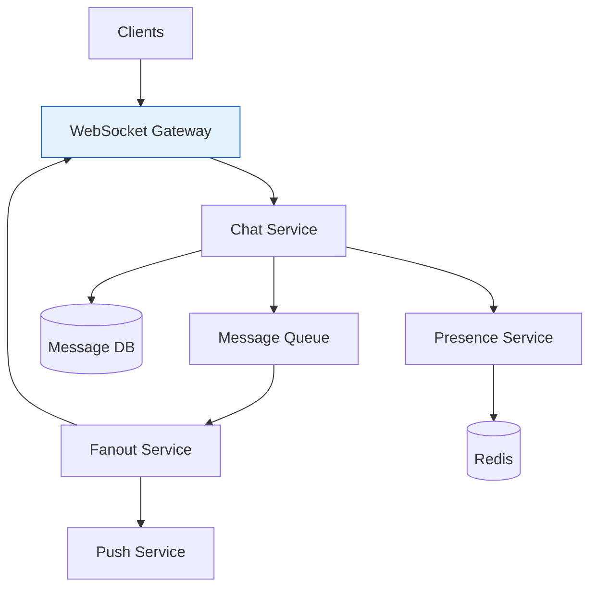
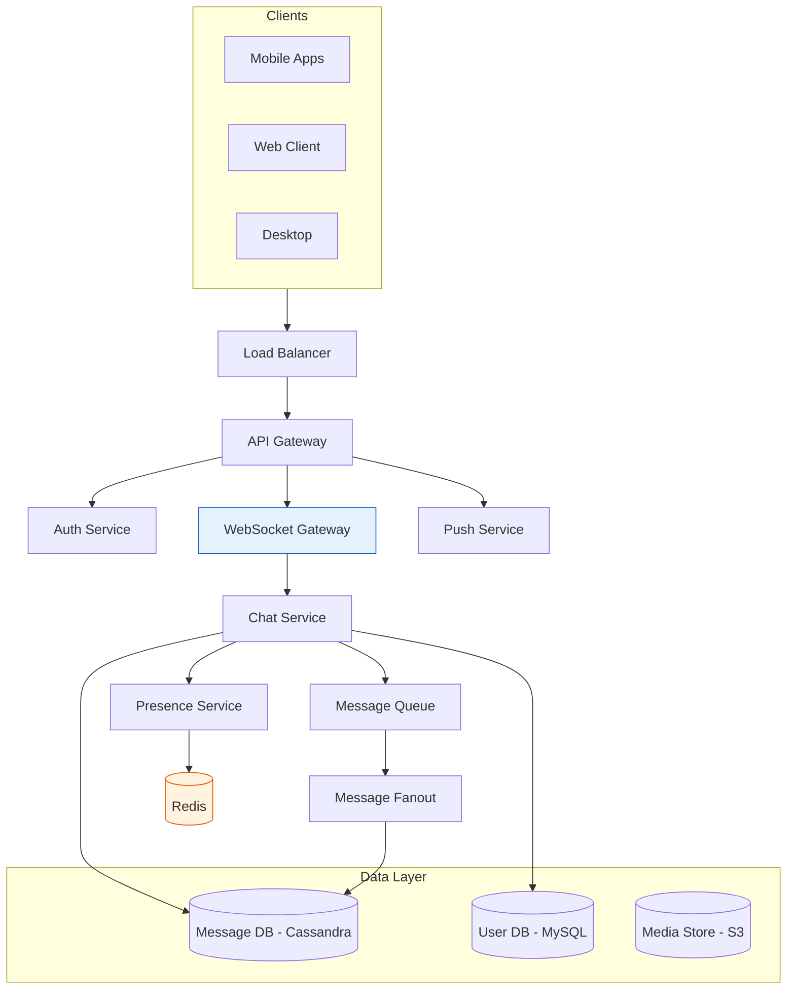

# Design WhatsApp / Messaging System

## Problem Statement

Design a real-time messaging system like WhatsApp that supports:
- One-on-one messaging
- Group messaging (up to 256 members)
- Message delivery status (sent, delivered, read)
- Online/offline presence
- End-to-end encryption
- Media sharing (images, videos, documents)

## Architecture Overview




## Requirements

### Functional Requirements
1. Send/receive messages in real-time
2. Support group chats
3. Show delivery/read receipts
4. Display online/last seen status
5. Support media attachments
6. Message history and sync across devices
7. Push notifications for offline users

### Non-Functional Requirements
- **Latency**: < 100ms for message delivery
- **Availability**: 99.99% uptime
- **Scale**: 2B users, 100B messages/day
- **Consistency**: Messages should never be lost
- **Security**: End-to-end encryption

## Capacity Estimation

### Traffic
- 2B users, 500M DAU
- 100B messages/day = 1.15M messages/second
- Average message size: 100 bytes
- 10% messages have media (average 500KB)

### Storage
- Text messages: 100B × 100 bytes = 10 TB/day
- Media: 10B × 500KB = 5 PB/day
- Yearly storage: ~2 EB (with replication)

### Bandwidth
- Incoming: ~50 GB/s
- Outgoing: ~150 GB/s (fanout for groups)

## High-Level Architecture




## Core Components

### 1. WebSocket Gateway

Maintains persistent connections with clients for real-time messaging.

```python
class WebSocketGateway:
    def __init__(self):
        self.connections = {}  # user_id -> [connection_ids]
        self.redis = RedisCluster()
        self.kafka = KafkaProducer()

    async def on_connect(self, websocket, user_id):
        """Handle new WebSocket connection."""
        connection_id = generate_uuid()

        # Store connection locally
        if user_id not in self.connections:
            self.connections[user_id] = []
        self.connections[user_id].append({
            'id': connection_id,
            'socket': websocket,
            'device': websocket.device_info
        })

        # Register in Redis for cross-server routing
        server_id = get_server_id()
        await self.redis.sadd(f"user:{user_id}:connections",
                             f"{server_id}:{connection_id}")
        await self.redis.set(f"user:{user_id}:online", "1", ex=300)

        # Publish presence update
        await self.kafka.send('presence-updates', {
            'user_id': user_id,
            'status': 'online',
            'timestamp': time.time()
        })

        return connection_id

    async def on_disconnect(self, user_id, connection_id):
        """Handle WebSocket disconnection."""
        # Remove local connection
        if user_id in self.connections:
            self.connections[user_id] = [
                c for c in self.connections[user_id]
                if c['id'] != connection_id
            ]

        # Remove from Redis
        server_id = get_server_id()
        await self.redis.srem(f"user:{user_id}:connections",
                             f"{server_id}:{connection_id}")

        # Check if user has other active connections
        remaining = await self.redis.scard(f"user:{user_id}:connections")
        if remaining == 0:
            await self.redis.set(f"user:{user_id}:last_seen", time.time())
            await self.redis.delete(f"user:{user_id}:online")

            await self.kafka.send('presence-updates', {
                'user_id': user_id,
                'status': 'offline',
                'last_seen': time.time()
            })

    async def send_to_user(self, user_id, message):
        """Send message to all user's connections."""
        # Try local connections first
        if user_id in self.connections:
            for conn in self.connections[user_id]:
                await conn['socket'].send(json.dumps(message))
            return True

        # Route to other servers via Redis pub/sub
        connections = await self.redis.smembers(f"user:{user_id}:connections")
        if connections:
            await self.redis.publish(f"user:{user_id}:messages",
                                    json.dumps(message))
            return True

        return False  # User is offline
```

### 2. Chat Service

Handles message sending, storage, and delivery.

```python
class ChatService:
    def __init__(self):
        self.message_db = CassandraClient()
        self.user_db = MySQLClient()
        self.kafka = KafkaProducer()
        self.redis = RedisCluster()

    async def send_message(self, request: SendMessageRequest) -> MessageResponse:
        """Process and route a new message."""
        # Generate message ID (time-based for ordering)
        message_id = self._generate_message_id()

        # Create message object
        message = Message(
            id=message_id,
            conversation_id=request.conversation_id,
            sender_id=request.sender_id,
            content=self._encrypt(request.content),
            content_type=request.content_type,
            timestamp=time.time(),
            status='sent'
        )

        # Store message
        await self._store_message(message)

        # Get recipients
        if request.is_group:
            recipients = await self._get_group_members(request.conversation_id)
            recipients.remove(request.sender_id)
        else:
            recipients = [request.recipient_id]

        # Queue for delivery
        await self.kafka.send('message-fanout', {
            'message': message.to_dict(),
            'recipients': recipients
        })

        # Send acknowledgment to sender
        return MessageResponse(
            message_id=message_id,
            status='sent',
            timestamp=message.timestamp
        )

    def _generate_message_id(self) -> str:
        """Generate time-ordered unique message ID."""
        # Use Snowflake-like ID for ordering
        timestamp = int(time.time() * 1000)
        sequence = self._get_sequence_number()
        server_id = get_server_id()

        return f"{timestamp:013d}{server_id:05d}{sequence:05d}"

    async def _store_message(self, message: Message):
        """Store message in Cassandra."""
        # Primary storage by conversation
        await self.message_db.execute("""
            INSERT INTO messages (
                conversation_id, message_id, sender_id,
                content, content_type, timestamp, status
            ) VALUES (?, ?, ?, ?, ?, ?, ?)
        """, [
            message.conversation_id,
            message.id,
            message.sender_id,
            message.content,
            message.content_type,
            message.timestamp,
            message.status
        ])

        # Index for user's message history
        await self.message_db.execute("""
            INSERT INTO user_messages (
                user_id, message_id, conversation_id, timestamp
            ) VALUES (?, ?, ?, ?)
        """, [
            message.sender_id,
            message.id,
            message.conversation_id,
            message.timestamp
        ])

    async def get_messages(self, conversation_id: str,
                          before: str = None, limit: int = 50):
        """Retrieve messages for a conversation."""
        query = """
            SELECT * FROM messages
            WHERE conversation_id = ?
        """
        params = [conversation_id]

        if before:
            query += " AND message_id < ?"
            params.append(before)

        query += " ORDER BY message_id DESC LIMIT ?"
        params.append(limit)

        return await self.message_db.execute(query, params)
```

### 3. Message Fanout Service

Handles message delivery to recipients.

```python
class MessageFanoutService:
    def __init__(self):
        self.ws_gateway = WebSocketGateway()
        self.push_service = PushNotificationService()
        self.kafka = KafkaConsumer('message-fanout')
        self.redis = RedisCluster()

    async def process_messages(self):
        """Process message fanout queue."""
        async for record in self.kafka:
            message_data = json.loads(record.value)
            message = message_data['message']
            recipients = message_data['recipients']

            # Fan out to all recipients
            delivery_tasks = []
            for recipient_id in recipients:
                task = self.deliver_to_user(recipient_id, message)
                delivery_tasks.append(task)

            # Process in parallel with concurrency limit
            await asyncio.gather(*delivery_tasks)

    async def deliver_to_user(self, user_id: str, message: dict):
        """Deliver message to a single user."""
        # Try real-time delivery via WebSocket
        is_online = await self.redis.exists(f"user:{user_id}:online")

        if is_online:
            delivered = await self.ws_gateway.send_to_user(user_id, {
                'type': 'new_message',
                'message': message
            })

            if delivered:
                # Update delivery status
                await self._update_status(message['id'], user_id, 'delivered')

                # Notify sender
                await self._send_delivery_receipt(message, user_id, 'delivered')
                return

        # User is offline - store for later sync and send push
        await self._queue_for_sync(user_id, message)
        await self.push_service.send(user_id, {
            'title': await self._get_sender_name(message['sender_id']),
            'body': self._get_preview(message),
            'data': {'message_id': message['id']}
        })

    async def _update_status(self, message_id: str, user_id: str, status: str):
        """Update message delivery/read status."""
        await self.redis.hset(
            f"message:{message_id}:status",
            user_id,
            json.dumps({'status': status, 'timestamp': time.time()})
        )

    async def _send_delivery_receipt(self, message: dict,
                                     recipient_id: str, status: str):
        """Send delivery/read receipt to message sender."""
        sender_id = message['sender_id']

        await self.ws_gateway.send_to_user(sender_id, {
            'type': 'message_status',
            'message_id': message['id'],
            'recipient_id': recipient_id,
            'status': status,
            'timestamp': time.time()
        })
```

### 4. Presence Service

Tracks user online/offline status.

```python
class PresenceService:
    def __init__(self):
        self.redis = RedisCluster()
        self.kafka = KafkaProducer()

    async def update_presence(self, user_id: str, status: str):
        """Update user presence status."""
        if status == 'online':
            await self.redis.set(f"user:{user_id}:online", "1", ex=300)
        else:
            await self.redis.delete(f"user:{user_id}:online")
            await self.redis.set(f"user:{user_id}:last_seen", time.time())

        # Notify contacts
        contacts = await self._get_user_contacts(user_id)
        for contact_id in contacts:
            await self.kafka.send('presence-notifications', {
                'subscriber_id': contact_id,
                'user_id': user_id,
                'status': status,
                'last_seen': time.time() if status == 'offline' else None
            })

    async def get_presence(self, user_ids: List[str]) -> Dict[str, PresenceInfo]:
        """Get presence status for multiple users."""
        pipeline = self.redis.pipeline()

        for user_id in user_ids:
            pipeline.get(f"user:{user_id}:online")
            pipeline.get(f"user:{user_id}:last_seen")

        results = await pipeline.execute()

        presence = {}
        for i, user_id in enumerate(user_ids):
            is_online = results[i * 2]
            last_seen = results[i * 2 + 1]

            presence[user_id] = PresenceInfo(
                user_id=user_id,
                is_online=bool(is_online),
                last_seen=float(last_seen) if last_seen else None
            )

        return presence

    async def heartbeat(self, user_id: str):
        """Process client heartbeat to maintain online status."""
        await self.redis.expire(f"user:{user_id}:online", 300)
```

### 5. Group Service

Manages group chat operations.

```python
class GroupService:
    def __init__(self):
        self.db = MySQLClient()
        self.redis = RedisCluster()
        self.kafka = KafkaProducer()

    async def create_group(self, request: CreateGroupRequest) -> Group:
        """Create a new group chat."""
        group_id = generate_uuid()

        group = Group(
            id=group_id,
            name=request.name,
            creator_id=request.creator_id,
            created_at=time.time()
        )

        async with self.db.transaction():
            # Create group
            await self.db.execute("""
                INSERT INTO groups (id, name, creator_id, created_at)
                VALUES (?, ?, ?, ?)
            """, [group_id, request.name, request.creator_id, time.time()])

            # Add members
            for member_id in request.member_ids:
                await self.db.execute("""
                    INSERT INTO group_members (group_id, user_id, role, joined_at)
                    VALUES (?, ?, ?, ?)
                """, [group_id, member_id, 'member', time.time()])

            # Creator is admin
            await self.db.execute("""
                UPDATE group_members SET role = 'admin'
                WHERE group_id = ? AND user_id = ?
            """, [group_id, request.creator_id])

        # Cache group members
        await self.redis.sadd(f"group:{group_id}:members", *request.member_ids)

        # Notify members
        await self._notify_group_creation(group, request.member_ids)

        return group

    async def get_members(self, group_id: str) -> List[str]:
        """Get all members of a group."""
        # Try cache first
        members = await self.redis.smembers(f"group:{group_id}:members")

        if not members:
            # Load from database
            result = await self.db.execute("""
                SELECT user_id FROM group_members
                WHERE group_id = ?
            """, [group_id])

            members = [row['user_id'] for row in result]

            if members:
                await self.redis.sadd(f"group:{group_id}:members", *members)

        return list(members)

    async def add_member(self, group_id: str, user_id: str, added_by: str):
        """Add a member to a group."""
        # Check if group exists and adder has permission
        member_count = await self.redis.scard(f"group:{group_id}:members")

        if member_count >= 256:
            raise GroupFullError("Group has reached maximum capacity")

        await self.db.execute("""
            INSERT INTO group_members (group_id, user_id, role, joined_at)
            VALUES (?, ?, 'member', ?)
        """, [group_id, user_id, time.time()])

        await self.redis.sadd(f"group:{group_id}:members", user_id)

        # Notify group
        await self._send_system_message(group_id,
            f"{added_by} added {user_id} to the group")
```

## Database Schema

### Cassandra (Messages)

```sql
-- Messages by conversation (primary access pattern)
CREATE TABLE messages (
    conversation_id text,
    message_id text,
    sender_id text,
    content blob,
    content_type text,
    timestamp bigint,
    status text,
    PRIMARY KEY (conversation_id, message_id)
) WITH CLUSTERING ORDER BY (message_id DESC);

-- User message index (for sync)
CREATE TABLE user_messages (
    user_id text,
    bucket text,  -- YYYY-MM for time bucketing
    message_id text,
    conversation_id text,
    timestamp bigint,
    PRIMARY KEY ((user_id, bucket), message_id)
) WITH CLUSTERING ORDER BY (message_id DESC);

-- Offline message queue
CREATE TABLE pending_messages (
    user_id text,
    message_id text,
    conversation_id text,
    sender_id text,
    content blob,
    timestamp bigint,
    PRIMARY KEY (user_id, message_id)
) WITH CLUSTERING ORDER BY (message_id ASC);
```

### MySQL (Users & Groups)

```sql
CREATE TABLE users (
    id VARCHAR(36) PRIMARY KEY,
    phone VARCHAR(20) UNIQUE NOT NULL,
    name VARCHAR(100),
    profile_pic_url VARCHAR(500),
    public_key BLOB,
    created_at TIMESTAMP DEFAULT CURRENT_TIMESTAMP,
    INDEX idx_phone (phone)
);

CREATE TABLE groups (
    id VARCHAR(36) PRIMARY KEY,
    name VARCHAR(100) NOT NULL,
    description TEXT,
    creator_id VARCHAR(36) NOT NULL,
    created_at TIMESTAMP DEFAULT CURRENT_TIMESTAMP,
    FOREIGN KEY (creator_id) REFERENCES users(id)
);

CREATE TABLE group_members (
    group_id VARCHAR(36),
    user_id VARCHAR(36),
    role ENUM('member', 'admin') DEFAULT 'member',
    joined_at TIMESTAMP DEFAULT CURRENT_TIMESTAMP,
    PRIMARY KEY (group_id, user_id),
    FOREIGN KEY (group_id) REFERENCES groups(id),
    FOREIGN KEY (user_id) REFERENCES users(id)
);

CREATE TABLE conversations (
    id VARCHAR(36) PRIMARY KEY,
    type ENUM('direct', 'group') NOT NULL,
    group_id VARCHAR(36),
    created_at TIMESTAMP DEFAULT CURRENT_TIMESTAMP,
    FOREIGN KEY (group_id) REFERENCES groups(id)
);

CREATE TABLE conversation_participants (
    conversation_id VARCHAR(36),
    user_id VARCHAR(36),
    last_read_message_id VARCHAR(36),
    muted_until TIMESTAMP,
    PRIMARY KEY (conversation_id, user_id),
    INDEX idx_user_conversations (user_id, conversation_id)
);
```

## End-to-End Encryption

### Key Exchange Protocol

```python
class E2EEncryption:
    """Signal Protocol-based end-to-end encryption."""

    def __init__(self, user_id: str):
        self.user_id = user_id
        self.identity_key_pair = None
        self.prekeys = []

    def generate_keys(self):
        """Generate identity key pair and prekeys."""
        # Identity key (long-term)
        self.identity_key_pair = X25519.generate()

        # Signed prekey (medium-term, rotated weekly)
        signed_prekey = X25519.generate()
        signature = self.identity_key_pair.sign(signed_prekey.public)

        # One-time prekeys (single use)
        self.prekeys = [X25519.generate() for _ in range(100)]

        return KeyBundle(
            identity_key=self.identity_key_pair.public,
            signed_prekey=signed_prekey.public,
            signature=signature,
            prekeys=[pk.public for pk in self.prekeys]
        )

    def initiate_session(self, recipient_bundle: KeyBundle) -> bytes:
        """Initiate encrypted session with recipient."""
        # Generate ephemeral key
        ephemeral = X25519.generate()

        # X3DH key agreement
        dh1 = self.identity_key_pair.exchange(recipient_bundle.signed_prekey)
        dh2 = ephemeral.exchange(recipient_bundle.identity_key)
        dh3 = ephemeral.exchange(recipient_bundle.signed_prekey)

        if recipient_bundle.prekeys:
            prekey = recipient_bundle.prekeys[0]
            dh4 = ephemeral.exchange(prekey)
            shared_secret = HKDF(dh1 + dh2 + dh3 + dh4)
        else:
            shared_secret = HKDF(dh1 + dh2 + dh3)

        # Initialize Double Ratchet
        return self._init_ratchet(shared_secret, recipient_bundle)

    def encrypt_message(self, session: Session, plaintext: bytes) -> bytes:
        """Encrypt message using Double Ratchet."""
        # Derive message key
        chain_key, message_key = self._ratchet_step(session.chain_key)
        session.chain_key = chain_key

        # Encrypt
        nonce = generate_nonce()
        ciphertext = AES_GCM.encrypt(message_key, nonce, plaintext)

        return MessageEnvelope(
            header=session.ratchet_header,
            counter=session.message_counter,
            ciphertext=ciphertext
        ).serialize()

    def decrypt_message(self, session: Session, envelope: bytes) -> bytes:
        """Decrypt received message."""
        msg = MessageEnvelope.deserialize(envelope)

        # Check if we need to ratchet
        if msg.header != session.peer_ratchet_key:
            self._dh_ratchet(session, msg.header)

        # Derive message key
        message_key = self._get_message_key(session, msg.counter)

        # Decrypt
        return AES_GCM.decrypt(message_key, msg.ciphertext)
```

## Media Handling

### Media Upload Flow

```
┌────────┐     ┌──────────┐     ┌──────────┐     ┌─────┐
│ Client │────►│   API    │────►│  Media   │────►│ S3  │
└────────┘     │  Gateway │     │ Service  │     └─────┘
               └──────────┘     └──────────┘
                                     │
                                     ▼
                              ┌──────────────┐
                              │   Processing │
                              │    Queue     │
                              └──────────────┘
                                     │
                    ┌────────────────┼────────────────┐
                    ▼                ▼                ▼
              ┌──────────┐    ┌──────────┐    ┌──────────┐
              │ Thumbnail│    │  Video   │    │  Image   │
              │Generator │    │ Transcoder│   │Optimizer │
              └──────────┘    └──────────┘    └──────────┘
```

```python
class MediaService:
    def __init__(self):
        self.s3 = S3Client()
        self.cdn = CDNClient()
        self.processing_queue = KafkaProducer()

    async def upload_media(self, request: MediaUploadRequest) -> MediaInfo:
        """Handle media upload."""
        # Generate presigned URL for direct upload
        media_id = generate_uuid()
        upload_key = f"raw/{media_id}/{request.filename}"

        presigned_url = await self.s3.generate_presigned_url(
            bucket='whatsapp-media',
            key=upload_key,
            expires_in=3600,
            content_type=request.content_type
        )

        # Client uploads directly to S3
        # After upload, trigger processing
        await self.processing_queue.send('media-processing', {
            'media_id': media_id,
            'upload_key': upload_key,
            'content_type': request.content_type,
            'encryption_key': request.encryption_key  # Client-provided E2E key
        })

        return MediaInfo(
            media_id=media_id,
            upload_url=presigned_url,
            expires_at=time.time() + 3600
        )

    async def process_media(self, media_id: str, upload_key: str,
                           content_type: str):
        """Process uploaded media."""
        if content_type.startswith('image/'):
            # Generate thumbnails
            await self._process_image(media_id, upload_key)
        elif content_type.startswith('video/'):
            # Transcode and generate preview
            await self._process_video(media_id, upload_key)

        # Move to final location
        final_key = f"media/{media_id}"
        await self.s3.copy(upload_key, final_key)

        # Generate CDN URL
        cdn_url = await self.cdn.get_signed_url(final_key, expires_in=86400)

        return cdn_url

    async def _process_image(self, media_id: str, upload_key: str):
        """Generate image thumbnails."""
        # Download original
        image_data = await self.s3.get(upload_key)

        # Create thumbnails
        thumbnails = {
            'small': resize_image(image_data, 100, 100),
            'medium': resize_image(image_data, 300, 300),
            'preview': resize_image(image_data, 600, 600, blur=True)
        }

        # Upload thumbnails
        for size, data in thumbnails.items():
            await self.s3.put(f"thumbnails/{media_id}/{size}.jpg", data)
```

## Scaling Strategies

### 1. Message Routing Optimization

```python
class MessageRouter:
    """Routes messages to appropriate chat servers."""

    def __init__(self):
        self.redis = RedisCluster()
        self.consistent_hash = ConsistentHash()

    def get_server_for_user(self, user_id: str) -> str:
        """Determine which server handles a user's connections."""
        # Check if user has active connection
        connections = self.redis.smembers(f"user:{user_id}:connections")

        if connections:
            # Return server with active connection
            return connections[0].split(':')[0]

        # For offline users, use consistent hashing
        return self.consistent_hash.get_node(user_id)

    def route_message(self, message: dict, recipient_id: str):
        """Route message to correct server."""
        target_server = self.get_server_for_user(recipient_id)

        if target_server == get_current_server():
            # Local delivery
            return self._deliver_locally(message, recipient_id)
        else:
            # Remote delivery via pub/sub
            return self._deliver_remotely(message, recipient_id, target_server)
```

### 2. Connection Management

```python
class ConnectionManager:
    """Manages WebSocket connections across cluster."""

    MAX_CONNECTIONS_PER_SERVER = 100000

    def __init__(self):
        self.connections = {}
        self.connection_count = 0

    async def accept_connection(self, websocket, user_id: str):
        """Accept new WebSocket connection with load management."""
        if self.connection_count >= self.MAX_CONNECTIONS_PER_SERVER:
            # Redirect to less loaded server
            redirect_server = await self._find_available_server()
            await websocket.send(json.dumps({
                'type': 'redirect',
                'server': redirect_server
            }))
            await websocket.close()
            return

        # Accept connection
        self.connection_count += 1
        await self._register_connection(websocket, user_id)

    async def _find_available_server(self) -> str:
        """Find server with capacity for new connections."""
        servers = await self.redis.hgetall('server:connections')

        for server, count in sorted(servers.items(), key=lambda x: int(x[1])):
            if int(count) < self.MAX_CONNECTIONS_PER_SERVER:
                return server

        raise NoCapacityError("All servers at capacity")
```

## Reliability Patterns

### Message Delivery Guarantee

```python
class ReliableDelivery:
    """Ensures at-least-once message delivery."""

    def __init__(self):
        self.pending_acks = {}
        self.retry_queue = asyncio.PriorityQueue()

    async def send_with_ack(self, user_id: str, message: dict,
                           timeout: float = 30.0):
        """Send message and wait for acknowledgment."""
        message_id = message['id']

        # Track pending ack
        self.pending_acks[message_id] = {
            'message': message,
            'user_id': user_id,
            'attempts': 0,
            'sent_at': time.time()
        }

        # Send message
        await self._send_message(user_id, message)

        # Schedule retry if no ack received
        await self.retry_queue.put((
            time.time() + timeout,
            message_id
        ))

    async def receive_ack(self, message_id: str):
        """Process message acknowledgment."""
        if message_id in self.pending_acks:
            del self.pending_acks[message_id]

    async def retry_processor(self):
        """Process retry queue for unacknowledged messages."""
        while True:
            retry_time, message_id = await self.retry_queue.get()

            # Wait until retry time
            wait_time = retry_time - time.time()
            if wait_time > 0:
                await asyncio.sleep(wait_time)

            # Check if still pending
            if message_id in self.pending_acks:
                pending = self.pending_acks[message_id]
                pending['attempts'] += 1

                if pending['attempts'] < 3:
                    # Retry
                    await self._send_message(
                        pending['user_id'],
                        pending['message']
                    )

                    # Schedule next retry with exponential backoff
                    next_retry = time.time() + (30 * (2 ** pending['attempts']))
                    await self.retry_queue.put((next_retry, message_id))
                else:
                    # Max retries exceeded, queue for offline sync
                    await self._queue_for_offline(
                        pending['user_id'],
                        pending['message']
                    )
```

## Interview Discussion Points

### Why Cassandra for Messages?
- Time-series data with high write throughput
- Partition by conversation for efficient reads
- Built-in clustering for message ordering
- Linear scalability for petabyte-scale storage

### How to Handle Message Ordering?
- Snowflake-like IDs with embedded timestamp
- Cassandra clustering for ordered storage
- Client-side vector clocks for conflict resolution

### How to Scale WebSocket Connections?
- Connection sharding across servers
- Redis pub/sub for cross-server routing
- Consistent hashing for connection affinity

### How to Handle Group Messages Efficiently?
- Fan-out on write for small groups (< 100 members)
- Fan-out on read for large groups
- Batch delivery with compression

## Related Topics

- [[02_design_rate_limiter|Rate Limiter Design]]
- [[03_design_twitter|Twitter Design]] - Feed architecture
- [[08_design_notification_system|Notification System]] - Push notifications
- [[../Core_Components/05_message_queues|Message Queues]]

---

**Tags**: #system-design #hld #messaging #real-time #case-study #whatsapp
