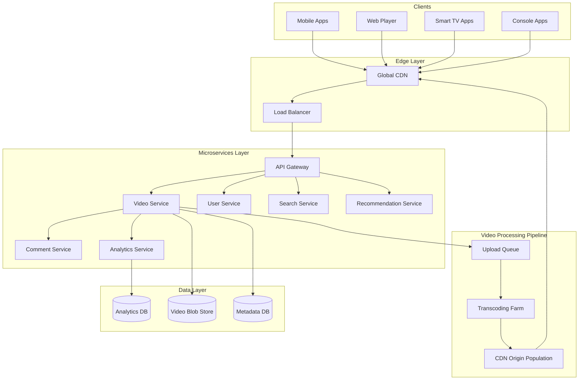

# Design YouTube / Video Streaming Platform

## Problem Statement

Design a video streaming platform like YouTube that supports:
- Video upload and processing
- Video streaming (adaptive bitrate)
- Video search and recommendations
- User interactions (likes, comments, subscriptions)
- Analytics and monetization

## Requirements

### Functional Requirements
1. Upload videos (up to 1 hour, any format)
2. Stream videos with adaptive quality
3. Search videos by title, description, tags
4. Like, comment, and subscribe
5. View count and analytics
6. Video recommendations
7. Live streaming (bonus)

### Non-Functional Requirements
- **Latency**: < 200ms to start video playback
- **Availability**: 99.99% uptime
- **Scale**: 2B users, 1B videos, 500M DAU
- **Durability**: Videos must never be lost
- **Consistency**: Views can be eventually consistent

## Capacity Estimation

### Traffic
- 500M DAU, average 5 videos/day/user
- 2.5B video views/day = 29K views/second
- 500K video uploads/day = 6 uploads/second

### Storage
- Average video: 500MB (raw), 1.5GB (all transcoded versions)
- Daily uploads: 500K × 1.5GB = 750 TB/day
- Yearly: ~275 PB (with replication)

### Bandwidth
- Average video stream: 5 Mbps
- Peak concurrent streams: 50M
- Peak bandwidth: 250 Tbps

## High-Level Architecture




## Core Components

### 1. Video Upload Service

Handles video ingestion and triggers processing.

```python
class VideoUploadService:
    def __init__(self):
        self.s3 = S3Client()
        self.db = DatabaseClient()
        self.queue = KafkaProducer()
        self.redis = RedisClient()

    async def initiate_upload(self, request: UploadRequest) -> UploadSession:
        """Initialize multipart upload for large videos."""
        video_id = self._generate_video_id()

        # Create upload session
        session = UploadSession(
            video_id=video_id,
            user_id=request.user_id,
            filename=request.filename,
            file_size=request.file_size,
            content_type=request.content_type,
            status='pending'
        )

        # Generate presigned URLs for multipart upload
        num_parts = ceil(request.file_size / CHUNK_SIZE)  # 5MB chunks
        upload_id = await self.s3.create_multipart_upload(
            bucket='youtube-raw',
            key=f"uploads/{video_id}/{request.filename}"
        )

        presigned_urls = []
        for part_num in range(1, num_parts + 1):
            url = await self.s3.generate_presigned_url(
                bucket='youtube-raw',
                key=f"uploads/{video_id}/{request.filename}",
                upload_id=upload_id,
                part_number=part_num
            )
            presigned_urls.append({'part': part_num, 'url': url})

        # Store session
        await self.redis.setex(
            f"upload:{video_id}",
            3600 * 24,  # 24 hour expiry
            json.dumps({
                'upload_id': upload_id,
                'parts': [],
                'status': 'uploading'
            })
        )

        return UploadSession(
            video_id=video_id,
            upload_id=upload_id,
            presigned_urls=presigned_urls,
            expires_at=time.time() + 3600 * 24
        )

    async def complete_upload(self, video_id: str,
                             parts: List[UploadedPart]) -> Video:
        """Complete multipart upload and trigger processing."""
        session = json.loads(await self.redis.get(f"upload:{video_id}"))

        # Complete S3 multipart upload
        await self.s3.complete_multipart_upload(
            bucket='youtube-raw',
            key=f"uploads/{video_id}",
            upload_id=session['upload_id'],
            parts=parts
        )

        # Create video record
        video = Video(
            id=video_id,
            user_id=session['user_id'],
            status='processing',
            upload_time=time.time()
        )

        await self.db.execute("""
            INSERT INTO videos (id, user_id, status, upload_time)
            VALUES (?, ?, ?, ?)
        """, [video_id, video.user_id, 'processing', video.upload_time])

        # Queue for transcoding
        await self.queue.send('video-processing', {
            'video_id': video_id,
            'source_key': f"uploads/{video_id}",
            'user_id': video.user_id
        })

        return video

    async def upload_progress(self, video_id: str) -> UploadProgress:
        """Get upload/processing progress."""
        # Check processing status
        status = await self.redis.hgetall(f"processing:{video_id}")

        if status:
            return UploadProgress(
                video_id=video_id,
                stage=status.get('stage', 'queued'),
                progress=float(status.get('progress', 0)),
                eta_seconds=int(status.get('eta', 0))
            )

        return UploadProgress(video_id=video_id, stage='queued', progress=0)
```

### 2. Video Transcoding Service

Converts videos to multiple formats and resolutions.

```python
class TranscodingService:
    """Distributed video transcoding pipeline."""

    PROFILES = [
        {'name': '2160p', 'height': 2160, 'bitrate': '20M'},
        {'name': '1440p', 'height': 1440, 'bitrate': '10M'},
        {'name': '1080p', 'height': 1080, 'bitrate': '5M'},
        {'name': '720p', 'height': 720, 'bitrate': '2.5M'},
        {'name': '480p', 'height': 480, 'bitrate': '1M'},
        {'name': '360p', 'height': 360, 'bitrate': '500K'},
        {'name': '240p', 'height': 240, 'bitrate': '300K'},
    ]

    def __init__(self):
        self.s3 = S3Client()
        self.redis = RedisClient()
        self.queue = KafkaConsumer('video-processing')

    async def process_video(self, job: ProcessingJob):
        """Main transcoding pipeline."""
        video_id = job['video_id']

        try:
            # Update status
            await self._update_status(video_id, 'downloading', 0)

            # Download source video
            source_path = await self._download_source(job['source_key'])

            # Analyze video
            await self._update_status(video_id, 'analyzing', 10)
            video_info = await self._analyze_video(source_path)

            # Determine output profiles based on source resolution
            profiles = self._select_profiles(video_info['height'])

            # Transcode to each profile (can be parallelized)
            await self._update_status(video_id, 'transcoding', 20)
            transcoded_files = await self._transcode_all(
                source_path, video_id, profiles, video_info
            )

            # Generate thumbnails
            await self._update_status(video_id, 'thumbnails', 80)
            thumbnails = await self._generate_thumbnails(source_path, video_id)

            # Generate HLS/DASH manifests
            await self._update_status(video_id, 'packaging', 90)
            manifest = await self._create_streaming_manifest(
                video_id, transcoded_files
            )

            # Upload to CDN origin
            await self._upload_to_origin(video_id, transcoded_files, manifest)

            # Update database
            await self._finalize_video(video_id, video_info, thumbnails)

            await self._update_status(video_id, 'complete', 100)

        except Exception as e:
            await self._handle_error(video_id, e)

    async def _transcode_all(self, source: str, video_id: str,
                            profiles: list, info: dict) -> List[str]:
        """Transcode video to all profiles."""
        tasks = []

        for profile in profiles:
            task = self._transcode_single(source, video_id, profile, info)
            tasks.append(task)

        # Run transcoding in parallel
        results = await asyncio.gather(*tasks)
        return results

    async def _transcode_single(self, source: str, video_id: str,
                               profile: dict, info: dict) -> str:
        """Transcode to single profile using FFmpeg."""
        output_path = f"/tmp/{video_id}/{profile['name']}.mp4"

        # Build FFmpeg command
        cmd = [
            'ffmpeg', '-i', source,
            '-c:v', 'libx264',
            '-preset', 'medium',
            '-crf', '23',
            '-vf', f"scale=-2:{profile['height']}",
            '-b:v', profile['bitrate'],
            '-c:a', 'aac',
            '-b:a', '128k',
            '-movflags', '+faststart',
            '-y', output_path
        ]

        process = await asyncio.create_subprocess_exec(
            *cmd,
            stdout=asyncio.subprocess.PIPE,
            stderr=asyncio.subprocess.PIPE
        )

        await process.wait()

        if process.returncode != 0:
            raise TranscodingError(f"FFmpeg failed for {profile['name']}")

        # Segment for HLS
        segments_dir = f"/tmp/{video_id}/hls/{profile['name']}"
        os.makedirs(segments_dir, exist_ok=True)

        segment_cmd = [
            'ffmpeg', '-i', output_path,
            '-c', 'copy',
            '-hls_time', '4',
            '-hls_playlist_type', 'vod',
            '-hls_segment_filename', f"{segments_dir}/segment_%03d.ts",
            f"{segments_dir}/playlist.m3u8"
        ]

        await asyncio.create_subprocess_exec(*segment_cmd)

        return segments_dir

    async def _create_streaming_manifest(self, video_id: str,
                                        transcoded: List[str]) -> str:
        """Create master HLS manifest."""
        manifest_lines = ['#EXTM3U', '#EXT-X-VERSION:3']

        for profile_dir in transcoded:
            profile_name = os.path.basename(profile_dir)
            profile = next(p for p in self.PROFILES if p['name'] == profile_name)

            manifest_lines.append(
                f'#EXT-X-STREAM-INF:BANDWIDTH={self._parse_bitrate(profile["bitrate"])},'
                f'RESOLUTION=auto,NAME="{profile_name}"'
            )
            manifest_lines.append(f'{profile_name}/playlist.m3u8')

        return '\n'.join(manifest_lines)

    def _select_profiles(self, source_height: int) -> list:
        """Select appropriate output profiles based on source resolution."""
        return [p for p in self.PROFILES if p['height'] <= source_height]
```

### 3. Video Streaming Service

Handles video playback requests.

```python
class VideoStreamingService:
    def __init__(self):
        self.cdn = CDNClient()
        self.db = DatabaseClient()
        self.redis = RedisClient()
        self.analytics = AnalyticsClient()

    async def get_video_manifest(self, video_id: str,
                                 request: StreamRequest) -> StreamResponse:
        """Get video streaming manifest with signed URLs."""
        # Get video metadata
        video = await self._get_video(video_id)

        if not video or video['status'] != 'ready':
            raise VideoNotFoundError(video_id)

        # Check access permissions
        await self._check_access(video, request.user_id)

        # Generate signed manifest URL
        manifest_url = await self.cdn.get_signed_url(
            path=f"videos/{video_id}/master.m3u8",
            expires_in=3600,
            ip_restriction=request.client_ip
        )

        # Get available quality levels
        qualities = json.loads(video['available_qualities'])

        # Track view start
        await self._track_view_start(video_id, request)

        return StreamResponse(
            manifest_url=manifest_url,
            available_qualities=qualities,
            duration=video['duration'],
            thumbnails=json.loads(video['thumbnails'])
        )

    async def report_playback(self, video_id: str,
                             report: PlaybackReport) -> None:
        """Process playback heartbeat for analytics."""
        # Buffer playback events
        await self.redis.lpush(
            f"playback:{video_id}:{report.session_id}",
            json.dumps({
                'timestamp': time.time(),
                'position': report.position,
                'quality': report.quality,
                'buffer_health': report.buffer_health,
                'rebuffer_count': report.rebuffer_count
            })
        )

        # Update watch progress for resume
        if report.user_id:
            await self.redis.hset(
                f"user:{report.user_id}:watch_history",
                video_id,
                json.dumps({
                    'position': report.position,
                    'last_watched': time.time()
                })
            )

    async def _track_view_start(self, video_id: str, request: StreamRequest):
        """Track video view with deduplication."""
        # Use Redis HyperLogLog for unique view counting
        view_key = f"views:{video_id}:{get_date_bucket()}"

        # Create viewer fingerprint
        fingerprint = hashlib.md5(
            f"{request.user_id or request.client_ip}:{request.user_agent}"
            .encode()
        ).hexdigest()

        # Check if this is a new view (not counted in last hour)
        if not await self.redis.sismember(f"viewed:{video_id}:1h", fingerprint):
            await self.redis.sadd(f"viewed:{video_id}:1h", fingerprint)
            await self.redis.expire(f"viewed:{video_id}:1h", 3600)

            # Increment view count
            await self.redis.pfadd(view_key, fingerprint)

            # Queue for analytics processing
            await self.analytics.track('video_view', {
                'video_id': video_id,
                'viewer_fingerprint': fingerprint,
                'timestamp': time.time(),
                'geo': request.geo_location
            })
```

### 4. Search Service

Handles video search and discovery.

```python
class VideoSearchService:
    def __init__(self):
        self.es = ElasticsearchClient()
        self.db = DatabaseClient()
        self.ml = MLInferenceClient()

    async def search(self, query: SearchQuery) -> SearchResults:
        """Search videos with relevance ranking."""
        # Build Elasticsearch query
        es_query = {
            'bool': {
                'must': [
                    {
                        'multi_match': {
                            'query': query.text,
                            'fields': [
                                'title^3',
                                'description^2',
                                'tags',
                                'channel_name',
                                'transcript'
                            ],
                            'type': 'best_fields',
                            'fuzziness': 'AUTO'
                        }
                    }
                ],
                'filter': [
                    {'term': {'status': 'ready'}},
                    {'term': {'visibility': 'public'}}
                ]
            }
        }

        # Apply filters
        if query.duration_range:
            es_query['bool']['filter'].append({
                'range': {
                    'duration': {
                        'gte': query.duration_range[0],
                        'lte': query.duration_range[1]
                    }
                }
            })

        if query.upload_date:
            es_query['bool']['filter'].append({
                'range': {
                    'upload_time': {
                        'gte': self._parse_date_filter(query.upload_date)
                    }
                }
            })

        # Add ranking factors
        es_query = {
            'function_score': {
                'query': es_query,
                'functions': [
                    {
                        'field_value_factor': {
                            'field': 'view_count',
                            'factor': 1.2,
                            'modifier': 'log1p'
                        }
                    },
                    {
                        'gauss': {
                            'upload_time': {
                                'origin': 'now',
                                'scale': '30d',
                                'decay': 0.5
                            }
                        }
                    },
                    {
                        'field_value_factor': {
                            'field': 'engagement_score',
                            'factor': 1.5,
                            'modifier': 'sqrt'
                        }
                    }
                ],
                'score_mode': 'multiply',
                'boost_mode': 'multiply'
            }
        }

        # Execute search
        results = await self.es.search(
            index='videos',
            body={
                'query': es_query,
                'from': query.offset,
                'size': query.limit,
                'highlight': {
                    'fields': {
                        'title': {},
                        'description': {'fragment_size': 150}
                    }
                }
            }
        )

        # Enhance results with user context
        videos = await self._enhance_results(results, query.user_id)

        return SearchResults(
            videos=videos,
            total=results['hits']['total']['value'],
            took_ms=results['took']
        )

    async def index_video(self, video: Video):
        """Index video for search."""
        # Extract transcript if available
        transcript = await self._get_transcript(video.id)

        doc = {
            'video_id': video.id,
            'title': video.title,
            'description': video.description,
            'tags': video.tags,
            'channel_id': video.channel_id,
            'channel_name': video.channel_name,
            'duration': video.duration,
            'upload_time': video.upload_time,
            'view_count': video.view_count,
            'like_count': video.like_count,
            'comment_count': video.comment_count,
            'engagement_score': self._calculate_engagement(video),
            'transcript': transcript,
            'status': video.status,
            'visibility': video.visibility,
            'category': video.category,
            'language': video.language
        }

        await self.es.index(
            index='videos',
            id=video.id,
            body=doc
        )
```

### 5. Recommendation Service

Provides personalized video recommendations.

```python
class RecommendationService:
    def __init__(self):
        self.redis = RedisClient()
        self.db = DatabaseClient()
        self.ml = MLModelClient()
        self.feature_store = FeatureStoreClient()

    async def get_home_feed(self, user_id: str,
                           limit: int = 20) -> List[VideoRecommendation]:
        """Get personalized home feed."""
        # Get user features
        user_features = await self.feature_store.get_user_features(user_id)

        # Get candidate videos from multiple sources
        candidates = await self._get_candidates(user_id, limit * 10)

        # Score candidates using ML model
        scored = await self._score_candidates(user_features, candidates)

        # Apply diversity and freshness rules
        diverse = self._apply_diversity(scored, limit)

        # Add explanations
        return [
            VideoRecommendation(
                video=v['video'],
                score=v['score'],
                reason=self._get_recommendation_reason(v)
            )
            for v in diverse
        ]

    async def _get_candidates(self, user_id: str, limit: int) -> List[dict]:
        """Get candidate videos from multiple retrieval sources."""
        # Parallel retrieval from different sources
        tasks = [
            self._get_subscription_videos(user_id),
            self._get_trending_videos(),
            self._get_similar_to_history(user_id),
            self._get_topic_based(user_id),
            self._get_collaborative_filtering(user_id)
        ]

        results = await asyncio.gather(*tasks)

        # Merge and deduplicate
        seen = set()
        candidates = []

        for source_results in results:
            for video in source_results:
                if video['id'] not in seen:
                    seen.add(video['id'])
                    candidates.append(video)

        return candidates[:limit]

    async def _score_candidates(self, user_features: dict,
                               candidates: List[dict]) -> List[dict]:
        """Score candidates using two-tower neural network."""
        # Get video features
        video_ids = [c['id'] for c in candidates]
        video_features = await self.feature_store.get_batch_video_features(
            video_ids
        )

        # Prepare batch for inference
        batch = {
            'user_embedding': user_features['embedding'],
            'user_history': user_features['watch_history'][-50:],
            'video_embeddings': [v['embedding'] for v in video_features],
            'video_metadata': [
                {
                    'duration': v['duration'],
                    'freshness': time.time() - v['upload_time'],
                    'popularity': v['view_count']
                }
                for v in video_features
            ]
        }

        # Run inference
        scores = await self.ml.predict('recommendation_ranker', batch)

        # Combine with candidates
        scored = []
        for i, candidate in enumerate(candidates):
            scored.append({
                'video': candidate,
                'score': scores[i],
                'features': video_features[i]
            })

        return sorted(scored, key=lambda x: x['score'], reverse=True)

    async def get_related_videos(self, video_id: str,
                                limit: int = 20) -> List[Video]:
        """Get videos related to current video."""
        # Get video embedding
        video = await self._get_video_with_embedding(video_id)

        # Find similar videos using ANN search
        similar_ids = await self.ml.ann_search(
            index='video_embeddings',
            query_vector=video['embedding'],
            top_k=limit * 2,
            filters={'status': 'ready', 'visibility': 'public'}
        )

        # Filter out same channel duplicates
        related = await self._fetch_videos(similar_ids)
        diverse = self._diversify_by_channel(related, limit)

        return diverse

    def _apply_diversity(self, scored: List[dict], limit: int) -> List[dict]:
        """Apply diversity rules to avoid monotonous feed."""
        result = []
        seen_channels = {}
        seen_categories = {}

        for item in scored:
            channel = item['video']['channel_id']
            category = item['video']['category']

            # Limit per channel
            if seen_channels.get(channel, 0) >= 2:
                continue

            # Limit per category
            if seen_categories.get(category, 0) >= 5:
                continue

            result.append(item)
            seen_channels[channel] = seen_channels.get(channel, 0) + 1
            seen_categories[category] = seen_categories.get(category, 0) + 1

            if len(result) >= limit:
                break

        return result
```

## Database Schema

### MySQL (Metadata)

```sql
CREATE TABLE videos (
    id VARCHAR(11) PRIMARY KEY,
    channel_id VARCHAR(36) NOT NULL,
    title VARCHAR(100) NOT NULL,
    description TEXT,
    duration INT NOT NULL,
    status ENUM('processing', 'ready', 'failed', 'deleted') DEFAULT 'processing',
    visibility ENUM('public', 'unlisted', 'private') DEFAULT 'public',
    category VARCHAR(50),
    language VARCHAR(10),
    upload_time TIMESTAMP DEFAULT CURRENT_TIMESTAMP,
    publish_time TIMESTAMP,
    available_qualities JSON,
    thumbnails JSON,
    INDEX idx_channel (channel_id),
    INDEX idx_status_visibility (status, visibility),
    INDEX idx_publish_time (publish_time),
    FOREIGN KEY (channel_id) REFERENCES channels(id)
);

CREATE TABLE channels (
    id VARCHAR(36) PRIMARY KEY,
    user_id VARCHAR(36) NOT NULL,
    name VARCHAR(100) NOT NULL,
    handle VARCHAR(50) UNIQUE,
    description TEXT,
    profile_pic_url VARCHAR(500),
    banner_url VARCHAR(500),
    subscriber_count BIGINT DEFAULT 0,
    video_count INT DEFAULT 0,
    created_at TIMESTAMP DEFAULT CURRENT_TIMESTAMP,
    INDEX idx_user (user_id),
    INDEX idx_handle (handle),
    FOREIGN KEY (user_id) REFERENCES users(id)
);

CREATE TABLE video_stats (
    video_id VARCHAR(11) PRIMARY KEY,
    view_count BIGINT DEFAULT 0,
    like_count BIGINT DEFAULT 0,
    dislike_count BIGINT DEFAULT 0,
    comment_count BIGINT DEFAULT 0,
    share_count BIGINT DEFAULT 0,
    avg_watch_percentage FLOAT DEFAULT 0,
    updated_at TIMESTAMP DEFAULT CURRENT_TIMESTAMP ON UPDATE CURRENT_TIMESTAMP,
    FOREIGN KEY (video_id) REFERENCES videos(id)
);

CREATE TABLE subscriptions (
    user_id VARCHAR(36),
    channel_id VARCHAR(36),
    subscribed_at TIMESTAMP DEFAULT CURRENT_TIMESTAMP,
    notifications ENUM('all', 'personalized', 'none') DEFAULT 'personalized',
    PRIMARY KEY (user_id, channel_id),
    INDEX idx_channel (channel_id),
    FOREIGN KEY (user_id) REFERENCES users(id),
    FOREIGN KEY (channel_id) REFERENCES channels(id)
);

CREATE TABLE comments (
    id VARCHAR(36) PRIMARY KEY,
    video_id VARCHAR(11) NOT NULL,
    user_id VARCHAR(36) NOT NULL,
    parent_id VARCHAR(36),
    content TEXT NOT NULL,
    like_count INT DEFAULT 0,
    reply_count INT DEFAULT 0,
    created_at TIMESTAMP DEFAULT CURRENT_TIMESTAMP,
    updated_at TIMESTAMP,
    INDEX idx_video_time (video_id, created_at),
    INDEX idx_parent (parent_id),
    FOREIGN KEY (video_id) REFERENCES videos(id),
    FOREIGN KEY (user_id) REFERENCES users(id),
    FOREIGN KEY (parent_id) REFERENCES comments(id)
);
```

### ClickHouse (Analytics)

```sql
CREATE TABLE video_views (
    video_id String,
    viewer_id String,
    session_id String,
    timestamp DateTime,
    watch_duration UInt32,
    watch_percentage Float32,
    quality String,
    device_type String,
    country String,
    referrer String
) ENGINE = MergeTree()
PARTITION BY toYYYYMM(timestamp)
ORDER BY (video_id, timestamp);

CREATE TABLE playback_events (
    video_id String,
    session_id String,
    event_type Enum('start', 'pause', 'resume', 'seek', 'quality_change', 'buffer', 'complete'),
    timestamp DateTime,
    position UInt32,
    quality String,
    buffer_health Float32
) ENGINE = MergeTree()
PARTITION BY toYYYYMMDD(timestamp)
ORDER BY (video_id, session_id, timestamp);

-- Materialized view for real-time aggregations
CREATE MATERIALIZED VIEW video_stats_hourly
ENGINE = SummingMergeTree()
PARTITION BY toYYYYMMDD(hour)
ORDER BY (video_id, hour)
AS SELECT
    video_id,
    toStartOfHour(timestamp) AS hour,
    count() AS views,
    sum(watch_duration) AS total_watch_time,
    avg(watch_percentage) AS avg_completion
FROM video_views
GROUP BY video_id, hour;
```

## CDN Architecture

### Multi-Tier Caching

```
┌─────────────────────────────────────────────────────────────────┐
│                        EDGE TIER                                 │
│   ┌─────────┐  ┌─────────┐  ┌─────────┐  ┌─────────┐           │
│   │  PoP 1  │  │  PoP 2  │  │  PoP 3  │  │  PoP N  │  (1000+)  │
│   │ (Edge)  │  │ (Edge)  │  │ (Edge)  │  │ (Edge)  │           │
│   └────┬────┘  └────┬────┘  └────┬────┘  └────┬────┘           │
└────────┼────────────┼────────────┼────────────┼─────────────────┘
         │            │            │            │
         └────────────┴──────┬─────┴────────────┘
                             │
┌────────────────────────────┼────────────────────────────────────┐
│                       REGIONAL TIER                              │
│        ┌───────────────────┼───────────────────┐                │
│        │                   │                   │                │
│   ┌────▼────┐         ┌────▼────┐         ┌────▼────┐          │
│   │ Region  │         │ Region  │         │ Region  │  (50+)   │
│   │  Cache  │         │  Cache  │         │  Cache  │          │
│   └────┬────┘         └────┬────┘         └────┬────┘          │
│        │                   │                   │                │
└────────┼───────────────────┼───────────────────┼────────────────┘
         │                   │                   │
         └───────────────────┼───────────────────┘
                             │
┌────────────────────────────┼────────────────────────────────────┐
│                       ORIGIN TIER                                │
│                    ┌───────▼───────┐                            │
│                    │    Origin     │                            │
│                    │    Shield     │                            │
│                    └───────┬───────┘                            │
│                            │                                     │
│                    ┌───────▼───────┐                            │
│                    │   S3 / Blob   │                            │
│                    │    Storage    │                            │
│                    └───────────────┘                            │
└─────────────────────────────────────────────────────────────────┘
```

```python
class CDNManager:
    def __init__(self):
        self.origin = S3Client()
        self.cache_tiers = ['edge', 'regional', 'origin_shield']

    def get_cache_key(self, video_id: str, quality: str,
                     segment: int) -> str:
        """Generate cache key for video segment."""
        return f"v/{video_id}/{quality}/seg{segment:05d}.ts"

    async def prefetch_popular(self, video_id: str):
        """Prefetch popular video to edge caches."""
        # Get video segments
        manifest = await self.origin.get(f"videos/{video_id}/master.m3u8")
        qualities = self._parse_manifest(manifest)

        # Prefetch first 30 seconds at all qualities
        for quality in qualities:
            segments = await self._get_segment_list(video_id, quality)
            first_segments = segments[:8]  # ~32 seconds

            for segment in first_segments:
                await self._prefetch_to_edges(video_id, quality, segment)

    async def get_optimal_edge(self, client_ip: str,
                              video_id: str) -> str:
        """Get optimal edge PoP for client."""
        # Get client geo location
        geo = await self._geolocate(client_ip)

        # Find nearest PoPs
        nearby_pops = await self._get_nearby_pops(geo['lat'], geo['lon'])

        # Check cache status and load
        best_pop = None
        best_score = float('inf')

        for pop in nearby_pops:
            cache_hit = await self._check_cache(pop, video_id)
            load = await self._get_pop_load(pop)
            latency = self._estimate_latency(geo, pop)

            score = latency + (0 if cache_hit else 50) + (load * 10)

            if score < best_score:
                best_score = score
                best_pop = pop

        return best_pop['hostname']
```

## Adaptive Bitrate Streaming

### Client-Side ABR Logic

```python
class AdaptiveBitrateController:
    """Client-side ABR algorithm (Buffer-based + Throughput)."""

    def __init__(self):
        self.buffer_levels = []
        self.throughput_samples = []
        self.current_quality = None
        self.qualities = []

    def select_quality(self, available_qualities: List[dict],
                      buffer_seconds: float,
                      last_segment_throughput: float) -> dict:
        """Select optimal quality based on buffer and throughput."""
        # Update samples
        self.throughput_samples.append(last_segment_throughput)
        if len(self.throughput_samples) > 5:
            self.throughput_samples.pop(0)

        # Calculate harmonic mean of throughput (conservative estimate)
        avg_throughput = self._harmonic_mean(self.throughput_samples)

        # Buffer-based component
        if buffer_seconds < 5:
            # Low buffer - be conservative
            buffer_factor = 0.5
        elif buffer_seconds < 15:
            # Medium buffer - normal operation
            buffer_factor = 0.8
        else:
            # High buffer - can be aggressive
            buffer_factor = 1.0

        # Find highest quality that fits bandwidth
        target_bitrate = avg_throughput * buffer_factor * 0.85  # 15% safety margin

        selected = available_qualities[0]  # Lowest quality as default

        for quality in sorted(available_qualities,
                             key=lambda x: x['bitrate']):
            if quality['bitrate'] <= target_bitrate:
                selected = quality

        # Prevent rapid quality oscillation
        if self.current_quality:
            current_idx = available_qualities.index(self.current_quality)
            selected_idx = available_qualities.index(selected)

            # Only allow one level change at a time
            if abs(selected_idx - current_idx) > 1:
                if selected_idx > current_idx:
                    selected = available_qualities[current_idx + 1]
                else:
                    selected = available_qualities[current_idx - 1]

        self.current_quality = selected
        return selected

    def _harmonic_mean(self, values: List[float]) -> float:
        """Calculate harmonic mean (better for rates)."""
        if not values:
            return 0
        return len(values) / sum(1/v for v in values if v > 0)
```

## View Count System

### Accurate, Scalable View Counting

```python
class ViewCountService:
    """Scalable view counting with deduplication."""

    def __init__(self):
        self.redis = RedisCluster()
        self.kafka = KafkaProducer()
        self.db = DatabaseClient()

    async def record_view(self, video_id: str, viewer_id: str,
                         session_id: str, watch_duration: int):
        """Record a video view with validation."""
        # Validate view (at least 30 seconds or 30% of video)
        video = await self._get_video(video_id)
        min_watch = min(30, video['duration'] * 0.3)

        if watch_duration < min_watch:
            return  # Not a valid view

        # Check for duplicate (same session)
        session_key = f"view:{video_id}:{session_id}"
        if await self.redis.exists(session_key):
            return  # Already counted

        # Mark as counted (expire after 24 hours)
        await self.redis.setex(session_key, 86400, "1")

        # Increment in-memory counter
        await self.redis.incr(f"views:{video_id}:count")

        # Queue for persistence
        await self.kafka.send('view-events', {
            'video_id': video_id,
            'viewer_id': viewer_id,
            'timestamp': time.time(),
            'watch_duration': watch_duration
        })

    async def get_view_count(self, video_id: str) -> int:
        """Get current view count."""
        # Check cache first
        cached = await self.redis.get(f"views:{video_id}:count")

        if cached:
            return int(cached)

        # Load from database
        result = await self.db.fetchone("""
            SELECT view_count FROM video_stats WHERE video_id = ?
        """, [video_id])

        count = result['view_count'] if result else 0

        # Cache for 5 minutes
        await self.redis.setex(f"views:{video_id}:count", 300, count)

        return count

    async def flush_to_database(self):
        """Periodic job to flush view counts to database."""
        # Get all pending view counts
        keys = await self.redis.scan_iter("views:*:count")

        for key in keys:
            video_id = key.split(':')[1]
            count = await self.redis.getdel(key)

            if count:
                await self.db.execute("""
                    UPDATE video_stats
                    SET view_count = view_count + ?
                    WHERE video_id = ?
                """, [int(count), video_id])
```

## Interview Discussion Points

### Why Segment Videos for Streaming?
- Enables adaptive bitrate switching mid-stream
- Better cache efficiency (cache popular segments)
- Faster startup (download first segment quickly)
- Parallel download of segments

### How to Handle 500K Daily Video Uploads?
- Distributed transcoding farm with auto-scaling
- Priority queues (premium users first)
- Parallel transcoding of quality levels
- Pre-scaling based on upload patterns

### How to Design the Recommendation System?
- Two-stage: Candidate generation → Ranking
- Multiple retrieval paths (collaborative, content-based)
- Real-time personalization using user signals
- A/B testing for algorithm improvements

### How to Count Views Accurately at Scale?
- Validate view duration before counting
- Session-based deduplication
- HyperLogLog for unique viewer estimation
- Eventually consistent with periodic reconciliation

## Related Topics

- [[01_design_url_shortener|URL Shortener]] - ID generation
- [[04_design_instagram|Instagram Design]] - Media processing
- [[10_design_distributed_cache|Distributed Cache]] - Caching strategies
- [[../Architecture_Patterns/02_event_driven|Event-Driven Architecture]]

---

**Tags**: #system-design #hld #video-streaming #case-study #youtube #cdn
