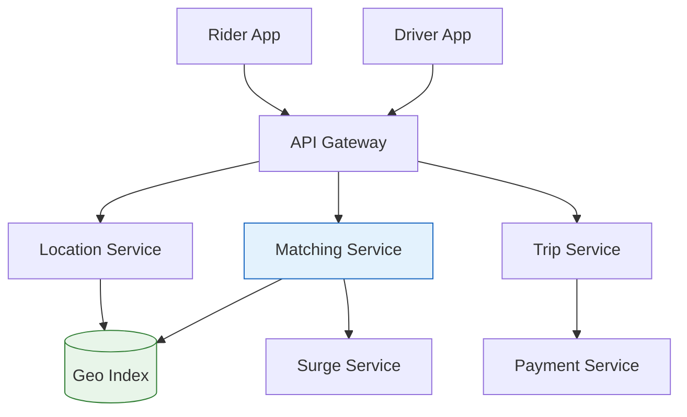
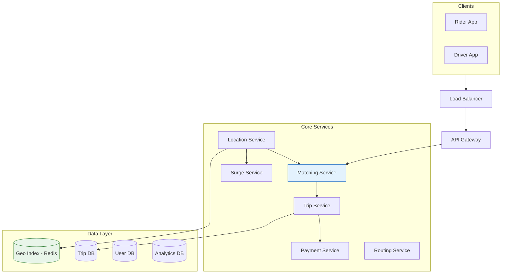

# Design Uber / Ride-Sharing Platform

## Problem Statement

Design a ride-sharing platform like Uber that enables:
- Real-time driver-rider matching
- Location tracking and ETA calculation
- Dynamic pricing
- Payment processing
- Trip management

## Architecture Overview




## Requirements

### Functional Requirements
1. Riders can request rides and see nearby drivers
2. Drivers can accept/decline ride requests
3. Real-time location tracking during trips
4. Dynamic pricing based on demand
5. ETA and route calculation
6. Payment processing and receipts
7. Rating system for drivers and riders
8. Trip history

### Non-Functional Requirements
- **Latency**: < 500ms for driver matching
- **Availability**: 99.99% uptime
- **Scale**: 100M users, 20M rides/day
- **Accuracy**: Location updates every 3-5 seconds
- **Consistency**: Strong consistency for payments

## Capacity Estimation

### Traffic
- 20M rides/day = 230 rides/second
- 5M active drivers, 50M active riders
- Location updates: 5M drivers × (1 update/4 sec) = 1.25M updates/sec

### Storage
- Trip data: 20M × 2KB = 40 GB/day
- Location history: 5M × 86400/4 × 50 bytes = 540 GB/day
- Yearly: ~200 TB

### Bandwidth
- Location updates: 1.25M × 100 bytes = 125 MB/s
- App data: ~500 MB/s total

## High-Level Architecture




## Core Components

### 1. Location Service

Handles real-time location tracking and geospatial indexing.

```python
class LocationService:
    def __init__(self):
        self.redis = RedisCluster()
        self.kafka = KafkaProducer()
        self.geohash_precision = 7  # ~150m accuracy

    async def update_driver_location(self, driver_id: str,
                                     location: Location) -> None:
        """Update driver's current location."""
        # Calculate geohash for spatial indexing
        geohash = self._encode_geohash(location.lat, location.lng)

        # Get previous geohash to update index
        prev_geohash = await self.redis.hget(
            f"driver:{driver_id}", "geohash"
        )

        # Update driver location atomically
        pipeline = self.redis.pipeline()

        # Store driver's current location
        pipeline.hset(f"driver:{driver_id}", mapping={
            "lat": location.lat,
            "lng": location.lng,
            "geohash": geohash,
            "heading": location.heading,
            "speed": location.speed,
            "timestamp": time.time(),
            "status": "available"
        })

        # Update geospatial index
        if prev_geohash and prev_geohash != geohash:
            # Remove from old cell
            pipeline.srem(f"geo:{prev_geohash}", driver_id)

        # Add to new cell
        pipeline.sadd(f"geo:{geohash}", driver_id)

        # Also update Redis GEO for radius queries
        pipeline.geoadd("drivers:geo", location.lng, location.lat, driver_id)

        # Set TTL (driver offline if no update in 60s)
        pipeline.expire(f"driver:{driver_id}", 60)

        await pipeline.execute()

        # Publish location update for active trips
        await self.kafka.send('location-updates', {
            'driver_id': driver_id,
            'location': location.to_dict(),
            'timestamp': time.time()
        })

    async def find_nearby_drivers(self, location: Location,
                                  radius_km: float = 5.0,
                                  limit: int = 20) -> List[DriverLocation]:
        """Find available drivers near a location."""
        # Use Redis GEORADIUS for efficient spatial query
        nearby = await self.redis.georadius(
            "drivers:geo",
            location.lng,
            location.lat,
            radius_km,
            unit="km",
            withdist=True,
            withcoord=True,
            count=limit * 2,  # Get extra to filter
            sort="ASC"
        )

        # Filter for available drivers only
        drivers = []
        for driver_id, dist, coords in nearby:
            driver_info = await self.redis.hgetall(f"driver:{driver_id}")

            if driver_info and driver_info.get('status') == 'available':
                drivers.append(DriverLocation(
                    driver_id=driver_id,
                    lat=float(coords[1]),
                    lng=float(coords[0]),
                    distance_km=dist,
                    heading=float(driver_info.get('heading', 0)),
                    eta_minutes=self._estimate_eta(dist)
                ))

            if len(drivers) >= limit:
                break

        return drivers

    async def get_driver_location(self, driver_id: str) -> Optional[Location]:
        """Get current location of a specific driver."""
        data = await self.redis.hgetall(f"driver:{driver_id}")

        if not data:
            return None

        return Location(
            lat=float(data['lat']),
            lng=float(data['lng']),
            heading=float(data.get('heading', 0)),
            speed=float(data.get('speed', 0)),
            timestamp=float(data['timestamp'])
        )

    def _encode_geohash(self, lat: float, lng: float) -> str:
        """Encode coordinates to geohash."""
        import geohash
        return geohash.encode(lat, lng, precision=self.geohash_precision)

    def _estimate_eta(self, distance_km: float) -> float:
        """Rough ETA estimate based on distance."""
        # Assume average speed of 25 km/h in urban areas
        return (distance_km / 25) * 60  # minutes
```

### 2. Matching Service

Handles driver-rider matching with optimization.

```python
class MatchingService:
    def __init__(self):
        self.location_service = LocationService()
        self.routing_service = RoutingService()
        self.surge_service = SurgeService()
        self.redis = RedisClient()
        self.kafka = KafkaProducer()

    async def request_ride(self, request: RideRequest) -> RideResponse:
        """Process ride request and find matching driver."""
        # Calculate route and fare estimate
        route = await self.routing_service.get_route(
            request.pickup, request.dropoff
        )

        # Get surge multiplier
        surge = await self.surge_service.get_multiplier(request.pickup)

        # Calculate fare estimate
        fare = self._calculate_fare(route, surge, request.ride_type)

        # Create ride request
        ride_id = generate_uuid()
        ride = Ride(
            id=ride_id,
            rider_id=request.rider_id,
            pickup=request.pickup,
            dropoff=request.dropoff,
            ride_type=request.ride_type,
            route=route,
            surge_multiplier=surge,
            estimated_fare=fare,
            status='searching'
        )

        # Store ride request
        await self._store_ride(ride)

        # Find and match driver
        matched_driver = await self._find_best_driver(ride)

        if matched_driver:
            ride.driver_id = matched_driver.id
            ride.status = 'driver_assigned'
            await self._notify_driver(matched_driver, ride)
            await self._notify_rider(request.rider_id, ride, matched_driver)

        return RideResponse(
            ride_id=ride_id,
            status=ride.status,
            driver=matched_driver,
            estimated_fare=fare,
            surge_multiplier=surge,
            eta_pickup=matched_driver.eta_minutes if matched_driver else None
        )

    async def _find_best_driver(self, ride: Ride,
                               max_attempts: int = 3) -> Optional[Driver]:
        """Find optimal driver using multi-factor scoring."""
        for attempt in range(max_attempts):
            # Expand search radius with each attempt
            radius = 3.0 + (attempt * 2)  # 3km, 5km, 7km

            nearby_drivers = await self.location_service.find_nearby_drivers(
                ride.pickup,
                radius_km=radius,
                limit=10
            )

            if not nearby_drivers:
                continue

            # Score each driver
            scored_drivers = []
            for driver_loc in nearby_drivers:
                driver = await self._get_driver(driver_loc.driver_id)

                if not self._is_eligible(driver, ride):
                    continue

                # Get actual ETA via routing
                eta = await self.routing_service.get_eta(
                    driver_loc.to_location(),
                    ride.pickup
                )

                score = self._calculate_driver_score(
                    driver=driver,
                    distance=driver_loc.distance_km,
                    eta=eta,
                    rating=driver.rating,
                    acceptance_rate=driver.acceptance_rate
                )

                scored_drivers.append({
                    'driver': driver,
                    'score': score,
                    'eta': eta
                })

            if scored_drivers:
                # Sort by score and try top drivers
                scored_drivers.sort(key=lambda x: x['score'], reverse=True)

                for candidate in scored_drivers[:3]:
                    accepted = await self._request_driver_acceptance(
                        candidate['driver'],
                        ride,
                        timeout_seconds=15
                    )

                    if accepted:
                        candidate['driver'].eta_minutes = candidate['eta']
                        return candidate['driver']

            # Wait before expanding search
            await asyncio.sleep(2)

        return None

    def _calculate_driver_score(self, driver: Driver, distance: float,
                               eta: float, rating: float,
                               acceptance_rate: float) -> float:
        """Calculate composite driver score for matching."""
        # Weights for different factors
        DISTANCE_WEIGHT = 0.35
        RATING_WEIGHT = 0.25
        ACCEPTANCE_WEIGHT = 0.20
        IDLE_TIME_WEIGHT = 0.20

        # Normalize scores to 0-1
        distance_score = max(0, 1 - (distance / 10))  # 10km = 0
        rating_score = (rating - 3) / 2  # 3-5 -> 0-1
        acceptance_score = acceptance_rate
        idle_score = min(1, driver.idle_minutes / 30)  # Cap at 30 min

        return (
            distance_score * DISTANCE_WEIGHT +
            rating_score * RATING_WEIGHT +
            acceptance_score * ACCEPTANCE_WEIGHT +
            idle_score * IDLE_TIME_WEIGHT
        )

    async def _request_driver_acceptance(self, driver: Driver,
                                        ride: Ride,
                                        timeout_seconds: int) -> bool:
        """Send ride request to driver and wait for response."""
        request_key = f"ride_request:{ride.id}:{driver.id}"

        # Store request
        await self.redis.setex(request_key, timeout_seconds + 5, 'pending')

        # Send push notification to driver
        await self.kafka.send('driver-notifications', {
            'driver_id': driver.id,
            'type': 'ride_request',
            'ride': ride.to_dict(),
            'timeout': timeout_seconds
        })

        # Wait for response
        start_time = time.time()
        while time.time() - start_time < timeout_seconds:
            response = await self.redis.get(request_key)

            if response == 'accepted':
                return True
            elif response == 'declined':
                return False

            await asyncio.sleep(0.5)

        # Timeout - mark as declined
        await self.redis.set(request_key, 'timeout')
        return False
```

### 3. Trip Service

Manages active trips and state transitions.

```python
class TripService:
    def __init__(self):
        self.db = DatabaseClient()
        self.redis = RedisClient()
        self.location_service = LocationService()
        self.payment_service = PaymentService()
        self.kafka = KafkaProducer()

    async def start_trip(self, ride_id: str) -> Trip:
        """Start the trip when driver picks up rider."""
        ride = await self._get_ride(ride_id)

        if ride.status != 'driver_arrived':
            raise InvalidStateError(f"Cannot start trip in state: {ride.status}")

        # Get driver's current location as actual pickup
        driver_location = await self.location_service.get_driver_location(
            ride.driver_id
        )

        # Create trip record
        trip = Trip(
            id=generate_uuid(),
            ride_id=ride_id,
            driver_id=ride.driver_id,
            rider_id=ride.rider_id,
            pickup_location=driver_location,
            pickup_time=time.time(),
            status='in_progress',
            route_points=[driver_location.to_dict()]
        )

        # Start trip in database
        await self.db.execute("""
            INSERT INTO trips (id, ride_id, driver_id, rider_id,
                             pickup_lat, pickup_lng, pickup_time, status)
            VALUES (?, ?, ?, ?, ?, ?, ?, ?)
        """, [trip.id, ride_id, trip.driver_id, trip.rider_id,
              driver_location.lat, driver_location.lng,
              trip.pickup_time, 'in_progress'])

        # Update ride status
        await self._update_ride_status(ride_id, 'in_progress')

        # Start location tracking subscription
        await self._start_trip_tracking(trip)

        # Notify rider
        await self.kafka.send('rider-notifications', {
            'rider_id': trip.rider_id,
            'type': 'trip_started',
            'trip': trip.to_dict()
        })

        return trip

    async def complete_trip(self, trip_id: str) -> TripSummary:
        """Complete trip and process payment."""
        trip = await self._get_trip(trip_id)

        if trip.status != 'in_progress':
            raise InvalidStateError(f"Trip not in progress: {trip.status}")

        # Get driver's current location as dropoff
        driver_location = await self.location_service.get_driver_location(
            trip.driver_id
        )

        # Get final route from location history
        route_points = await self._get_trip_route(trip_id)

        # Calculate actual distance and duration
        actual_distance = self._calculate_distance(route_points)
        actual_duration = time.time() - trip.pickup_time

        # Calculate final fare
        ride = await self._get_ride(trip.ride_id)
        final_fare = self._calculate_final_fare(
            distance_km=actual_distance,
            duration_minutes=actual_duration / 60,
            surge_multiplier=ride.surge_multiplier,
            ride_type=ride.ride_type
        )

        # Update trip record
        await self.db.execute("""
            UPDATE trips SET
                dropoff_lat = ?, dropoff_lng = ?,
                dropoff_time = ?, status = ?,
                distance_km = ?, duration_seconds = ?,
                final_fare = ?
            WHERE id = ?
        """, [driver_location.lat, driver_location.lng,
              time.time(), 'completed',
              actual_distance, actual_duration,
              final_fare, trip_id])

        # Process payment
        payment = await self.payment_service.charge_ride(
            rider_id=trip.rider_id,
            driver_id=trip.driver_id,
            amount=final_fare,
            trip_id=trip_id
        )

        # Update ride and driver status
        await self._update_ride_status(trip.ride_id, 'completed')
        await self._set_driver_available(trip.driver_id)

        # Create summary
        summary = TripSummary(
            trip_id=trip_id,
            distance_km=actual_distance,
            duration_minutes=actual_duration / 60,
            fare=final_fare,
            payment_status=payment.status,
            route=route_points
        )

        # Send notifications
        await self._send_trip_completion_notifications(trip, summary)

        return summary

    async def _start_trip_tracking(self, trip: Trip):
        """Subscribe to driver location updates for trip tracking."""
        # Store trip in Redis for real-time updates
        await self.redis.hset(f"active_trip:{trip.id}", mapping={
            'driver_id': trip.driver_id,
            'rider_id': trip.rider_id,
            'start_time': trip.pickup_time,
            'status': 'in_progress'
        })

        # Driver -> Active Trip mapping
        await self.redis.set(
            f"driver:{trip.driver_id}:active_trip",
            trip.id
        )

    async def track_location_update(self, driver_id: str, location: Location):
        """Process location update during active trip."""
        trip_id = await self.redis.get(f"driver:{driver_id}:active_trip")

        if trip_id:
            # Append to route
            await self.redis.rpush(
                f"trip:{trip_id}:route",
                json.dumps(location.to_dict())
            )

            # Broadcast to rider
            trip = await self.redis.hgetall(f"active_trip:{trip_id}")
            await self.kafka.send('location-broadcasts', {
                'rider_id': trip['rider_id'],
                'driver_location': location.to_dict(),
                'trip_id': trip_id
            })

    def _calculate_final_fare(self, distance_km: float, duration_minutes: float,
                             surge_multiplier: float, ride_type: str) -> float:
        """Calculate final trip fare."""
        rates = self._get_rates(ride_type)

        base_fare = rates['base']
        distance_fare = distance_km * rates['per_km']
        time_fare = duration_minutes * rates['per_minute']

        subtotal = base_fare + distance_fare + time_fare

        # Apply surge
        total = subtotal * surge_multiplier

        # Apply minimum fare
        return max(total, rates['minimum'])
```

### 4. Surge Pricing Service

Calculates dynamic pricing based on demand.

```python
class SurgeService:
    def __init__(self):
        self.redis = RedisClient()
        self.analytics = AnalyticsClient()

    # Surge multiplier thresholds
    DEMAND_THRESHOLDS = [
        (1.0, 1.0),   # Normal
        (1.2, 1.25),  # Low surge
        (1.5, 1.5),   # Medium surge
        (2.0, 1.75),  # High surge
        (3.0, 2.0),   # Very high surge
        (float('inf'), 2.5)  # Maximum
    ]

    async def get_multiplier(self, location: Location) -> float:
        """Get current surge multiplier for a location."""
        geohash = self._encode_geohash(location.lat, location.lng, precision=5)

        # Check cached surge
        cached = await self.redis.get(f"surge:{geohash}")
        if cached:
            return float(cached)

        # Calculate surge
        multiplier = await self._calculate_surge(geohash)

        # Cache for 5 minutes
        await self.redis.setex(f"surge:{geohash}", 300, str(multiplier))

        return multiplier

    async def _calculate_surge(self, geohash: str) -> float:
        """Calculate surge based on supply/demand ratio."""
        # Get demand (ride requests in last 5 minutes)
        demand = await self._get_demand(geohash)

        # Get supply (available drivers in area)
        supply = await self._get_supply(geohash)

        if supply == 0:
            return self.DEMAND_THRESHOLDS[-1][1]  # Max surge

        demand_ratio = demand / supply

        # Find appropriate multiplier
        for threshold, multiplier in self.DEMAND_THRESHOLDS:
            if demand_ratio < threshold:
                return multiplier

        return self.DEMAND_THRESHOLDS[-1][1]

    async def _get_demand(self, geohash: str) -> int:
        """Get ride request count in area."""
        # Count requests in last 5 minutes from neighboring cells
        cells = self._get_neighboring_cells(geohash)
        total = 0

        for cell in cells:
            count = await self.redis.get(f"demand:{cell}:5m")
            total += int(count or 0)

        return total

    async def _get_supply(self, geohash: str) -> int:
        """Get available driver count in area."""
        cells = self._get_neighboring_cells(geohash)
        total = 0

        for cell in cells:
            count = await self.redis.scard(f"geo:{cell}")
            total += count

        return total

    async def record_demand(self, location: Location):
        """Record ride request for demand tracking."""
        geohash = self._encode_geohash(location.lat, location.lng, precision=5)

        # Increment demand counter with 5-minute expiry
        key = f"demand:{geohash}:5m"
        pipe = self.redis.pipeline()
        pipe.incr(key)
        pipe.expire(key, 300)
        await pipe.execute()

    def _get_neighboring_cells(self, geohash: str) -> List[str]:
        """Get geohash and its 8 neighbors."""
        import geohash as gh
        neighbors = gh.neighbors(geohash)
        return [geohash] + list(neighbors.values())
```

### 5. Routing Service

Handles route calculation and ETA estimation.

```python
class RoutingService:
    def __init__(self):
        self.osrm_client = OSRMClient()  # Open Source Routing Machine
        self.redis = RedisClient()
        self.ml_model = ETAModelClient()

    async def get_route(self, origin: Location,
                       destination: Location) -> Route:
        """Get optimal route between two points."""
        # Check cache
        cache_key = self._route_cache_key(origin, destination)
        cached = await self.redis.get(cache_key)

        if cached:
            return Route.from_json(cached)

        # Get route from OSRM
        response = await self.osrm_client.route(
            coordinates=[
                [origin.lng, origin.lat],
                [destination.lng, destination.lat]
            ],
            overview='full',
            geometries='polyline',
            steps=True
        )

        route_data = response['routes'][0]

        route = Route(
            distance_m=route_data['distance'],
            duration_s=route_data['duration'],
            polyline=route_data['geometry'],
            steps=[
                RouteStep(
                    instruction=step['maneuver']['instruction'],
                    distance_m=step['distance'],
                    duration_s=step['duration']
                )
                for step in route_data['legs'][0]['steps']
            ]
        )

        # Cache for 10 minutes
        await self.redis.setex(cache_key, 600, route.to_json())

        return route

    async def get_eta(self, origin: Location, destination: Location) -> float:
        """Get estimated time of arrival in minutes."""
        # Get base route ETA
        route = await self.get_route(origin, destination)
        base_eta = route.duration_s / 60

        # Apply ML-based adjustment for traffic conditions
        traffic_factor = await self._get_traffic_factor(origin, destination)

        # Apply time-of-day adjustment
        time_factor = self._get_time_factor()

        adjusted_eta = base_eta * traffic_factor * time_factor

        return round(adjusted_eta, 1)

    async def _get_traffic_factor(self, origin: Location,
                                  destination: Location) -> float:
        """Get ML-predicted traffic adjustment factor."""
        features = {
            'origin_lat': origin.lat,
            'origin_lng': origin.lng,
            'dest_lat': destination.lat,
            'dest_lng': destination.lng,
            'hour': datetime.now().hour,
            'day_of_week': datetime.now().weekday(),
            'is_holiday': self._is_holiday()
        }

        prediction = await self.ml_model.predict(features)
        return prediction['traffic_factor']

    def _get_time_factor(self) -> float:
        """Get time-based adjustment factor."""
        hour = datetime.now().hour

        # Rush hour adjustments
        if 7 <= hour <= 9 or 17 <= hour <= 19:
            return 1.3  # 30% longer during rush hour
        elif 22 <= hour or hour <= 5:
            return 0.85  # 15% faster at night
        else:
            return 1.0

    async def get_eta_updates(self, trip_id: str,
                             driver_location: Location,
                             destination: Location) -> ETAUpdate:
        """Get real-time ETA update during trip."""
        eta = await self.get_eta(driver_location, destination)

        # Get remaining route
        route = await self.get_route(driver_location, destination)

        return ETAUpdate(
            trip_id=trip_id,
            eta_minutes=eta,
            distance_remaining_km=route.distance_m / 1000,
            updated_at=time.time()
        )
```

## Database Schema

### MySQL (Transactional Data)

```sql
CREATE TABLE users (
    id VARCHAR(36) PRIMARY KEY,
    email VARCHAR(255) UNIQUE,
    phone VARCHAR(20) UNIQUE NOT NULL,
    name VARCHAR(100),
    profile_pic_url VARCHAR(500),
    user_type ENUM('rider', 'driver', 'both') NOT NULL,
    created_at TIMESTAMP DEFAULT CURRENT_TIMESTAMP,
    INDEX idx_phone (phone),
    INDEX idx_email (email)
);

CREATE TABLE drivers (
    id VARCHAR(36) PRIMARY KEY,
    user_id VARCHAR(36) NOT NULL,
    license_number VARCHAR(50) NOT NULL,
    vehicle_type ENUM('economy', 'comfort', 'premium', 'xl') NOT NULL,
    vehicle_make VARCHAR(50),
    vehicle_model VARCHAR(50),
    vehicle_year INT,
    vehicle_color VARCHAR(30),
    license_plate VARCHAR(20),
    rating DECIMAL(3, 2) DEFAULT 5.00,
    total_trips INT DEFAULT 0,
    acceptance_rate DECIMAL(3, 2) DEFAULT 1.00,
    status ENUM('offline', 'online', 'busy') DEFAULT 'offline',
    approved_at TIMESTAMP,
    FOREIGN KEY (user_id) REFERENCES users(id),
    INDEX idx_status (status),
    INDEX idx_vehicle_type (vehicle_type)
);

CREATE TABLE rides (
    id VARCHAR(36) PRIMARY KEY,
    rider_id VARCHAR(36) NOT NULL,
    driver_id VARCHAR(36),
    ride_type ENUM('economy', 'comfort', 'premium', 'xl') NOT NULL,
    pickup_lat DECIMAL(10, 8) NOT NULL,
    pickup_lng DECIMAL(11, 8) NOT NULL,
    pickup_address VARCHAR(500),
    dropoff_lat DECIMAL(10, 8) NOT NULL,
    dropoff_lng DECIMAL(11, 8) NOT NULL,
    dropoff_address VARCHAR(500),
    status ENUM('searching', 'driver_assigned', 'driver_en_route',
                'driver_arrived', 'in_progress', 'completed', 'cancelled') NOT NULL,
    estimated_fare DECIMAL(10, 2),
    surge_multiplier DECIMAL(3, 2) DEFAULT 1.00,
    created_at TIMESTAMP DEFAULT CURRENT_TIMESTAMP,
    FOREIGN KEY (rider_id) REFERENCES users(id),
    FOREIGN KEY (driver_id) REFERENCES drivers(id),
    INDEX idx_rider (rider_id),
    INDEX idx_driver (driver_id),
    INDEX idx_status (status),
    INDEX idx_created (created_at)
);

CREATE TABLE trips (
    id VARCHAR(36) PRIMARY KEY,
    ride_id VARCHAR(36) NOT NULL UNIQUE,
    driver_id VARCHAR(36) NOT NULL,
    rider_id VARCHAR(36) NOT NULL,
    pickup_lat DECIMAL(10, 8),
    pickup_lng DECIMAL(11, 8),
    dropoff_lat DECIMAL(10, 8),
    dropoff_lng DECIMAL(11, 8),
    pickup_time TIMESTAMP,
    dropoff_time TIMESTAMP,
    distance_km DECIMAL(10, 2),
    duration_seconds INT,
    final_fare DECIMAL(10, 2),
    driver_earnings DECIMAL(10, 2),
    status ENUM('in_progress', 'completed', 'cancelled') NOT NULL,
    cancellation_reason VARCHAR(255),
    FOREIGN KEY (ride_id) REFERENCES rides(id),
    FOREIGN KEY (driver_id) REFERENCES drivers(id),
    FOREIGN KEY (rider_id) REFERENCES users(id),
    INDEX idx_driver_time (driver_id, pickup_time),
    INDEX idx_rider_time (rider_id, pickup_time)
);

CREATE TABLE ratings (
    id VARCHAR(36) PRIMARY KEY,
    trip_id VARCHAR(36) NOT NULL,
    rater_id VARCHAR(36) NOT NULL,
    ratee_id VARCHAR(36) NOT NULL,
    rating INT NOT NULL CHECK (rating BETWEEN 1 AND 5),
    comment TEXT,
    created_at TIMESTAMP DEFAULT CURRENT_TIMESTAMP,
    FOREIGN KEY (trip_id) REFERENCES trips(id),
    INDEX idx_ratee (ratee_id)
);

CREATE TABLE payments (
    id VARCHAR(36) PRIMARY KEY,
    trip_id VARCHAR(36) NOT NULL,
    rider_id VARCHAR(36) NOT NULL,
    amount DECIMAL(10, 2) NOT NULL,
    driver_payout DECIMAL(10, 2),
    platform_fee DECIMAL(10, 2),
    payment_method VARCHAR(50),
    status ENUM('pending', 'completed', 'failed', 'refunded') NOT NULL,
    transaction_id VARCHAR(100),
    created_at TIMESTAMP DEFAULT CURRENT_TIMESTAMP,
    FOREIGN KEY (trip_id) REFERENCES trips(id),
    INDEX idx_rider (rider_id),
    INDEX idx_status (status)
);
```

## Geospatial Indexing

### Geohash-Based Approach

```python
class GeospatialIndex:
    """Efficient geospatial indexing using geohash."""

    def __init__(self, redis: RedisClient):
        self.redis = redis

    async def add_driver(self, driver_id: str, lat: float, lng: float):
        """Add driver to geospatial index."""
        # Multiple precision levels for different query ranges
        for precision in [4, 5, 6, 7]:  # ~40km, ~5km, ~1km, ~150m
            geohash = self._encode(lat, lng, precision)
            await self.redis.sadd(f"geo:{precision}:{geohash}", driver_id)
            await self.redis.expire(f"geo:{precision}:{geohash}", 60)

        # Also add to Redis native GEO
        await self.redis.geoadd("drivers:locations", lng, lat, driver_id)

    async def find_in_radius(self, lat: float, lng: float,
                            radius_km: float) -> List[str]:
        """Find drivers within radius."""
        # Choose precision based on radius
        if radius_km <= 0.5:
            precision = 7
        elif radius_km <= 2:
            precision = 6
        elif radius_km <= 10:
            precision = 5
        else:
            precision = 4

        # Get cell and neighbors
        center_hash = self._encode(lat, lng, precision)
        cells = self._get_neighbors(center_hash)

        # Get drivers from all cells
        driver_ids = set()
        for cell in cells:
            members = await self.redis.smembers(f"geo:{precision}:{cell}")
            driver_ids.update(members)

        # Filter by exact distance using Redis GEO
        if driver_ids:
            result = await self.redis.georadius(
                "drivers:locations",
                lng, lat, radius_km, unit="km",
                withdist=True
            )
            return [(d, dist) for d, dist in result if d in driver_ids]

        return []

    async def remove_driver(self, driver_id: str, lat: float, lng: float):
        """Remove driver from index."""
        for precision in [4, 5, 6, 7]:
            geohash = self._encode(lat, lng, precision)
            await self.redis.srem(f"geo:{precision}:{geohash}", driver_id)

        await self.redis.zrem("drivers:locations", driver_id)
```

### Quadtree Alternative

```python
class QuadTreeIndex:
    """In-memory quadtree for fast spatial queries."""

    def __init__(self, bounds: Bounds, max_items: int = 100,
                 max_depth: int = 10):
        self.bounds = bounds
        self.max_items = max_items
        self.max_depth = max_depth
        self.items = []
        self.children = None  # NW, NE, SW, SE

    def insert(self, driver_id: str, lat: float, lng: float) -> bool:
        """Insert driver into quadtree."""
        if not self.bounds.contains(lat, lng):
            return False

        if len(self.items) < self.max_items or self.max_depth == 0:
            self.items.append((driver_id, lat, lng))
            return True

        if self.children is None:
            self._subdivide()

        for child in self.children:
            if child.insert(driver_id, lat, lng):
                return True

        return False

    def query_radius(self, center_lat: float, center_lng: float,
                    radius_km: float) -> List[Tuple[str, float]]:
        """Find all drivers within radius."""
        results = []
        self._query_recursive(center_lat, center_lng, radius_km, results)
        return results

    def _query_recursive(self, lat: float, lng: float,
                        radius_km: float, results: list):
        """Recursive radius query."""
        # Check if search area intersects this node's bounds
        if not self.bounds.intersects_circle(lat, lng, radius_km):
            return

        # Check items in this node
        for driver_id, dlat, dlng in self.items:
            dist = haversine_distance(lat, lng, dlat, dlng)
            if dist <= radius_km:
                results.append((driver_id, dist))

        # Check children
        if self.children:
            for child in self.children:
                child._query_recursive(lat, lng, radius_km, results)

    def _subdivide(self):
        """Split node into four quadrants."""
        mid_lat = (self.bounds.min_lat + self.bounds.max_lat) / 2
        mid_lng = (self.bounds.min_lng + self.bounds.max_lng) / 2

        self.children = [
            QuadTreeIndex(Bounds(mid_lat, self.bounds.max_lat,
                                self.bounds.min_lng, mid_lng)),  # NW
            QuadTreeIndex(Bounds(mid_lat, self.bounds.max_lat,
                                mid_lng, self.bounds.max_lng)),  # NE
            QuadTreeIndex(Bounds(self.bounds.min_lat, mid_lat,
                                self.bounds.min_lng, mid_lng)),  # SW
            QuadTreeIndex(Bounds(self.bounds.min_lat, mid_lat,
                                mid_lng, self.bounds.max_lng)),  # SE
        ]
```

## Scaling Strategies

### Regional Partitioning

```python
class RegionalDispatcher:
    """Routes requests to appropriate regional services."""

    REGIONS = {
        'us-east': {'lat_range': (24, 50), 'lng_range': (-90, -65)},
        'us-west': {'lat_range': (24, 50), 'lng_range': (-125, -90)},
        'eu-west': {'lat_range': (35, 60), 'lng_range': (-10, 20)},
        'ap-south': {'lat_range': (-10, 30), 'lng_range': (65, 100)},
    }

    def get_region(self, lat: float, lng: float) -> str:
        """Determine region for a location."""
        for region, bounds in self.REGIONS.items():
            if (bounds['lat_range'][0] <= lat <= bounds['lat_range'][1] and
                bounds['lng_range'][0] <= lng <= bounds['lng_range'][1]):
                return region

        return 'default'

    async def dispatch_to_region(self, region: str, request: dict):
        """Send request to regional service."""
        endpoint = self._get_regional_endpoint(region)
        return await self.http_client.post(endpoint, json=request)
```

## Interview Discussion Points

### Why Use Geohash Over Lat/Lng Indexing?
- Enables prefix-based range queries
- Efficient for finding nearby entities
- Works well with distributed caches
- Hierarchical precision (adjustable)

### How to Handle Driver Location Updates at Scale?
- Batch updates with windowing (every 3-5 seconds)
- Use Redis for in-memory spatial index
- Kafka for async persistence
- Regional sharding by geography

### How Does Dynamic Pricing Work?
- Real-time supply/demand ratio calculation
- Geohash-based area segmentation
- Cached multipliers with short TTL
- A/B testing for optimal thresholds

### How to Ensure Fair Driver Matching?
- Multi-factor scoring (distance, rating, idle time)
- Round-robin within score tiers
- Avoid always picking nearest driver
- Track and balance driver earnings

## Related Topics

- [[05_design_whatsapp|WhatsApp Design]] - Real-time communication
- [[../Core_Components/06_service_discovery|Service Discovery]]
- [[../Architecture_Patterns/04_saga_pattern|Saga Pattern]] - Distributed transactions
- [[10_design_distributed_cache|Distributed Cache]] - Location caching

---

**Tags**: #system-design #hld #ride-sharing #geospatial #case-study #uber
