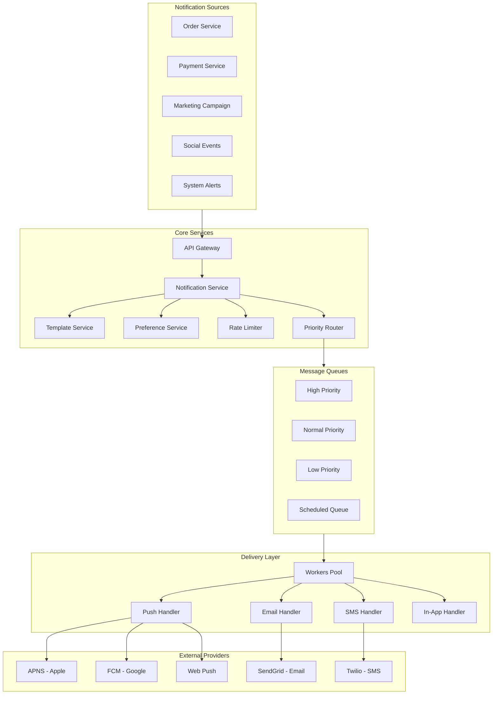

# Design Notification System

## Problem Statement

Design a scalable notification system that can deliver notifications across multiple channels:
- Push notifications (iOS, Android, Web)
- Email notifications
- SMS notifications
- In-app notifications

## Requirements

### Functional Requirements
1. Send notifications via multiple channels
2. Support notification preferences per user
3. Template-based notification content
4. Rate limiting and throttling
5. Scheduled/delayed notifications
6. Notification tracking (delivered, read, clicked)
7. Batch notifications
8. Priority levels

### Non-Functional Requirements
- **Latency**: < 1s for high-priority notifications
- **Throughput**: 10M notifications/day, burst 1M/minute
- **Availability**: 99.9% uptime
- **Reliability**: At-least-once delivery guarantee
- **Scalability**: Handle traffic spikes (10x normal)

## Capacity Estimation

### Traffic
- 10M notifications/day = 115 notifications/second (average)
- Peak: 1M/minute = 16,667/second
- Distribution: 60% push, 25% email, 10% in-app, 5% SMS

### Storage
- Notification metadata: 1KB per notification
- Daily: 10M × 1KB = 10 GB
- Retention: 90 days = 900 GB

### Bandwidth
- Outbound: ~100 MB/s during peaks

## High-Level Architecture




## Core Components

### 1. Notification Service

Main entry point for all notifications.

```python
class NotificationService:
    def __init__(self):
        self.template_service = TemplateService()
        self.preference_service = PreferenceService()
        self.rate_limiter = RateLimiter()
        self.router = NotificationRouter()
        self.db = DatabaseClient()

    async def send(self, request: NotificationRequest) -> NotificationResponse:
        """Send notification with validation and routing."""
        # Validate request
        self._validate(request)

        # Generate notification ID
        notification_id = self._generate_id()

        # Check rate limits
        if not await self.rate_limiter.check(request.user_id, request.type):
            return NotificationResponse(
                id=notification_id,
                status='rate_limited',
                message='Too many notifications'
            )

        # Get user preferences
        preferences = await self.preference_service.get(request.user_id)

        # Filter channels based on preferences
        allowed_channels = self._filter_channels(
            request.channels,
            preferences,
            request.type
        )

        if not allowed_channels:
            return NotificationResponse(
                id=notification_id,
                status='blocked_by_preferences'
            )

        # Render notification content
        content = await self.template_service.render(
            request.template_id,
            request.data,
            allowed_channels
        )

        # Create notification record
        notification = Notification(
            id=notification_id,
            user_id=request.user_id,
            type=request.type,
            priority=request.priority,
            channels=allowed_channels,
            content=content,
            scheduled_at=request.scheduled_at,
            status='pending'
        )

        # Store notification
        await self._store(notification)

        # Route to appropriate queue
        await self.router.route(notification)

        return NotificationResponse(
            id=notification_id,
            status='queued',
            channels=allowed_channels
        )

    async def send_batch(self, request: BatchNotificationRequest) -> BatchResponse:
        """Send notifications to multiple users."""
        results = []

        # Process in chunks for efficiency
        for chunk in chunks(request.user_ids, 1000):
            # Get preferences for all users in chunk
            preferences_map = await self.preference_service.get_batch(chunk)

            for user_id in chunk:
                prefs = preferences_map.get(user_id, {})

                result = await self.send(NotificationRequest(
                    user_id=user_id,
                    template_id=request.template_id,
                    type=request.type,
                    channels=request.channels,
                    data=request.data,
                    priority=request.priority
                ))

                results.append(result)

        return BatchResponse(
            total=len(request.user_ids),
            queued=sum(1 for r in results if r.status == 'queued'),
            failed=sum(1 for r in results if r.status != 'queued')
        )

    def _filter_channels(self, requested: List[str],
                        preferences: UserPreferences,
                        notification_type: str) -> List[str]:
        """Filter channels based on user preferences."""
        allowed = []

        for channel in requested:
            # Check global opt-out
            if not preferences.get(f'{channel}_enabled', True):
                continue

            # Check category opt-out
            if notification_type in preferences.get(f'{channel}_blocked_types', []):
                continue

            # Check quiet hours
            if self._is_quiet_hours(preferences) and channel in ['push', 'sms']:
                continue

            allowed.append(channel)

        return allowed
```

### 2. Priority Router

Routes notifications to appropriate queues based on priority.

```python
class NotificationRouter:
    def __init__(self):
        self.kafka = KafkaProducer()
        self.scheduler = SchedulerService()

    PRIORITY_QUEUES = {
        'critical': 'notifications-critical',
        'high': 'notifications-high',
        'normal': 'notifications-normal',
        'low': 'notifications-low'
    }

    async def route(self, notification: Notification):
        """Route notification to appropriate queue."""
        # Handle scheduled notifications
        if notification.scheduled_at:
            if notification.scheduled_at > time.time():
                await self.scheduler.schedule(notification)
                return

        # Determine queue based on priority
        queue = self.PRIORITY_QUEUES.get(
            notification.priority,
            self.PRIORITY_QUEUES['normal']
        )

        # Split by channel for parallel processing
        for channel in notification.channels:
            message = {
                'notification_id': notification.id,
                'user_id': notification.user_id,
                'channel': channel,
                'content': notification.content.get(channel),
                'metadata': notification.metadata,
                'priority': notification.priority,
                'created_at': time.time()
            }

            await self.kafka.send(queue, message)


class SchedulerService:
    def __init__(self):
        self.redis = RedisClient()
        self.kafka = KafkaProducer()

    async def schedule(self, notification: Notification):
        """Schedule notification for future delivery."""
        # Use Redis sorted set with timestamp as score
        await self.redis.zadd(
            'scheduled_notifications',
            {json.dumps(notification.to_dict()): notification.scheduled_at}
        )

    async def process_scheduled(self):
        """Background job to process scheduled notifications."""
        while True:
            now = time.time()

            # Get notifications due for delivery
            due = await self.redis.zrangebyscore(
                'scheduled_notifications',
                0,
                now,
                start=0,
                num=100
            )

            for notification_json in due:
                notification = Notification.from_json(notification_json)

                # Remove from scheduled set
                await self.redis.zrem('scheduled_notifications', notification_json)

                # Route for immediate delivery
                router = NotificationRouter()
                await router.route(notification)

            await asyncio.sleep(1)  # Check every second
```

### 3. Push Notification Handler

Handles push notifications for mobile and web.

```python
class PushHandler:
    def __init__(self):
        self.apns = APNSClient()  # Apple Push Notification Service
        self.fcm = FCMClient()    # Firebase Cloud Messaging
        self.web_push = WebPushClient()
        self.db = DatabaseClient()
        self.redis = RedisClient()

    async def send(self, message: dict) -> DeliveryResult:
        """Send push notification to user's devices."""
        user_id = message['user_id']
        content = message['content']

        # Get user's registered devices
        devices = await self._get_user_devices(user_id)

        if not devices:
            return DeliveryResult(
                notification_id=message['notification_id'],
                channel='push',
                status='no_devices'
            )

        results = []

        for device in devices:
            try:
                if device.platform == 'ios':
                    result = await self._send_apns(device, content)
                elif device.platform == 'android':
                    result = await self._send_fcm(device, content)
                elif device.platform == 'web':
                    result = await self._send_web_push(device, content)

                results.append(result)

            except InvalidTokenError:
                # Remove invalid device token
                await self._remove_device(device.token)
            except Exception as e:
                results.append(DeliveryResult(
                    device_id=device.id,
                    status='failed',
                    error=str(e)
                ))

        # Aggregate results
        successful = sum(1 for r in results if r.status == 'sent')

        return DeliveryResult(
            notification_id=message['notification_id'],
            channel='push',
            status='sent' if successful > 0 else 'failed',
            devices_reached=successful,
            devices_failed=len(results) - successful
        )

    async def _send_apns(self, device: Device, content: dict) -> dict:
        """Send via Apple Push Notification Service."""
        payload = {
            'aps': {
                'alert': {
                    'title': content['title'],
                    'body': content['body']
                },
                'sound': 'default',
                'badge': content.get('badge', 1)
            },
            'data': content.get('data', {})
        }

        response = await self.apns.send(
            device_token=device.token,
            payload=payload,
            topic=device.bundle_id,
            priority=10
        )

        return {'device_id': device.id, 'status': 'sent'}

    async def _send_fcm(self, device: Device, content: dict) -> dict:
        """Send via Firebase Cloud Messaging."""
        message = {
            'token': device.token,
            'notification': {
                'title': content['title'],
                'body': content['body']
            },
            'data': content.get('data', {}),
            'android': {
                'priority': 'high',
                'notification': {
                    'sound': 'default',
                    'click_action': content.get('click_action')
                }
            }
        }

        response = await self.fcm.send(message)
        return {'device_id': device.id, 'status': 'sent'}

    async def _send_web_push(self, device: Device, content: dict) -> dict:
        """Send via Web Push (VAPID)."""
        subscription = {
            'endpoint': device.endpoint,
            'keys': {
                'p256dh': device.p256dh,
                'auth': device.auth_key
            }
        }

        payload = json.dumps({
            'title': content['title'],
            'body': content['body'],
            'icon': content.get('icon'),
            'url': content.get('click_url')
        })

        await self.web_push.send(subscription, payload)
        return {'device_id': device.id, 'status': 'sent'}
```

### 4. Email Handler

Handles email notifications with templating and tracking.

```python
class EmailHandler:
    def __init__(self):
        self.sendgrid = SendGridClient()
        self.ses = AmazonSESClient()  # Fallback
        self.db = DatabaseClient()
        self.template_engine = TemplateEngine()

    async def send(self, message: dict) -> DeliveryResult:
        """Send email notification."""
        user_id = message['user_id']
        content = message['content']

        # Get user's email
        user = await self._get_user(user_id)

        if not user or not user.email:
            return DeliveryResult(
                notification_id=message['notification_id'],
                channel='email',
                status='no_email'
            )

        # Check if email is verified
        if not user.email_verified:
            return DeliveryResult(
                notification_id=message['notification_id'],
                channel='email',
                status='email_not_verified'
            )

        # Render HTML email
        html_content = await self.template_engine.render_email(
            template=content.get('template', 'default'),
            data=content
        )

        # Add tracking pixel and link tracking
        tracking_id = generate_uuid()
        html_content = self._add_tracking(html_content, tracking_id)

        # Build email
        email = Email(
            to=user.email,
            from_email='notifications@company.com',
            subject=content['subject'],
            html_content=html_content,
            text_content=content.get('text_body'),
            tracking_id=tracking_id
        )

        # Send with primary provider, fallback on failure
        try:
            message_id = await self.sendgrid.send(email)
        except Exception as e:
            # Fallback to SES
            message_id = await self.ses.send(email)

        # Store delivery record
        await self._store_delivery(
            notification_id=message['notification_id'],
            tracking_id=tracking_id,
            message_id=message_id,
            recipient=user.email
        )

        return DeliveryResult(
            notification_id=message['notification_id'],
            channel='email',
            status='sent',
            message_id=message_id
        )

    def _add_tracking(self, html: str, tracking_id: str) -> str:
        """Add open tracking pixel and click tracking."""
        # Add tracking pixel
        pixel = f''
        html = html.replace('</body>', f'{pixel}</body>')

        # Wrap links with tracking
        import re
        def replace_link(match):
            url = match.group(1)
            tracked = f'https://track.company.com/click/{tracking_id}?url={urllib.parse.quote(url)}'
            return f'href="{tracked}"'

        html = re.sub(r'href="([^"]+)"', replace_link, html)

        return html


class EmailTrackingService:
    """Handles email open and click tracking."""

    def __init__(self):
        self.redis = RedisClient()
        self.kafka = KafkaProducer()

    async def track_open(self, tracking_id: str):
        """Record email open event."""
        # Deduplicate opens (count unique opens)
        if await self.redis.setnx(f"email_open:{tracking_id}", "1"):
            await self.redis.expire(f"email_open:{tracking_id}", 86400 * 30)

            await self.kafka.send('email-events', {
                'type': 'open',
                'tracking_id': tracking_id,
                'timestamp': time.time()
            })

    async def track_click(self, tracking_id: str, url: str):
        """Record email click event."""
        await self.kafka.send('email-events', {
            'type': 'click',
            'tracking_id': tracking_id,
            'url': url,
            'timestamp': time.time()
        })
```

### 5. SMS Handler

Handles SMS notifications with provider abstraction.

```python
class SMSHandler:
    def __init__(self):
        self.twilio = TwilioClient()
        self.nexmo = NexmoClient()  # Fallback
        self.db = DatabaseClient()
        self.rate_limiter = SMSRateLimiter()

    # SMS is expensive, apply strict rate limiting
    SMS_LIMITS = {
        'transactional': {'per_hour': 10, 'per_day': 50},
        'marketing': {'per_hour': 1, 'per_day': 3},
        'otp': {'per_hour': 5, 'per_day': 20}
    }

    async def send(self, message: dict) -> DeliveryResult:
        """Send SMS notification."""
        user_id = message['user_id']
        content = message['content']
        sms_type = message.get('metadata', {}).get('sms_type', 'transactional')

        # Get user's phone number
        user = await self._get_user(user_id)

        if not user or not user.phone:
            return DeliveryResult(
                notification_id=message['notification_id'],
                channel='sms',
                status='no_phone'
            )

        # Check rate limits
        if not await self.rate_limiter.check(user_id, sms_type):
            return DeliveryResult(
                notification_id=message['notification_id'],
                channel='sms',
                status='rate_limited'
            )

        # Format phone number (ensure E.164 format)
        phone = self._format_phone(user.phone, user.country_code)

        # Build SMS
        body = content['body']

        if len(body) > 160:
            # Will be sent as multiple segments
            body = body[:157] + '...'

        # Send via primary provider
        try:
            message_sid = await self.twilio.send(
                to=phone,
                body=body,
                from_=self._get_sender_id(user.country_code)
            )
            provider = 'twilio'
        except Exception as e:
            # Fallback
            message_sid = await self.nexmo.send(to=phone, body=body)
            provider = 'nexmo'

        # Record for billing
        await self._record_sms_sent(user_id, provider, len(body))

        return DeliveryResult(
            notification_id=message['notification_id'],
            channel='sms',
            status='sent',
            message_id=message_sid,
            provider=provider
        )

    def _get_sender_id(self, country_code: str) -> str:
        """Get appropriate sender ID for country."""
        # Different countries have different sender ID requirements
        SENDER_IDS = {
            'US': '+1234567890',  # Must be phone number
            'GB': 'COMPANY',       # Can be alphanumeric
            'IN': 'COMPNY',        # 6 char max
        }
        return SENDER_IDS.get(country_code, '+1234567890')
```

### 6. In-App Notification Handler

Stores notifications for in-app display.

```python
class InAppHandler:
    def __init__(self):
        self.redis = RedisClient()
        self.db = DatabaseClient()
        self.websocket = WebSocketGateway()

    async def send(self, message: dict) -> DeliveryResult:
        """Store and optionally push in-app notification."""
        user_id = message['user_id']
        content = message['content']
        notification_id = message['notification_id']

        # Store in database for persistence
        await self.db.execute("""
            INSERT INTO in_app_notifications
            (id, user_id, title, body, icon, action_url, created_at, read)
            VALUES (?, ?, ?, ?, ?, ?, ?, false)
        """, [
            notification_id,
            user_id,
            content['title'],
            content['body'],
            content.get('icon'),
            content.get('action_url'),
            time.time()
        ])

        # Add to Redis list for quick access
        await self.redis.lpush(
            f"notifications:{user_id}",
            json.dumps({
                'id': notification_id,
                'title': content['title'],
                'body': content['body'],
                'icon': content.get('icon'),
                'action_url': content.get('action_url'),
                'created_at': time.time(),
                'read': False
            })
        )

        # Trim to keep only recent notifications
        await self.redis.ltrim(f"notifications:{user_id}", 0, 99)

        # Update unread count
        await self.redis.incr(f"unread:{user_id}")

        # Push via WebSocket if user is online
        is_online = await self.websocket.is_connected(user_id)

        if is_online:
            await self.websocket.send(user_id, {
                'type': 'notification',
                'notification': {
                    'id': notification_id,
                    'title': content['title'],
                    'body': content['body']
                }
            })

        return DeliveryResult(
            notification_id=notification_id,
            channel='in_app',
            status='stored',
            pushed_realtime=is_online
        )

    async def get_notifications(self, user_id: str,
                               limit: int = 20,
                               before: str = None) -> List[dict]:
        """Get user's in-app notifications."""
        # Try Redis cache first
        cached = await self.redis.lrange(f"notifications:{user_id}", 0, limit - 1)

        if cached:
            return [json.loads(n) for n in cached]

        # Fall back to database
        query = """
            SELECT * FROM in_app_notifications
            WHERE user_id = ?
        """
        params = [user_id]

        if before:
            query += " AND created_at < ?"
            params.append(before)

        query += " ORDER BY created_at DESC LIMIT ?"
        params.append(limit)

        return await self.db.fetchall(query, params)

    async def mark_read(self, user_id: str, notification_ids: List[str]):
        """Mark notifications as read."""
        # Update database
        placeholders = ','.join(['?'] * len(notification_ids))
        await self.db.execute(f"""
            UPDATE in_app_notifications
            SET read = true
            WHERE id IN ({placeholders}) AND user_id = ?
        """, notification_ids + [user_id])

        # Update unread count
        await self.redis.decrby(f"unread:{user_id}", len(notification_ids))
```

## Database Schema

```sql
CREATE TABLE notifications (
    id VARCHAR(36) PRIMARY KEY,
    user_id VARCHAR(36) NOT NULL,
    type VARCHAR(50) NOT NULL,
    priority ENUM('critical', 'high', 'normal', 'low') DEFAULT 'normal',
    channels JSON NOT NULL,
    content JSON NOT NULL,
    status ENUM('pending', 'processing', 'sent', 'failed', 'cancelled') NOT NULL,
    scheduled_at TIMESTAMP NULL,
    created_at TIMESTAMP DEFAULT CURRENT_TIMESTAMP,
    updated_at TIMESTAMP DEFAULT CURRENT_TIMESTAMP ON UPDATE CURRENT_TIMESTAMP,
    INDEX idx_user_created (user_id, created_at),
    INDEX idx_status (status),
    INDEX idx_scheduled (scheduled_at)
);

CREATE TABLE notification_deliveries (
    id VARCHAR(36) PRIMARY KEY,
    notification_id VARCHAR(36) NOT NULL,
    channel ENUM('push', 'email', 'sms', 'in_app', 'webhook') NOT NULL,
    status ENUM('pending', 'sent', 'delivered', 'failed', 'bounced') NOT NULL,
    provider VARCHAR(50),
    provider_message_id VARCHAR(100),
    error_message TEXT,
    sent_at TIMESTAMP,
    delivered_at TIMESTAMP,
    FOREIGN KEY (notification_id) REFERENCES notifications(id),
    INDEX idx_notification (notification_id),
    INDEX idx_status (status)
);

CREATE TABLE user_preferences (
    user_id VARCHAR(36) PRIMARY KEY,
    push_enabled BOOLEAN DEFAULT true,
    email_enabled BOOLEAN DEFAULT true,
    sms_enabled BOOLEAN DEFAULT true,
    push_blocked_types JSON,
    email_blocked_types JSON,
    sms_blocked_types JSON,
    quiet_hours_start TIME,
    quiet_hours_end TIME,
    timezone VARCHAR(50) DEFAULT 'UTC',
    updated_at TIMESTAMP DEFAULT CURRENT_TIMESTAMP ON UPDATE CURRENT_TIMESTAMP
);

CREATE TABLE device_tokens (
    id VARCHAR(36) PRIMARY KEY,
    user_id VARCHAR(36) NOT NULL,
    platform ENUM('ios', 'android', 'web') NOT NULL,
    token TEXT NOT NULL,
    bundle_id VARCHAR(100),
    endpoint VARCHAR(500),  -- For web push
    p256dh VARCHAR(100),    -- For web push
    auth_key VARCHAR(50),   -- For web push
    created_at TIMESTAMP DEFAULT CURRENT_TIMESTAMP,
    last_used_at TIMESTAMP,
    INDEX idx_user (user_id),
    INDEX idx_token (token(255))
);

CREATE TABLE in_app_notifications (
    id VARCHAR(36) PRIMARY KEY,
    user_id VARCHAR(36) NOT NULL,
    title VARCHAR(255) NOT NULL,
    body TEXT NOT NULL,
    icon VARCHAR(255),
    action_url VARCHAR(500),
    read BOOLEAN DEFAULT false,
    created_at TIMESTAMP DEFAULT CURRENT_TIMESTAMP,
    INDEX idx_user_read (user_id, read),
    INDEX idx_user_created (user_id, created_at)
);

CREATE TABLE notification_templates (
    id VARCHAR(50) PRIMARY KEY,
    name VARCHAR(100) NOT NULL,
    type VARCHAR(50) NOT NULL,
    channels JSON NOT NULL,
    content JSON NOT NULL,  -- Templates per channel
    variables JSON,
    active BOOLEAN DEFAULT true,
    created_at TIMESTAMP DEFAULT CURRENT_TIMESTAMP,
    updated_at TIMESTAMP
);
```

## Rate Limiting

```python
class NotificationRateLimiter:
    """Rate limiting for notifications."""

    def __init__(self):
        self.redis = RedisClient()

    # Rate limits per notification type
    LIMITS = {
        'marketing': {'per_hour': 2, 'per_day': 5},
        'transactional': {'per_hour': 20, 'per_day': 100},
        'system': {'per_hour': 50, 'per_day': 200},
        'social': {'per_hour': 30, 'per_day': 150}
    }

    async def check(self, user_id: str, notification_type: str) -> bool:
        """Check if notification can be sent."""
        limits = self.LIMITS.get(notification_type, self.LIMITS['transactional'])

        # Check hourly limit
        hourly_key = f"rate:{user_id}:{notification_type}:hour:{get_hour_bucket()}"
        hourly_count = await self.redis.incr(hourly_key)

        if hourly_count == 1:
            await self.redis.expire(hourly_key, 3600)

        if hourly_count > limits['per_hour']:
            return False

        # Check daily limit
        daily_key = f"rate:{user_id}:{notification_type}:day:{get_day_bucket()}"
        daily_count = await self.redis.incr(daily_key)

        if daily_count == 1:
            await self.redis.expire(daily_key, 86400)

        if daily_count > limits['per_day']:
            return False

        return True

    async def check_global_throttle(self, channel: str) -> bool:
        """Check global rate limits to protect providers."""
        CHANNEL_LIMITS = {
            'email': 10000,  # per second
            'sms': 1000,
            'push': 50000
        }

        key = f"global_rate:{channel}:{int(time.time())}"
        count = await self.redis.incr(key)

        if count == 1:
            await self.redis.expire(key, 2)

        return count <= CHANNEL_LIMITS.get(channel, 1000)
```

## Delivery Guarantees

```python
class ReliableDelivery:
    """Ensures at-least-once delivery with retries."""

    def __init__(self):
        self.redis = RedisClient()
        self.kafka = KafkaProducer()
        self.db = DatabaseClient()

    RETRY_DELAYS = [60, 300, 900, 3600, 7200]  # 1m, 5m, 15m, 1h, 2h

    async def process_with_retry(self, handler, message: dict):
        """Process message with automatic retry on failure."""
        notification_id = message['notification_id']
        attempt = message.get('attempt', 0)

        try:
            result = await handler.send(message)

            if result.status == 'sent':
                await self._record_success(notification_id, message['channel'])
            else:
                await self._handle_failure(message, result.error, attempt)

        except Exception as e:
            await self._handle_failure(message, str(e), attempt)

    async def _handle_failure(self, message: dict, error: str, attempt: int):
        """Handle failed delivery with retry scheduling."""
        notification_id = message['notification_id']
        channel = message['channel']

        # Record failure
        await self.db.execute("""
            UPDATE notification_deliveries
            SET status = 'failed', error_message = ?
            WHERE notification_id = ? AND channel = ?
        """, [error, notification_id, channel])

        # Check if should retry
        if attempt < len(self.RETRY_DELAYS):
            delay = self.RETRY_DELAYS[attempt]

            # Schedule retry
            message['attempt'] = attempt + 1
            await self.redis.zadd(
                'notification_retries',
                {json.dumps(message): time.time() + delay}
            )
        else:
            # Max retries exceeded - mark as permanently failed
            await self._mark_permanent_failure(notification_id, channel)

    async def process_retries(self):
        """Background job to process scheduled retries."""
        while True:
            now = time.time()

            # Get due retries
            due = await self.redis.zrangebyscore(
                'notification_retries',
                0, now,
                start=0, num=100
            )

            for message_json in due:
                message = json.loads(message_json)

                # Remove from retry queue
                await self.redis.zrem('notification_retries', message_json)

                # Re-queue for processing
                queue = self._get_queue(message['priority'])
                await self.kafka.send(queue, message)

            await asyncio.sleep(10)
```

## Interview Discussion Points

### How to Handle Provider Failures?
- Circuit breaker pattern for each provider
- Automatic fallback to secondary providers
- Queue backpressure when all providers down
- Alert on provider degradation

### How to Ensure Exactly-Once Delivery?
- Use idempotency keys for each notification
- Deduplicate at the handler level
- Accept at-least-once, dedupe on client

### How to Handle Different Priorities?
- Separate queues per priority level
- Different consumer groups/concurrency
- Critical notifications bypass rate limits
- SLA monitoring per priority

### How to Scale for Burst Traffic?
- Auto-scaling worker pools
- Pre-provisioned capacity for known events
- Circuit breakers to protect providers
- Graceful degradation (email over push)

## Related Topics

- [[../Core_Components/05_message_queues|Message Queues]]
- [[02_design_rate_limiter|Rate Limiter Design]]
- [[../Architecture_Patterns/05_circuit_breaker|Circuit Breaker Pattern]]

---

**Tags**: #system-design #hld #notifications #case-study #push-notifications
